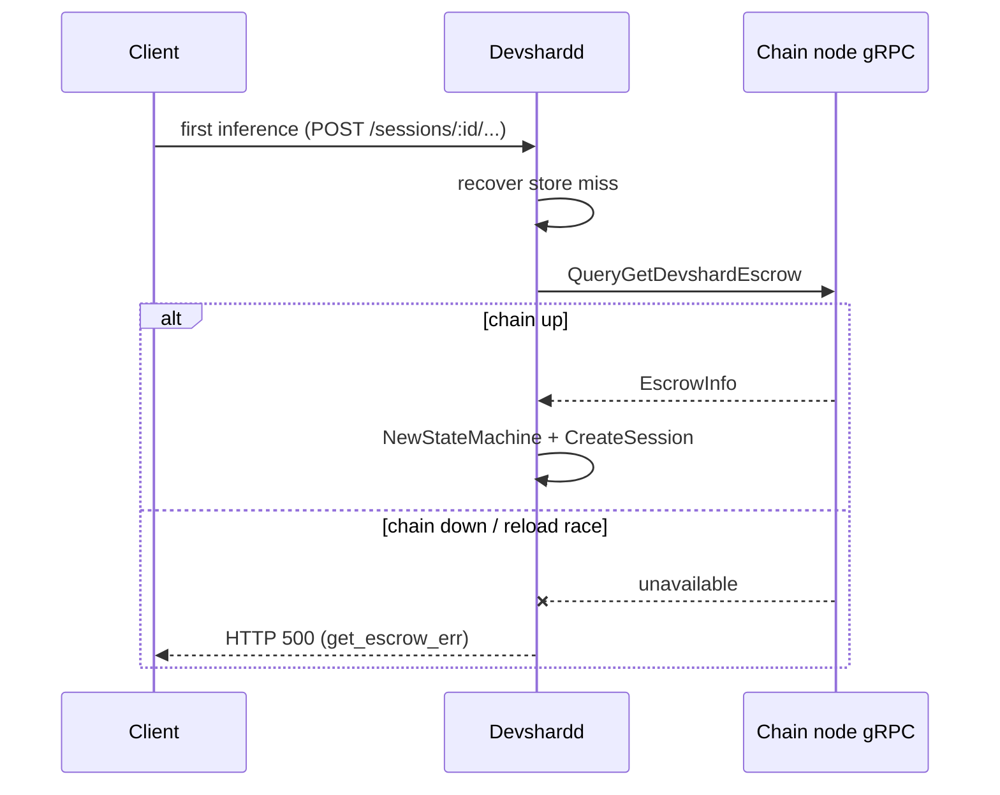
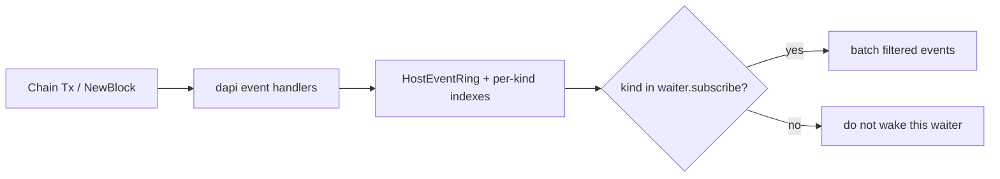
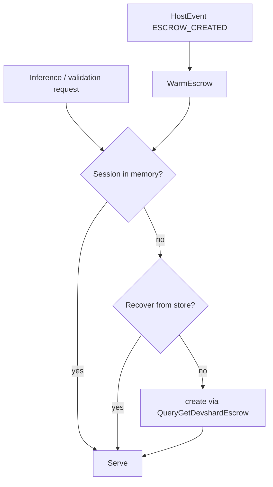

# DAPI host-events long-poll (escrow + maintenance)

Standalone workstream that lands **before** [ml-node-capacity-fallback-plan.md](./ml-node-capacity-fallback-plan.md). Goal: add a **subscription-filtered** `GetHostEvents` long-poll for escrow create/settle and maintenance schedule/cancel. **`GetRuntimeConfig` stays as-is** (epoch + params); do not migrate params/epoch onto this channel in the first cut. Escrow warm-up is the first consumer; lazy create on first inference stays as a fallback.

## Problem

### Lazy escrow create

Today escrow sessions are created **lazily** inside `HostManager.getOrCreate`:



| Failure mode | What happens |
|--------------|--------------|
| Host / versiond / devshardd reload | Local session gone; first request must hit chain |
| Chain node briefly unavailable during that first request | `ReasonGetEscrowErr` → **HTTP 500** |
| Many concurrent first-hits for new escrows | Stampede of identical `QueryGetDevshardEscrow` |

### Long-poll is params/epoch only

DAPI already long-polls `GetRuntimeConfig` (epoch + governance/runtime params) to standalone `devshardd`. That channel does **not** carry escrow or maintenance events. We leave it alone and add a sibling RPC for discrete host events.

### Chain events exist; dapi does not listen

| Event | Emitted from | Attributes (key ones) | In dapi today |
|-------|--------------|------------------------|---------------|
| `devshard_escrow_created` | `MsgCreateDevshardEscrow` | `escrow_id`, `creator`, `amount`, `epoch_index`, `model_id` | **No** handler (BlockObserver drops) |
| `devshard_escrow_settled` | `MsgSettleDevshardEscrow` | `escrow_id`, `settler`, `total_payout`, `fees`, `remainder`, … | **No** handler |
| `maintenance_scheduled` | `MsgScheduleMaintenance` | `reservation_id`, `participant`, `start_height`, `duration_blocks` | **No** handler, **no** API exposure |
| `maintenance_canceled` | `MsgCancelMaintenance` (+ lifecycle when maintenance disabled) | `reservation_id`, `participant`, `credit_restored` / `credit_refunded`, optional `reason` | **No** handler, **no** API exposure |

Chain also has `QueryMaintenanceScheduled` (per participant). That is pull-only; dapi does not cache or fan it out.

`ChainBridge.OnEscrowCreated` / settlement hooks exist on the bridge interface but return `ErrNotImplemented`.

---

## Goals

| Goal | Metric |
|------|--------|
| Proactive session warm-up | After create event, host has a session **before** first inference |
| Survive chain blips on first request | If session already stored, inference does not call chain |
| Keep lazy path | Miss still does `QueryGetDevshardEscrow` as today |
| Open-escrow accounting | Host knows how many escrows it currently handles (create − settle) |
| Feed capacity fallback | [ml-node-capacity-fallback-plan.md](./ml-node-capacity-fallback-plan.md) can divide `max_concurrent` by **open escrows on this host**, not a fixed `/3` |
| Maintenance visibility | `maintenance_scheduled` / `maintenance_canceled` ingested and available on the long-poll |
| Topic subscriptions | Client declares which event kinds it wants on `GetHostEvents`; others **do not wake** the waiter and are **omitted** from the response |

## Non-goals

- Removing the lazy `getOrCreate` → `GetEscrow` path.
- Changing on-chain create/settle/maintenance msgs or event attribute names.
- Gateway / `devshardctl` escrow rotation (already parses `devshard_escrow_created` from its own txs).
- Implementing `ListNodeCapacity` (that stays in the capacity plan).
- Replacing chain `QueryMaintenanceScheduled` (long-poll is push; query remains for catch-up / admin).
- Migrating epoch/params onto `GetHostEvents` or adapting `GetRuntimeConfig` over the new ring (**keep `GetRuntimeConfig` as-is**).

---

## Design

### 1. Sibling `GetHostEvents` (escrow + maintenance only)

**Decision (lower risk):** leave `GetRuntimeConfig` unchanged. Add a **sibling** NodeManager RPC for discrete escrow/maintenance events with an explicit **subscribe set**. Two long-poll loops on the client (runtimeconfig + host-events) is fine.

```protobuf
rpc GetHostEvents(GetHostEventsRequest) returns (GetHostEventsResponse);

enum HostEventKind {
  HOST_EVENT_KIND_UNSPECIFIED = 0;
  // 1–2 reserved if we later fold EPOCH/PARAMS here; unused in v1
  HOST_EVENT_KIND_ESCROW_CREATED = 3;
  HOST_EVENT_KIND_ESCROW_SETTLED = 4;
  HOST_EVENT_KIND_MAINTENANCE_SCHEDULED = 5;
  HOST_EVENT_KIND_MAINTENANCE_CANCELED = 6;
}

message GetHostEventsRequest {
  uint64 cursor = 1;                        // last applied seq; 0 = live from now (or catch-up policy)
  uint32 max_wait_seconds = 2;              // 0 = immediate; >0 = long-poll (server-capped)
  repeated HostEventKind subscribe = 3;     // required; empty → InvalidArgument
}

message HostEvent {
  uint64 seq = 1;
  HostEventKind kind = 2;
  int64 observed_at_unix = 3;
  // Exactly one payload set per kind:
  EscrowPayload escrow = 12;
  MaintenancePayload maintenance = 13;
}

message EscrowPayload {
  uint64 escrow_id = 1;
  uint64 epoch_index = 2;
  string model_id = 3;
  // created: creator, amount; settled: settler, totals — as needed
}

message MaintenancePayload {
  uint64 reservation_id = 1;
  string participant = 2;
  int64 start_height = 3;          // scheduled
  uint64 duration_blocks = 4;      // scheduled / credit on cancel
  string reason = 5;               // optional (e.g. maintenance_disabled)
}

message GetHostEventsResponse {
  bool unchanged = 1;              // idle timeout / nothing in subscribed set since cursor
  repeated HostEvent events = 2;   // only kinds in `subscribe`, in seq order
  uint64 next_cursor = 3;
  uint64 generation = 4;           // dapi boot nonce
  bool reset = 5;                  // client must re-hydrate
  int32 open_escrow_count = 6;     // if escrow topics subscribed (optional convenience)
}
```

**Subscription semantics (hard requirements):**

| Rule | Behavior |
|------|----------|
| Wake filter | A waiter is woken only when a new event’s `kind ∈ subscribe` |
| Response filter | Returned `events` contain **only** subscribed kinds; others are omitted even if they advanced the global seq |
| Cursor | Global monotonic seq across escrow/maintenance kinds; skipped (unsubscribed) seqs are still covered by `next_cursor` |
| Empty subscribe | `InvalidArgument` (no accidental firehose) |
| `GetRuntimeConfig` | **Unchanged** — separate notifier, separate client loop |



**Why not extend `GetRuntimeConfig`?** Escrow/maintenance are discrete event streams; params/epoch are revisioned snapshots. Mixing them forces every params client to deal with escrow traffic (or subscriptions on a shared cursor). Sibling RPCs keep blast radius small.

**Later (optional, out of scope for v1):** fold EPOCH/PARAMS into `GetHostEvents` and thin-adapt `GetRuntimeConfig`. Reserved enum values 1–2 leave room without a breaking renumber.

### 2. Event ingest at dapi

Add handlers next to existing Tx handlers in `decentralized-api/internal/event_listener`. BlockObserver’s `relevanceFilter` (`hasHandler`) will deliver these once registered.

```go
// escrow
CanHandle: Events["devshard_escrow_created.escrow_id"]
Handle:    append HostEvent{ESCROW_CREATED, ...}; notify waiters subscribed to that kind

CanHandle: Events["devshard_escrow_settled.escrow_id"]
Handle:    append HostEvent{ESCROW_SETTLED, ...}; notify ...

// maintenance
CanHandle: Events["maintenance_scheduled.reservation_id"]
Handle:    append HostEvent{MAINTENANCE_SCHEDULED, ...}; notify ...

CanHandle: Events["maintenance_canceled.reservation_id"]
Handle:    append HostEvent{MAINTENANCE_CANCELED, ...}; notify ...
```

**Params / epoch:** unchanged — still `ConfigManager` + `GetRuntimeConfig` / `RuntimeConfigNotifier`. Do **not** append PARAMS/EPOCH into `HostEventRing` in v1.

**Embedded HostManager (dapi in-process):** on `ESCROW_CREATED`, warm session (prefetch `GetEscrow` + create). On `ESCROW_SETTLED`, settle/evict and remove from open-set. Maintenance events update an in-memory reservation view for local consumers / optional future HTTP admin — no gRPC hop needed.

**Maintenance state in dapi:** keep a small cache keyed by `reservation_id` / participant (from events; optional hydrate via `QueryMaintenanceScheduled` on startup). Long-poll is the push API; do not require a separate HTTP endpoint for the first cut if gRPC long-poll is enough for `devshardd` / operators. If an HTTP/admin read is still desired, expose the same cache (out of scope for phase A unless needed for ops).

### 3. Consumer: standalone `devshardd`

**Two loops** on `NODE_MANAGER_ADDR` (same gRPC client / dial):

1. Existing `GetRuntimeConfig` adaptive loop — **unchanged**.
2. New `GetHostEvents` loop:

```
GetHostEvents(
  cursor,
  max_wait≈60s,
  subscribe=[ESCROW_CREATED, ESCROW_SETTLED, MAINTENANCE_SCHEDULED, MAINTENANCE_CANCELED]
)
  → ESCROW_CREATED: HostManager.WarmEscrow(id)
  → ESCROW_SETTLED: HostManager.OnEscrowSettled(id)
  → MAINTENANCE_*: update local maintenance view (drain / refuse new work as product rules dictate)
  → advance cursor; re-issue
```

A process that only needs params never opens `GetHostEvents`. A process that only needs escrow/maintenance never touches `GetRuntimeConfig` (unusual today, but the split allows it).

If `GetHostEvents` is down / `Unimplemented`, behavior matches today: runtimeconfig still works; escrow first inference still lazy-creates via chain; maintenance stays unknown until query/catch-up.

**WarmEscrow** should:

1. No-op if session already in memory or recoverable from store.
2. Otherwise `bridge.GetEscrow` → same `create` path as lazy bind (lanes A/B as today).
3. Skip / soft-fail if this participant is not in the escrow’s slot set.
4. Record success toward **open escrow count**.

### 4. Keep lazy escrow path



Lazy path remains the safety net for missed events, late-joining hosts, and old dapi without `GetHostEvents`.

Map chain-unavailable on lazy create to **503** instead of **500** (retryable; clients should back off).

### 5. Open-escrow count → capacity fallback

The feed is **at-least-once** (BlockObserver replays up to ~500 blocks after a dapi restart; the long-poll re-sends on reconnect). A `created++/settled--` counter would double-count on replay, so track a **set of open escrow IDs**, not a delta:

```go
openEscrows := len(openSet)            // openSet: escrowID -> struct{}
// created event: openSet[id] = struct{}{}   (idempotent)
// settled event: delete(openSet, id)         (idempotent)
```

Only escrows **this host actually serves** (in the escrow's slot set) go in the set — see §3 membership filter.

| Today (capacity plan alone) | With this plan |
|-----------------------------|----------------|
| `effectiveMax = max(1, registeredMax / 3)` | `effectiveMax = max(1, registeredMax / max(1, openEscrows))` |

If open count is unknown (old dapi / never subscribed), capacity plan keeps `/3` (or zero-change on old DAPI).

**Leak guard:** an escrow can leave the host without a `devshard_escrow_settled` event (epoch retention prune, expiry). Reconcile `openSet` on epoch change against live sessions / the retention window (reuse the existing `OnEpochChange` prune hook), so the denominator cannot grow unbounded.

### 6. Catch-up / restart (phase B+)

Minimum viable: cursor `0` = live from now; store recovery + lazy create for escrows; optional `QueryMaintenanceScheduled` for current participant on startup.

Follow-up: bounded ring replay since `cursor`; list-open-escrows warm for current epoch.

---

## Implementation phases

- **Phase A** — steps 1–6: proto, ring+subscriptions, ingest handlers, dapi-embedded warm/settle, standalone consumer, open-set.
- **Phase B** — steps 7–8: capacity denominator, maintenance consumption/exposure.
- **Phase C** — step 9: reset/catch-up + leak-guard hardening, lazy-create **503**.

---

## Step-by-step implementation plan

Each step is PR-sized: files, work, tests, acceptance. Steps 1–3 are server plumbing with no behavior change; escrow/maintenance behavior turns on at step 4+.

### Step 1 — Proto: add `GetHostEvents` (additive, back-compat)

**Files:** `devshard/nodemanager/nodemanager.proto`, regenerate via `go generate ./devshard/nodemanager` ([`generate.go`](../../devshard/nodemanager/generate.go) runs `protoc`).

**Work:**
- Add `rpc GetHostEvents` + `HostEventKind` (escrow + maintenance; reserve 1–2 unused for possible future EPOCH/PARAMS) + request/response/payloads (§1). Add `generation` and `reset`.
- Leave `GetRuntimeConfig` and all existing tags untouched — no adapter, no shared notifier.

**Tests:** wire-format stability test alongside `runtime_config_backcompat_test.go` (new RPC/messages must not shift existing field numbers).

**Acceptance:** `go build ./...` in `decentralized-api` + `devshard`; generated `gen` compiles; `AcquireMLNode`/`GetRuntimeConfig` wire tests still pass.

### Step 2 — Server ring + notifier

**Files:** new `decentralized-api/apiconfig/host_event_ring.go` (next to `runtime_config_notifier.go`).

**Work:**
- `HostEventRing`: bounded slice of `HostEvent` with monotonic `seq`, a `generation` set at construction (boot nonce), per-kind last-seq index, and a broadcast wake (reuse the `RuntimeConfigNotifier` close-channel pattern).
- `Append(kind, payload)` → assign seq, store, wake. `Since(cursor, subscribe)` → filtered slice + `next_cursor` + `reset` when cursor generation mismatches or is below the retained window.
- Kinds in v1: escrow + maintenance only (no PARAMS/EPOCH coalescing).

**Tests:** `host_event_ring_test.go` — seq monotonic; subscribe filter; generation-mismatch → reset; wraparound drops oldest with `reset`.

**Acceptance:** unit tests green; no wiring yet.

### Step 3 — Server RPC handler `GetHostEvents`

**Files:** `decentralized-api/nodemanager/server.go` (+ `host_events_rpc.go`), reuse `clampMaxWait` from `runtime_config_max_wait.go`.

**Work:**
- Implement long-poll loop mirroring `GetRuntimeConfig`’s wait pattern (subscribe before snapshot to avoid lost wakeups): compute `Since(cursor, subscribe)`; if non-empty return; else wait on ring wake / `max_wait` / `ctx`.
- Wake filter: only return when a new event’s kind ∈ `subscribe`; always advance `next_cursor` past skipped seqs.
- Empty `subscribe` → `InvalidArgument`.
- Inject the ring into `Server` (nil-safe: nil ring → `FailedPrecondition`).
- Do **not** change `GetRuntimeConfig` or share its notifier with the ring.

**Tests:** `host_events_test.go` — immediate when behind; long-poll wakes on Append of subscribed kind; does NOT wake on unsubscribed kind; times out → `unchanged`; ctx cancel; generation reset; `GetRuntimeConfig` still passes existing tests unchanged.

**Acceptance:** handler tests green; server still constructs with existing callers (ring optional).

### Step 4 — Ingest handlers at dapi

**Files:** `decentralized-api/internal/event_listener/event_listener.go` (+ `escrow_events.go`, `maintenance_events.go`); register in the `eventHandlers` slice in `NewEventListener`; pass the ring into `EventListener`.

**Work:**
- `DevshardEscrowCreatedEventHandler` / `...SettledEventHandler`: `CanHandle` on `devshard_escrow_created.escrow_id` / `devshard_escrow_settled.escrow_id`; `Handle` parses attrs and resolves slot membership via `bridge.GetEscrow`, then `ring.Append(ESCROW_CREATED/SETTLED, payload)` only if this node holds a slot (fallback: append anyway).
- `MaintenanceScheduledEventHandler` / `...CanceledEventHandler` (tx path): `CanHandle` on `maintenance_scheduled.reservation_id` / `maintenance_canceled.reservation_id`; append.
- Lifecycle `maintenance_canceled` (block-emitted, not tx): add a NewBlock parse in `handleBLSEvents`-sibling (guard `isNodeSynced()`), append to ring.
- `relevanceFilter = hasHandler` already includes new handlers automatically (they’re in the slice).

**Tests:** feed synthetic block results (like existing block observer tests) with each event → assert ring append; assert unhandled events still dropped; membership filter path.

**Acceptance:** with a running dapi, creating/settling an escrow and scheduling/canceling maintenance produces ring events (assert via a test `GetHostEvents` call).

### Step 5 — dapi-embedded HostManager warm/settle + open-set

**Files:** `decentralized-api/internal/devshard/manager.go` (+ maybe `open_escrows.go`).

**Work:**
- `HostManager.WarmEscrow(escrowID)` → call existing `getOrCreate` (singleflight-guarded by `escrowID`, so warm and a concurrent first inference share one create); on success add to `openSet`.
- `HostManager.OnEscrowSettled(escrowID)` → evict/mark settled (reuse eviction used elsewhere), `delete(openSet, id)`.
- `openSet` guarded by existing `m.mu`; `OpenEscrowCount() int`.
- Wire the escrow ingest handlers (step 4) to call these for the **embedded** path directly (no gRPC hop) when dapi hosts devshard in-process.
- Epoch-change reconcile hook (leak guard for escrows that end without a settle event) via the existing `OnEpochChange`/prune wiring.

**Tests:** extend `manager_test.go` — warm creates once under concurrent first-inference; settle removes; open count idempotent under duplicate created/settled; reconcile drops stale.

**Acceptance:** embedded dapi warms a session before first inference; `OpenEscrowCount` correct across dup events.

### Step 6 — Standalone devshardd consumer

**Files:** new `devshard/hostevents/` client loop (model it on `devshard/runtimeconfig/grpc_runner.go`); wire in `devshard/cmd/devshardd/main.go` next to the runtimeconfig provider; reuse the NodeManager client/`NODE_MANAGER_ADDR`.

**Work:**
- Long-poll `GetHostEvents(subscribe=[ESCROW_CREATED, ESCROW_SETTLED, MAINTENANCE_SCHEDULED, MAINTENANCE_CANCELED], max_wait≈60s)`, advancing `cursor`; handle `reset` (re-hydrate).
- Route: created→`HostManager.WarmEscrow`; settled→`HostManager.OnEscrowSettled`; maintenance→local view (step 8).
- `Unimplemented` soft-fail (old dapi): log once, stop loop; lazy create still works.
- Leave the existing `GetRuntimeConfig` / `runtimeconfig` adaptive loop **untouched**.

**Tests:** fake NodeManager server driving events → assert warm/settle calls; reset re-hydrates; Unimplemented stops cleanly.

**Acceptance:** in the local cluster, creating an escrow warms the session on the target host before any inference; killing/restarting dapi triggers `reset` and recovery.

### Step 7 — Capacity denominator

**Files:** capacity cache from [ml-node-capacity-fallback-plan.md](./ml-node-capacity-fallback-plan.md); `devshard/cmd/devshardd/app.go` wiring; metrics.

**Work:** plumb `HostManager.OpenEscrowCount()` into the fallback divisor (`/ max(1, openEscrows)`; else `/3`). Add `devshardd_open_escrows` gauge.

**Tests:** fallback slots scale with open count; falls back to `/3` when zero/unknown.

**Acceptance:** with N open escrows and DAPI down, fallback in-flight ≈ `max/ N`.

### Step 8 — Maintenance consumption + optional exposure

**Files:** devshardd local maintenance view; optional dapi HTTP admin read.

**Work:** apply scheduled/canceled to local policy (advisory drain/refuse — product rules) and/or expose a read (`GET` maintenance) backed by the same cache. Startup hydrate via `QueryMaintenanceScheduled`.

**Tests:** schedule/cancel round-trip to subscriber; omitted for non-subscribers; hydrate on start.

**Acceptance:** maintenance windows visible to devshardd/ops without a chain query per read.

### Step 9 — Hardening

**Files:** ring reset/catch-up, epoch reconcile, `devshard/server/routes.go` (503 mapping).

**Work:** bounded ring replay since cursor; `openSet` epoch reconcile; map lazy-create chain-unavailable to **503** instead of **500**.

**Tests:** reset path; leak guard; 503 on chain-down lazy create.

**Acceptance:** no open-count leak across epochs; clients recover after dapi restart; chain blips yield retryable 503.

---

## Testing

| Test | Asserts |
|------|---------|
| Handler relevance | escrow + maintenance Tx events are queued (not dropped) |
| Subscribe wake filter | waiter with `subscribe=[ESCROW_*]` does **not** return when only `MAINTENANCE_*` is appended |
| Subscribe response filter | response never contains unsubscribed kinds |
| `GetRuntimeConfig` unchanged | existing long-poll / back-compat tests still pass; no shared notifier with host-events |
| Escrow warm before inference | session exists without HTTP hit after create event |
| Maintenance long-poll | schedule/cancel delivered to subscribers; omitted for others |
| Lazy fallback | old dapi / no escrow subscribe → first inference still creates via chain |
| Open count idempotency | duplicate created/settled (replay) → set size stable; only local-slot escrows counted |
| Generation reset | client cursor from prior dapi boot → `reset=true`, client re-hydrates |
| Epoch leak guard | escrow that ends without a settle event → reconciled out of `openSet` on epoch change |
| Membership filter | escrow where this node holds no slot → not warmed / not counted |
| Capacity integration (phase B) | `effectiveMax` uses open count when known |

---

## Related

| Item | Topic |
|------|-------|
| [params-dataflow.md](./params-dataflow.md) | Existing `GetRuntimeConfig` long-poll — **unchanged** in this workstream |
| [ml-node-capacity-fallback-plan.md](./ml-node-capacity-fallback-plan.md) | Fallback `max_concurrent` bound; consumes open-escrow count |
| `MsgCreateDevshardEscrow` / `MsgSettleDevshardEscrow` | Emit `devshard_escrow_*` |
| `MsgScheduleMaintenance` / `MsgCancelMaintenance` | Emit `maintenance_scheduled` / `maintenance_canceled` |
| `QueryMaintenanceScheduled` | Chain pull API; optional hydrate, not a substitute for push |
| `HostManager.getOrCreate` | Lazy path to keep |
| `bridge.OnEscrowCreated` | Stub → implement for warm-up |
