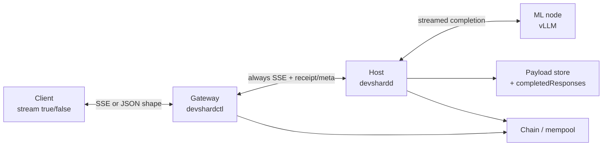
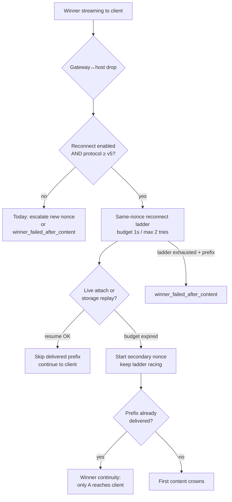
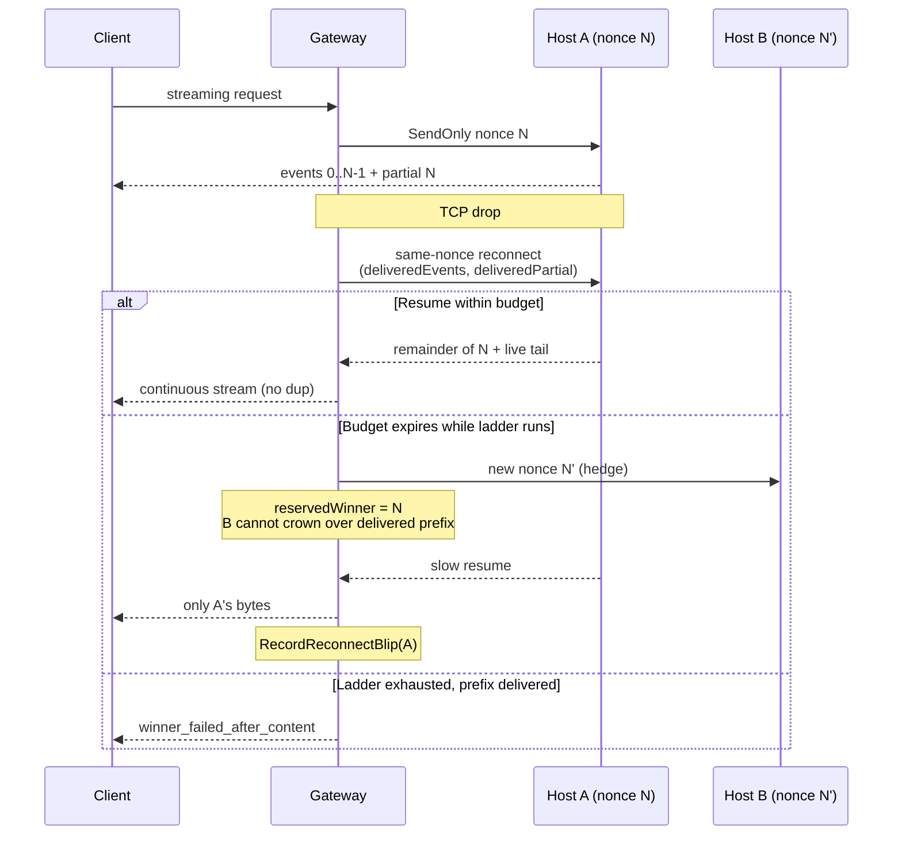
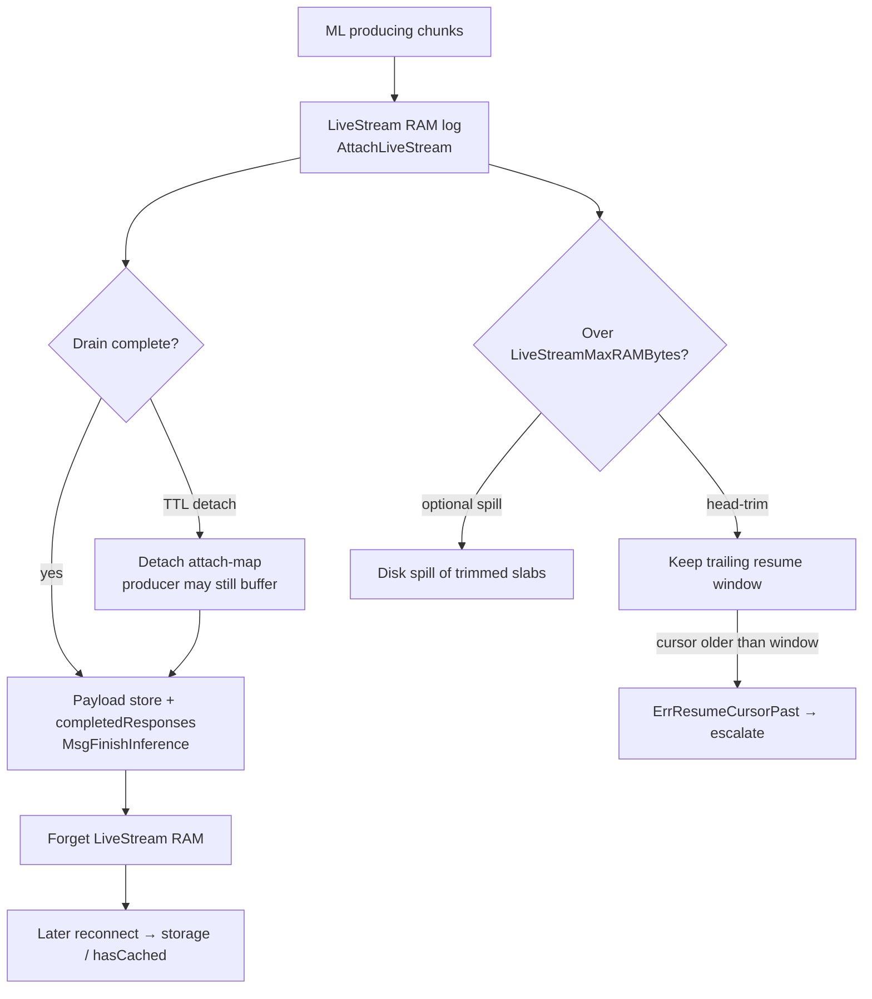
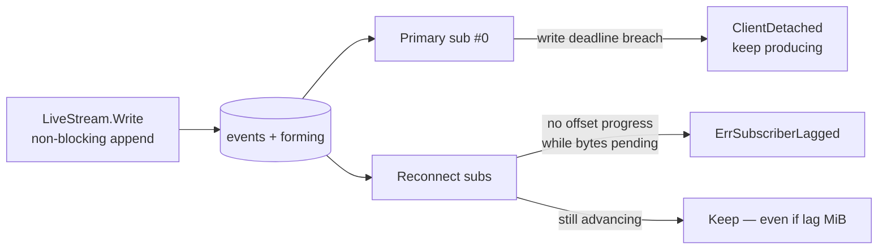
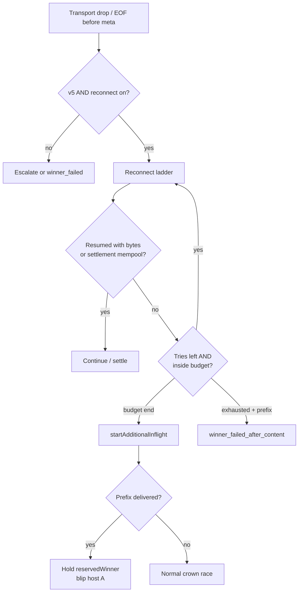

# Gateway streaming HA — design overview

**Status:** Living overview of the always-stream + same-nonce reconnect architecture.  
**Audience:** Operators and engineers who need one place for the end-to-end design, flows, timeouts, observability, and e2e coverage.  
**Detail / checklists:**  
[proposals/always-stream-upstream.md](./proposals/always-stream-upstream.md) (design),  
[gateway-always-stream-upstream-plan.md](./gateway-always-stream-upstream-plan.md) (always-stream steps),  
[gateway-attempt-reconnect-plan.md](./gateway-attempt-reconnect-plan.md) (reconnect steps).

---

## 1. Summary

Two complementary motivations:

| Theme | Goal | Why |
|---|---|---|
| **Streaming as the universal upstream shape** | Always request a streamed completion from host → ML, regardless of the client’s `stream` flag | Real liveness (first-token / inter-chunk), real TTFT, and **sustained stream speed (bytes/sec)** for every chat request — the signals needed for more reliable routing and host-quality decisions |
| **Same-nonce reconnect** | On a mid-stream gateway↔host drop, resume the **same** inference before starting a new nonce | Fault-tolerance and high availability: transient TCP blips stop costing a full regeneration or a user-visible `winner_failed_after_content` |

**What the client sees**

- `stream: true` → SSE chunks (as today).
- `stream: false` → one aggregated `chat.completion` JSON (after always-stream lands at the gateway).
- Mid-stream drop on a v5 session with reconnect enabled → silent resume from the break offset when the host still has the generation; otherwise escalate as today.

**What is already landed (core path)**

| Area | State |
|---|---|
| Streamed usage mandatory + well-formed streamed replay | Done (parent Steps 1–2) |
| Host ML drain independent of the gateway writer | Done (parent Step 3) |
| Same-nonce reconnect, winner continuity, LiveStream resume tiers | Done (reconnect Steps 1–5e); **default-off**, gated to protocol ≥ `v5` |
| Gateway SSE event size cap (1 MiB) | Done (parent Step 12) |
| Force upstream `stream` / client aggregator / intent | **Not yet** (parent Steps 5–11) |
| Citest e2e (admin + v2 gate + v5 mid-stream resume) | Done (reconnect Step 7; `make citest-attempt-reconnect`) |
| Soft-signal persist, full Prometheus/OTel | **Deferred** (reconnect Steps 6 / 8 / 5f–5g) |
| Cross-instance `devshardd` HA / ML reattach on host reboot | **Deferred** (reconnect Step 10; needs separated mock MLNodes from `ak/devshard-observability-e2e` + MLNode keep-alive) |

---

## 2. Overall design

### 2.1 Components



### 2.2 Happy-path request flow

```mermaid
sequenceDiagram
  participant C as Client
  participant G as Gateway
  participant H as Host
  participant M as ML

  C->>G: chat.completions (stream intent)
  Note over G: Normalize; (future) force stream=true upstream
  G->>H: HostRequest + nonce N
  H->>M: POST streamed completion
  M-->>H: SSE chunks
  H-->>G: data chunks + receipt + meta
  alt Client wants SSE
    G-->>C: forward chunks
  else Client wants JSON
    G-->>C: aggregate → chat.completion
  end
  Note over H: Finish → hash → payload store → MsgFinishInference
```

### 2.3 Failure-tolerant path (drop mid-stream)



### 2.4 Design pillars (short)

1. **Upstream always streams** (when `ForceUpstreamStreaming` is on) — client shape is a gateway boundary decision.
2. **Host never aborts ML because the gateway writer died** — drain, persist, forget live RAM.
3. **Resume, don’t regenerate** — same nonce, same host, cursor `(deliveredEvents, deliveredPartial)`.
4. **Winner continuity** — once bytes reached the client, a secondary must not splice a different generation onto that prefix.
5. **Soft signals before hard routing** — reconnect blips and stream bytes/sec are measured so routing can become smarter later; they do **not** quarantine or force secondaries by default.

---

## 3. Same-nonce reconnection

### 3.1 When it runs

Effective gate:

```text
AttemptReconnectEnabled
AND ProtocolVersionAtLeast(session, ProtocolV5)
```

On ≤v4 escrows the path is dormant even if the setting is flipped: those hosts abort ML on disconnect and cannot answer a mid-generation reconnect usefully.

### 3.2 Cursor and resume

The gateway tracks an **upstream** resume cursor on the winning inflight (not rewritten client bytes):

```text
deliveredEvents  = complete upstream data events already forwarded
deliveredPartial = bytes of the next event already forwarded
```

On reconnect the host emits from that cursor (remainder of the partial event, then live/storage tail). The gateway still skips any unexpected re-prefix as a safety net. Aggregating (`stream: false`) clients need no cursor — nothing was written yet; they re-buffer / re-aggregate.

### 3.3 Ladder flow



### 3.4 Winner continuity rules

| Situation | Client outcome |
|---|---|
| A drops **before** content; B crowns | Clean B stream from the start |
| A drops **after** content; resume succeeds | Continuous A stream from break offset |
| A drops after content; budget expires; B ahead | Still **only A** if A resumes — B settles as loser |
| A’s ladder exhausted with prefix delivered | Truncated / `winner_failed_after_content` (opt-in stream-reset is off by default) |
| Receipt-only reconnect (no live/cache/mempool) | Failed try; does not burn a “successful resume” |

A reconnect is **not** a new attempt for accounting: same inflight / nonce / one terminal `ProcessResponse` (merge receipt/mempool from the last useful response).

---

## 4. Live buffers (reconnect plan Step 5)

Host-side buffering makes resume possible without a second vLLM call. `LiveStream` is an **append-only byte log with independent readers**; the producer never does network I/O under the append lock.

### 4.1 Tier lifecycle



### 4.2 Readers and backpressure



| Reader | Slow but advancing | Frozen offset | Soft-cap exceeded |
|---|---|---|---|
| **Primary** | Kept (never `ErrSubscriberLagged`) | Per-write deadline → detach reader, keep producing | Trim/spill once primary past trim point or dropped |
| **Reconnect** | Kept (byte lag alone never kills it) | `LiveStreamReaderStallTimeout` → `ErrSubscriberLagged` | Prefer `ErrResumeCursorPast` if head trimmed |

**Never** publish a mid-flight partial body as the durable `completedResponses` entry — replay would synthesize `[DONE]` and silently truncate.

### 4.3 Step 5 sub-steps (status)

| Sub-step | Role | Status |
|---|---|---|
| **5a** | Reader stall policy (reconnect no-progress; primary write deadline) | Done |
| **5b** | Cut per-chunk id-rewrite cost; slab sharing deferred (conflicts with trim) | Done (rewrite); slab deferred |
| **5c** | Head-trim to RAM cap (`eventsBase` / `bytesBase`); no partial durable publish | Done |
| **5d** | Defensive forming-event cap | Done |
| **5e** | Payload store as last resume tier; clocks from `ExecutionTimeout` | Done (init defaults; session-dynamic clock follow-up noted in plan) |
| **5f** | Trim/lag metrics → Step 8 dashboards | Deferred |
| **5g** | Per-chunk hop timestamps (`: devshard-ts` comments) | Deferred |

---

## 5. Timeouts and actions

Clocks that bound producing / holding a winner derive from protocol **`ExecutionTimeout`** (default **32 min**) so host drain, LiveStream attach TTL, and gateway hard timeout stay aligned with the chain missed-finish window.

### 5.1 Timeout → action map

| Clock | Default | Where | When it fires | Action |
|---|---|---|---|---|
| Receipt timeout | 5s | Gateway | No receipt after send | Escalate / mark attempt failed |
| First-token budget | floor 1s + per-input-token lag (cap 1s floor family) | Gateway | No content yet | `attempt_failed` / start secondary (streaming policy) |
| Attempt reconnect budget | **1s** from first drop | Gateway | Ladder still open | Start hedge secondary **and** keep ladder racing |
| Attempt reconnect max tries | **2** per nonce | Gateway | Tries exhausted | Release reservation; fail or let secondary crown per R4/R5 |
| Inter-chunk stall (log / policy) | 30s log threshold; 60s setting | Gateway | Winner silent after content | Stall signal / abort path for hung winner |
| Streaming attempt hard timeout | `ExecutionTimeout` | Gateway | Crowned winner exceeds budget | Terminal winner failure |
| Non-stream no-content / max wait | `ExecutionTimeout` today | Gateway | Pre–always-stream path | Long wait / reduced-`max_tokens` retry — **removed when always-stream forces streaming escalation** |
| Host ML / drain deadline | `ExecutionTimeout` | Host | Detached client still generating | Stop drain; set `PartialResponse*`; no unbounded orphan GPU |
| `InflightReplayBufferTTL` | `ExecutionTimeout` | Host | Live attach map entry aged out | **Detach** attachability (do not abort finish); reconnect uses storage or fails cleanly |
| LiveStream primary write deadline | ~30s | Host | Black-holed primary TCP | `ClientDetached`; keep producing into durable body |
| LiveStream reader stall (reconnect) | ~30s (> reconnect budget) | Host | Reconnect sub makes zero progress with pending bytes | `ErrSubscriberLagged` → gateway ladder / escalate |
| SSE event size | 1 MiB / line | Gateway transport | Line grows without `\n` | `ErrSSEEventTooLarge` → attempt failure / escalate |

### 5.2 Decision sketch on a drop



---

## 6. Observability

Motivation: **measure stream speed and reconnect pressure** so routing can later prefer hosts that stay up and deliver tokens quickly — without buying a second generation on every blip.

### 6.1 Soft signals (not routing — yet)

| Signal | Definition | Routing today | Persist |
|---|---|---|---|
| **Reconnect blip** | One per ladder run per participant; ages out in `ReconnectBlipWindow` (default 5m) | None — no `RequestSample`, no quarantine, no picker effect | Step 6 → gateway store (deferred) |
| **Stream bytes/sec** | `outputBytes / max(elapsed_since_first_content, ε)` on attempts that forwarded content | None (informational) | Rolling summary with blips (Step 6) |
| **Reconnect attempts** | Transport tries on the same inflight; counters by result | N/A (path metrics) | Prometheus (Step 8) |

```text
stream_bps = outputBytes / max(elapsed_since_first_content, ε)
```

- Clock starts at first content chunk, not send/receipt.
- Ends at attempt terminal (success, stall, hard timeout, cancel, ladder exit).
- Prefer winner / client-forwarded bytes; optional suppressed-loser series for capacity diagnosis.

### 6.2 Reconnect + LiveStream metrics (target / Step 8)

| Metric (illustrative) | Meaning |
|---|---|
| `devshard_gateway_attempt_reconnect_total{result,protocol_version}` | `resumed` / `budget_expired` / `receipt_only` / `error` / `skipped_protocol` |
| `devshard_gateway_attempt_reconnect_seconds` | Ladder latency |
| `devshard_gateway_winner_continuity_total{outcome}` | `resumed` / `reset` / `failed` |
| `devshard_gateway_reconnect_blips_total` + in-window gauge | Blip pressure per participant |
| `devshard_gateway_stream_bytes_per_second` / `_total` | Sustained throughput |
| `sse_event_too_large` attempt reason | Transport DoS abort (landed classifier) |
| Host 5f: live-log bytes, trim, `cursor_past_after_trim`, `subscriber_lagged`, `reader_lag_bytes` | RAM / stall health |

### 6.3 Hop timestamps (Step 5g — deferred)

Goal: join gateway → host → ML → host → gateway latency **without** changing `ResponseHash` or the resume cursor.

```text
gateway_send  →  req_ms           (gateway → host)        [cross-clock]
req_ms        →  v[i] / ml[i]     (host → ML → host)
ml[i]         →  w[i]             (host buffer residency)
w[i]          →  gateway_recv[i]  (host → gateway)        [cross-clock]
```

Carrier: SSE **comment** lines injected at the subscriber writer (`: devshard-ts {…}`), invisible to old gateways and outside cursor-counted `LiveStream` events. Absolute `ml`/`v` arrays live in parallel RAM (+ finish sidecar); `w` is per-connection emit time. Metrics carry `tier` ∈ `live|cache|store`. Same R8 rule: metrics only, never `Decide` / quarantine.

### 6.4 OTel (parent Step 16 — after observability e2e merge)

- Child span `attempt.reconnect` under `gateway.attempt`
- Reconnect TTFB and time-to-first-**new** chunk past the delivered offset
- `attempt.winner_switched` / `attempt.failover` when the race moves to another nonce

---

## 7. E2E scenarios — connection reattempts (`testenv` / citest)

**Status:** Citest landed (`TestAttemptReconnect_*`, `make citest-attempt-reconnect`). Unit coverage in `redundancy_reconnect_test.go` and host `livestream_*_test.go`. Soft-signal persist / full Prometheus+OTel / default-on soak remain deferred in the reconnect plan.

| # | Scenario | Assert |
|---|---|---|
| 1 | Mid-stream drop, **v5**, reconnect on | One complete non-duplicated completion; exactly one `MsgFinishInference`. Variants: resume from **storage** after drain+forget; head-trim cursor **inside** window; cursor **older** than window → clean escalate |
| 2 | Mid-stream drop, **v4**, reconnect on | No same-nonce resend; today’s escalate / `winner_failed_after_content` contract |
| 3 | Host permanently down after drop, v5 | Escalation after budget; outcome matches today’s failure contract |
| 4 | Streaming **and** non-streaming clients, fixed seed | Resumed vs uninterrupted agree on aggregated **content + usage** (not raw bytes — chunk ids rewrite) |
| 5 | Helpers | `killableClient` / `streamContentThenErrClient`; `mockopenai` `PartialStream` |
| 6 | **R4 winner continuity** | A delivers prefix and drops; B races ahead while A resumes slowly → client sees **only A**; B is loser; one blip on A; routing unchanged |
| 7 | **Second drop after resume** | Ladder is one-shot per nonce — no fresh 1s window; lands in `winner_failed_after_content` |
| 8 | **Reconnect while client already gone** | Nonce finishes once; delivered prefix does **not** advance over swallowed post-disconnect bytes |

Suggested layout: `devshard/testenv/citest` + `devshard/cmd/devshardctl/e2e`, with stacks stamped to protocol `v5` via version-name harness (do not fake the gate by only flipping `AttemptReconnectEnabled`).

### 7.1 Cross-instance host HA / ML reattach (reconnect plan Step 10)

Same-process reconnect (above) is not enough when the sticky `devshardd` **reboots** or
failover lands on another HA replica: live state is process-local, and today tearing down
the host→ML connection aborts generation. Multi-instance topology + shared Postgres already
exist ([high-availability-architecture.md](./high-availability-architecture.md)); HA citest
for leases / rolling update is landed. What is missing is **MLNode keep-alive across host
disconnect** so another `devshardd` can reattach to the same job.

**Defer e2e until after `ak/devshard-observability-e2e` merges** — that branch separates mock
ML nodes from `devshardd`, which is required to reboot a host without killing the stream
source. See [issue #1466](https://github.com/gonka-ai/gonka/issues/1466) §4 and reconnect
plan Step 10 (scenarios HA1–HA4).

---

## 8. E2E scenarios — always-streaming design (`testenv` / citest)

**Status:** Host prerequisites landed; gateway force/aggregate (`ForceUpstreamStreaming`) still to land. Scenarios below are the acceptance matrix for that flip.

| # | Scenario | Assert |
|---|---|---|
| A1 | `stream: false` client + force-upstream on | Client gets `application/json` `chat.completion`; mock ML saw a **streaming** request; usage present |
| A2 | `stream: true` client + force-upstream on | SSE unchanged; no trailing usage chunk unless client asked `include_usage` |
| A3 | Differential | Aggregated JSON matches mock’s own non-streaming JSON field-for-field (fixed seed) |
| A4 | Cache isolation | Identical normalized bodies, different client stream intent → different cache keys / shapes |
| A5 | Escalation under always-stream | Dead host / no first token for a `stream: false` client escalates on **first-token** budget, not the old 140s reduced-`max_tokens` path |
| A6 | Mid-stream disconnect + drain | Host publishes `MsgFinishInference` with non-zero input tokens; same-nonce reconnect replays full body |
| A7 | Streamed replay format | Reconnect to completed streamed inference parses as a normal chunk sequence (not `{"events":[…]}` as one line) |
| A8 | SSE oversize | Malicious unterminated `data:` aborts with `ErrSSEEventTooLarge` under limit+ε; legal near-limit chunk still parses |
| A9 | Soak / dashboards | TTFT populated for essentially all chat; no `response_timeout_reduced_max_tokens`; missing-usage and sse-oversize counters stay at zero outside fault tests |

Existing unedited e2e that must keep passing once the aggregator lands: `TestE2E_NonStreamingHappyPath`, shape/cache isolation tests, streaming suites, `non_streaming_corner_cases_test.go`.

---

## Related documents

| Doc | Role |
|---|---|
| [proposals/always-stream-upstream.md](./proposals/always-stream-upstream.md) | Consolidated design (always-stream + reconnect) |
| [gateway-always-stream-upstream-plan.md](./gateway-always-stream-upstream-plan.md) | Always-stream implementation steps / rollout |
| [gateway-attempt-reconnect-plan.md](./gateway-attempt-reconnect-plan.md) | Reconnect + LiveStream Step 5 detail; Step 10 cross-instance HA |
| [high-availability-architecture.md](./high-availability-architecture.md) | Multi-instance `versiond` / `devshardd` + shared Postgres |
| [Issue #1466](https://github.com/gonka-ai/gonka/issues/1466) | Inference handling; §4 = cross-instance HA / ML reattach |
| [proposals/chat-stream-inflight-join.md](./proposals/chat-stream-inflight-join.md) | Fan-out to a *different* client request (separate) |
| [stream-resume-pre-proposal.md](./stream-resume-pre-proposal.md) | Client-facing `Last-Event-ID` resume (separate) |
