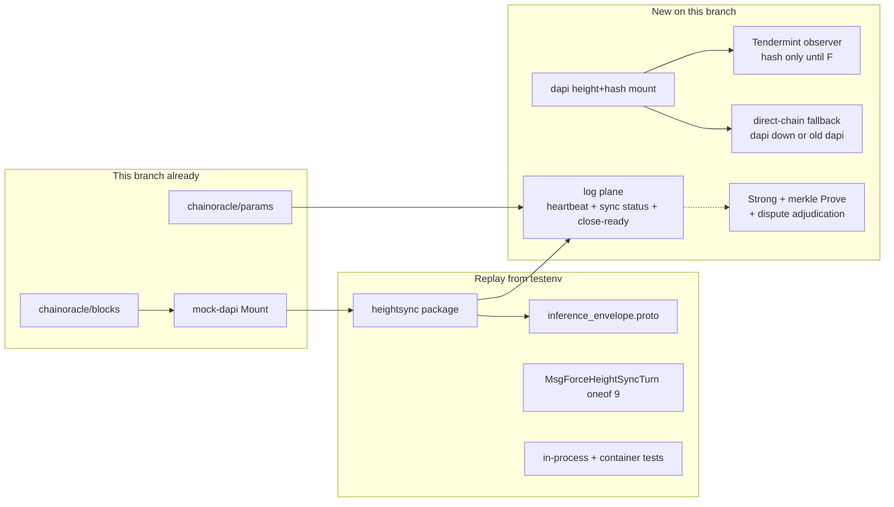
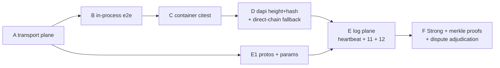

# Height-sync implementation plan (v5 / `ak/height-sync-protocol`)

**Spec:** [`proposals/HEIGHT_SYNC_PROTOCOL_PROPOSAL.md`](./proposals/HEIGHT_SYNC_PROTOCOL_PROPOSAL.md)  
**Test catalog (from `devshard-testenv`):** [`height-sync-tests.md`](./height-sync-tests.md)  
**Related:** [`proposals/CPOC_PROTOCOL.md`](./proposals/CPOC_PROTOCOL.md), [`proposals/FINALIZATION_COLLECTOR_PROTOCOL_PROPOSAL.md`](./proposals/FINALIZATION_COLLECTOR_PROTOCOL_PROPOSAL.md), [`proposals/VALIDATION_PROTOCOL_PROPOSAL.md`](./proposals/VALIDATION_PROTOCOL_PROPOSAL.md)

**Status:** Phases **A**, **B**, and **C** landed on this branch. Catalog §2–§4 pass (`go test ./heightsync/... ./transport/... ./testenv/scenarios/ -run HeightSync`; held-response tests need `-tags=dev`). Phase C is `citest-height-sync` against this mock-dapi chainoracle (no `heightsyncd`). Phases D–F not started. The oracle substrate (`devshard/chainoracle/blocks`) and the mock-dapi mount already exist.

| Phase | Status | What’s on this branch |
| ----- | ------ | --------------------- |
| **A** | ✅ | `devshard/heightsync`, envelope, `MsgForceHeightSyncTurn` oneof 9, host/user/transport/state seams on `chainoracle/blocks`. Catalog §2–§3. |
| **B** | ✅ | In-process e2e in `testenv/scenarios/heightsync_anchor_e2e_*.go` (static `blocks.BlockOracle`s, `/devshard/v2`, numeric escrow ids). Catalog §4 including `-tags=dev` E2/E3/E8. |
| **C** | ✅ | Container citest `citest-height-sync` against mock-dapi `/block/*` (optional `DEVSHARD_CHAINORACLE_URL`; default compose unchanged) |
| **D** | ⏳ | Production dapi height+hash + old-dapi fallback |
| **E** | ⏳ | Log plane (heartbeat, sync vector/state, repair, close-ready) |
| **F** | ⏳ | Strong / `light_block` / dispute adjudication |

This plan delivers **the whole spec except the Strong path**, in six phases:

1. **A–C** replay the transport plane that is already implemented and tested on `devshard-testenv` (Omit/Anchor, cadence, forced turns, courier carry, response-leg signatures, `(C-quorum)`), rewired onto `chainoracle/blocks`.
2. **D** mounts a **height+hash** oracle in production dapi and keeps v5 hosts working against an **unmodified older dapi**.
3. **E** builds the **log plane** — §10 heartbeat turns, §11 `sync_vector` / `sync_state` / `peer_seen` / repair probe, §12 close-ready arming, §14 L1–L7 verifier checks, §17 `(C-turn)`. This is new code; nothing on `devshard-testenv` covers it.
4. **F** is **only** the Strong path (`light_block`, `D`-band escalation, `(C-strong)`/`(C-hybrid)`), the dapi work that feeds it (commit signatures, IAVL `Prove()`), and the **dispute adjudication** that consumes Strong-grade evidence.

The split for disputes is: **marking lands in E, adjudication lands with F.** Phase E must *detect and record* every attributable event the spec names (`DISPUTE_ORIGINATOR` / `DISPUTE_CARRIER` on sight, `ACKED`-vs-log contradiction, false `SYNCED`) into the audit ring, metrics, and local evidence store. Turning those records into evidence packets, on-chain `MsgHeightSyncEvidence`, or slashing is Strong-phase work, because the canonical-pair half of the packet is a `LightBlock`.

---

## 0. Why not `git cherry-pick`

The height-sync commits on `devshard-testenv` (`a2f7507b0`, `5b079ca7a`, `95e3996fb`, …) will **not** apply cleanly:

| Conflict | This branch | `devshard-testenv` |
| -------- | ----------- | ------------------ |
| Oracle package | `devshard/chainoracle/blocks` (+ `params`, unified HTTP) | `devshard/blockoracle` |
| Testenv topology | mock-dapi **in-process** mock observer + `cosrv.Mount` | separate `heightsyncd` process; mockdapi is an HTTP client |
| Lineage | 0.2.15 / v5 (`#1497`, `#1564`, `#1578`) | 0.2.13-era testenv + later height-sync |
| `diff.proto` | 8 txs, field 9 free | field 9 = `MsgForceHeightSyncTurn` (compatible number) |

**Replay, do not cherry-pick.** Copy named directories from `devshard-testenv`, rewrite imports `devshard/blockoracle` → `devshard/chainoracle/blocks`, and wire hosts to the oracle this branch already serves from mock-dapi.

Source commits to replay from (merge-base `d8b8e9073`):

| Hash | What to take |
| ---- | ------------ |
| `a2f7507b0` | `heightsync/` skeleton, `inference_envelope.proto`, first e2e |
| `0a77734b4` | Phase A test fixes |
| `5b079ca7a` | **Core:** cadence, inbound, confirmation, origin signing, courier, force turn, docs catalog |
| `95e3996fb` | Container e2e + `decide_log` / `oracle_debug` |

Do **not** copy `devshard/blockoracle/**` or `testenv/cmd/heightsyncd` — replaced by `chainoracle` + mock-dapi.

---

## 1. What exists where

### This branch (`ak/height-sync-protocol`)

| Piece | State |
| ----- | ----- |
| `devshard/chainoracle/blocks` | `BlockOracle` (`Latest` / `At` / `Prove` / `Subscribe`), `Header`+`Commit`, HTTP `/block/latest\|:height\|prove\|stream`, `client`, `verifier` |
| `devshard/chainoracle/server.Mount` | Blocks + `/versions`; `import_gate_test.go` forbids `heightsync` / `host` / `testenv` imports |
| `devshard/chainoracle/params` | Runtime-config snapshot source/server (`common/runtimeconfig.Snapshot`) — the carrier for new chain params (§8.4) |
| mock-dapi | In-process mock observer, same HTTP contract |
| `observer.NewTendermint` | **Stub that panics** — production observer not written |
| `devshard/heightsync` | **✅ Present** (transport plane: cadence, inbound, confirmation, origin signing, audit) |
| Envelope / `MsgForceHeightSyncTurn` | **✅ Present** (`inference_envelope.proto`, `diff.proto` oneof 9) |
| Sequencer seams | `user/session.go`: force-turn compose in `PrepareInferenceFn`, escrow hints on `SendOnly` / `sendDiffRound` |
| Host seams | `host/host.go` `WithChainOracle`, `LatestHeight`; `host/mempool.go` unchanged (no force-turn sort on this branch) |
| Verifier seams | `state/machine.go` + `state/heightsync.go`: `applyForceHeightSyncTurn`, escrow hints hashed into rest hash |
| Transport seams | envelope wrap/unwrap, `WithHeightSync`, origin verify, seed RPC, peer tips; routes include `POST .../height-sync` |
| In-process e2e | **✅ Present** (`testenv/scenarios/heightsync_anchor_e2e_*.go`, catalog §4) |
| Peer fan-out | `gossip/interface.go`: `PeerClient.GossipTxs`, `MempoolSink.AddTx` |
| Production dapi | **No** `devshard` module dep; no `/block/*` routes. Height+hash today: `BrokerChainBridgeImpl.GetBlockHash` → CometBFT `Block` RPC (hash only, no commit) |

### `devshard-testenv` (replay source)

Transport plane **done and tested**: Omit/Anchor, `K`/`slots_num` cadence, degraded Anchor (`tip_stale_after_ms`), `MsgForceHeightSyncTurn` + cadence swallow, response-leg origin signatures, courier peer tips + `last_propagated`, freshness gate `F`, `(C-quorum)`, audit ring, exculpation API, seed RPC, in-process e2e E1–E11, container Phase A–C.

**Not implemented there either** (spec-only): Strong / `light_block`, `MsgHeartbeat` / `MsgHeightAck`, `sync_vector`, `sync_state`, `peer_seen`, repair probe, close-ready, `(C-turn)`.



---

## 2. Phases

Each phase is independently shippable. Strong is last, matching `devshard-testenv` (Strong milestone ⏳). The log plane (E) does **not** need Strong evidence.

| Phase | Deliverable | Spec | Replay? | Status |
| ----- | ----------- | ---- | ------- | ------ |
| **A** | `heightsync/` + envelope + force turn + host/user/transport/state seams, imports on `chainoracle/blocks` | §7–§9, §13–§17 Anchor + `(C-quorum)` | Yes | ✅ |
| **B** | In-process e2e on current `testenv/scenarios` | catalog §4 | Yes, path remap | ✅ |
| **C** | Container citest `citest-height-sync` against mock-dapi chainoracle (no `heightsyncd`) | catalog §5 A–C | Adapt | ✅ |
| **D** | Dapi mounts **height+hash** (`/block/latest`, `/block/:height`); hash-only Tendermint observer; **v5 ↔ old dapi** fallback. **No** `Prove()`, **no** commit-quorum requirement. | plan §7 | New | ⏳ |
| **E** | **Log plane:** `MsgHeartbeat` / `MsgHeightAck`, `observed_height`, turn record, `sync_vector`, `sync_state`, `peer_seen`, repair probe, close-ready arming, L1–L7, `(C-turn)`, marking of attributable events | §10–§12, §14 log-plane, §17 `(C-turn)`, §18.2.1, §20 params | New | ⏳ |
| **F** | **Strong only:** `light_block` + `D`-band escalation + `(C-strong)`/`(C-hybrid)`; dapi `Header.Commit` + IAVL `Prove()`; dispute adjudication and evidence packets | §8, §15 Strong proof, §18.4, catalog §8 | New | ⏳ |



Only F depends on Strong. E depends on D solely because a heartbeat needs a real `(height, hash)` source on production hosts; against mock-dapi it can be developed in parallel with D.

---

## 3. Spec coverage matrix (validity re-check)

Every normative surface in the spec, the artefact that satisfies it, and the phase. This table is the acceptance criterion for "the plan fills the gaps the proposal targets".

| Spec | Surface | Artefact | Phase |
| ---- | ------- | -------- | ----- |
| §7 fields 1–7 | `HeightSyncSection` on the envelope | `proto/devshard/v1/inference_envelope.proto`, `transport/envelope.go` | A |
| §7 field 8 | Response-leg signature, `CanonicalOriginBytes`, field 8 excluded from signing input | `heightsync/origin_signing.go` | A |
| §7 field 9 | `light_block` | — | **F** |
| §7 field 10 | `tip_stale_after_ms`, advisory, set after signing | `heightsync/anchor.go` (degraded Anchor) | A |
| §8 Omit/Anchor/degraded Anchor | Producer mode table incl. quiet-vs-dead feed | `heightsync/anchor.go` + `source.go` | A |
| §8 Strong | Escalation state machine | — | **F** |
| §9 cadence | `K` / `slots_num` windows, initial turn, constraint `K ≥ slots_num` | `heightsync/cadence.go` | A |
| §9 forced turn | `MsgForceHeightSyncTurn` (oneof **9**), `ActiveForcedTurn`, second-directive ignore, cadence swallow | `diff.proto`, `state/machine.go`, `heightsync/cadence.go` | A |
| §9 lazy carry | `MaxFresh` + `last_propagated` gate | `transport/peer_tips.go` | A |
| §10.3 obligation | `h_last` tracking, `K_hb` cadence, `D_ack` deadline, heartbeat turn opened by the **user only** | `heightsync/heartbeat.go` + `user/session.go` | **E** |
| §10.3 wire compat | Heartbeat turn also carries `MsgForceHeightSyncTurn{reason="heartbeat"}` so existing forced-turn enforcement covers the span | `user/session.go` | **E** |
| §10.4 | `MsgHeartbeat` (oneof **10**), `MsgHeightAck` (oneof **11**), `HeightAckContent` domain `heightsync.ack.v1`, four binding rules | `diff.proto`, `heightsync/logplane.go` | **E** |
| §10.5 | `observed_height` in `DiffContent`; REQUIRED on the heartbeat pair, RECOMMENDED on `MsgStartInference` / `MsgConfirmStart` / `MsgFinishInference` | `diff.proto` + `state/machine.go`; signature coverage and the `ExecutorReceiptContent` mirror in §8.2.1 | **E** (stamps: E, gated — see §8.5) |
| §10.6 | Async fan-out: span dispatched without awaiting acks; ack tail out of order; late acks tagged, never clear `degraded` | `user/session.go`, `heightsync/turn.go` | **E** |
| §10.7 | `SyncTurnRecord`, `open` / `complete` / `degraded`, `Q` reused from `(C-quorum)`, only `complete` advances `h_last` | `heightsync/turn.go` | **E** |
| §11.1 | `SyncVectorEntry` + `AckStatus`, one entry per slot for `turn_seq − 1`, `ACKED`-vs-log contradiction is user-attributable | `heightsync/syncvector.go`, L7 | **E** (marking) |
| §11.2 | `sync_state` decision table, `peer_seen` bitmap incl. probe-learned heights | `heightsync/syncstate.go`, `heightsync/peerseen.go` | **E** |
| §11.2 `CATCHING_UP` ⇒ next heartbeat Strong | Escalation of the *next* turn to Strong | recorded in E, **enforced in F** | E/F |
| §11.3 | `POST /sessions/:id/heightsync/repair`, both legs signed (domain `heightsync.repair.v1`), outcomes `HEIGHT` / `UNREACHABLE`, **no attribution** | `heightsync/repair.go`, `transport/server.go`, `server/routes.go` | **E** |
| §11.4 | One probe per `(turn, slot)`, `R_max` per `K_hb`, stagger `δ_probe`, backoff, zero probes on healthy path, armed hosts stop | `heightsync/repair.go` budget state | **E** |
| §12.1–12.3 | `last_signal_height`, arming at `T_idle`, level-triggered disarm, emits nothing | `heightsync/closeready.go` | **E** |
| §12.4 | `CloseReadyView`, `UserTimeoutEvidence` (degraded turns as context) | `heightsync/closeready.go` | **E** (producer); consumer is finalization, out of scope |
| §13 host producer rules | Anchor on every response in a turn, degraded Anchor, ack REQUIRED even when oracle unusable | `heightsync/anchor.go` (A) + `host` ack producer (E) | A + E |
| §13 courier rules | Peer tips, `VerifyOrigin` on ingest, strip field 8, never self-brand as originator, heartbeat obligation | `transport/client.go` (A) + `user/session.go` (E) | A + E |
| §14 steps 1–3, 5–9 | Receiver pipeline incl. forced-turn-first ordering, freshness `F`, cadence/lazy classification, oracle reconciliation, deferred queue, audit + metrics | `heightsync/inbound.go` | A |
| §14 step 4 | Strong verification branch | — | **F** |
| §14 L1–L7 (+ L0 monotonicity) | Log-plane checks at diff-ingest | `heightsync/logplane.go` wired into `state.StateMachine.ValidateDiff`; L4 / L5a additionally at the `inbound.go` edge, where the envelope is still attached | **E** |
| §14 result classes | `VALID_*`, `DEFERRED_FAIL`, `DISPUTE_*`, `INVALID(reason)` + new `ack_sig_invalid`, `ack_causality` | `heightsync/inbound.go` + `logplane.go` | A (transport) + E (log) |
| §15 asymmetric model | Response signed, request trusted, exculpation on demand | `heightsync/origin_signing.go`, `transport/peer_tips.go` | A |
| §15 exception | Repair probe signs **both** legs | `heightsync/repair.go` | **E** |
| §15 Strong proof steps 1–7 | `VerifyLightBlock` | — | **F** |
| §16 | Originator immutability, `D` bound on carry-forward, provenance-less carry ⇒ carrier is source, `last_propagated` ladder | `transport/peer_tips.go` (`D` bound enforced only once `D` exists in F) | A (+F for the `D` clause) |
| §17 `(C-quorum)`, `F`, `W_conf`, `Q`, monotonicity, pruning | `ConfirmationIndex` | `heightsync/confirmation.go` | A |
| §17 `(C-turn)` | Deterministic rule over `SyncTurnRecord`; `sync_state ≠ ORACLE_UNAVAILABLE` filter | `heightsync/confirmation.go` + `turn.go` | **E** |
| §17 `(C-strong)` / `(C-hybrid)` | — | — | **F** |
| §18.1 | `ConfirmationView()` on client + server | `transport/client.go`, `transport/server.go` | A |
| §18.2 | `ObservedHeightNow()` | `transport/client.go` | A |
| §18.2.1 | `TurnTracker.Record` / `Latest` / `MissingAcks`, `Server.RepairProbe`, `Server.CloseReadyView` | `heightsync/turn.go`, `repair.go`, `closeready.go` | **E** |
| §18.3 | `HeightSyncEvidenceFor`, `VerifyOriginDetached` | `transport/client.go`, `heightsync/origin_signing.go` | A |
| §18.4 | `LightBlockFor` | — | **F** |
| §18.5 | Seed RPC `POST /sessions/:id/height-sync` behind `WithHeightSyncSeedRPC` | `transport/server.go` | A |
| §18.6 | `SendMsgForceHeightSyncTurn` | `user/session.go` | A |
| §18.7 | `AuditRing`, `HeightSyncAuditRing()` both sides | `heightsync/audit.go` | A |
| §19 attacks 1–5, 9, 11, 13 | Anchor-plane defences | catalog §2–§5 tests | A–C |
| §19 attacks 6–8, 12 | Strong-plane defences | catalog §8 S1–S12 | **F** |
| §19 attack 10 | Cross-session equivocation | audit ring records it (A); adjudication | A (record) / **F** |
| §19 attacks 14–22 | Log-plane defences (quiet session, missing ack, lying vector, false `SYNCED`, probe amplification, partitioned minority, drip-fed late acks) | plan §8.13 / catalog §7: H1–H24 | **E** |
| §19 attacks 23–26 | Stamp integrity (rewritten `executor_sig` height, regression, future-dating) and replay stability of the tier split | plan §8.13 / catalog §7.2–§7.3: H13a, H13c, H13d, H13e, H28–H30 | **E** |
| §20 defaults | `K`, `slots_num`, `F`, `W_conf`, `Q`, audit capacity, `StaleAfter` | existing constructors | A |
| §20 new params | `K_hb`, `D_ack`, `T_idle`, `δ_probe`, `R_max`, `(C-turn)` reuse of `Q` | `heightsync/params.go` + runtime-config snapshot | **E** |
| §20 `D`, header-cache window, Strong recency, `Rule=Strong/Hybrid` | — | — | **F** |

### Gaps this revision closes

The previous revision of this plan had Phase E as a five-line paragraph. Concretely it did not say:

- where `MsgHeightAck` is produced or how it reaches `Diff` (host mempool, §8.6);
- that L0–L7 run inside `state.StateMachine.ValidateDiff`, i.e. that the log plane is a **diff-validation** concern and not a transport concern — with L4 / L5a as the cross-plane exceptions that can only be evaluated at the transport edge (§8.7);
- how `sync_state` is computed, or that `ORACLE_UNAVAILABLE` must still be acked and must not count toward `Q` (§8.6);
- that `peer_seen` includes probe-learned heights (§8.6);
- how `sync_vector` is composed given async fan-out — it reports turn `s − 1`, never `s` (§8.5);
- the repair endpoint's route, auth, signing domain, and budget state (§8.9);
- the arming inputs for close-ready, or that arming must be level-triggered (§8.10);
- that `(C-turn)` is a new confirmation rule with a determinism requirement (§8.11);
- which attributable events are *marked* in E versus *adjudicated* in F (§8.7).

Two smaller corrections: the `D` bound on carry-forward (§16) cannot be enforced before `D` exists, so it moves to F; and `CATCHING_UP` forcing the next heartbeat to Strong is recorded in E but only enforced in F.

---

## 4. Phase A — replay transport plane onto this tree ✅

Landed. Catalog §2–§3 pass. Adaptations vs `devshard-testenv`: `WithChainOracle` (not `WithBlockOracle`); force-turn compose lives in `user/session.go` (`PrepareInferenceFn`); height-sync escrow fields are a 4th rest-hash component in `ComputeRestHashV2`.

### 4.1 Files to copy from `devshard-testenv` (then rewrite)

```
devshard/heightsync/**           # entire package
devshard/proto/devshard/v1/inference_envelope.proto
```

Patch in place (do not overwrite HEAD versions wholesale):

| File | Change |
| ---- | ------ |
| `diff.proto` | Add `MsgForceHeightSyncTurn` as oneof **9** (same number as testenv). Keep reveal-seed field 7 deprecated. |
| `transport/envelope.go` | New on this branch — copy |
| `transport/peer_tips.go` | Copy |
| `transport/client.go` / `server.go` / `types.go` | Merge: `WithHeightSync`, wrap/unwrap envelope, origin verify, mempool unchanged |
| `host/host.go` | `WithBlockOracle` → `WithChainOracle(blocks.BlockOracle)`; `LatestHeight`; force-anchor flag |
| `user/session.go` | Courier scheduler hook in `PrepareInference` / `SendOnly`; peer-tip ingest in `processResponse`; `SendMsgForceHeightSyncTurn` via `addPendingTx` |
| `state/machine.go` | `applyForceHeightSyncTurn` in the `applyTx` switch + escrow hint fields |
| `host/mempool.go` | Force-turn tx path (testenv already has this pattern) |

Import rewrite: `devshard/blockoracle` → `devshard/chainoracle/blocks` everywhere in the copied package.

`buf generate` / existing proto Makefile after envelope + `diff.proto`.

### 4.2 Envelope compatibility

HEAD transport is still **bare JSON** `InferenceRequest`. The testenv envelope is protobuf wrapping that JSON + optional `height_sync`.

Receiver rule (backward compatible **inside v5**):

- If the body parses as `InferenceRequestEnvelope` → use it.
- Else parse as today's JSON `InferenceRequest` → treat as **Omit** (no section).

Old **clients** talking to v5 hosts: Omit is valid outside sync turns; inside a sync turn the host still **responds** with a signed Anchor (`TestHeightSyncAnchor_E2E_ForcedSyncTurn_HostResponsesAnchorEvenIfUserOmits`). Gateway/devshardctl on this branch must be upgraded together with hosts for cadence; mixed old-ctl + new-host is Omit-on-request, Anchor-on-response.

### 4.3 Unit tests to bring over

All of `heightsync/*_test.go`, `origin_signing_test.go`, transport envelope/peer-tip tests. Swap fake oracles to `chainoracle/blocks` types. `TestLocalOracleSource_ParityWithBlockOracle` → `…ChainOracle`.

---

## 5. Phase B — in-process e2e ✅

Landed. Catalog §4 pass on this module:

```
go test -count=1 ./heightsync/... ./transport/... ./testenv/scenarios/ -run HeightSync
go test -tags=dev -count=1 ./testenv/scenarios/ -run '^TestHeightSyncAnchor_E2E_'
```

Copied `devshard/testenv/scenarios/heightsync_anchor_e2e_*.go` and held-response stubs (`heightsync_session_hold_*.go`, `transport/inference_hold_*.go`).

Adaptations:

- Oracle: static `blocks.BlockOracle` fakes (and `host.WithChainOracle`); **no** `heightsyncd`.
- HTTP: `/devshard/v2` (not `/v1/devshard`); `NewHTTPSession` requires `RoutePrefix` + temp `StoragePath`.
- Escrow ids must be canonical numeric (`ValidateEscrowID`); e2e uses `9001`.
- `state.NewStateMachine` takes a store (`MustMemoryStore`); `SendOnly` takes `(stream, receiptHandler)`.
- E8 (`HeldOriginatorReplayRejected`): courier cache `F` is widened so the held originator is still emitted after 70s; host inbound `F` stays 60s and rejects the replay.

Pass bar: catalog §4 all ✅ (`go test ./heightsync/... ./transport/... ./testenv/scenarios/ -run HeightSync`; E2/E3/E8 need `-tags=dev`, E8 skips under `-short`).

---

## 6. Phase C — container / citest e2e ✅

Do **not** revive `testenv/cmd/heightsyncd` or `Dockerfile.height-sync`. This branch's mock-dapi already is the producer.

Height-sync is **opt-in** on production binaries. Unset env keeps today's host and gateway behaviour:

| Env | Default | Effect |
| --- | ------- | ------ |
| `DEVSHARD_CHAINORACLE_URL` | unset | no oracle, no envelope sections |
| `DEVSHARD_HEIGHTSYNC_K` | `10` | cadence spacing |
| `DEVSHARD_HEIGHTSYNC_SLOTS` | `1` | sync-turn width |
| `DEVSHARD_LOG_LEVEL` | unset (`info`) | set `debug` in citest so `heightsync: emit` is visible |

Default `testenv/docker-compose.yml` / gencompose output does **not** set `DEVSHARD_CHAINORACLE_URL`. Only `citest-height-sync` patches the generated compose (`EnableHeightSyncCompose` → `http://mock-dapi:9100`).

Makefile target `citest-height-sync` (auto-discovered by `list-citest-targets`):

| ID | Scenario (from catalog §5) | On this branch |
| -- | -------------------------- | -------------- |
| A | Cadence logs on real compose | `TestHeightSync_CadenceEmitsAnchor`: mock-dapi `/block/latest` live; first chat is a sync-turn Anchor (`heightsync: emit` `mode=anchor` in compose logs) |
| B | Lost first response / force turn / cheating trail | Lost-first: `TestHeightSync_LostFirstChunk` (same mock-openai fault as A1, height-sync on). Force/session-start: covered by A (nonce 1). Cheating-trail mutate hooks stay in-process e2e (`testenv/scenarios`, catalog §4) — production binaries have no response-mutate hook |
| C | Feed stop → Omit / degraded; recover → Anchor | `TestHeightSync_FeedStoppedOmitsThenRecovers`: `docker compose pause mock-dapi` after a live Anchor; next chat is `mode=omit` or `tip_stale_after_ms`; unpause recovers |

Also `TestHeightSync_MockDapiBlockLatest` (D6): `/block/latest` advances on the stock mock-dapi, no height-sync env required.

`StaleAfter`: keep `MOCKDAPI_STALE_AFTER` ≥ block cadence (catalog already documents this). Client default `StaleAfter` is 10s; mock-dapi block interval is 1s.

---

## 7. Phase D — Dapi height+hash (no merkle proofs)

### 7.1 Contract

Height-sync (scheduler, inbound, heartbeat) never imports CometBFT. It speaks **one** interface: `blocks.BlockOracle`. That is the "no CometBFT in the hot path" rule — not "no chain access if dapi is down".

CometBFT stays **inside** a `BlockOracle` adapter, the same way `common/chain.NewWithQueryFallback` already hides gRPC vs Comet RPC from query callers. Height-sync code does not branch on transport.

| Producer | Environment | Evidence on `Header` | When |
| -------- | ----------- | -------------------- | ---- |
| mock observer + `cosrv.Mount` | testenv mock-dapi | synthetic commit (already; unused until Strong) | now |
| **dapi in-process mount** + hash-only Tendermint observer | production, dapi reachable | `Height` + `BlockHash` only; `Commit` empty | **D** |
| **direct-chain adapter** (hash-only) | dapi down, old dapi, or `/block/*` missing | `Height` + `BlockHash` only; `Commit` empty | **D** — keep today's fallback |
| **dapi + full observer** (`Commit`, `Prove()`) | production Strong | real `Commit.Signatures` + `validators_hash` + IAVL proofs | **F only** |

`Prove()` (IAVL merkle) and commit-quorum verification are **Strong-phase work**. Phase D MUST NOT require `/block/:height/prove` to succeed, and neither Anchor nor the heartbeat may depend on it.

### 7.2 Mount in production dapi

`decentralized-api` currently has **no** `devshard` require. Add:

```
require devshard v0.0.0
replace devshard => ../devshard
```

and import **only** `devshard/chainoracle/{blocks,blocks/observer,blocks/server,server}`.

Wire (height+hash only):

1. Implement `observer.NewTendermint` **hash-only**: map `block.Block.Hash()`, height, time, chain_id into `blocks.Header`. Leave `Commit` empty. Filling signatures / `validators_hash` is F.
2. `chainoracle/server.Mount` on the **existing Echo** at the **root** of the listen address hosts already use for dapi HTTP — **not** under `/v1/`, so the path matches mock-dapi and the client: `GET /block/latest`, `GET /block/:height`. `GET /block/:height/prove` and `/block/stream` may exist as 501 until F.
3. Do not collide with `GET /v1/bridge/status` or the deprecated `/v1/status`.
4. Capability: if the mount is disabled by env (`DAPI_CHAINORACLE_DISABLED`), omit the routes; v5 hosts then use the fallback in §7.3.

### 7.3 Fallback: old dapi **and** dapi unreachable

Two distinct reasons to leave dapi, already true of today's host/gateway chain client (`common/chain.NewWithQueryFallback` + dapi `GetBlockHash` over Comet RPC). Phase D must keep both.

| Why dapi cannot serve `(H, hash)` | Same as today | Height-sync adapter |
| -------------------------------- | ------------- | ------------------- |
| **Old dapi** — process up, no `/block/*` (404) | old binaries have no chainoracle mount | capability miss → direct chain |
| **Dapi down** — connection refused, timeout, reset, mid-session outage | queries already fall back to the chain node without a restart | transport miss → same adapter, **runtime**, not boot-only |

Old dapi **must not be modified**. Direct chain is the existing node endpoints the host already has:

1. **Chain gRPC** `CometServiceClient.GetLatestBlock` / `GetBlockByHeight` (preferred; `chain.Client` already exposes this).
2. **CometBFT RPC** `Block` / `GetBlockHash` (`GET {rpc}/block?height=`), used today when gRPC is down. URL from runtime-config snapshot, else `DEVSHARD_COMET_RPC` / `NODE_RPC_URL`, else `chain.RPCURLFromGRPCURL` (host + `:26657`).

Do not invent a new dapi HTTP path that old binaries would not serve.

**Host oracle is a failover wrapper**, not a one-shot startup probe. Same shape as `fallbackConn` in `common/chain/fallback.go`:

```
Latest() / At():
  1. If dapi /block/* last succeeded → blocks/client (CHAINORACLE_URL or dapi HTTP base)
  2. On 404 / 501 / Unimplemented → mark capability=legacy; stay on direct chain until process restart
     (old dapi will not grow the route without a deploy)
  3. On transport failure (connection refused, timeout, reset) → direct chain for this call;
     probe dapi again after DefaultRPCProbeInterval (30m, same constant) so a recovered dapi
     becomes primary without restarting the host
  4. Direct chain itself is chain.NewWithQueryFallback: gRPC first, Comet RPC second
  5. Both missing → oracle error; scheduler Omit; IsStrictlyConfirmed → stale
```

Height-sync never sees steps 2–4. It only calls `oracle.Latest()`. CometBFT types stay inside the adapter.

**What works on old dapi (and on dapi-down)**

| Mode | Direct-chain adapter (old dapi or dapi down) |
| ---- | -------------------------------------------- |
| Anchor `(H, hash)` | **Yes** |
| Degraded Anchor (`tip_stale_after_ms`) | Yes (client `StaleAfter`) |
| `(C-quorum)` | Yes — originators attest `(H, hash)` |
| Heartbeat / `(C-turn)` (Phase E) | Yes — the log plane needs `(height, hash)` only |
| Strong / `light_block` / `D`-band escalation | **No** until F — empty `Commit`. If `\|Δ\| > D` before then, stay `INVALID(strong_required)`; never pretend Strong succeeded |
| `Prove()` merkle | **No** until F — unused by Anchor and by the heartbeat |

**Not in Phase D**

- No one-off `/v1/block_hash` on old dapi "just for v5". If we touch dapi at all, we mount height+hash via chainoracle (§7.2).
- v5 must not require merkle proofs or commit signatures for Anchor.
- No `/block/:height/prove`, no `Header.Commit` fill.

### 7.4 Tests

| ID | Case | Assert |
| -- | ---- | ------ |
| D1 | Unit: Tendermint observer maps a fixture `ResultBlock` → `Header` **hash-only** | hash equals `Block.Hash()`; `Commit.Signatures` empty |
| D2 | Unit: direct-chain adapter from stub gRPC + Comet RPC | `Latest().BlockHash` set; `Commit.Signatures` empty; gRPC preferred, RPC on gRPC-down |
| D3 | Host client: `/block/latest` 200 | uses chainoracle client; Anchor still emits; Comet RPC not touched |
| D4 | Host client: `/block/latest` 404 (old dapi) then chain ok | capability fallback; scheduler still emits Anchor |
| D5 | Host client: dapi **and** chain missing | Omit + `ConfirmStale` |
| D6 | citest: current mock-dapi (has `/block/*`) | `TestHeightSync_MockDapiBlockLatest` (Phase C) |
| D7 | citest or unit: simulated old dapi (no `/block/*`, chain RPC only) | cadence Anchors still flow; Strong never claimed |
| D8 | `/block/:height/prove` absent or 501 | Anchor path unaffected |
| D9 | Unit: heartbeat turn (Phase E) on a hash-only direct-chain oracle | turn reaches `complete`; no Strong requested |
| D10 | **Runtime:** dapi `/block/latest` was 200, then connection refused | next `Latest()` uses direct chain; Anchor still emits; no host restart |
| D11 | **Runtime:** dapi recovers after probe interval | next `Latest()` is back on chainoracle client; no restart |

Catalogued in [`height-sync-tests.md`](./height-sync-tests.md) **§6** with the `D*` identifiers preserved and planned test names attached. Commit-quorum `Verify` and merkle `Prove` tests belong in F.

---

## 8. Phase E — the log plane (§10, §11, §12, §14 L1–L7, §17 `(C-turn)`)

### 8.1 What must be true when E is done

1. A **quiet** escrow still aligns heights: the user opens a heartbeat turn within `K_hb` blocks of the last completed turn, hosts answer within `D_ack`, and `(C-turn)` confirms.
2. Every verifier replaying the same `Diff` computes the **identical** `SyncTurnRecord` and the identical `(C-turn)` answer.
3. A user-signed height claim exists in the log, so finalization's `USER_TIMEOUT` evidence is satisfiable.
4. Every host can answer "was slot *j* synchronized, as of what I have seen" from `sync_state` + `peer_seen` + probe-learned tips.
5. A missing ack **never** produces cheating evidence; a self-contradictory `sync_vector` **always** produces a marked, attributable record.
6. Nothing in this layer votes, gossips a verdict, or writes to mainnet.
7. Every message that carries a wall-clock stamp also carries the signer's height, inside that message's own signature, and the record keeps the derived heights — so a later change can move timeout and seal decisions off local clocks (§8.2.1). E populates them; it switches no decision over to them.

### 8.2 Proto changes

`DevshardTx` oneof allocation (`proto/devshard/v1/diff.proto`). This registry must be agreed with the cPoC proposal **before either lands** (spec §10.4):

| Number | Message | Owner | Phase |
| ------ | ------- | ----- | ----- |
| 1–8 | existing txs | — | shipped |
| 9 | `MsgForceHeightSyncTurn` | height-sync | A |
| **10** | `MsgHeartbeat` | height-sync | **E** — **taken** |
| **11** | `MsgHeightAck` | height-sync | **E** — **taken** |
| 12 | `MsgSkipProbe` | cPoC | reserved; cPoC later |
| 13 | `CarrySkip` | cPoC | reserved; cPoC later |

```proto
message MsgHeartbeat {
  uint64 turn_seq                      = 1;
  uint64 observed_height               = 2;
  bytes  observed_block_hash           = 3;
  uint64 slots_num                     = 4;
  string reason                        = 5;  // height_cadence|quiet_session|forced|cpoc_band
  repeated SyncVectorEntry sync_vector = 6;  // status of turn_seq - 1
}

message MsgHeightAck {
  uint64    turn_seq            = 1;
  uint64    ref_nonce           = 2;
  uint32    slot_id             = 3;
  uint64    observed_height     = 4;
  bytes     observed_block_hash = 5;
  SyncState sync_state          = 6;
  bytes     peer_seen           = 7;  // bitmap, bit j = "slot j fresh within F"
  bytes     host_sig            = 8;  // over HeightAckContent, domain heightsync.ack.v1
}

message SyncVectorEntry {
  uint32    slot_id         = 1;
  AckStatus status          = 2;
  uint64    observed_height = 3;
  uint64    ack_nonce       = 4;
}

enum AckStatus { ACK_STATUS_UNSPECIFIED = 0; ACKED = 1; MISSING = 2; UNREACHABLE = 3; REJECTED = 4; }
enum SyncState { SYNC_STATE_UNSPECIFIED = 0; SYNCED = 1; CATCHING_UP = 2; ORACLE_STALE = 3; ORACLE_UNAVAILABLE = 4; }
```

#### 8.2.1 Heights alongside `started_at` / `confirmed_at`

Existing txs already carry wall-clock stamps: `MsgStartInference.started_at` (6), `MsgConfirmStart.confirmed_at` (3). They are consumed as a clock in two places today — `host/timeout.go` (`nowUnix − rec.StartedAt` for refusal, `nowUnix − rec.ConfirmedAt` for execution, with the comment *“anchored to ConfirmedAt (executor-signed wall clock), not StartedAt (user-controlled)”*) and `state/seal.go` `stateClockLocked`, which derives a deterministic “current time” from the max `ConfirmedAt` over confirmed live inferences and feeds auto-seal into `post_state_root`.

**Rule: one stamp per message. No `started_at_height` / `confirmed_at_height` fields.** `observed_height` on a message is by definition the height its signer observed when it produced that message, which is exactly what a `*_at_height` field would mean. Two fields for one value would need a third rule to keep them consistent. Which signer each stamp speaks for:

| Message | Existing timestamp | Height carrier | Signer of the height |
| ------- | ------------------ | -------------- | -------------------- |
| `MsgStartInference` | `started_at` | `observed_height` | user (diff signature) — a *claim*, same trust as `started_at` |
| `MsgConfirmStart` | `confirmed_at` | `observed_height` | executor, **if** it enters `ExecutorReceiptContent` (see trap below) |
| `MsgFinishInference` | — | `observed_height` | executor, automatically (`proposer_sig`) |
| `MsgHeartbeat` | — | `observed_height` | user (diff signature) |
| `MsgHeightAck` | — | `observed_height` | host (`host_sig`) |

**Signature coverage differs per message, and one case is a trap.** `proposer_sig` on `MsgFinishInference` / `MsgValidation` / `MsgValidationVote` is computed over `deterministicMarshal(msg)` with the sig field zeroed (`state/machine.go` `verifyProposerSig`), so **any new field is covered automatically** — nothing to do beyond adding it. `executor_sig` on `MsgConfirmStart` is different: it is verified over `ExecutorReceiptContent`, which `applyConfirmStart` **rebuilds field by field** from the record plus `msg.ConfirmedAt`. A field added only to `MsgConfirmStart` is therefore *not signed by the executor* — the sequencer could rewrite the executor's height and `executor_sig` would still verify. So:

```proto
// tx.proto — next free number on each message
MsgStartInference   { … started_at = 6;   observed_height = 7;  observed_block_hash = 8;  }
MsgConfirmStart     { … confirmed_at = 3; observed_height = 4;  observed_block_hash = 5;  }
MsgFinishInference  { … escrow_id = 7;    observed_height = 8;  observed_block_hash = 9;  }

// diff.proto — ExecutorReceiptContent MUST mirror MsgConfirmStart's pair,
// or the executor's height is user-forgeable:
ExecutorReceiptContent { … confirmed_at = 8; observed_height = 9; observed_block_hash = 10; }
```

`applyConfirmStart` must copy both into the `receiptContent` it builds before `RecoverAddress`. Test H28 asserts a diff whose `MsgConfirmStart.observed_height` was altered after signing fails with `ErrInvalidExecutorSig`.

**Why this is stronger than the envelope check.** For a host-originated tx the height is signed *inside the log* by the originator, so it is attributable and replayable on its own — no envelope needed, and §8.7's L4 becomes a redundant cross-check rather than the only evidence. That is the correct reading of “the originator's own signature is enough proof”: it is the **tx** signature that proves it, not the envelope. `HeightSyncSection.sender_signature` covers section fields 1–7 only, never `message_body`, so the envelope never binds a tx cryptographically — the two planes are related positionally, by being in the same exchange.

**“Not in the future, not in the past” needs no new mechanism**, only one addition to L0:

| Requirement | Check | Tier |
| ----------- | ----- | ---- |
| Not in the future | `observed_block_hash` cannot exist before block `H` does; L6 reconciles the pair | pure `Diff` (deferred) |
| Not in the past, session-wide | L0: `observed_height` non-decreasing across nonces | pure `Diff` |
| Not in the past, per inference | **L0b**: `start.observed_height ≤ confirm.observed_height ≤ finish.observed_height` for one `inference_id`, following causal order | pure `Diff` |
| Agrees with the envelope of its exchange | L4 | edge, marks |
| Fresh relative to the receiver | L5a | edge, marks |

L0b is free — the same comparison over fields already being read — and it is what makes a per-inference duration expressible in blocks.

**State record.** `InferenceRecordProto` gains `started_at_height` (15) and `confirmed_at_height` (16), set from the stamps in `applyStartInference` / `applyConfirmStart`. This is *derived state*, not wire duplication: `host/timeout.go` and `state/seal.go` read the record, not the tx. It changes `post_state_root` bytes, so it ships in the same version bump as everything else in E.

**Payoff, and the path to logical time.** Once `confirmed_at_height` is in the record and executor-signed, the two clock consumers can move off wall time:

| Consumer | Today | With heights |
| -------- | ----- | ------------ |
| `VerifyExecutionTimeout` | `nowUnix − rec.ConfirmedAt ≥ ExecutionTimeout`, against the verifier's local clock | `h_local − rec.ConfirmedAtHeight ≥ ExecutionTimeoutBlocks`, against a height every host agrees on |
| `VerifyRefusalTimeout` | `nowUnix − rec.StartedAt`, and `started_at` is user-controlled and unverifiable | `h − rec.StartedAtHeight`, and the user's claim is now checkable against the chain via L6 |
| `stateClockLocked` | max `ConfirmedAt` over the tail window | max `ConfirmedAtHeight` — a chain-verifiable logical clock inside `post_state_root` |

This is the whole point of §1 of the spec: a timeout decision that depends on each host's local clock cannot be agreed on, while a height can. Note the direction of the improvement — a wall-clock `int64` is unfalsifiable, whereas `(H, hash)` must match a real block, so heights are strictly more verifiable than the timestamps they replace, *including* on user-originated messages.

**Sequencing.** E adds the fields and populates them; it does **not** switch any decision over to them. Flipping `timeout.go` and `stateClockLocked` to heights changes consensus-visible behaviour (auto-seal folds into the state root), so it is its own change with its own migration, listed as a §10 extension seam. Keep both values on the record during the transition; drop the timestamps only once no consumer reads them.

#### 8.2.2 Ack signing input and binding rules

Signing input mirrors the §7 field-8 rule so there is exactly one pattern in the codebase:

```go
// heightsync/ack_signing.go
const DomainHeightAck = "heightsync.ack.v1"

// HeightAckContent = DomainHeightAck || proto.Marshal(fields 1..7)
func CanonicalAckBytes(ack *types.MsgHeightAck) []byte
func SignAck(signer Signer, ack *types.MsgHeightAck) error      // sets field 8
func VerifyAck(ack *types.MsgHeightAck, slotKey string) error   // field 8 excluded from input
```

Binding rules from §10.4, each with a home:

| Rule | Enforced in | Evaluable by | Result |
| ---- | ----------- | ------------ | ------ |
| Ack height/hash equal the response-leg section of the same response | L4, transport edge | only the user receiving that response | `DISPUTE_ORIGINATOR` on sight, persisted as a mark |
| Heartbeat height equals the request-leg section when present | L4, transport edge | only the host receiving that request | `DISPUTE_CARRIER`, persisted as a mark |
| `observed_height` non-decreasing across nonces | L0, `ValidateDiff` | every verifier | `INVALID(height_regression)` |
| `ref_nonce` names a `MsgHeartbeat` in `Diff` with the same `turn_seq` | L3, `ValidateDiff` | every verifier | `INVALID(ack_causality)` |
| `slots_num` = group size and `8·len(peer_seen) ≥ slots_num` | L1, `ValidateDiff` | every verifier | `INVALID(bad_framing)` |

The first two are cross-plane and thus **not** replayable; the rest are pure functions of `Diff`. §8.7 explains why that split is forced.

### 8.3 Package layout

New files in `devshard/heightsync`:

| File | Contents |
| ---- | -------- |
| `params.go` | `HeartbeatConfig{IntervalBlocks, AckDeadlineBlocks, IdleBlocks}`, `RepairConfig{Stagger, MaxProbesPerWindow}`, defaults + constraint validation (§8.4) |
| `heartbeat.go` | Obligation calculator: `func (h *Heartbeat) Due(hNow, hLast uint64) (bool, Reason)`; turn opener helper returning the `[]*types.DevshardTx` for a span |
| `turn.go` | `SyncTurnRecord`, `TurnTracker` (`Observe(diff)`, `Record`, `Latest`, `MissingAcks`, `LastCompletedHeight`) |
| `syncvector.go` | Vector composition (user side) + `CheckVectorAgainstLog` (verifier side, L7) |
| `syncstate.go` | `func EvaluateSyncState(oracle Source, hRef uint64, cfg) types.SyncState` — the §11.2 table as one pure function |
| `peerseen.go` | `PeerSeen` bitmap: `MarkFresh(slot, h, at)`, `Bytes()`, expiry by `F`, probe-learned tips included |
| `ack_signing.go` | Domain + canonical bytes + sign/verify |
| `logplane.go` | `func CheckDiffLogPlane(ctx, diff, sec *types.HeightSyncSection, deps) LogPlaneResult` — L0–L3, L5b, L6, L7 always; L4 and L5a only when `sec != nil` (transport edge). Replay, catch-up and gossip pass `nil` |
| `repair.go` | Probe request/response types, signing, budget/stagger/backoff state machine, `RepairOutcome` |
| `closeready.go` | `CloseReady` tracker, `CloseReadyView`, `UserTimeoutEvidence` |
| `marks.go` | Local, append-only record of attributable events (`AttributableMark{kind, slot, turn_seq, nonce, blob, sig}`) — the E-phase half of the dispute story. A **request-leg** L4 mark stores the verbatim signed request (`body`, `X-Devshard-Signature`, `X-Devshard-Timestamp`, `escrow_id`) because the transport signature only verifies over the exact bytes; a **response-leg** mark stores the origin blob + field 8, which is durable on its own (§13, “Why the split”) |

Touched existing files:

| File | Change |
| ---- | ------ |
| `proto/devshard/v1/diff.proto` | oneof 10/11 + the three new messages/enums |
| `state/machine.go` | `applyTx` cases for `MsgHeartbeat` / `MsgHeightAck`; call `heightsync.CheckDiffLogPlane` from `ValidateDiff`; keep `h_last` / `turn_seq` in escrow state so replay is deterministic |
| `user/session.go` | Heartbeat obligation timer, turn dispatch through the existing round loop, ack inclusion in `composeDiffLocked`, `sync_vector` composition, `last_signal` bookkeeping is host-side only |
| `host/host.go` | Ack producer on inbound heartbeat; `sync_state` evaluation; `peer_seen` maintenance; close-ready tracker updates |
| `host/mempool.go` | Acks enter through `AddTx` and are removed by `RemoveIncluded` like any other host tx |
| `transport/server.go` | `HandleHeightSyncRepair`, `RepairProbe`, `CloseReadyView()`, `TurnTracker()` accessors |
| `server/routes.go`, `cmd/devshard-host/main.go` | Register `POST /sessions/:id/heightsync/repair` with `withSessionAuth` |
| `observability/metrics_prometheus.go` | New counters/gauges (§8.12) |

### 8.4 Parameter plumbing

`K_hb`, `D_ack`, `T_idle`, `δ_probe`, `R_max` are chain params in the spec. Carrier: the existing runtime-config snapshot (`common/runtimeconfig.Snapshot` → `chainoracle/params` → `devshard/runtimeparams`), so hosts and users read the same numbers and testenv can override them.

```go
// heightsync/params.go
type HeartbeatConfig struct {
    IntervalBlocks    uint64 // K_hb,   default 4
    AckDeadlineBlocks uint64 // D_ack,  default 2
    IdleBlocks        uint64 // T_idle, default 3*K_hb = 12
}

func (c HeartbeatConfig) Validate(blockTime, freshness time.Duration) error
// K_hb * blockTime <= freshness/2      (two heartbeats fit inside F)
// T_idle > K_hb + D_ack               (one lost turn never arms a host)
```

`Validate` runs at construction and in a unit test over the shipped defaults, so a bad override fails fast instead of silently arming hosts.

### 8.5 User side — obligation, dispatch, vector

The user is the only party that appends to `Diff`, so all of §10.3 lives in `user/session.go`.

1. **Track `h_last`** = mainnet height at which the last turn of any kind *completed*, read from `TurnTracker.LastCompletedHeight()`. Cadence turns (§9) and, once stamps land, ordinary inference txs advance it for free.
2. **Due check** on each block tick / each outbound round: `Heartbeat.Due(hNow, hLast)`. When due, the turn must be opened before `h_last + K_hb + D_ack`.
3. **Open the turn**: allocate `turn_seq`, then dispatch `slots_num` consecutive nonces, each carrying `MsgHeartbeat` plus an Anchor section, **without awaiting any ack** (§10.6). Because `executor(n) = hosts[n mod slots_num]`, any consecutive span of `slots_num` nonces addresses every slot exactly once — no nonce alignment logic is needed.
4. **First nonce also carries `MsgForceHeightSyncTurn{reason:"heartbeat"}`** so the existing forced-turn enforcement (§14 step 2) covers the whole span with no new receiver rules.
5. **Height source**: `ObservedHeightNow()` (already exists). `(0,false)` ⇒ **do not** open a turn claiming a height; log `heartbeat_skipped_no_height` and let hosts arm if the silence persists.
6. **Ack inclusion**: acks arriving in host responses / mempool are appended to the next composed diff by `composeDiffLocked`, in arrival order, possibly several per diff. Late acks are included and tagged `late`.
7. **`sync_vector` composition**: for the diff being composed at nonce `t + j`, report **turn `turn_seq − 1`**, one entry per slot, from what the user held when it composed that diff. Never report the in-flight turn — by construction it cannot be known yet.
8. **Honesty is enforced only against the log**: `ACKED(j,h,n)` must match an ack actually at `Diff[n]`. Choosing `MISSING` where the truth is "I dropped it" is not detectable and must not be modelled as if it were (§11.1).

Optional stamps (§10.5, RECOMMENDED): add `observed_height` / `observed_block_hash` to `MsgStartInference`, `MsgConfirmStart`, `MsgFinishInference` — field numbers, signature coverage, and the `ExecutorReceiptContent` mirror are specified in §8.2.1. Ship this **behind the same protocol version bump** as the heartbeat if it lands in E; if it slips, the protocol stays correct and merely emits more heartbeats. Guard test: with stamps on, a busy session emits **zero** heartbeats.

### 8.6 Host side — ack, `sync_state`, `peer_seen`

On an inbound envelope whose diff contains a `MsgHeartbeat` addressed to this host's slot:

1. Build `MsgHeightAck{turn_seq, ref_nonce, slot_id, observed_height, observed_block_hash}` from the **same** oracle read used for the response-leg Anchor of that exchange, so L4 can never fire on an honest host. Sign with `SignAck`.
2. `sync_state = EvaluateSyncState(...)` per §11.2:

| Condition at the host | Value | Consequence |
| --------------------- | ----- | ----------- |
| tip within `D` of `h_ref`, fresh, hash matches its oracle | `SYNCED` | none |
| `h_ref − h_local > D` | `CATCHING_UP` | record "next heartbeat to me must be Strong"; **enforced in F** |
| no new block within `StaleAfter`, cached tip present | `ORACLE_STALE` | degraded Anchor peer; still counts toward `Q` |
| `Latest()` fails or no cached tip | `ORACLE_UNAVAILABLE` | ack is still REQUIRED; does **not** count toward `Q` |

   Until `D` exists (F), `CATCHING_UP` is derived from the same delta with `D` defaulted from `HeartbeatConfig`; the value is reported, only the Strong escalation is deferred.
3. `peer_seen` = bitmap of slots for which this host holds a height claim fresh within `F`, from **`Diff` and from repair probes** (§11.2). Maintained by `PeerSeen`; bit *j* expires when its tip ages past `F`.
4. Place the ack in the mempool via `Mempool.AddTx` — the same path that carries `MsgConfirmStart` / `MsgRevealSeed`. Inclusion is the user's job; non-inclusion is visible locally through `RemoveIncluded` / `host/staleness.go` and is **not** evidence against the user (§11.3).
5. An ack is REQUIRED even when the oracle is unusable. Silence is strictly worse for the roster than a transparent `ORACLE_UNAVAILABLE`.

**`MsgHeightAck` is emitted only in answer to a heartbeat**, never as a general stamp on host responses. It is structurally bound to a turn (`ref_nonce` + `turn_seq`, enforced by L3) and it is the only host tx that carries `sync_state` + `peer_seen`. Where the host is already signing a tx for that exchange, the height rides that tx instead:

| Host response | Height carrier in the log | `MsgHeightAck`? |
| ------------- | ------------------------- | --------------- |
| answering `MsgHeartbeat` | `MsgHeightAck` | **yes**, required |
| `MsgConfirmStart` / `MsgFinishInference` with stamps | `observed_height` on that tx | no — the stamp discharges the slot's obligation |
| the same before stamps land | none on this exchange | no — the user still owes a heartbeat turn |
| repair probe answering `HEIGHT` | optional ack offered into the prober's mempool | **may**, courtesy repair only, never evidence (§8.9) |

So a fully busy escrow with stamps emits zero heartbeats **and** zero acks; H2 asserts exactly that.

### 8.7 Verifier — L0–L7 and the marking/adjudication split

Most checks run at **diff-ingest**: `state.StateMachine.ValidateDiff` calls `heightsync.CheckDiffLogPlane`. That placement is what makes them replayable — every verifier ingesting the same diff runs the same function. **L4 is the exception and must not go there** (see “Where each check can run”).

| # | Check | Home | Failure |
| - | ----- | ---- | ------- |
| L0 | **Height monotonicity**: `observed_height` never decreases across nonces within the escrow; a stamp on nonce `n` is `≥` the newest stamp at any `n' < n` (any signer) | `logplane.go` | `INVALID(height_regression)`, attributed to the diff signer |
| L0b | **Per-inference causal order**: `start ≤ confirm ≤ finish` on `observed_height` for one `inference_id` (§8.2.1) | `logplane.go` | `INVALID(height_regression)`, attributed to the stamp's signer |
| L1 | Framing: `slots_num` = group size, `8·len(peer_seen) ≥ slots_num`, `turn_seq` monotonic per escrow | `logplane.go` | `INVALID(bad_framing)` |
| L2 | `host_sig` verifies over `HeightAckContent` for `slot_id`'s registered key | `ack_signing.go` | `INVALID(ack_sig_invalid)` — blocks a user fabricating acks |
| L3 | Causality: `ref_nonce` names a `MsgHeartbeat` in `Diff` with the same `turn_seq` | `turn.go` | `INVALID(ack_causality)`, attributed to the appending user |
| L4 | Envelope binding (§10.4 rules 1–2) | **`inbound.go` transport edge**, not `ValidateDiff` | `DISPUTE_ORIGINATOR` / `DISPUTE_CARRIER` **on sight**, no oracle lookup; persisted as a mark because it cannot be recomputed later |
| L5a | Live `D` band: `\|observed_height − local_aligned\| > D` at admission | `inbound.go` | refuse the exchange + **mark**; never a permanent diff verdict |
| L5b | In-log `D` band: signer claimed `SYNCED` while outside `D` of the same turn's ack heights | `logplane.go` | `INVALID(strong_required)` — the *escalation* it implies is F |
| L6 | Oracle reconciliation of `(observed_height, observed_block_hash)`, identical to §14 step 7 including the deferred queue | reuse `inbound.go` reconciliation | `DEFERRED_FAIL` / `DISPUTE_ORIGINATOR` |
| L7 | Turn bookkeeping + `sync_vector` vs log | `turn.go`, `syncvector.go` | `ACKED` contradicted by the log ⇒ user-attributable **mark**, no `INVALID` (the diff is already signed). `MISSING` / `UNREACHABLE` / `REJECTED` with no ack ⇒ **no blame**. |

#### Where each check can run — and why L4 cannot be replayed

A diff is presented at ingest, at catch-up, at recovery, and at audit, each time to a verifier with a different wall clock and a different follower tip. So a check may only produce an `INVALID`/dispute verdict if its inputs are frozen in the diff. Three tiers:

| Tier | Checks | Inputs | Verdict may affect diff validity? |
| ---- | ------ | ------ | --------------------------------- |
| **Pure `Diff`** | L0, L0b, L1, L2, L3, L5b, L7 | log bytes + registered slot keys + group size | **yes** — same answer for every verifier, forever |
| **Same-exchange edge** | L4, L5a | the diff **and** the `HeightSyncSection` of that one HTTP exchange | **no** — records a mark |
| **Local oracle, deferrable** | L6 | the verifier's own follower, whenever it reaches `H` | only via `DEFERRED_FAIL`, which is monotone once `H` is final |

The envelope never enters the log, so **neither half of L4 is recomputable from `Diff`** — the response-leg section is known only to the host that produced it and the user that received it; the request-leg section is known only to that recipient, and under lazy carry it may be absent for some recipients (`last_propagated[recipient]`) while present for others. L4 therefore has exactly one evaluation point: the party at the other end of the exchange, at the moment of the exchange, where both planes are in hand. Consequences:

- L4 lives in the receiver pipeline (`inbound.go`), where the envelope is still attached, and runs against the heartbeat/ack found in the diff of that same request. `CheckDiffLogPlane` takes an *optional* section argument and skips L4 when it is nil (replay, catch-up, gossip).
- A fired L4 must be **persisted verbatim** — offending blob plus signature, via `marks.go` — because no later verifier can reproduce it. This is the same shape as `DISPUTE_ORIGINATOR` on the transport plane. Response-leg marks keep the origin blob + field 8; request-leg marks keep the whole signed HTTP request, since the only user signature covering the section is the transport one.
- The plan’s earlier claim that L1–L4 are pure functions of `Diff` (mirroring spec §14) is wrong for L4 and is corrected here. Worth feeding back into §14 of the spec.

Likewise, **L5 must not compare a diff's height to the verifier's current tip** as a validity rule. A verifier replaying a three-day-old session has `local_aligned` thousands of blocks ahead, so every historical heartbeat would fall outside `D` and the whole session would replay as `INVALID`. Split it: L5a is a live admission gate (the host may refuse to serve, and marks), L5b is the replay-stable half — it compares the heartbeat's claim against the ack heights of its own turn, which are in the log next to it.

A determinism test asserts that two independently constructed verifiers ingesting the same diff sequence produce byte-identical `SyncTurnRecord`s and identical L0–L3 / L5b / L7 verdicts, and that dropping the envelope changes nothing except that L4 and L5a do not run.

#### What makes “fresh nonce ⇒ fresh height” hold

The stamp is a `(height, hash)` **pair** for this reason, and the guarantee is two-sided:

| Bound | Mechanism | Replay-safe? |
| ----- | --------- | ------------ |
| Height cannot be **future-dated** | `observed_block_hash` cannot be known before block `H` exists, so the pair proves the signer was alive at or after `H` — an unforgeable lower bound on signing time | yes (L6 confirms the pair once `H` is final) |
| Height cannot go **backwards** | L0 monotonicity + nonce ordering in the state machine | yes |
| Height cannot **stall** while nonces advance | heartbeat obligation: `h − h_last > K_hb` opens a turn, and `h_last` advances only on a completed turn (or a stamped inference tx). Resolution of the log's logical clock is therefore `K_hb` blocks | yes — the obligation is computed from log state |
| A **stale** height cannot buy service | L5a at admission: the receiver compares against its own tip and refuses | no — local, so it marks rather than invalidates |
| A user who **stops** stamping | `T_idle` close-ready arming (§8.10) | yes |

So the durable, replayable answer to “does nonce `n` have a fresh height” is not a per-diff freshness test — it cannot be, because freshness is relative to a clock the log does not contain. It is: the stamp proves a lower bound on when it was signed, monotonicity forbids regression, and the cadence bounds how far nonces can advance without a new stamp. “Not too old relative to *now*” is enforced live by receivers, who can refuse work and mark, and durably by arming when stamps stop arriving.

**Marking now, adjudication with Strong.** Every attributable outcome above is written to `heightsync/marks.go` (kind, slot, `turn_seq`, nonce, verbatim offending blob + signature) and to the audit ring and metrics. What is *not* in E:

| Deferred with Strong (F or later) | Why |
| -------------------------------- | --- |
| Evidence packet assembly (originator blob **+** canonical `LightBlock`) | the canonical half is a Strong proof (§18.4) |
| On-chain `MsgHeightSyncEvidence` / slashing tx | dispute layer owns it (§21 ⏸) |
| Cross-session equivocation detection (attack 10) | needs the dispute layer's cross-session index |
| `CATCHING_UP` ⇒ next heartbeat Strong (§11.2) | needs Strong on the wire |
| `D` bound on carry-forward (§16) | needs `D` |

So E ends with a complete, replayable **record** of who contradicted themselves, and F/dispute turns records into consequences. Nothing in E slashes.

### 8.8 Turn record and completion

```go
// heightsync/turn.go
type SyncTurnRecord struct {
    TurnSeq           uint64
    RequestSpan       [2]uint64 // [t, t+slots_num-1]
    HReq              uint64
    Acks              map[uint32]AckRecord // slot -> nonce, height, hash, sync_state, late
    State             TurnState            // open | complete | degraded
    CompletedAtHeight uint64
}
```

| State | Condition |
| ----- | --------- |
| `open` | height ≤ `h_req + D_ack` and fewer than `Q` acks |
| `complete` | acks from `≥ Q` distinct slots, `sync_state ≠ ORACLE_UNAVAILABLE` |
| `degraded` | height passed `h_req + D_ack` with `< Q` acks |

Invariants to test explicitly:

- `Q` is the **same** value as `(C-quorum)`'s `Q`; there is no second quorum knob.
- Only `complete` advances `h_last` and only `complete` satisfies `(C-turn)`.
- A late ack is admitted for height purposes, tagged `late`, and **never** clears `degraded` (attack 22).
- `ORACLE_UNAVAILABLE` acks are recorded but do not count toward `Q`.

### 8.9 Repair probe (§11.3, §11.4)

Endpoint, registered next to the existing session routes with the same group-membership auth (`withSessionAuth` → `AuthMiddleware` → `isGroupMember`), reusing `Server.SetPeerClients` for the outbound direction:

```
POST /sessions/:id/heightsync/repair

Request  { turn_seq, ref_nonce, requester_slot, observed_height,
           observed_block_hash, requester_sig }   // domain heightsync.repair.v1
Response { outcome, observed_height, observed_block_hash,
           sync_state?, ack?, responder_sig }     // same domain
```

**Both legs are signed** — the one exception to §15's asymmetry, because there is no courier user in this path. Reuse the `CanonicalOriginBytes` pattern with domain `heightsync.repair.v1`.

Trigger: `TurnTracker.MissingAcks(turnSeq)` returns slots whose ack is absent once height passes `h_req + D_ack`. Budget state machine in `repair.go`:

```
for each missing slot j:
  if armed close-ready            -> stop (escrow is closing anyway)
  if probes_this_window >= R_max  -> record degraded only
  if already probed (turn_seq, j) -> skip
  wait ((V_slot - j) mod slots_num) * δ_probe
  if ack landed in Diff meanwhile -> skip (no traffic spent)
  unicast probe
  on UNREACHABLE -> exponential backoff for j
```

Outcomes and the **only** permitted conclusions:

| `outcome` | `V` may conclude | `V` may NOT conclude |
| --------- | ---------------- | -------------------- |
| `HEIGHT` | peer reachable now; ingest its `(height, hash)` as an Anchor-equivalent tip; set `peer_seen` bit; optionally place the offered ack in the local mempool as a courtesy | that the peer previously delivered an ack to the sequencer; that the user censored anything |
| `UNREACHABLE` | peer looks down **from `V`'s view**; local record + backoff | that the peer is faulty for the roster; anything about the user |

Hard invariants, each with a negative test: the probe path never emits `USER_CHEATING`, never writes an `AttributableMark`, never produces finalization evidence, never broadcasts, and never carries a verdict. A courtesy ack placed in the mempool is normal traffic — if the sequencer includes it the turn may still reach `complete`, and if it does not, nothing follows.

### 8.10 Close-ready arming (§12)

```go
// heightsync/closeready.go
type CloseReadyView interface {
    Armed() (armed bool, armedAtHeight uint64)
    TimeoutEvidence() UserTimeoutEvidence
}

type UserTimeoutEvidence struct {
    Slot                uint32
    LastSignalHeight    uint64
    ArmedAtHeight       uint64
    LastUserHeightClaim uint64 // from MsgHeartbeat.observed_height (user-signed)
    LastCompleteTurnSeq uint64
    DegradedTurns       []uint64 // context, not fraud
}
```

`last_signal_height(V)` advances on **any** of: a user-signed diff applied, a heartbeat request received, or one of this host's own mempool txs included. Arming is level-triggered: `h_now − last_signal_height > T_idle` ⇒ armed; any user contact disarms and resets, while `[armed_at, disarmed_at)` is retained as evidence of the gap.

Arming **emits nothing** — no message, no round, no mainnet tx. Its only effects are deferred: voting eligibility on a future `FinalizeInit{USER_TIMEOUT}` (armed MAY `AGREE`, unarmed MUST `REJECT`) and the evidence struct above. `ArmReason` is **silence only**; a missing ack is never a reason (§12.4). The finalization consumer itself stays out of scope here — E ships the producer and the interface.

### 8.11 `(C-turn)` confirmation rule (§17)

Add `Rule = Turn` to `ConfirmationConfig`, evaluated over `TurnTracker`, not over the audit ring:

> A `complete` `SyncTurnRecord` exists in `Diff` with `≥ Q` acks whose `observed_height ≥ h`, all within `F`, all with `sync_state ≠ ORACLE_UNAVAILABLE`.

Because the inputs are host-signed acks inside the user-signed log, two verifiers cannot disagree. Monotonicity still holds (`pending → confirmed` only). `(C-hybrid)` — "any rule clears" — becomes selectable in E for `Quorum ∪ Turn`; adding `Strong` to the union is F.

Testenv keeps `(C-quorum)` as default so Phase A–C expectations do not shift; a dedicated scenario runs with `Rule = Turn` and a second one with the hybrid union.

### 8.12 Observability

| Signal | Kind | Labels |
| ------ | ---- | ------ |
| `heightsync_heartbeat_turns_total` | counter | `reason`, `outcome{complete,degraded}` |
| `heightsync_heartbeat_skipped_total` | counter | `cause{real_traffic,no_height}` |
| `heightsync_ack_total` | counter | `sync_state`, `late` |
| `heightsync_ack_rejected_total` | counter | `reason{ack_sig_invalid,ack_causality,bad_framing,height_regression}` |
| `heightsync_stale_stamp_total` | counter | `tier{l5a_admission,l5b_in_log}` — L5a is expected to be non-zero on a lagging peer; L5b is not |
| `heightsync_turn_state` | gauge | `state` |
| `heightsync_repair_probes_total` | counter | `outcome{height,unreachable,skipped_ack_landed,budget_exhausted}` |
| `heightsync_peer_seen_slots` | gauge | — |
| `heightsync_close_ready_armed` | gauge | — |
| `heightsync_marks_total` | counter | `kind{dispute_originator,dispute_carrier,vector_contradiction,deferred_fail}` |

Logging follows the existing `heightsync: decide` / `oracle_debug` pattern from `95e3996fb`; add `heightsync: logplane` with `turn_seq`, `slot`, check id (L0–L7), and verdict, so container tests can assert on log lines as catalog §5 already does.

### 8.13 Tests for Phase E

| ID | Case | Asserts | Spec / attack |
| -- | ---- | ------- | ------------- |
| H1 | Quiet session, no traffic | heartbeat turn opens before `h_last + K_hb + D_ack` | §10.3 |
| H2 | Busy session with stamps on existing txs | **zero** heartbeats emitted | §10.3, §10.5 |
| H3 | `ObservedHeightNow()` false | no turn claiming a height; skip metric | §18.2 |
| H4 | Span dispatch | `slots_num` consecutive nonces, no ack awaited, every slot addressed once | §10.6 |
| H5 | Acks arrive out of order, several in one diff | all recorded; record identical regardless of arrival order | §10.6 |
| H6 | `Q` acks present | turn `complete`; `h_last` advances; `(C-turn)` confirms | §10.7, §17 |
| H7 | `< Q` acks past `D_ack` | turn `degraded`; no blame recorded | §10.7 |
| H8 | Late ack after `degraded` | admitted for height, tagged `late`, `degraded` **not** cleared | attack 22 |
| H9 | Two verifiers, same `Diff` | byte-identical `SyncTurnRecord`, identical L0–L3 / L5b / L7 verdicts | §10.7, §14 |
| H10 | User fabricates an ack | `INVALID(ack_sig_invalid)` | L2 |
| H11 | Ack references an unknown / mismatched turn | `INVALID(ack_causality)` | L3 |
| H12 | Ack height ≠ its own response-leg Anchor | `DISPUTE_ORIGINATOR` on sight, mark written, no oracle lookup | L4, attack 18 |
| H13 | Heartbeat height ≠ request-leg section | `DISPUTE_CARRIER` | L4 |
| H13a | Same diff re-ingested from catch-up / gossip with no envelope | L4 and L5a skipped; every other verdict unchanged; a mark written at the edge is **not** re-derived | §8.7 tiers |
| H13b | Heartbeat with a section for slot A, none for slot B (lazy carry, `last_propagated`) | A runs L4, B skips it; both accept the diff | §8.7, §16 |
| H13c | Replay of a session whose stamps are far below the verifier's current tip | **no** `INVALID`; L5a does not run off-line, L5b compares against in-turn acks only | §8.7 |
| H13d | Heartbeat at nonce `n+1` with `observed_height` below nonce `n`'s stamp | `INVALID(height_regression)`, same verdict on every verifier | L0 |
| H13e | Stamp whose `observed_block_hash` belongs to a different height (attempted future-dating) | `DEFERRED_FAIL` once the follower reaches `H`; pair never confirms | L6 |
| H28 | `MsgConfirmStart.observed_height` altered after the executor signed | `ErrInvalidExecutorSig` — proves the height is inside `ExecutorReceiptContent` | §8.2.1 trap |
| H29 | `MsgFinishInference` with a stamp | `proposer_sig` covers it with no signing-code change; tampering fails `ErrInvalidProposerSig` | §8.2.1 |
| H30 | `confirm.observed_height` below `start.observed_height` for one inference | `INVALID(height_regression)` on every verifier | L0b |
| H31 | Record after apply | `started_at_height` / `confirmed_at_height` set from the stamps; `post_state_root` differs from the unstamped run | §8.2.1 state record |
| H32 | Request-leg L4 mark retained, then verified offline | recovering the address from the stored `(body, sig, ts, escrow_id)` yields the user and shows section ≠ stamp; verification succeeds well past the ±30 s window | §13 retention |
| H33 | Busy escrow with stamps | **zero** `MsgHeartbeat` **and** zero `MsgHeightAck`; acks appear only in heartbeat turns | §8.6 ack scope |
| H14 | Host reports `SYNCED` with a stale oracle | `DEFERRED_FAIL` once the follower advances; honest `ORACLE_STALE` carries no penalty | L6, attack 19 |
| H15 | `sync_vector` says `ACKED(j,h,n)`, `Diff[n]` has no ack | user-attributable mark; still no `INVALID` | §11.1, attack 16 |
| H16 | `sync_vector` says `MISSING`, no ack, probe later returns `HEIGHT` | **no** mark, **no** `USER_CHEATING` | §11.1, §11.3, attack 15 |
| H17 | Missing ack past `D_ack`, peer alive | probe returns `HEIGHT`; height ingested; `peer_seen` bit set; turn stays `degraded` | §11.3, attack 17 |
| H18 | Missing ack, peer down | `UNREACHABLE`; local record + backoff only | §11.3 |
| H19 | All `N−1` hosts see one dead slot | one probe per `(turn, slot)` per prober, `R_max` cap, stagger makes late probers skip when the ack landed | §11.4, attack 20 |
| H20 | Armed host with missing acks | stops probing | §11.4 |
| H21 | User silent past `T_idle` | host arms; no message emitted anywhere on the wire | §12.1–12.2, attack 14 |
| H22 | User contacts an armed host | disarms; `[armed_at, disarmed_at)` retained | §12.3 |
| H23 | Partitioned minority armed | arming produces no vote and no tx; closing still needs finalization quorum | attack 21 |
| H24 | `ORACLE_UNAVAILABLE` ack | ack present and required; does not count toward `Q`; `(C-turn)` unaffected | §11.2, §17 |
| H25 | Params override violating `T_idle > K_hb + D_ack` | `HeartbeatConfig.Validate` fails at startup | §20 |
| H26 | Container: quiet compose escrow | heartbeat cadence visible in logs; `(C-turn)` confirms; no probe traffic in the healthy path | §10, §11.4 |
| H27 | Container: one host stopped | degraded turns, bounded probe traffic, arming only after `T_idle` of user silence | §11.4, §12 |

These are catalogued in [`height-sync-tests.md`](./height-sync-tests.md) **§7** (grouped 7.1 cadence, 7.2 L0–L7 and tiers, 7.3 stamps and signature coverage, 7.4 repair, 7.5 arming, 7.6 container) with the `H*` identifiers preserved, and in its §9 / §10 matrices. Flip ⏳ to ✅ there as each lands; the catalog stays the historical record.

### 8.14 Explicitly not in Phase E

Strong on the wire, `D`-band escalation, `(C-strong)`, `LightBlockFor`, evidence packets, on-chain dispute txs, cross-session equivocation, cPoC `MsgSkipProbe` / `CarrySkip` carriers (E only reserves oneof 12/13 for them), and finalization's vote/commit machinery.

---

## 9. Phase F — Strong + dapi merkle proofs + dispute adjudication (last)

Do this only after A–E are green. Matching `devshard-testenv`, Strong stays ⏳ until then.

Height-sync:

- Envelope field 9 `light_block`, proof type `cometbft-light-block-v1`
- `StrongVerifier.VerifyLightBlock` — §15 steps 1–7 (chain id, header vs claims, `validators_hash`, optional epoch-bound step 3b, `BlockID`, `VerifyCommit > 2/3`, optional recency)
- `D` band: `|Δ| > D` ⇒ Strong required else `INVALID(strong_required)`; the §16 carry-forward `D` bound
- `(C-strong)` / `(C-hybrid)` including `Strong`
- Log-plane escalation: a slot that acked `CATCHING_UP` gets a **Strong** next heartbeat (§11.2)

Dapi (the merkle-proof work):

- Fill `Header.Commit` + `validators_hash` in the Tendermint observer
- Implement `GET /block/:height/prove` (IAVL) and `/block/stream` as a real feed
- Host-side `Verify` against the pinned validator set

Dispute adjudication (deferred here because its canonical half is a Strong proof):

- Evidence packet = originator blob (`HeightSyncEvidenceFor`) + canonical pair (`LightBlockFor`)
- Promote `heightsync/marks.go` records from E into packets
- On-chain `MsgHeightSyncEvidence` + slashing, cross-session equivocation index

Skip Strong entirely on a legacy hash-only oracle (empty commit) — degrade, never fake. Tests: catalog §8 S1–S12.

---

## 10. Extension seams — how to extend this protocol later

Every seam below is a place where the next protocol (cPoC, finalization, validation) can add surface **without** touching the receiver pipeline or breaking replay. The last column is the test that must fail if someone extends carelessly.

| Seam | Where | How to extend | Invariant | Guard |
| ---- | ----- | ------------- | --------- | ----- |
| **New diff-resident tx** | `diff.proto` `DevshardTx` oneof | Claim the next number from the registry in §8.2 and add an `applyTx` case | Numbers are never reused or renumbered; the registry is updated in the same PR | proto-lint / golden descriptor test |
| **Stamp `observed_height` on an existing tx** | `MsgStartInference` / `MsgConfirmStart` / `MsgFinishInference` | Add the two fields; the turn tracker already accepts any signed stamp as discharging the obligation for its signer's slot | One stamp per message, never a second `*_at_height` field; and the stamp must fall inside the message's **own** signature — mirror it into the signed content when the signature is over a separate content message, as `ExecutorReceiptContent` is (§8.2.1) | H2, H28, H29 + an L4 variant per stamped message |
| **Replace a wall-clock field with logical time** | `host/timeout.go`, `state/seal.go` `stateClockLocked`, `InferenceRecordProto` | Read the `*_at_height` already on the record; convert the threshold from seconds to blocks; keep both values on the record until no consumer reads the timestamp | A decision that folds into `post_state_root` (auto-seal) may only switch clocks in a version-gated change — never behind a runtime flag, or two hosts compute different roots | H31 + a replay test asserting identical roots across a version boundary |
| **New `AckStatus` / `SyncState` value** | `syncvector.go`, `syncstate.go` | Append a number; verifiers map unknown values to the **most conservative** existing behaviour (unknown `SyncState` ⇒ does not count toward `Q`; unknown `AckStatus` ⇒ treated as `MISSING`, i.e. inconclusive) | An unknown enum never creates blame and never inflates a quorum | unit test feeding an out-of-range enum |
| **New envelope section field** | `inference_envelope.proto` `HeightSyncSection` | Append after field 10. Fields that must be signed go **before** the signature boundary only via a new domain string, never by redefining `CanonicalOriginBytes` | Existing signatures stay verifiable; advisory fields (like field 10) are set **after** signing and must not be trusted | `TestCanonicalOriginBytes_DomainSeparated` + a fixture-signature regression test |
| **New signing domain** | `heightsync/*_signing.go` | One domain constant per message kind (`heightsync.origin.v1`, `heightsync.ack.v1`, `heightsync.repair.v1`); bump the `.vN` suffix rather than changing an input | Two message kinds never share a domain; a domain's input set is frozen once shipped | round-trip + cross-domain rejection test per domain |
| **New confirmation rule** | `ConfirmationConfig.Rule` | Add a predicate; `(C-hybrid)` is the union | Monotonicity holds (`pending → confirmed` only); a rule that reads per-`V` state must be documented as non-deterministic across verifiers, as `(C-quorum)` is | `TestConfirm_MonotonicityAfterPrune` extended per rule |
| **New oracle producer** | `blocks.BlockOracle` | Implement the interface (mock, dapi mount, direct-chain adapter, future light client) | Producers may return an empty `Commit`; consumers must degrade (Omit / no Strong), never fake | `contract_test.go` in `chainoracle/blocks` runs the same suite against every producer |
| **New turn reason** | `MsgHeartbeat.reason` | Free-form string, metric label | Reason never changes validation: a turn is a turn | H1 variants per reason |
| **New `INVALID` reason / result class** | `heightsync/inbound.go`, `logplane.go` | Add the constant + a metric label | Reason strings are stable once shipped (container tests grep logs); a new class must state whether it is pure-`Diff` (deterministic) or oracle-dependent (may defer) | log-label lint + H9 determinism test |
| **New repair outcome** | `RepairOutcome` | Add a case | No outcome may ever imply prior delivery to the sequencer, or produce a mark / evidence | H16 negative test (asserts no mark on any probe path) |
| **New arming reason** | `closeready.go` | Only if it is genuinely *user silence* toward this host | `ArmReason` stays silence-only; a missing ack must never arm | H21 + a negative test that a missing ack alone does not arm |
| **New evidence consumer** | `heightsync/marks.go`, §18 APIs | Read `AttributableMark` + `AuditRing`; do not re-derive verdicts | Consumers read, never mutate, height-sync state | import-gate style test keeping `heightsync` free of consumer imports |
| **New chain param** | `HeartbeatConfig` / `RepairConfig` via `common/runtimeconfig.Snapshot` | Add a field, a default, and a `Validate` constraint | Every param has a default that works with no chain support, and a constraint test | H25 |
| **Capability negotiation with dapi** | failover `BlockOracle` wrapper | Probe `/block/*`; 404 stays on direct chain; transport failure retries after the same probe interval as `NewWithQueryFallback` | A missing or down dapi degrades to direct chain; it never fails a session | D4, D5, D8, D10, D11 |
| **Protocol version gate** | v5 session binding | Wire changes ride the protocol version bump, not presence-sniffing of new fields | A v5 host and a v5-minus-one client agree on Omit-on-request / Anchor-on-response, never on a half-enabled log plane | §4.2 envelope-compat tests |

Five rules that apply to all of the above:

1. **Additive only.** New fields append; no number is reused, no field changes meaning.
2. **Signing inputs are frozen.** Change an input set only by minting a new domain.
3. **Unknown is conservative.** Unknown enums, missing fields, and absent endpoints reduce capability; they never create blame or quorum.
4. **Deterministic checks stay pure.** Anything a dispute may rest on must be either a pure function of `Diff` (L0–L3, L5b, L7) or captured verbatim as a mark at the one point it is observable (L4, L5a). Oracle-dependent checks defer. Never make diff validity depend on the verifier's own clock or tip.
5. **No new fan-out without a budget.** Any new host↔host traffic states its healthy-path cost (ideally zero), a per-window cap, and a stagger, as §11.4 does.

---

## 11. Implementation order (checklist)

1. Replay `heightsync/` + envelope proto + `MsgForceHeightSyncTurn` (oneof 9); rewrite oracle imports.
2. Merge transport/host/user/state seams; proto gen.
3. Unit tests green (`./heightsync/...`, `./transport/...`).
4. In-process e2e green (catalog §4).
5. ✅ `citest-height-sync` A–C on mock-dapi chainoracle (no `heightsyncd`; env-gated on host/gateway).
6. Dapi height+hash mount + hash-only Tendermint observer; D1–D8. **No** `Prove()`, **no** commit-quorum.
7. Direct-chain fallback: old dapi (D4, D7) **and** dapi-down at runtime (D10, D11). Reuse `chain.NewWithQueryFallback`.
8. Agree the oneof registry (10/11 here, 12/13 cPoC); land protos + `HeartbeatConfig` params (§8.2, §8.4).
9. Turn tracker + heartbeat obligation + ack producer; L0–L3 / L5b / L6 / L7 in `ValidateDiff`, L4 / L5a at the transport edge; H1–H14, H13a–H13e, H24, H25.
10. `sync_vector` / `sync_state` / `peer_seen` + marking; H15, H16.
11. Repair probe + budgets; H17–H20.
12. Close-ready arming + `CloseReadyView`; H21–H23.
13. `(C-turn)` + hybrid union; container H26, H27.
14. **Last:** Strong + dapi merkle `Prove()` + commit signatures + dispute adjudication (Phase F).

---

## 12. Out of scope

- cPoC skip verdicts, `MsgSkipProbe` / `CarrySkip`, Path B probes (E only reserves their oneof numbers; a later heartbeat may share `observed_height` with them)
- Finalization collector vote/commit QCs and the `USER_TIMEOUT` decision itself — E ships the evidence producer only
- Replacing `GetBlockHash` call sites inside PoC validation — they stay on the existing RPC until they opt into `BlockOracle`
- Moving `chainoracle` into `common/` (possible later; not required for dapi `replace devshard`)
- Merkle `Prove()`, commit-quorum verification, Strong `light_block`, evidence packets, on-chain `MsgHeightSyncEvidence` — all Phase F or the dispute layer
- Idle-escrow economics (a user heartbeating at `T_idle − 1` forever) — named non-defence in spec §12.3

---

## 13. Decisions needed before coding

### 1. `DevshardTx` oneof field numbers (height-sync vs cPoC) — **taken**

**Taken:** height-sync **10** (`MsgHeartbeat`) / **11** (`MsgHeightAck`); cPoC **12** (`MsgSkipProbe`) / **13** (`CarrySkip`). Phase E adds 10/11 as real fields and a comment reserving 12/13. Do not reuse 7.

---

### 2. `observed_height` stamps on existing inference txs — in Phase E, or later?

**The extra user↔host part is not this stamp.** User↔host HTTP is already extended **outside** `Diff` (Phase A):

```
HTTP body = InferenceRequestEnvelope {
  height_sync: HeightSyncSection,   // optional; Omit if absent
  message_body: <today's JSON InferenceRequest / response>
}
```

`HeightSyncSection` already carries `mainnet_height` + `mainnet_block_hash_hex`. Old clients send bare JSON; the host treats that as Omit. **`DiffContent` is unchanged** — the envelope is stripped at the transport edge before txs are applied. That is the “does not affect existing diffs” extension, and it is the **transport plane**. Putting another `observed_height` on the envelope would duplicate `HeightSyncSection` and still never enter the log (spec §7: heights on envelopes have one field, not two).

Decision 2 is the **other** plane: copy that same `(height, hash)` **into `DiffContent`** so a verifier who only has the signed log can see it. The envelope cannot do that job (§10.5) — see “Why the split” below.

**What is asked.** Spec §10.5 splits the log plane into two layers:

| Carrier | Spec verb | Effect |
| ------- | --------- | ------ |
| `MsgHeartbeat` / `MsgHeightAck` | **REQUIRED** | quiet sessions still stamp a signed `(height, hash)` into `Diff` |
| `MsgStartInference` / `MsgConfirmStart` / `MsgFinishInference` | **SHOULD** | the same stamp rides real work, so a **busy** session never emits a heartbeat at all |

The heartbeat obligation (§10.3) is “if `h − h_last > K_hb`, open a turn”. `h_last` advances on **any completed turn**, including an ordinary inference tx that carries `observed_height`. Without the stamp, inference traffic does **not** discharge the obligation, so a fully busy escrow still opens a `slots_num`-wide heartbeat every `K_hb` blocks — extra diffs, extra acks, extra mempool. The spec calls this correct-but-costly: “the new messages are required from day one, the stamps on existing messages can land later.”

So the decision is **when** to add two optional proto fields to the three existing messages:

```proto
// appended on MsgStartInference (after 6), MsgConfirmStart (after 3),
// MsgFinishInference (after 7) — same names, next free numbers:
uint64 observed_height     = N;
bytes  observed_block_hash = N+1;
```

Zero / empty means “not stamped” (proto3). Old binaries that do not know the fields ignore them. New verifiers treat absence as “this tx does not discharge `h_last`”.

That is **not** the same as adding new oneof members (decision 1). It is an additive field on messages that already exist. It still has to land in the same protocol-version bump as the heartbeat if mixed v5 / v5-minus-one sessions must agree on whether a busy escrow owes a heartbeat.

**What it costs in E if we ship it**

- User: `composeDiffLocked` copies `ObservedHeightNow()` onto outbound `MsgStartInference` (and onto `MsgFinishInference` it proposes).
- Host: `MsgConfirmStart` / `MsgFinishInference` produced into the mempool carry the same `(height, hash)` as that response’s `HeightSyncSection` (L4 binding, same as the ack).
- `TurnTracker`: a stamped inference tx for slot `j` counts as discharging that slot’s heartbeat obligation for the current window — H2 asserts a busy session emits **zero** `MsgHeartbeat`.
- L4 grows one case: if both the envelope section and the stamp are present **on the same exchange**, they MUST match; mismatch is `DISPUTE_CARRIER` (user) or `DISPUTE_ORIGINATOR` (host confirm/finish), checked at the transport edge and persisted as a mark (§8.7).
- L0 monotonicity now applies to inference stamps too, which is free: it is the same comparison over the same two fields. L0b adds per-inference causal order.
- `ExecutorReceiptContent` gains the mirrored fields, and `applyConfirmStart` copies them into the content it rebuilds — without this the executor's height is user-forgeable (§8.2.1).
- `InferenceRecordProto` gains `started_at_height` / `confirmed_at_height`, so `post_state_root` bytes change. No consumer switches to them in E.

**What it costs if we defer it**

- Phase E is smaller: only new messages 10/11, no edits to the inference hot path.
- H2 cannot pass: a busy session still heartbeats every `K_hb` blocks.
- A second proto + version bump later on the three hottest messages.
- cPoC C14 bands stay as wide as the gap between dedicated heartbeats even when inference is flowing — the whole point of the stamp.

**Preferable.** Ship the stamps **in Phase E, behind the same v5 bump as `MsgHeartbeat`**. The extra proto fields are small; the alternative is permanent extra traffic on every busy escrow until a later bump, plus a second migration. Defer only if E is slipping on the required pair — then the protocol stays correct, H2 stays ⏳, and the stamps become the first item of a follow-on.

Do **not** stamp `MsgTimeoutInference` / `MsgValidation*` in E. They are not in the spec’s SHOULD list; they do not address a slot as executor work; adding them later is the §10 extension seam (“stamp `observed_height` on an existing tx”).

#### Why the split — envelope vs `Diff` (rationale, not a decision)

**Two user signatures already exist, with different lifetimes.** “The user does not sign the request leg” is a statement about the **section**, not about the request. One HTTP body carries both planes, each with its own signature:

| Layer | Covers | Lifetime | Replayable evidence? |
| ----- | ------ | -------- | -------------------- |
| `DiffJSON.UserSig` (`user/session.go` `signDiff`) | `DiffContent` — nonce, txs, `post_state_root` | durable; stored, gossiped, replayed | **yes** — this is the log plane |
| `X-Devshard-Signature` (`transport/auth.go`) | `sha256(escrow_id ‖ whole body ‖ ts)`, ±30 s drift | ephemeral; checked at admission, not persisted today | **only if retained** — see below |

So the request-leg `HeightSyncSection` *is* covered by a user signature — the transport one. It is unusable as evidence **as currently handled**, because nothing persists it: it is computed over the whole body including prompt bytes that live in payload storage rather than the log, and it is invisible to a verifier replaying `Diff`.

It can be made portable, deliberately, for the exchanges where L4 actually fires. Retaining four things — the raw body byte-for-byte, `X-Devshard-Signature`, `X-Devshard-Timestamp`, and the `escrow_id` — lets any third party recover the sender's address and see that one signed blob contains a section height and a `MsgHeartbeat` height that disagree. The ±30 s drift is an admission rule and does not limit later verification. Two limits: it attributes to the **sender of the POST** (the courier user), never to a host, because the request-leg section carries no originator signature; and the body contains the prompt, so this is per-mark retention, never blanket request logging. `marks.go` therefore stores the request-leg mark as `(body, sig, ts, escrow_id)` rather than a parsed excerpt — the signature only verifies over the exact bytes.

Host contradictions need none of this: section field 8 and the tx signature (`host_sig` / `executor_sig` / `proposer_sig`) are each durable on their own, which is why `DISPUTE_ORIGINATOR` is available on sight.

`HeightSyncSection.sender_signature` (field 8) is **response-leg only** for two independent reasons:

- **Nothing else authenticates a response.** Responses carry no auth headers — `VerifyPOSTAuth` runs on the request leg only. The section must be self-signed or it is anonymous. On the request leg transport auth already binds the sender, so an inline signature adds nothing for admission.
- **A carrier cannot forward the originator’s signature.** `Carry()` rewrites field 4 (`timestamp_unix_ms`) and field 5 (`direction` → `"request"`), both inside the signing input (fields 1–7), so the host’s signature no longer verifies. The user could re-sign with its own key, but that attests “I relayed this”, not “`(H, hash)` is real” — the truth claim belongs to the host that read its own oracle. Hence exculpation on demand (`HeightSyncEvidenceFor`) rather than a second signature on the hot path.

**Why `message_body` stays wrapped rather than extended.** Height-sync must be classifiable (Omit / Anchor / Strong) *before* the payload is touched, while `message_body` is opaque, possibly large, and on the response leg a stream. A fixed-size prefix keeps the classification independent of payload handling and identical for requests and responses.

**Why not move `HeightSyncSection` itself into `Diff`.** Tempting, and wrong for six reasons:

| # | Reason | Consequence if moved |
| - | ------ | -------------------- |
| 1 | **The section is per-recipient; a diff is shared.** Lazy carry is gated by `last_propagated[recipient]`, so what the user sends host 2 differs from host 3. A diff is one signed object replayed byte-identically to everyone (`diffsForHost`, gossip, recovery) and feeding `post_state_root`. | either per-host diff bytes ⇒ divergent state roots ⇒ no signature quorum, or every host’s carry shipped to every host |
| 2 | **Hosts cannot append to `Diff`.** The response leg is where a host attests its own tip immediately and unmediated. The log has no response leg — a host’s height can only enter as a mempool tx the *user* chooses to include. | every host’s height claim becomes dependent on sequencer cooperation; the missing-ack problem (§11.3, no receipt) would apply to *all* alignment, and `(C-quorum)` — which works today with zero user cooperation — disappears |
| 3 | **Diff contents are state-transition inputs.** Transport problems (stale tip, `\|Δ\| > D`, unverifiable origin) are today a per-message classification: Omit, or `INVALID` for that envelope, with the inference unaffected. | an oracle hiccup could invalidate a diff carrying real work — inference liveness coupled to oracle health |
| 4 | **The log has no clock.** Nonces advance only when there is work; that is exactly §10.1, the reason the heartbeat exists. The envelope rides every message, including responses and catch-up. | quiet sessions would have no alignment surface at all |
| 5 | **Diffs are permanent.** They are persisted, snapshotted, hashed, replayed. The section is ten fields of per-message provenance, and under Strong it carries a `LightBlock` with commit signatures (KBs). | per-message metadata, and eventually validator signature sets, inside the state root forever |
| 6 | **`DiffContent` bytes are signature- and state-root-covered.** Any field addition changes the session format for every participant; envelope changes degrade to Omit for old peers. | Phase A could not ship the transport plane without a diff-format migration |

**Conclusion.** Keep the *carrier* on the envelope; move only the **scalar claim** into the log. That is what §10.5 does: `observed_height` + `observed_block_hash` are two fields, not a section — no provenance, no `light_block`, identical for every recipient, cheap to persist. L4 binds the planes (stamp ≡ section on the same exchange), so the duplication cannot drift silently. Decision 2 is only about *which* messages carry that scalar pair.

Rejected now and later: `light_block`, originator metadata, or `tip_stale_after_ms` in `DiffContent`.

---

| # | Decision | Blocks | Default if unanswered |
| - | -------- | ------ | --------------------- |
| 1 | Oneof numbers | — | **taken:** HS 10/11, cPoC 12/13 reserved |
| 2 | `observed_height` stamps on Start/Confirm/Finish | H2, heartbeat volume | **prefer in E**, same version bump (see above) |
| 3 | Are `K_hb` / `D_ack` / `T_idle` real chain params in v5, or runtime-config only? | §8.4 plumbing | runtime-config snapshot with in-code defaults |
| 4 | Default confirmation rule for testenv after E | Phase A–C expectations | keep `(C-quorum)`; add `Turn` and hybrid scenarios |
| 5 | Repair endpoint auth: group membership (as today) or a dedicated peer credential? | §8.9 route | reuse `withSessionAuth` + `isGroupMember` |
| 6 | Is `D` defined before Strong (only to derive `CATCHING_UP`), or does E report it from `HeartbeatConfig`? | §8.6 | `HeartbeatConfig`-local `D`, superseded by `StrongPolicy.D` in F |
