# host_score — visual scheme

All scenarios covered as sequence diagrams. Values drawn from the merged replay loop; defaults from `host_scores.go` and `host_score_quarantine.go`.

---

## 0. System overview

Static map of where each layer sits in the request lifecycle. Every later scenario is a specific walk through this graph.

```mermaid
flowchart TD
    A([inference arrives]) --> B[bucket = lt_1k / 1k_5k / ... / gte_100k]
    B --> C[Picker — next free nonce binds to a host]
    C --> D{IsRecentlyQuarantined&#40;host&#41;<br/>any of 5 channels?}
    D -- yes --> Z[skip nonce, try next]
    D -- no --> E[Primary assigned]
    E --> F[decideHostScoreSpeedup]
    F --> G{branches}
    G -- unresponsive primary --> P1[primary_unresponsive<br/>force secondary]
    G -- H2H rate ≥ 60% --> P2[host_scores<br/>accept H2H winner]
    G -- Layer 2 score beats margin --> P3[host_scores<br/>accept candidate]
    G -- no data --> P4[no_data<br/>primary alone]
    G -- data, no candidate --> P5[no_candidate<br/>maybe ε-greedy 2%]
    P1 --> R[race]
    P2 --> R
    P3 --> R
    P5 --> R
    P4 --> R
    R --> S[record per-host sample]
    S --> L3[Layer 3: bucket pool + 3-of-5 window]
    L3 --> L3Q{3-of-5 bad?}
    L3Q -- yes --> L3F[quarantine 30 / 60 / 120 min]
    L3Q -- no --> N([end])
    L3F --> N
```

---

## 1. Scenario — fast primary, no secondary needed

The picker binds the request to a top-Elo host. host_score sees that no candidate beats the primary by the speedup margin, so no secondary is launched and the primary runs alone. Speculative cost is zero.

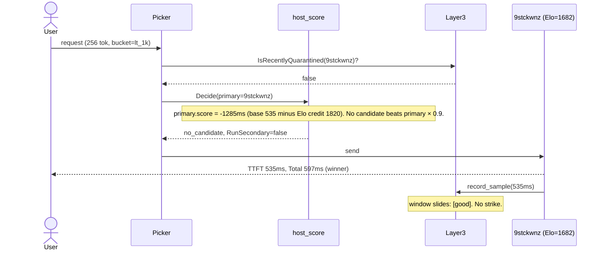

---

## 2. Scenario — slow primary, secondary wins

A slow host got the primary nonce. host_score finds a much faster candidate and spawns it. The two race in parallel, the secondary returns first, the slow primary is cancelled. User sees roughly 4× speedup at the cost of one extra nonce.

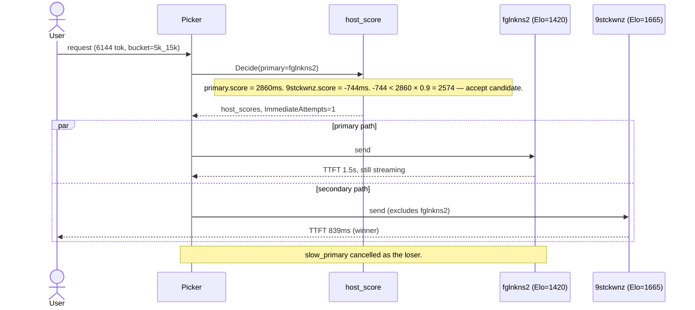

---

## 3. Scenario — Layer 1 H2H trigger overrides Layer 2

When the pairwise tracker holds at least three direct head-to-head samples between primary and a candidate, Layer 1 win-rate is consulted first and overrides the Layer 2 score path entirely. A win rate at or above 60% is accepted without looking at base, Elo, or UCB terms. This makes direct empirical evidence outrank inferred scores.

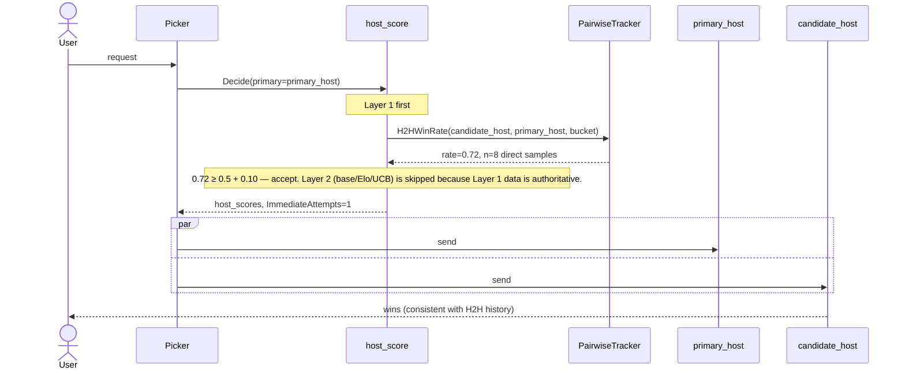

---

## 4. Scenario — UCB exploration (under-sampled host gets a structured bonus)

UCB ("upper confidence bound") is Layer 2's built-in answer to a specific failure mode: a host with few samples can look slightly worse than the primary on raw base/Elo numbers, but we are not confident in that comparison yet. Without correction we'd never race it and never learn whether it's actually faster. UCB adds a bonus to under-sampled hosts that decays as samples accumulate: `UCB = c · √(ln(N_bucket) / n_host)` with `c = HostScoreUCBCoefficient = 300 ms`. The bonus is *subtracted* from the candidate's score (lower score = more attractive), so a host with `n=5` samples gets ≈ 350 ms of help while a host with `n=500` gets only ≈ 35 ms. Unlike ε-greedy (an unconditional 2% random roll), UCB is *targeted* — it directs exploration at exactly the hosts we know least about.

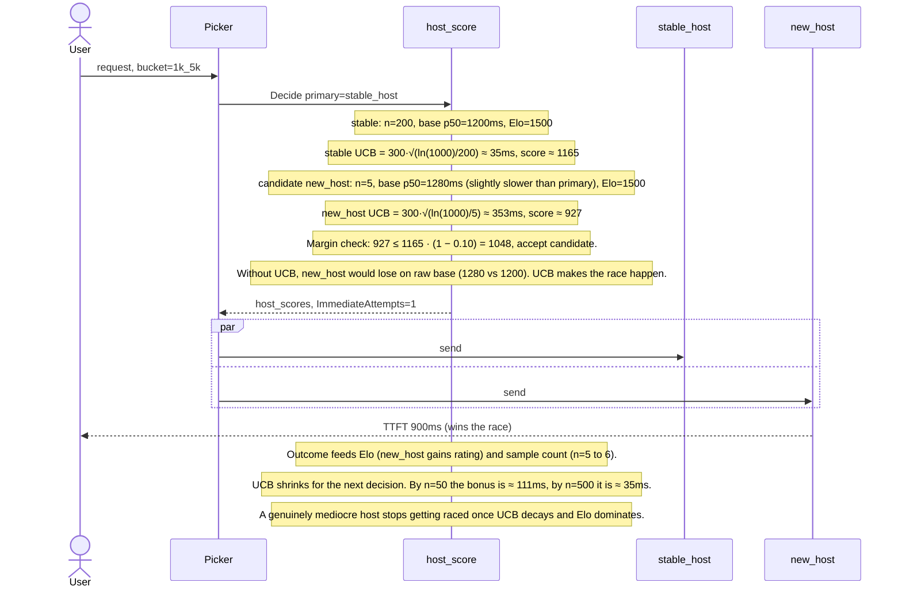

How UCB and ε-greedy divide the work: UCB is *deterministic structured exploration* aimed at uncertain hosts during Layer 2 scoring. ε-greedy (next scenario) is the *unconditional safety net* that fires after Layer 2 has nothing — covering hosts UCB cannot reach (e.g., zero samples means UCB formula is skipped) or scenarios where every candidate's Elo has drifted high enough that UCB alone can't bring them within the 10% margin.

---

## 5. Scenario — ε-greedy exploration (cold-start helper)

All Layer 1 and Layer 2 candidates fail the margin check (or have no data), but the ε-greedy floor still rolls true with probability 2%. A random non-tried host is then given a forced shot. This is how cold or recovering hosts get a chance to climb back into rotation. The exploration cost is bounded by ε itself: 2% of the would-be-no-secondary decisions.

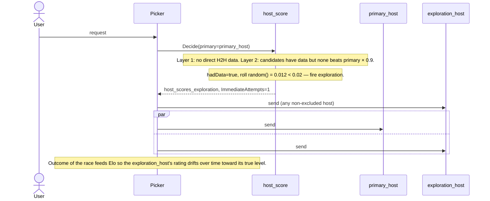

---

## 6. Scenario — primary unresponsive, immediate parallel

`PerfTracker.IsUnresponsiveParticipant(primary)` is the only check that runs before the Layer 1 and Layer 2 logic. If the primary has a recent history of failing to send any chunks, a backup is launched immediately and unconditionally. This bypass exists because the host is structurally broken right now — no point computing scores.

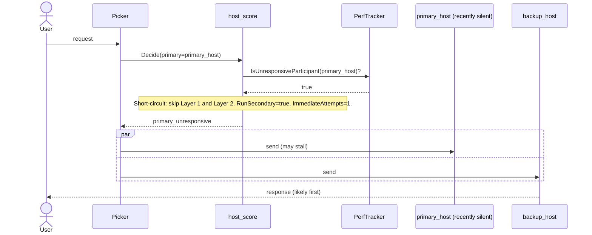

---

## 7. Scenario — Layer 3 quarantine fires (consecutive slow)

Three slow TTFTs from the same host land in its own (host, bucket) sliding window. The bucket threshold is the p90 of *other* hosts' samples (excludes self — no self-pollution). The third bad outcome trips the gate; quarantine duration is 30 minutes for the first event in the 4-hour history window. Subsequent picker checks via `IsRecentlyQuarantined` return true and the host is removed from primary and secondary rotation.

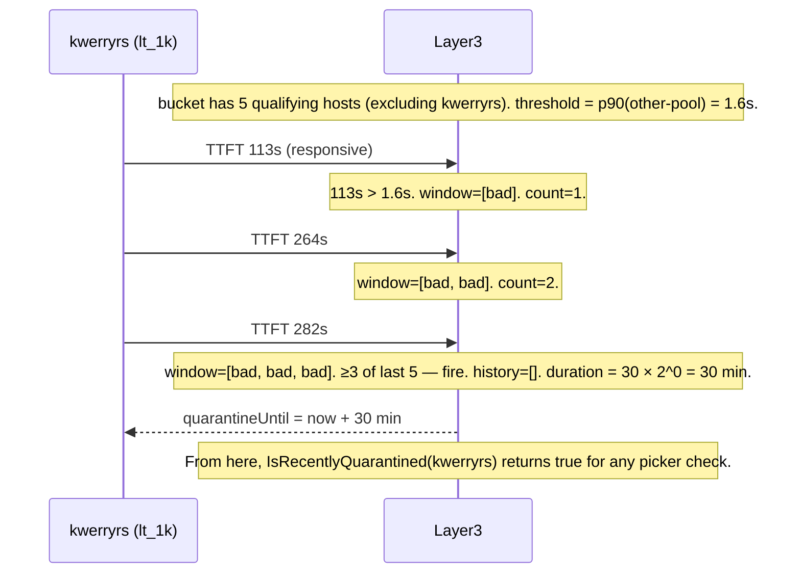

---

## 8. Scenario — bimodal host caught by sliding window

A bimodal host alternates fast and slow samples. A consecutive-strike counter would never reach 3 — every fast sample resets it. The sliding window doesn't reset, it just slides. Three bad outcomes anywhere in the last 5 are enough. This is the design rationale for choosing a window over a streak counter.

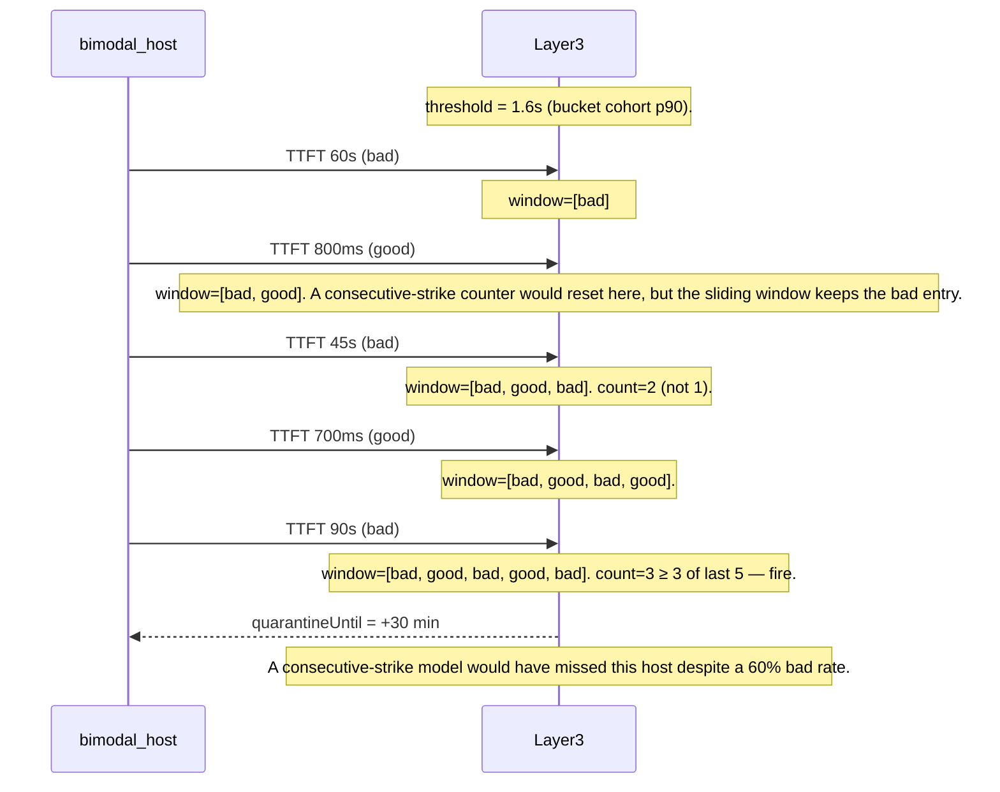

---

## 9. Scenario — quarantine expiry plus relapse (exponential backoff)

A repeat-offender host's quarantine duration grows as long as recent history (within a 4-hour sliding window) contains prior entries. The duration doubles on each relapse until it hits a 120-minute cap. After 4 hours without an entry, history prunes and the backoff resets to 30 minutes.

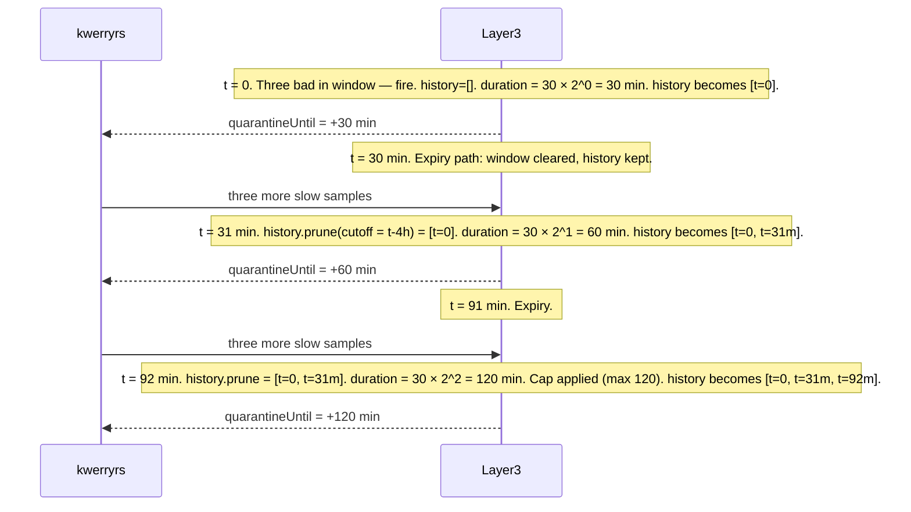

---

## 10. Scenario — host recovery (regime change)

A host that was slow long enough to sink its Elo and trigger Layer 3 quarantines actually fixes itself (network repaired, new hardware, catch-up cycle). Layer 3 quarantine expiry returns it to rotation; Elo's half-life decay pulls its rating back toward the 1500 default; ε-greedy occasionally spawns it as a secondary; good outcomes update its rating upward. There is no persistent blocklist — the algorithm self-heals.

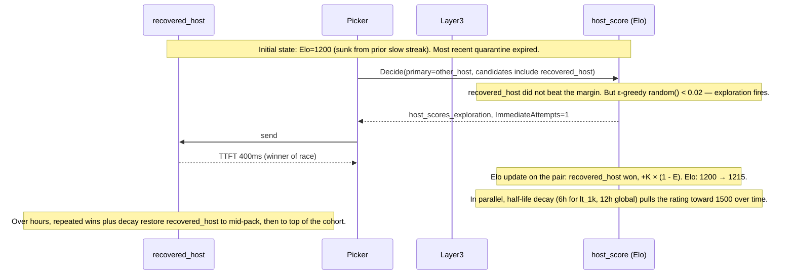

---

## 11. Exponential backoff — formula, table, and lifecycle

`bucketQuarState.nextQuarantineDuration` in `host_score_quarantine.go` computes the duration on every quarantine entry:

```text
1. prune history: keep only entries within last 4h sliding window
2. duration = HostScoreQuarantineBaseDuration << len(history)   // bit-shift = 30min × 2^count
3. if duration > HostScoreQuarantineMaxDuration: duration = HostScoreQuarantineMaxDuration
4. append now to history
```

Tunables (constants in `host_score_quarantine.go`):

| Constant | Value | Role |
|---|---:|---|
| `hostScoreQuarantineBaseDuration` | 30 min | first quarantine in a fresh history |
| `hostScoreQuarantineMaxDuration` | 120 min | hard cap on growth |
| `hostScoreQuarantineHistoryWindow` | 4 h | sliding window for relapse tracking |

Resulting schedule:

| Recent quarantines for (host, bucket) within 4h | Duration | How long until reset |
|---:|---:|---:|
| 0 | **30 min** | — |
| 1 | **60 min** | 4h from previous |
| 2 | **120 min** (cap) | 4h from previous |
| 3+ | 120 min | 4h from previous |
| (any) idle for 4h | back to **30 min** | history fully pruned |

Lifecycle on a typical repeat offender (already drawn in scenario 8 above):

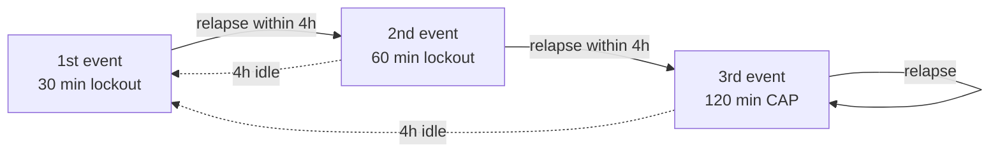

The history is *only* pruned during the `nextQuarantineDuration` call (and during `clearAll` — the operator-initiated reset, see `participantLimiter.ClearQuarantine`). Background ticking is not required. Confirmed by `TestHostScoreQuarantine_ExponentialBackoff` and `TestHostScoreQuarantine_BackoffResetsAfterHistoryWindow` in `participant_limiter_hostscore_test.go`.
