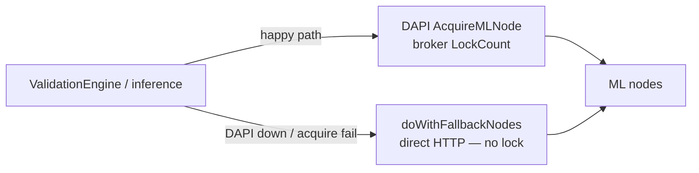

# ML node capacity & DAPI-down `max_concurrent` fallback

Standalone workstream: observe ML-node concurrency from DAPI and **bound the direct-HTTP fallback path** when DAPI is unreachable. Independent of any shared validation-pool redesign.

**Prerequisite (denominator):** [escrow-longpoll-plan.md](./escrow-longpoll-plan.md) — the host-events long-poll. This plan extends it so dapi also pushes a **per-escrow load map** (30-min avg mlnode req/min, idle escrows omitted). The divisor is `max(numberOfEscrows, 4)` with a **floor of 4** (§4): while dapi is up (or the last map is ≤10m old), `numberOfEscrows` = `len(activeLoad)`; after **10 minutes** without a delivery → `/4`.

## Problem

`devshardd` validation (and inference) has two ways to reach ML nodes:



| Path | Concurrency control |
|------|---------------------|
| DAPI `AcquireMLNode` | Broker enforces `LockCount < MaxConcurrent` |
| Fallback HTTP | **None today** — every caller can hit the same vLLM at once |

When DAPI is down (or acquire keeps failing), many concurrent fallback calls can overload ML nodes. We need a local bound based on known or estimated `max_concurrent`.

---

## Goals

| Goal | Metric |
|------|--------|
| Cap fallback traffic | In-flight fallback requests ≤ estimated free slots |
| Prefer live broker state | Use DAPI `max_concurrent` / `lock_count` when available |
| Safe when DAPI is down | If capacity was ever observed via `ListNodeCapacity`, use last-seen `max/divisor` + local in-flight |
| Load-based divisor | `divisor = max(numberOfEscrows, 4)` where `numberOfEscrows` = active escrows from the last dapi load map; keep that map for **10m** after dapi goes down, then `/4` (§4) |
| Rolling-upgrade safe | Old DAPI without `ListNodeCapacity` → **zero behavior change** |

## Non-goals

- Changing which inferences are selected for validation.
- Redesigning per-escrow vs process-wide validation scheduling (see [shared-validation-pool-plan.md](./shared-validation-pool-plan.md) — tiny async dispatcher; this cache bounds **fallback HTTP**, not dispatcher count).
- Changing DAPI broker acquire/release on the happy path.
- Gateway capacity (already via `/v1/versions` polling).
- HTTP/admin APIs for capacity — observation is gRPC `ListNodeCapacity` only.

---

## Design

### 1. `NodeCapacityCache` (new: `devshard/mlnode/capacity.go`, beside `mlnode.Manager`)

Lives in `devshard/mlnode` next to the existing passive `Manager` (both are fed by the same NodeManager gRPC surface). It must **not** import `decentralized-api/internal/devshard`; the active-escrow load map is injected as a callback so there is no import cycle.

```go
type NodeCapacity struct {
    NodeID        string
    Model         string
    MaxConcurrent int
    LockCount     int
    UpdatedAt     time.Time
    Source        string // "dapi" | "stale"
}

type Cache struct {
    mu    sync.RWMutex
    nodes map[string]NodeCapacity // key: nodeID

    // injected divisor input: the active-escrow load map from the host-events
    // long-poll (idle escrows omitted), plus when it was last delivered.
    activeLoad func() (byEscrow map[uint64]float64, deliveredAt time.Time)
    now        func() time.Time
}

func (c *Cache) EffectiveMax(nodeID string) int
func (c *Cache) Divisor() int                       // max(numberOfEscrows, 4) per §4 tiers
func (c *Cache) AvailableSlots(nodeID string) int   // max(0, effectiveMax - lockCount - localInFlight)
func (c *Cache) AvailableSlotsForModel(model string) int
```

### 2. Data sources (priority order)

| Source | When | Fields |
|--------|------|--------|
| **DAPI poll** | gRPC reachable + `ListNodeCapacity` implemented | `max_concurrent`, `lock_count` per node |
| **Acquire observe** | successful `AcquireMLNode` on a capacity-capable DAPI | refresh `lock_count` / `max_concurrent` if present |
| **Stale cache** | DAPI temporarily unreachable **after** at least one successful `ListNodeCapacity` | last-seen `max_concurrent` retained (same outage semantics as `mlnode.Manager`); `effectiveMax = max / divisor` (see §4) |
| **No capacity support** | Old DAPI (`Unimplemented` / never succeeded) | cache empty → **no local limiting** (identical to today) |

It is not realistic to have useful capacity rows without ever calling `ListNodeCapacity`. The only practical “no capacity” case is an **old DAPI** that does not implement the RPC. In that case we do not invent defaults or enable estimate-only mode — **zero change**.

### 3. DAPI observation — gRPC only

Capacity is observed over **gRPC only** (same nodemanager surface as `AcquireMLNode`). Do not add or use an HTTP/admin capacity endpoint.

Extend `devshard/nodemanager/nodemanager.proto` (regen into `devshard/nodemanager/gen`); DAPI implements it in `decentralized-api/nodemanager/server.go`:

```protobuf
rpc ListNodeCapacity(ListNodeCapacityRequest) returns (ListNodeCapacityResponse);

message NodeCapacityEntry {
  string node_id = 1;
  string model = 2;
  int32 max_concurrent = 3;
  int32 lock_count = 4;
  string status = 5; // INFERENCE, POC, etc.
}

message ListNodeCapacityResponse {
  repeated NodeCapacityEntry nodes = 1;
  int64 served_at_unix = 2;
}
```

DAPI reads from existing `broker.GetNodes()` (`MaxConcurrent`, `LockCount` already on `broker.NodeResponse`) — extend the server's `brokerAcquirer` interface with `GetNodes()`.

**Poll interval:** 5s default while DAPI is reachable.

**TTL — match existing `devshard/mlnode.Manager` on `upgrade-v0.2.14`:**

| Constant | Default | Role |
|----------|---------|------|
| Fresh window (`MLNODE_CACHE_TTL` / `DefaultCacheTTL`) | **10m** | Live observation window; prune only runs for models/nodes that still have fresh polls |
| Stale / retirement (`DefaultStaleTTL`) | **1h** (≥ fresh) | Prefer capacity rows newer than this; older rows are last resort |
| Prune interval | `freshTTL / 2` | Background prune, off the hot path |

Behavior while DAPI is down (no successful `ListNodeCapacity`), same as passive ML-node cache today:

- Do **not** wipe last-seen capacity when the poller fails — last-known rows **survive an outage of any length** (flow-gated prune: no fresh observe ⇒ leave cache intact).
- Continue applying `/divisor` + local in-flight from last-seen `max_concurrent`.
- Prefer rows within `staleTTL`; only use older retained rows if nothing fresher remains.
- If `ListNodeCapacity` was never supported, there are no rows — zero change (see §6).

Do not invent a separate `3 × pollInterval` capacity TTL; reuse these constants / env (`MLNODE_CACHE_TTL`) so operators already know the knobs.

### 4. Fallback divisor: active-escrow count from dapi per-escrow load

The divisor's `numberOfEscrows` is the count of **actively-loaded** escrows, not created-unsettled escrows. dapi computes a **per-escrow load** and pushes it over the host-events long-poll; the host divides by the number of escrows that are actually generating traffic.

**Per-escrow load (dapi-side).** For each escrow, `load = average mlnode requests per minute over the last 30 minutes`. dapi already brokers every `AcquireMLNode`, so with an `escrow_id` on the acquire it can attribute requests per escrow and maintain a rolling 30-minute rate (see §4b). An escrow with **no requests in the last 30 minutes is omitted** from the response — so the delivered map is exactly the set of *currently-active* escrows on this host.

**Delivery.** dapi returns the active-escrow load map on the **host-events long-poll** — on event change **or** on `max_wait` timeout (the long-poll already returns on both). The map is a snapshot recomputed at response time, e.g. `{ escrow_id → requests_per_min }`, with idle escrows absent.

**Divisor (devshardd-side).** devshardd caches the last map and computes:

- `numberOfEscrows = len(activeLoad)` — count of escrows with load in the last 30m.
- `divisor = max(numberOfEscrows, 4)` — floor of 4.
- `registeredMax` = last-seen `max_concurrent` (from `ListNodeCapacity`, §3); `effectiveMax = max(1, registeredMax / divisor)`, minus local in-flight.

| Tier | Condition | `numberOfEscrows` | `divisor` |
|------|-----------|-------------------|-----------|
| **1 — usable load map** | last `escrow_load` delivery **≤ `escrowLoadStaleTTL` = 10m** ago (dapi up, or short outage) | `len(activeLoad)` from that last map | `max(len(activeLoad), 4)` |
| **2 — map expired** | no delivery for **> 10m** (dapi down long enough that the last map is discarded) | `0` (unknown) | `4` (floor) |

**Why load beats created-unsettled.** An escrow can be created and left idle; created-minus-settled therefore **over-counts** real concurrency. Load counts only escrows actually issuing mlnode requests, and idle ones drop out of the map after 30m — so the divisor tracks true concurrent pressure. The floor of **4** still guards the tail case (e.g. one active escrow shouldn't hand nearly the whole `max_concurrent` to fallback, since inference + validation share the same vLLM).

**Outage policy (decided).** When dapi goes down, the load map stops refreshing. **Keep using the last delivered map for 10 minutes**, then fall back to `/4`. That covers typical short outages without pretending the pre-outage active set is still meaningful after a long gap. Timestamp each delivery (`lastLoadMapAt`); if `now - lastLoadMapAt ≤ 10m` → tier 1; else → tier 2 (`divisor = 4`).

If `ListNodeCapacity` was never available (old DAPI): **do not** apply this bound — zero change vs today.

### 4b. How dapi attributes and pushes per-escrow load

**Attribution.** Add `escrow_id` to `AcquireMLNodeRequest`. devshardd knows the serving escrow at acquire time (each session is per-escrow), so it threads the id into `mlClient.Acquire`. dapi's broker records `(escrow_id, timestamp)` per acquire into a rolling 30-minute window and derives `requests_per_min` per escrow. No new chain traffic; reuses the existing acquire path.

**Push.** Extend the host-events long-poll response (`GetHostEventsResponse` in [escrow-longpoll-plan.md](./escrow-longpoll-plan.md)) with a snapshot field `repeated EscrowLoad { uint64 escrow_id; double requests_per_min; }`, computed at response time with idle (≥30m) escrows omitted. This is additive and does not change the existing event/cursor semantics. (Cross-plan impact: this and the `AcquireMLNodeRequest.escrow_id` field are additions the escrow-longpoll workstream must carry.)

**Why not the chain.** The chain cannot supply active load. For completeness, the full `x/inference` escrow state is: `DevshardEscrows` (+ `Query/DevshardEscrow(id)`, single-lookup), `DevshardEscrowsByEpoch` (index, no query), `DevshardEscrowEpochCount` (network-wide, no query), `DevshardHostEpochStats.escrow_count` (cumulative-per-epoch **and** its writer is never called → always `0`), `DevshardEscrowCounter` (next-id). An escrow is only ever *created → settled* — there is **no per-escrow activity/last-used signal on-chain**. So a chain probe could at best return created-unsettled (the quantity we are moving away from); there is no chain fallback for load. After the last map is older than **10m**, the divisor is simply `4`.

### 5. Apply the bound in the engine (today’s architecture)

Gate `doWithFallbackNodes` in `decentralized-api/cmd/devshardd/engine.go` (the only unbounded direct-HTTP path; validation reaches it through the shared `doWithLockedNode` on the same `devshardEngine`) with one shared per-node / per-model semaphore **only when capacity has been observed**:

```
if !capacity.HasObservedCapacity() {
  // old DAPI / never polled successfully — unchanged path
  return doFallbackUnchanged(...)
}
slots = capacity.AvailableSlotsForModel(model)  // or per-node when targeting a node
if !tryAcquire(slots) { wait / retry / skip with existing backoff }
...
defer release()
```

Inference and validation share the same in-flight counters and slot budget for a given node/model — one semaphore, not separate budgets.

**Key clarification (node vs model).** The semaphore is keyed per **`(node_id, model)`** — that is the physical vLLM occupancy the bound protects. `AvailableSlotsForModel(model)` is only for **target selection** (which nodes of a model still have room); the actual acquire/release counts against the chosen node's `(node_id, model)` budget. `effectiveMax` (and its `divisor`) is therefore per node, not a single model-wide pool.

Happy-path `AcquireMLNode` stays unchanged — broker remains the source of truth when DAPI is up.

### 6. Backward compatibility with older DAPI

- Missing `ListNodeCapacity` (`Unimplemented` / method-not-found): mark capacity as unsupported, leave cache empty, **never** apply `/divisor` limiting. Behavior identical to today.
- Poller logs once at info on unsupported RPC, not error; retry rarely (for post-upgrade detection) rather than every poll as an error.
- New `devshardd` + new DAPI → observe; if DAPI later goes down, limit fallback using last-seen max + last load map.
- New `devshardd` + old DAPI → **zero change**.
- New `devshardd` + DAPI that has `ListNodeCapacity` but **not** the load map (partial upgrade): capacity known, but no active-escrow map → divisor stays at the `4` floor (still a safe bound, just not load-tuned).

Passive node IDs without a successful `ListNodeCapacity` do not enable limiting.

### 7. Metrics

- `devshardd_node_capacity_max_concurrent{node_id, model, source}`
- `devshardd_node_capacity_lock_count{node_id, model}`
- `devshardd_fallback_in_flight{node_id, model}`
- `devshardd_fallback_acquire_wait_seconds` / `devshardd_fallback_rejected_total`
- `devshardd_fallback_divisor{source}` — `source` = `load_map` | `floor4` (emitted value already includes the `max(·,4)` floor)
- `devshardd_active_escrows` — count of escrows in the last delivered load map
- `devshardd_active_escrow_load{escrow_id}` — per-escrow requests/min (dapi-computed)
- `devshardd_load_map_age_seconds` — age of the last delivered load map (drives the 10m stale cutoff → `/4`)

---

## Implementation phases

- **Phase A — Observe only (steps 1–6):** proto additions, DAPI `ListNodeCapacity` handler, per-escrow load attribution + push, devshardd cache + load-map consumer, metrics. **No concurrency behavior change.**
- **Phase B — Bound fallback (steps 7–8):** local in-flight semaphore + `max(numberOfEscrows, 4)` divisor, gate on `doWithFallbackNodes`.

No chain phase: the chain has no per-escrow load signal (§4b), so there is no chain-probe tier.

---

## Step-by-step implementation plan

Each step is PR-sized: files, work, tests, acceptance. Steps 1–6 are observe-only (zero behavior change); the fallback bound turns on at step 8. Symbols confirmed against the tree: proto `devshard/nodemanager/nodemanager.proto` (→ `devshard/nodemanager/gen`), DAPI server `decentralized-api/nodemanager/server.go` (`brokerAcquirer`, `broker.GetNodes()`), standalone host `decentralized-api/cmd/devshardd/` (engine `engine.go`, `doWithLockedNode`/`doWithFallbackNodes`, `mlClient.Acquire`), host-events consumer `devshard/hostevents/runner.go`, passive cache `devshard/mlnode/manager.go`. The `GetHostEvents` RPC belongs to [escrow-longpoll-plan.md](./escrow-longpoll-plan.md); steps 1/4 extend it.

### Step 1 — Proto additions (additive, back-compat)

**Files:** `devshard/nodemanager/nodemanager.proto`; regenerate `devshard/nodemanager/gen`.

**Work:**
- Add `rpc ListNodeCapacity` + `NodeCapacityEntry` / request / response (§3).
- Add `string escrow_id = 3;` to `AcquireMLNodeRequest` (new tag; existing tags unchanged).
- Add `repeated EscrowLoad escrow_load = <next>;` to `GetHostEventsResponse` and `message EscrowLoad { uint64 escrow_id = 1; double requests_per_min = 2; }` (§4b). All additive.

**Tests:** wire-format stability test beside `host_events_wire_test.go` (existing field numbers must not shift).

**Acceptance:** `go build ./...` in `decentralized-api` + `devshard`; generated `gen` compiles; existing NodeManager wire tests pass.

### Step 2 — DAPI server handler `ListNodeCapacity`

**Files:** `decentralized-api/nodemanager/server.go` (+ `server_test.go`).

**Work:**
- Extend `brokerAcquirer` with `GetNodes() ([]broker.NodeResponse, error)`.
- Implement `ListNodeCapacity`: map `broker.GetNodes()` → `NodeCapacityEntry{ node_id, model, max_concurrent, lock_count, status }`; set `served_at_unix`. Nil broker subset → `FailedPrecondition`.

**Tests:** `server_test.go` with `mockBroker` → one entry per node with `MaxConcurrent`/`LockCount`; empty broker → empty list.

**Acceptance:** handler compiles into the existing server; `AcquireMLNode`/`GetRuntimeConfig` tests unchanged.

### Step 3 — Per-escrow load attribution (escrow_id → broker rolling 30m rate)

**Files:** `decentralized-api/cmd/devshardd/engine.go` (thread escrow id into `mlClient.Acquire`), `devshard/mlnode/client.go` (`Acquire` signature), DAPI broker (per-escrow rolling window; new file beside the broker).

**Work:**
- Thread the serving `escrowID` (known to the per-escrow session) through `executeMLRequest`/`doWithLockedNode` into `AcquireMLNodeRequest.EscrowId`. Fallback HTTP path carries the same id.
- In the DAPI broker, on each `AcquireMLNode`, append `(escrow_id, now)` to a rolling **30-minute** window; expose `requests_per_min` per escrow (count in window ÷ 30). Prune entries older than 30m on read/append.

**Tests:** broker rate — N acquires in window → `requests_per_min ≈ N/30`; entries age out after 30m; unknown/empty `escrow_id` ignored.

**Acceptance:** DAPI can report a per-escrow request rate; no consumer yet (observe-only).

### Step 4 — DAPI pushes the active-escrow load map on `GetHostEvents`

**Files:** `decentralized-api/nodemanager/server.go` (`GetHostEvents` handler), `decentralized-api/apiconfig/host_event_ring.go` if the snapshot is assembled there.

**Work:**
- On each `GetHostEvents` response (event change **or** `max_wait` timeout), attach `escrow_load`: for every escrow with `requests_per_min > 0` over the last 30m, emit `{ escrow_id, requests_per_min }`; **omit** escrows idle ≥30m.
- Snapshot semantics: `escrow_load` is a full replace each response, independent of the event cursor.

**Tests:** handler test — active escrow present with rate; idle-30m escrow omitted; returned on both change and timeout paths.

**Acceptance:** a subscribed devshardd receives the active-escrow load map; still observe-only on the host.

### Step 5 — devshardd `NodeCapacityCache` + poller + load-map consumer

**Files:** new `devshard/mlnode/capacity.go` (+ `capacity_test.go`), `devshard/hostevents/runner.go` (surface the latest `escrow_load` + delivery timestamp), wiring in `decentralized-api/cmd/devshardd/main.go`.

**Work:**
- `Cache` (§1) keyed by `node_id`; poll `ListNodeCapacity` every **5s**; retain last-seen on failure (flow-gated, matches `Manager.pruneAll`); `Unimplemented` soft-fail → `HasObservedCapacity()` stays false (§6 zero-change).
- Have the host-events runner expose the last `escrow_load` map + `lastLoadMapAt` (updated on every non-error `GetHostEvents` response). Inject `activeLoad func() (map[uint64]float64, time.Time)` into the `Cache`.

**Tests:** `capacity_test.go` — poll upsert/retain; `Unimplemented` → unsupported; runner surfaces latest load map + timestamp.

**Acceptance:** cache + load map populate against a fake NodeManager server; **no** change to acquire/fallback yet.

### Step 6 — Metrics + logging

**Files:** `devshard/mlnode/capacity.go` (metrics) using `devshard/observability`.

**Work:** emit `devshardd_node_capacity_max_concurrent{node_id,model,source}`, `devshardd_node_capacity_lock_count`, `devshardd_active_escrows`, `devshardd_active_escrow_load{escrow_id}`, `devshardd_load_map_age_seconds` (§7). Structured logs on dapi→stale→unsupported transitions.

**Tests:** metrics registered and updated on poll / load-map delivery.

**Acceptance:** `/metrics` exposes capacity + active-escrow gauges; still observe-only.

### Step 7 — In-flight semaphore + `AvailableSlots` + `Divisor()`

**Files:** `devshard/mlnode/capacity.go`.

**Work:**
- Per-`(node_id, model)` `localInFlight` with `tryAcquire`/`release`; `AvailableSlots(nodeID) = max(0, effectiveMax - lockCount - localInFlight)`; `AvailableSlotsForModel` for target selection (§5 node-vs-model note).
- `Divisor()`: if `now - deliveredAt ≤ 10m` (`escrowLoadStaleTTL`) → `max(len(activeLoad), 4)` (tier 1 — keep last map through a short dapi outage); else `4` (tier 2). `EffectiveMax(nodeID) = max(1, registeredMax / Divisor())`. Emit `devshardd_fallback_divisor{source}`.

**Tests:** in-flight inc/dec; `AvailableSlots` arithmetic; map ≤10m → `max(len,4)`, floor when `len<4`; map >10m → `4`.

**Acceptance:** slot/divisor math correct; not yet wired into the engine.

### Step 8 — Gate `doWithFallbackNodes`

**Files:** `decentralized-api/cmd/devshardd/engine.go` (`doWithFallbackNodes`); pass the `Cache` into `newDevshardEngine` (`main.go`).

**Work:**
- Before each fallback `PickNode` attempt: if `!cache.HasObservedCapacity()` → unchanged path (old DAPI, §6). Otherwise `tryAcquire(AvailableSlots)`, on no slots wait/skip with existing backoff, `defer release()` after the HTTP call. Validation shares this via `doWithLockedNode`.

**Tests:** `TestFallback_RespectsLocalInFlight`; integration: DAPI down after capacity observed → in-flight ≤ Σ`effectiveMax`; old DAPI → unbounded as today.

**Acceptance:** fallback stampede bounded when capacity is known; **zero change** on old DAPI.

---

## Testing

| Test | Asserts |
|------|---------|
| `TestListNodeCapacity_Handler` (step 2) | broker rows → one `NodeCapacityEntry` each; empty broker → empty list |
| `TestBrokerEscrowLoad_RollingWindow` (step 3) | N acquires in 30m → `requests_per_min ≈ N/30`; entries age out; empty `escrow_id` ignored |
| `TestGetHostEvents_ActiveLoadMap` (step 4) | active escrow present; idle-30m escrow omitted; returned on change and timeout |
| `TestNodeCapacityCache_PollUpsertAndRetain` (step 5) | poll upserts `dapi` rows; poll failure keeps last-seen `stale`; never wiped |
| `TestFallbackDivisor_FreshLoadMap` (step 7) | active-load map ≤10m → `divisor = max(len(activeLoad), 4)` (floor when `len<4`); still used after dapi goes down within that window |
| `TestFallbackDivisor_StaleFallsBackTo4` (step 7) | load map >10m old → `divisor = 4` |
| `TestNodeCapacityCache_UnimplementedZeroChange` | old DAPI → empty cache, fallback unbounded as today |
| `TestFallback_RespectsLocalInFlight` | concurrent fallback capped when capacity known |
| Integration: DAPI outage after capacity observed | in-flight ≤ sum(effectiveMax); no stampede |
| Integration: old DAPI | fallback path unchanged |

---

## Related

| Item | Topic |
|------|-------|
| [escrow-longpoll-plan.md](./escrow-longpoll-plan.md) | Host-events long-poll; extended here with `AcquireMLNodeRequest.escrow_id` + `GetHostEventsResponse.escrow_load` |
| #1417 (`ae2b525`) | Host leak fix, ML-node passive cache |
| `devshard/mlnode.Manager` on `upgrade-v0.2.14` | `DefaultCacheTTL=10m`, `DefaultStaleTTL=1h`; retain last-known during outage |
| `decentralized-api/cmd/devshardd/engine.go` `doWithFallbackNodes` | Unbounded direct HTTP when DAPI acquire fails — the path this plan bounds |
| Chain `x/inference` escrow state | Only created/settled; **no** per-escrow load signal → no chain divisor source (§4b) |
