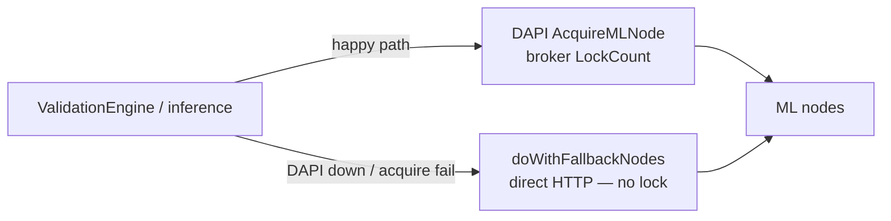

# ML node capacity & DAPI-down `max_concurrent` fallback

Standalone workstream: observe ML-node concurrency from DAPI and **bound the direct-HTTP fallback path** when DAPI is unreachable. Independent of any shared validation-pool redesign.

**Prerequisite (denominator):** [escrow-longpoll-plan.md](./escrow-longpoll-plan.md) — proactive escrow create/settle over the same dapi long-poll channel, plus a host-local **open escrow count**. Until that count exists, this plan uses a fixed `/3`. After it lands, prefer `max_concurrent / max(1, open_escrows_on_host)` (see §4).

## Problem

`devshardd` validation (and inference) has two ways to reach ML nodes:



| Path | Concurrency control |
|------|---------------------|
| DAPI `AcquireMLNode` | Broker enforces `LockCount < MaxConcurrent` |
| Fallback HTTP | **None today** — every caller can hit the same vLLM at once |

When DAPI is down (or acquire keeps failing), many concurrent fallback calls can overload ML nodes. We need a local bound based on known or estimated `max_concurrent`.

---

## Goals

| Goal | Metric |
|------|--------|
| Cap fallback traffic | In-flight fallback requests ≤ estimated free slots |
| Prefer live broker state | Use DAPI `max_concurrent` / `lock_count` when available |
| Safe when DAPI is down | If capacity was ever observed via `ListNodeCapacity`, use last-seen `max/divisor` + local in-flight (`divisor` = open escrows when known, else `3`) |
| Rolling-upgrade safe | Old DAPI without `ListNodeCapacity` → **zero behavior change** |

## Non-goals

- Changing which inferences are selected for validation.
- Redesigning per-escrow vs process-wide validation scheduling (see [shared-validation-pool-plan.md](./shared-validation-pool-plan.md) — tiny async dispatcher; this cache bounds **fallback HTTP**, not dispatcher count).
- Changing DAPI broker acquire/release on the happy path.
- Gateway capacity (already via `/v1/versions` polling).
- HTTP/admin APIs for capacity — observation is gRPC `ListNodeCapacity` only.

---

## Design

### 1. `NodeCapacityCache` (new: `devshard/cmd/devshardd/inference/capacity.go`)

```go
type NodeCapacity struct {
    NodeID        string
    Model         string
    MaxConcurrent int
    LockCount     int
    UpdatedAt     time.Time
    Source        string // "dapi" | "stale"
}

type Cache struct {
    mu    sync.RWMutex
    nodes map[string]NodeCapacity // key: nodeID
}

func (c *Cache) EffectiveMax(nodeID string) int
func (c *Cache) AvailableSlots(nodeID string) int // max(0, effectiveMax - lockCount - localInFlight)
func (c *Cache) AvailableSlotsForModel(model string) int
```

### 2. Data sources (priority order)

| Source | When | Fields |
|--------|------|--------|
| **DAPI poll** | gRPC reachable + `ListNodeCapacity` implemented | `max_concurrent`, `lock_count` per node |
| **Acquire observe** | successful `AcquireMLNode` on a capacity-capable DAPI | refresh `lock_count` / `max_concurrent` if present |
| **Stale cache** | DAPI temporarily unreachable **after** at least one successful `ListNodeCapacity` | last-seen `max_concurrent` retained (same outage semantics as `mlnode.Manager`); `effectiveMax = max / divisor` (see §4) |
| **No capacity support** | Old DAPI (`Unimplemented` / never succeeded) | cache empty → **no local limiting** (identical to today) |

It is not realistic to have useful capacity rows without ever calling `ListNodeCapacity`. The only practical “no capacity” case is an **old DAPI** that does not implement the RPC. In that case we do not invent defaults or enable estimate-only mode — **zero change**.

### 3. DAPI observation — gRPC only

Capacity is observed over **gRPC only** (same nodemanager surface as `AcquireMLNode`). Do not add or use an HTTP/admin capacity endpoint.

Extend `common/nodemanager/nodemanager.proto`:

```protobuf
rpc ListNodeCapacity(ListNodeCapacityRequest) returns (ListNodeCapacityResponse);

message NodeCapacityEntry {
  string node_id = 1;
  string model = 2;
  int32 max_concurrent = 3;
  int32 lock_count = 4;
  string status = 5; // INFERENCE, POC, etc.
}

message ListNodeCapacityResponse {
  repeated NodeCapacityEntry nodes = 1;
  int64 served_at_unix = 2;
}
```

DAPI reads from existing `broker.GetNodes()` (`MaxConcurrent`, `LockCount` already on `broker.NodeResponse`).

**Poll interval:** 5s default while DAPI is reachable.

**TTL — match existing `devshard/mlnode.Manager` on `upgrade-v0.2.14`:**

| Constant | Default | Role |
|----------|---------|------|
| Fresh window (`MLNODE_CACHE_TTL` / `DefaultCacheTTL`) | **10m** | Live observation window; prune only runs for models/nodes that still have fresh polls |
| Stale / retirement (`DefaultStaleTTL`) | **1h** (≥ fresh) | Prefer capacity rows newer than this; older rows are last resort |
| Prune interval | `freshTTL / 2` | Background prune, off the hot path |

Behavior while DAPI is down (no successful `ListNodeCapacity`), same as passive ML-node cache today:

- Do **not** wipe last-seen capacity when the poller fails — last-known rows **survive an outage of any length** (flow-gated prune: no fresh observe ⇒ leave cache intact).
- Continue applying `/divisor` + local in-flight from last-seen `max_concurrent`.
- Prefer rows within `staleTTL`; only use older retained rows if nothing fresher remains.
- If `ListNodeCapacity` was never supported, there are no rows — zero change (see §6).

Do not invent a separate `3 × pollInterval` capacity TTL; reuse these constants / env (`MLNODE_CACHE_TTL`) so operators already know the knobs.

### 4. Fallback: `max_concurrent / divisor` (only with prior capacity observation)

Applies when DAPI is unreachable **and** the cache has last-seen capacity from a prior successful `ListNodeCapacity`:

1. `registeredMax` = last seen `max_concurrent` for that node.
2. `divisor` =
   - `max(1, openEscrowsOnHost)` when the host tracks open escrows from [escrow-longpoll-plan.md](./escrow-longpoll-plan.md) (create − settle for escrows this host handles), else
   - `3` (fixed headroom until that plan’s counter exists).
3. `effectiveMax = max(1, registeredMax / divisor)`.
4. Track **local in-flight** per node in `devshardd` (increment when fallback HTTP starts, decrement on completion). Treat local in-flight as additional occupancy when computing available slots.

Rationale: fallback bypasses DAPI `Acquire`/`Release`. A fixed `/3` leaves crude headroom for inference + validation on the same vLLM; dividing by **open escrows on this host** shares slots with the actual concurrent session load once escrow fanout is live.

If `ListNodeCapacity` was never available (old DAPI): **do not** apply this bound — zero change vs today.

### 5. Apply the bound in the engine (today’s architecture)

Gate `Engine.doWithFallbackNodes` (and any other direct-HTTP ML path used by **validation or inference**) with one shared per-node / per-model semaphore **only when capacity has been observed**:

```
if !capacity.HasObservedCapacity() {
  // old DAPI / never polled successfully — unchanged path
  return doFallbackUnchanged(...)
}
slots = capacity.AvailableSlotsForModel(model)  // or per-node when targeting a node
if !tryAcquire(slots) { wait / retry / skip with existing backoff }
...
defer release()
```

Inference and validation share the same in-flight counters and slot budget for a given node/model — one semaphore, not separate budgets.

Happy-path `AcquireMLNode` stays unchanged — broker remains the source of truth when DAPI is up.

### 6. Backward compatibility with older DAPI

- Missing `ListNodeCapacity` (`Unimplemented` / method-not-found): mark capacity as unsupported, leave cache empty, **never** apply `/divisor` limiting. Behavior identical to today.
- Poller logs once at info on unsupported RPC, not error; retry rarely (for post-upgrade detection) rather than every poll as an error.
- New `devshardd` + new DAPI → observe; if DAPI later goes down, limit fallback using last-seen max.
- New `devshardd` + old DAPI → **zero change**.

Passive node IDs without a successful `ListNodeCapacity` do not enable limiting.
### 7. Metrics

- `devshardd_node_capacity_max_concurrent{node_id, model, source}`
- `devshardd_node_capacity_lock_count{node_id, model}`
- `devshardd_fallback_in_flight{node_id, model}`
- `devshardd_fallback_acquire_wait_seconds` / `devshardd_fallback_rejected_total`

---

## Implementation phases

### Phase A — Observe only

1. Proto + DAPI `ListNodeCapacity` handler.
2. `NodeCapacityCache` poller in `devshardd` with `Unimplemented` soft-fail.
3. Metrics + logging.
4. No concurrency behavior change.

**Files:** `common/nodemanager/nodemanager.proto`, DAPI nodemanager server, `devshard/cmd/devshardd/inference/capacity.go`, `app.go` wiring.

### Phase B — Bound fallback traffic

1. Local in-flight counters around `doWithFallbackNodes`.
2. Apply `effectiveMax` / available-slot checks before starting fallback HTTP.
3. Integration test: DAPI down **after** capacity was observed → in-flight ≤ sum(effectiveMax); old DAPI → unchanged.

---

## Testing

| Test | Asserts |
|------|---------|
| `TestNodeCapacityCache_StaleUsesDivisor` | prior `ListNodeCapacity` then DAPI down → `max/3` (or `/openEscrows` when count wired) |
| `TestNodeCapacityCache_UnimplementedZeroChange` | old DAPI → empty cache, fallback unbounded as today |
| `TestFallback_RespectsLocalInFlight` | concurrent fallback capped when capacity known |
| Integration: DAPI outage after capacity observed | in-flight ≤ sum(effectiveMax); no stampede |
| Integration: old DAPI | fallback path unchanged |

---

## Related

| Item | Topic |
|------|-------|
| [escrow-longpoll-plan.md](./escrow-longpoll-plan.md) | Proactive escrow create/settle long-poll; open-escrow count for §4 divisor |
| #1417 (`ae2b525`) | Host leak fix, ML-node passive cache |
| `devshard/mlnode.Manager` on `upgrade-v0.2.14` | `DefaultCacheTTL=10m`, `DefaultStaleTTL=1h`; retain last-known during outage |
| Current `Engine.doWithFallbackNodes` | Unbounded direct HTTP when DAPI acquire fails |
