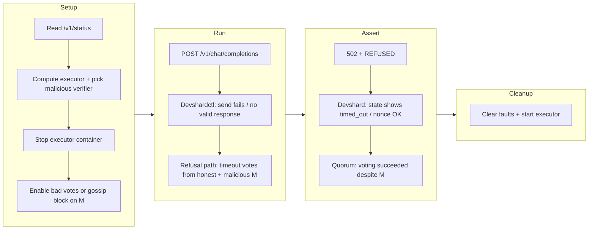

# Protocol testing proposal (testenv + Python + Go)

This document consolidates design decisions for **declarative-style protocol tests** around `devshardctl`, `devshardd`, the **mock gRPC chain**, and **timeout / voting / fault injection**. It is a **proposal**: implementation can follow in phases.

---

## Summary

### High-level idea: protocol end-to-end tests

**Protocol E2E tests** drive the devshard **as it actually runs**: a **user-facing** path (`devshardctl` over HTTP), **multiple participant processes** (`devshardd`, each with real `transport.Server`, gossip, and signing), and a **stand-in for mainnet** (`mock-server` gRPC). Assertions span **more than one binary** and **more than one hop**—for example refusal and execution timeouts, timeout **votes**, mempool and diff propagation, and behavior under **faults** (stopped containers, flaky network, or, injected bad responses of hosts).

The goal is not a single happy-path API call, but **cross-cutting protocol guarantees** observable only when those pieces are wired together.

We will also run **adversarial (“hacking”) scenarios** where **one or more hosts are dishonest**: invalid signatures, wrong receipts or state hashes, malformed gossip, dropped or duplicated messages, or bad timeout votes—implemented via **testenv-only fault injection** (control-plane rules, engine hooks), never as production behavior. The suite should show that **honest participants and the user path** stay safe: bad data is **rejected or outvoted**, timeouts still resolve, and the protocol does not collapse to an arbitrary state.

### Why unit tests are not enough

**Unit and in-process integration tests** (`go test` with fakes, `user.HostClient` mocks, `killableClient`, etc.) are essential and fast. They **do not** replace protocol E2E because they typically **skip**:

- Real **HTTP** request signing, framing, and SSE streaming between processes.
- **Gossip** fan-out and recovery across **separate** hosts and addresses.
- **Timing** and ordering that appear only with real sockets and schedulers (retries, refusal windows, concurrent requests).
- **Operational** faults (Docker stop/start, partitions) without reimplementing the whole stack in test doubles.

So unit tests **prove local invariants**; they cannot alone prove that the **deployed-shaped** system still satisfies the protocol.

### Why Testermint is not the right tool for this layer

**Testermint** (the repo’s Kotlin integration stack against a **full** chain + application cluster) is aimed at **system-level** validation: many moving parts, heavier bring-up, and coupling to **live** or **dockerized** chain and API surfaces. That is valuable, but **orthogonal** to **devshard-only** protocol work.

Devshard development needs to iterate **without** paying the cost of a full Testermint cluster for every protocol tweak. **`devshard/testenv`** exists precisely to **decouple devshard work from mainnet, testnet, and Testermint** (`devshard/testenv/README.md`): a **mock gRPC mainnet**, compose-defined participants, and a local user proxy. Protocol E2E belongs **here**, at the **devshard boundary**, not as a substitute for Testermint’s full-stack mission.

### Where the testing tool lives

The **protocol testing harness and fixtures** are intended to be **created and maintained under `devshard/testenv`**: Docker Compose definitions, `mock-server`, `devshardd`, testenv `devshardctl`, shell smoke scripts, and (per this proposal) a **Python/pytest**, **go**, **sh** drivers plus optional **control-plane** hooks on mock-server and participants. That keeps one **canonical lab** for devshard protocol behavior, separate from chain-wide Testermint jobs and from pure Go unit tests.

---

## Declarative example: `refusal-timeout` (high level, no code)

This is how a **declarative** scenario reads conceptually: named steps, explicit **faults** (executor down + adversarial verifier), one **stimulus**, and **expectations** on the **client**, **devshard/session state**, and **successful timeout voting** under attack. The harness resolves dynamic values (e.g. which participant is the next executor) at run time.

| Phase | Declarative intent |
|--------|-------------------|
| **Name** | `refusal-timeout` |
| **Preconditions** | Compose stack healthy: `mock-server`, all `participant-*`, `devshardctl` reachable. |
| **Resolve** | Read `GET /v1/status` → current `nonce` → next inference id `nonce + 1` → executor **slot** `(nonce + 1) mod group_size` → map slot to **compose service** (e.g. default layout: `participant-{slot mod 10}`; confirm against `config.yaml`). Pick a **different** participant as **malicious verifier** (not the executor for this inference): must remain a **non-executor** slot for timeout vote rules. |
| **Fault (executor)** | **Stop** the executor’s container (or equivalent: no TCP connect). Other participants and mock chain stay up. |
| **Fault (malicious host)** | On the chosen verifier, enable **testenv-only** injection, e.g. **`verify-timeout` returns wrong outcome** (reject when should accept, invalid signature, malformed vote payload), and/or **block outbound gossip** (`POST …/gossip/nonce`, `…/gossip/txs`) so bad or missing fan-out is exercised. Exact mechanism: control-plane on `devshardd` or env-driven fault profile (see §6). |
| **Stimulus** | Single **`POST /v1/chat/completions`** (non-streaming is enough) with a small prompt and bounded client timeout (long enough for refusal + timeout-vote path). |
| **Expect (client)** | HTTP **502**; response body mentions **timed out** and **REFUSED** (refusal-class timeout). |
| **Expect (devshard / state)** | **Required.** Poll `GET /v1/debug/state` and `GET /v1/status` on devshardctl until assertions pass: **session state reflects the refusal timeout** (e.g. `status_counts.timed_out` increases, `nonce` advances as expected after the timeout diff). This is part of what we test—not a thin HTTP-only smoke. |
| **Expect (voting / propagation)** | **Required.** **Timeout voting still succeeds:** honest verifiers supply enough **valid** votes that the protocol reaches quorum; the malicious host’s **bad vote or silence** must **not** prevent a correct outcome. Assert via devshardctl `GET /v1/debug/pending` / state snapshots and, where useful, **honest** hosts’ `GET …/mempool` and `GET …/diffs` (no reliance on the malicious host’s mempool for the final truth). |
| **Teardown** | Clear malicious fault profile; **start** the stopped executor again; short wait if needed for the next scenario. |

**Devshard** in this scenario means the **devshardctl session lab state** visible through **`/v1/status`** and **`/v1/debug/*`** (aggregates, pending txs, nonce)—what we assert changed correctly after the run, distinct from on-chain mainnet state.

The scenario is **declarative** because it states **what** the world should look like and **what** should happen, not **how** the harness implements compose or HTTP (that stays in the driver library).



**Assert subgraph:** **H**, **I**, and **J** are all **required** for this scenario class: the user-visible error, the **devshard/session state change**, and **successful timeout voting** in the presence of a dishonest participant.

```mermaid
sequenceDiagram
  participant H as Test harness
  participant C as Devshardctl
  participant X as Executor host
  participant M as Malicious verifier
  participant V as Honest verifiers

  H->>C: GET /v1/status
  H->>H: map next nonce to executor; pick M != executor
  H->>X: stop container
  H->>M: inject bad timeout vote and/or block outbound gossip
  H->>C: POST /v1/chat/completions
  C->>X: devshard send
  Note over C,X: unreachable: no usable response
  C->>M: verify-timeout
  M-->>C: wrong vote / reject / invalid
  C->>V: verify-timeout
  V-->>C: valid votes; quorum reached
  C-->>H: 502 chat response REFUSED
  H->>C: GET /v1/debug/state, /v1/status, /v1/debug/pending
  Note over H,C: assert devshard timed_out + quorum despite M
  H->>M: clear malicious faults
  H->>X: start container
```

---

## Python → Go mocks and assertion data (pointers)

- **Injection (chain):** **`mock-server`** — pytest posts JSON rules to dev-only HTTP (§6.1).
- **Injection (hosts):** **`devshardd`** — same idea (§6.2): rules shape **HTTP-level behavior** per **stage**—inference start/stream/receipt (`HandleInference`), **validation**, **`verify-timeout`**, **gossip**—via matches on **path/handler**, **nonce**, **attempt**. Pytest **reloads rules between scenario steps** (`PUT` / `POST`); Go applies them in handlers (no Python in Go). **§5** step 2; repeat the control call whenever a stage needs a new response profile; **§8** examples remain placeholders.
- **Assertions:** combine **client responses** (e.g. chat completion) with **poll loops** over **§2** endpoints—devshardctl `/v1/status`, `/v1/debug/*`, and per-host `GET …/mempool`, `…/diffs`, `…/signatures`. Harness shape: **§5** (`Observer`, shared context); refusal-timeout table shows concrete expectations; **§10** phase 4 for a shared observers helper.

---

## 1. Goals

- **Reproducible** scenarios (refusal timeout, execution timeout, recover-on-retry, voting, byzantine behavior).
- **Readable** tests: structure and data look “declarative”; assertions stay in a real language.
- **Observable** system: record **devshardctl** and **every participant** where needed (mempool, diffs, signatures, debug endpoints).
- **Runtime control**: change mock / fault behavior **between phases** from the test harness (e.g. Python) without rebuilding images.

Non-goals: running arbitrary Python inside Go; production exposure of fault APIs.

---

## 2. Existing surfaces (HTTP / gRPC)

Endpoints and services tests and tooling can call during protocol scenarios.

### 2.1 User proxy — devshardctl (testenv)

| Area | Base path | Examples |
|------|-----------|----------|
| OpenAI-style API | `/v1/…` | `POST /v1/chat/completions` |
| Session / debug | `/v1/…` | `GET /v1/status`, `GET /v1/debug/state`, `GET /v1/debug/pending`, `POST /v1/finalize` |

Implementation: `devshard/testenv/cmd/devshardctl/`.

### 2.2 Participants — `transport.Server`

| Area | Base path | Examples |
|------|-----------|----------|
| Devshard protocol (signed POSTs) | `/v1/devshard/sessions/:id/…` | inference, gossip, verify-timeout, etc. |
| Read-only observation (GET) | same prefix | `GET …/diffs`, `GET …/mempool`, `GET …/signatures` |

**Note:** GET routes currently **skip auth** in transport (`devshard/transport/server.go`). Treat them as **test / lab only**, not a public security boundary.

### 2.3 Mock mainnet — `mock-server`

| Transport | Where | Examples |
|-----------|--------|----------|
| gRPC | listener port from config (e.g. `9090`) | `MockQuery`, `MockTx` (`devshard/testenv/cmd/mockserver`) |
| HTTP (sidecar) | **gRPC port + 1** | `GET /health`, `GET /status` |

---

## 3. Test strategy: layers

| Layer | What it validates | Typical tooling |
|-------|-------------------|-----------------|
| **Unit / integration (Go)** | State machine, session, proxy logic with **in-process** `user.HostClient` fakes | `go test`, table-driven, `killableClient`-style wrappers |
| **Docker e2e** | Real HTTP, gossip, mock gRPC, multi-container | **Python + pytest** (recommended driver), optional `docker compose` for faults |
| **Stress / fault %** | Scale and random flakiness | Existing Go stress builds + optional Python orchestration |

**Recommendation:** Keep **strict protocol assertions** in **Go** where cheap; use **Python** for **multi-container orchestration**, **timeline polling**, and **readable scenario tables**. Optionally load **YAML** only for static config (ports, escrow id), not for assertion logic.

---

## 4. Declarative style: Python-first

### 4.1 Why not raw YAML-only

YAML is fine for **static** inputs. **Voting**, **quorum**, **cross-participant diffs**, and **“eventually”** conditions become a **second scripting language** (CEL, jq paths, embedded expressions). **Python + pytest** gives native assertions, stack traces, refactors, and optional `hypothesis`.

### 4.2 Hybrid (optional)

- `scenarios/*.yaml` — ports, participant URLs, escrow id.
- `test_*.py` — `Scenario` dataclasses + functions + assertions.

---

## 5. Scenario model (declarative in code)

Suggested building blocks:

- **`Env`**: `devshardctl_base`, `escrow_id`, `compose_dir`, `num_slots`, participant base URLs.
- **`Fault`**: stop/start participant, delay, **control-plane rules** (see §6), engine mode (`fail_execution`, …).
- **`RequestSpec`**: id, method/path/body, timeout.
- **`Observer`**: poll `GET` endpoints on ctl + each participant; store time series for asserts.
- **`assert_*`**: plain functions over a shared **context** (`responses`, `snapshots`, `docker` state).

Execution order per scenario (typical):

1. Resolve dynamic targets (`executor_for_next_inference` from `/v1/status`).
2. Apply faults (docker + control API); **call the control API again** whenever a scenario **stage** needs a new host response profile (inference vs validation vs votes).
3. Fire requests (sequential or `asyncio.gather`).
4. Await responses / poll observers until deadline.
5. Assert client + protocol.
6. **Cleanup** (start containers, clear rules)—use `try/finally` or pytest fixtures.

---

## 6. Control plane: switching mocks from Python

**Pattern:** Python sends **JSON-serializable rules**; Go **interprets** them (no Python-in-Go).

### 6.1 Mock server (`mock-server`)

Extend the existing HTTP server (port **gRPC + 1**) with a **dev-only** API, e.g.:

- `PUT /test/rules` — replace rule set; `clear: true` resets.
- Rules match **RPC name** / **escrow_id** / optional counters.
- Actions: return fixed payload, **gRPC error** (`UNAVAILABLE`, `DEADLINE_EXCEEDED`), **delay**, corrupt field.

Gate with `TESTENV_FAULT_API=1` and/or build tag; bind only on test networks; optional shared secret header.

### 6.2 Participants (`devshardd`)

Add **`POST /test/faults`** (or **`PUT /test/rules`** with `clear`) so pytest can **reload behavior between scenario stages** without restarting the container.

Rules should attach to **ingress HTTP / handler boundaries** the user traffic actually hits, not only to “the engine” as an abstract knob. Concretely, the Go side matches something like **`handler`** or **`path_prefix`** + **`escrow_id`** + **`nonce`** (or “next N calls”) and then:

- **Inference path** (`HandleInference` / `…/chat/completions`): delay, non-200, truncate SSE, omit `devshard_receipt`, wrong `ConfirmedAt`, stall after receipt (execution-timeout), etc.
- **Validation** (validator hook / validation-related responses): force invalid, flaky, or delayed validation where the stack exposes it.
- **Timeout votes** (`verify-timeout`): bad signature, reject, malformed body.
- **Gossip** (`gossip/nonce`, `gossip/txs`): drop, delay, duplicate (requires `gossip` hooks).

The **inference engine** toggles remain a **convenient implementation** for some of the above (e.g. never finish after receipt), but the **contract** for tests is: **per-stage, per-host response control** from Python via one rule document.

Also supported at this layer:

- Toggle **inference engine** behavior (success / fail after receipt / stall).
- **Mutate** outgoing receipts / signatures (byzantine).
- **Drop or delay** gossip—dev-only hooks in `gossip`.

### 6.3 Consensus / “voting” failures

In this codebase, “consensus” is largely **host state + signed txs + gossip**, not Tendermint. Inject failures by:

| Intent | Mechanism |
|--------|-----------|
| Partition / unreachable | `docker compose stop` / network policy |
| No finish / execution timeout | **Failing or stalling engine** on executor |
| Bad signatures / wrong state hash | **Fault layer** on participant HTTP or engine |
| Timeout vote quirks | Rules on **`verify-timeout`** handling |
| Gossip loss | **Drop** rules on gossip send path (dev hook) |

Observers: poll each host’s **`/v1/devshard/sessions/:id/mempool`** and **`diffs`** (and devshardctl **`/v1/debug/*`**) to assert **timeout txs**, **vote-related txs**, and **convergence**.

---

## 7. Three canonical scenarios (summary)

| Scenario | Fault | Client expectation | Notes |
|----------|--------|-------------------|--------|
| **refusal-timeout** | Executor **stopped** or unreachable | **502**, body contains `timed out` and **`REFUSED`** | Latency follows devshardctl refusal / timeout path; see `devshard/docs/issues/devshardctl-network-errors-refusal-fast-path.md` for a proposed fast path. |
| **execution-timeout** | Executor **up** but engine **never completes** finish path | **502**, body contains **execution** / **`EXECUTION`** | Requires **devshardd** fault or failing engine mode (not only `docker stop`). |
| **recover-on-retry** | Stop executor, **restart mid-flight** before refusal exhausts | **200**, valid completion | Second `sendAndProcess` succeeds after revive. |

---

## 8. Python examples (protocol-oriented)

Below: **illustrative** pytest-style modules. They assume:

- Stack is up (`docker compose` in `devshard/testenv`).
- `DEVSHARDCTL_URL` (default `http://127.0.0.1:8081`).
- `docker` and `compose` available for container faults.
- **Execution-timeout** and **control-plane** URLs are **placeholders** until Go endpoints exist (`pytest.skip` or env gate).

Dependencies (suggested): `pytest`, `httpx` (or `requests`), `pytest-asyncio` if using async.

### 8.1 Shared helpers (`conftest.py` or `harness.py`)

```python
# harness.py — shared utilities for protocol e2e tests
from __future__ import annotations

import os
import subprocess
import time
from dataclasses import dataclass
from typing import Optional

import httpx

DEFAULT_DEVSHARDCTL = os.environ.get("DEVSHARDCTL_URL", "http://127.0.0.1:8081")
DEFAULT_ESCROW = os.environ.get("TESTENV_ESCROW_ID", "1")
DEFAULT_NUM_SLOTS = int(os.environ.get("NUM_SLOTS", "16"))
COMPOSE_DIR = os.environ.get("TESTENV_COMPOSE_DIR", os.path.join(os.path.dirname(__file__), ".."))
COMPOSE_FILE = os.environ.get("COMPOSE_FILE", "docker-compose.yml")


@dataclass
class CtlClient:
    base: str = DEFAULT_DEVSHARDCTL
    timeout: float = 200.0

    def status(self) -> dict:
        with httpx.Client(timeout=30.0) as c:
            r = c.get(f"{self.base}/v1/status")
            r.raise_for_status()
            return r.json()

    def debug_state(self) -> dict:
        with httpx.Client(timeout=30.0) as c:
            r = c.get(f"{self.base}/v1/debug/state")
            r.raise_for_status()
            return r.json()

    def chat_completion(self, prompt: str, stream: bool = False, max_tokens: int = 32) -> httpx.Response:
        body = {
            "model": os.environ.get("DEVSHARD_MODEL", "Qwen/Qwen2.5-7B-Instruct"),
            "stream": stream,
            "max_tokens": max_tokens,
            "messages": [{"role": "user", "content": prompt}],
        }
        with httpx.Client(timeout=self.timeout) as c:
            return c.post(f"{self.base}/v1/chat/completions", json=body)


def participant_service_for_slot(slot: int) -> str:
    """Default gencompose mapping: 16 slots, 10 participants — adjust if config changes."""
    return f"participant-{slot % 10}"


def executor_slot_for_next_inference(nonce: int, num_slots: int = DEFAULT_NUM_SLOTS) -> int:
    next_id = nonce + 1
    return next_id % num_slots


def compose(*args: str) -> None:
    subprocess.run(
        ["docker", "compose", "-f", COMPOSE_FILE, *args],
        cwd=COMPOSE_DIR,
        check=True,
    )


def stop_participant(svc: str) -> None:
    compose("stop", svc)


def start_participant(svc: str) -> None:
    compose("start", svc)
```

### 8.2 Refusal-timeout

```python
# test_refusal_timeout.py
import time

import pytest

from harness import CtlClient, executor_slot_for_next_inference, participant_service_for_slot, start_participant, stop_participant


@pytest.mark.integration
def test_refusal_timeout_devshardctl():
    ctl = CtlClient()
    nonce = ctl.status()["nonce"]
    slot = executor_slot_for_next_inference(nonce)
    svc = participant_service_for_slot(slot)

    stop_participant(svc)
    time.sleep(2)

    try:
        r = ctl.chat_completion("refusal-timeout probe", stream=False)
        assert r.status_code == 502, r.text
        assert "timed out" in r.text
        assert "REFUSED" in r.text
    finally:
        start_participant(svc)
        time.sleep(2)

    # Optional: assert devshardctl debug state shows timed_out count increased
    st = ctl.debug_state()
    assert st.get("status_counts", {}).get("timed_out", 0) >= 1
```

### 8.3 Execution-timeout

Requires a **Go-side** way to run the executor **without** ever emitting a successful finish for that inference (e.g. `DEVSHARDD_ENGINE_MODE=fail_execution` on the executor container, or `POST /test/faults`). Below: **structure** + skip if not configured.

```python
# test_execution_timeout.py
import os

import pytest

from harness import CtlClient


@pytest.mark.integration
def test_execution_timeout_devshardctl():
    if os.environ.get("EXECUTOR_FAULT_URL", "") == "":
        pytest.skip("Set EXECUTOR_FAULT_URL or implement devshardd fault API / engine env")

    ctl = CtlClient()

    # Pseudocode: enable failing engine on executor only
    # httpx.post(f"{EXECUTOR_FAULT_URL}/test/faults", json={"mode": "fail_execution", ...})

    r = ctl.chat_completion("execution-timeout probe", stream=False)
    assert r.status_code == 502, r.text
    assert "timed out" in r.text
    assert "EXECUTION" in r.text  # matches TimeoutReason string from Go

    # Clear faults in finally (not shown)
```

### 8.4 Recover-on-retry

```python
# test_recover_on_retry.py
import threading
import time

import pytest

from harness import CtlClient, executor_slot_for_next_inference, participant_service_for_slot, start_participant, stop_participant


@pytest.mark.integration
def test_recover_on_retry_devshardctl():
    ctl = CtlClient()
    nonce = ctl.status()["nonce"]
    slot = executor_slot_for_next_inference(nonce)
    svc = participant_service_for_slot(slot)

    stop_participant(svc)
    revived = threading.Event()

    def revive_after_delay():
        time.sleep(0.7)
        start_participant(svc)
        revived.set()

    threading.Thread(target=revive_after_delay, daemon=True).start()

    r = ctl.chat_completion("recover-on-retry probe", stream=False)
    assert r.status_code == 200, r.text
    revived.wait(timeout=30)

    # Optional: parse JSON completion body if your proxy returns OpenAI-shaped JSON
    assert len(r.text) > 0
```

---

## 9. Relation to `devshardctl_timeout_check.sh`

The shell script in `devshard/testenv/scripts/devshardctl_timeout_check.sh` implements **refusal-timeout** (and optional happy path) without Python. The **Python** suite should **subsume** that script over time: same slot math, stronger asserts (debug state, multi-participant polling), and **phased fault + control-plane** rules.

---

## 10. Implementation phases (suggested)

1. **Python harness + pytest** in `devshard/testenv/py/` (or repo `tests/protocol/`): `harness.py`, refusal + recover tests, CI job with compose.
2. **`mock-server`**: `PUT /test/rules` for gRPC query/tx behavior (errors, delays, payload overrides).
3. **`devshardd`**: engine fault modes + optional HTTP `/test/faults` for byzantine / gossip drops.
4. **Observers library**: poll all participant GET endpoints; assert **quorum**, **timeout tx propagation**, **rejection of invalid signatures**.
5. Deprecate or wrap shell script as `make protocol-smoke`.

---

## 11. References (code)

- Devshardctl proxy / timeouts: `devshard/testenv/cmd/devshardctl/proxy.go`
- Session / executor slot: `devshard/user/user.go` (`composeDiffLocked`, `SendOnly`)
- Transport client: `devshard/transport/client.go`
- Participant HTTP routes: `devshard/transport/server.go`
- Mock server HTTP sidecar: `devshard/testenv/cmd/mockserver/main.go`
- Shell smoke: `devshard/testenv/scripts/devshardctl_timeout_check.sh`

---

*End of proposal.*
