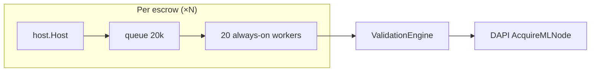
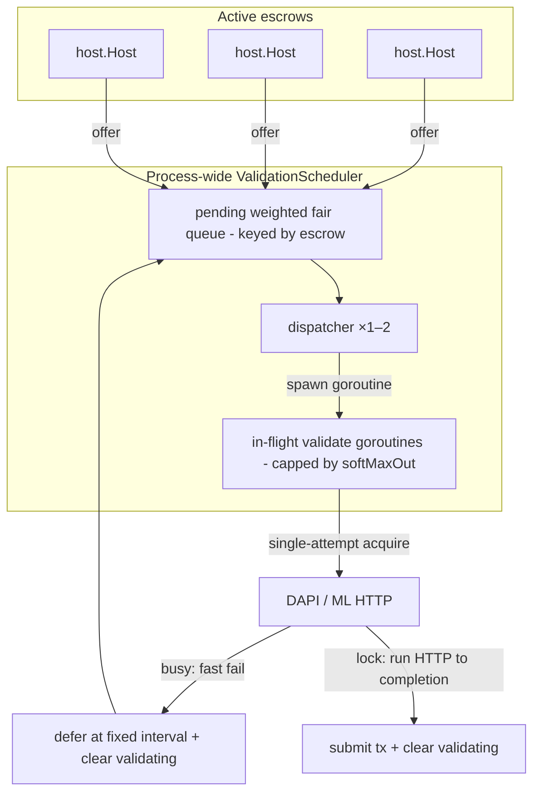

# Shared validation concurrency — implementation plan

## Context

Today each active devshard escrow gets its own `host.Host` with **20 dedicated validation goroutines** and a **20,000-job queue**. The real throughput ceiling is enforced downstream by DAPI's broker (`LockCount < MaxConcurrent` per ML node), not by these per-escrow workers.

### Production incident (fixed in #1417 / `ae2b525`)

A node accumulated ~2.5M goroutines / ~380GB RSS because:

1. `NewHost()` started 20 workers immediately, even for hosts that were never registered.
2. Failed escrow resolution discarded the host from the map without `Close()` — workers leaked.
3. Broken escrows (version conflict, pruned epoch) were re-resolved on every request with no negative cache.

**Phase 1 (this branch, cherry-picked from upstream):** explicit `Host.Start()` / `Host.Close()` lifecycle, resolution-failure cache (30s transient / 10m permanent), `storeSessionIfAbsent` race handling, `EvictBefore`, and shutdown paths that close all live hosts.

**Phase 2 (this document):** remove per-escrow worker pools. Treat validation like an **async HTTP router**: a tiny shared dispatcher hands off work; ML concurrency is owned by DAPI (and by the fallback capacity plan when DAPI is down). Local code must not invent a second pool sized to `sum(max_concurrent)`.

---

## How acquire actually works today (important — corrects earlier assumptions)

The DAPI broker acquire is **already non-blocking on the server side**. `lockAvailableNode` returns immediately: if no node is free it sends `nil`, which surfaces as `ErrNoNodesAvailable` → `codes.ResourceExhausted` at the client (`decentralized-api/broker/broker.go:456`, `node_lock.go:50`, `common/nodemanager/client.go:84`). DAPI never parks a caller waiting for a slot.

**The multi-second blocking is entirely devshardd-local.** `Engine.doWithLockedNode` (`devshard/cmd/devshardd/inference/engine.go`) swallows the instant `ResourceExhausted` and turns it into an internal retry loop: `maxAcquireAttempts = 10`, each iteration sleeping `2s` (`~20s` worst case) before giving up. That loop is what makes a validation "hold a slot" across a long acquire wait.

**Consequence for this plan:** the *non-blocking try-acquire primitive already exists* — it is `Acquire` returning `ResourceExhausted`. Making the scheduler react to "busy" fast requires **zero DAPI changes**. It requires two devshardd-local changes:

1. A **single-attempt (no sleep-retry) acquire mode** for the validation path, so `ErrNoNodesAvailable` returns in one RPC instead of being retried 10× internally.
2. Surfacing that error out through `Validate` so the scheduler can branch on `errors.Is(err, nodemanager.ErrNoNodesAvailable)`. Today acquire is buried under `Validate → ExecuteValidation → executeMLRequest → doWithLockedNode` and the scheduler only sees an opaque error.

---

## Why not N workers (and why not N = maxConcurrent)?

| Wrong model | Right model |
|-------------|-------------|
| N always-on workers ≈ ML slots | 1–2 dispatcher routines + spawn-per-job validates |
| Hold a local "slot" for whole acquire+HTTP | Dispatcher never blocks; in-flight work is bounded only by a static memory cap |
| `maxInFlight = sum(max_concurrent)` | That sum is the **broker / fallback** budget ([ml-node-capacity-fallback-plan.md](./ml-node-capacity-fallback-plan.md)), not a local worker count |

DAPI already admits at most `sum(max_concurrent)` locks; extra local waiters only create goroutine/queue pressure without raising ML throughput.

**Go note:** a `net/http` blocking call parks **one cheap goroutine per in-flight request** (the runtime netpoller frees the OS thread). That is fine and is not a "worker pool." We spawn one such goroutine per accepted validation and bound the total with a static soft cap (memory safety valve) — see the honest note on `softMaxOut` below.

---

## Goals

| Goal | Metric |
|------|--------|
| No per-escrow standing workers | Goroutine count not `20 × escrows` |
| Tiny shared dispatcher | 1–2 pump/dispatch routines process-wide |
| ML concurrency elsewhere | Happy path: DAPI broker; DAPI-down: capacity plan `/3` + local in-flight |
| Fairness across escrows | No single hot escrow starves others in the pending queue |
| Preserve consensus semantics | `ShouldValidate` stays per-host; only execution is shared |

## Non-goals

- Changing which inferences a host validates.
- Replacing DAPI broker locking on the happy path.
- Any DAPI / broker change (acquire is already non-blocking server-side).
- Gateway-side changes.
- Implementing DAPI-down `max/3` bounds — that is [ml-node-capacity-fallback-plan.md](./ml-node-capacity-fallback-plan.md). This plan does **not** size a local semaphore from `sum(max_concurrent)`.

---

## Current architecture (per-escrow workers)



**Problems:** `20N` idle/blocked goroutines; each worker held for entire acquire+ML wait (amplified by the internal 10×2s acquire retry); queue memory scales with escrows.

---

## Target architecture (async router, spawn-per-job)



**Design decision — spawn-per-job (resolves the earlier Option A / Option B contradiction):**

The dispatcher **never blocks**. It fair-pops a job and spawns a short-lived goroutine, then immediately takes the next job. Each spawned goroutine runs the full `Validate` (payload fetch → acquire → ML HTTP → submit tx). Concurrency is bounded only by `softMaxOut` (static memory cap), never by a pool sized to ML capacity.

Acquire inside that goroutine uses the **single-attempt (non-blocking) mode**:

1. Host discovers work → `scheduler.Offer(host, job)` (host marks `validating[id]`).
2. Pending queue is bounded and fair (round-robin by escrow). If full → drop + `job.Host.ClearValidating(id)` + rely on the next re-scan (same retry semantics as today).
3. Dispatcher fair-pops a job and spawns a goroutine (subject to `softMaxOut`; if at cap, leave the job pending and stop spawning until one completes).
4. In the goroutine, `Validate` runs with single-attempt acquire:
   - **Busy (`ErrNoNodesAvailable`)** → do **not** sleep-retry inside the engine. Return fast; scheduler defers the job (deferred set + fixed `deferDelay` timestamp) and clears `validating`. The dispatcher is already free and picks another escrow's job (fairness). Deferred jobs become eligible again only after `deferDelay` elapses (no tight spin); the interval is constant, not exponential, and there is no per-inference defer cap.
   - **Lock acquired** → run ML HTTP to completion in the same goroutine, submit `MsgValidation`/`MsgValidationVote`, clear `validating`.
5. `Host.Close()` → `scheduler.ForgetHost(h)`: drop pending + deferred for that host and clear their `validating`; in-flight goroutines are cancelled via their per-job context (see below).

**What bounds ML load?**

| Path | Bound |
|------|--------|
| DAPI up | Broker `LockCount < MaxConcurrent` |
| DAPI down + capacity observed | Capacity plan: `max/3` + local in-flight |
| Old DAPI, never observed | Unchanged today (no local invent) |

Local scheduler only bounds **pending queue depth** and a **static soft outstanding-goroutine cap** (memory), not "workers = Σ max_concurrent".

**Honest note on `softMaxOut`:** under sustained backlog this *is* a local concurrency ceiling — it behaves like a worker-pool cap. The distinction we keep is that it is a **static memory safety valve** (e.g. 256), decoupled from and never derived from `sum(max_concurrent)`. The non-blocking acquire matters precisely so these capped slots are not wasted parking for `~20s` on a saturated cluster: a busy job frees its slot in one RPC instead of holding it through a sleep-retry loop.

---

## Component design

### 1. `ValidationScheduler` (new: `devshard/validationpool/` or `validationsched/`)

```go
type Job struct {
    Host     *host.Host
    EscrowID string        // fairness key (weighted fair-queue bucket)
    Weight   uint32        // escrow share; default = host slot count
    Work     validateJob
}

type Scheduler struct {
    pending      wfq            // weighted fair queue, keyed by EscrowID
    deferred     deferredSet    // acquire-busy jobs, eligible after a fixed backoff
    dispatchers  int            // default 2
    outstanding  atomic.Int64   // live validate goroutines
    softMaxOut   int            // static memory cap; NOT sum(max_concurrent)
    deferDelay   time.Duration  // fixed acquire-busy re-probe interval (not exponential)
}

func (s *Scheduler) Offer(job Job) bool
func (s *Scheduler) ForgetHost(h *host.Host)
func (s *Scheduler) Shutdown(ctx context.Context) error
```

**Dispatchers:** default **2** (env `DEVSHARD_VALIDATION_DISPATCHERS`, clamp `[1, 4]`). Enough to keep the pending queue moving while one dispatch path is briefly busy spawning; unrelated to ML slot count.

**Acquire policy (resolved):** single-attempt, non-blocking. The validation path must use an engine acquire mode that does **one** `Acquire` RPC and returns `ErrNoNodesAvailable` immediately — it must **not** run `doWithLockedNode`'s `maxAcquireAttempts`/`2s`-sleep loop (that would double-retry: engine loop *and* scheduler defer). On busy → defer at a **fixed** interval and pick another escrow's job. Only after a lock (or a fallback slot from the capacity plan) does the ML HTTP run to completion.

**Per-job cancellable context (new):** today `validateAsync` runs with `context.Background()`, so `Close()` cannot cancel in-flight validations. The scheduler must mint a per-job `context.WithCancel` (derived from a host/scheduler root ctx) and cancel it in `ForgetHost`/`Shutdown`. This is what makes "in-flight finishes or ctx-cancel" real.

**`validating` ownership (new):** `validating[id]` lives on `Host`, but the scheduler owns pending/deferred/drop. Every scheduler path that abandons a job (pending full, `ForgetHost`, shutdown drain) must call an (unexported) `host.ClearValidating(id)` so the inference is re-offerable; otherwise it is stuck "validating" forever and `VoteThreshold` may become unreachable.

**Pending queue — weighted fair queue (resolved):** the pending queue is a **weighted fair queue** keyed by `EscrowID`, not plain round-robin. Each escrow gets a dispatch share proportional to its `Weight` (default = the host's slot count in that group, i.e. its share of validation responsibility; falls back to equal weight, which degenerates to round-robin). Implement with deficit round robin (DRR) or virtual-time WFQ: escrows with more slots progress faster, but no escrow — however hot — starves the others. Fixed high water mark (e.g. 4096) or `activeEscrows × K`.

**Soft outstanding cap:** env default 256 — if too many validate goroutines already exist, stop spawning until some complete. Static; **not** derived from capacity sum.

**Retry ownership (resolved):** two complementary sources.
- **Scheduler-driven (fixed interval, infinite defer):** acquire-busy jobs go to the deferred set and re-enter the weighted fair queue after a **fixed** `deferDelay` (no exponential backoff, no per-inference defer cap). This is required so a *quiet* escrow (no inbound traffic) still completes its validations after transient saturation. Infinite defer is safe because the validation **window** is the natural terminal: once the executor prunes the payload, `Validate` returns `ErrValidationSkipped` and the job is dropped (host.go:1063); settlement likewise ends the work. So a deferred job re-probes at a steady cadence until it acquires a slot, the payload is pruned, or the inference settles — never truly forever.
- **Traffic-driven backstop:** `collectValidationJobs` still re-scans on every `HandleRequest` and re-offers anything not `validating` and not already voted (unchanged). This covers pending-full drops.

**Payload-fetch-before-acquire wrinkle (accepted, noted):** in `Validator.Validate`, payloads are fetched from the executor *before* acquire. An acquire-busy requeue therefore discards a completed payload fetch and refetches on retry. We accept this cost because busy-requeues should be rare when capacity is sized correctly. Reordering acquire ahead of payload fetch is a possible follow-up but is invasive (acquire and ML HTTP are coupled inside `doWithLockedNode`) and out of scope here.

**Capacity plan relationship:** scheduler does **not** call `SyncCapacity` to resize workers. Capacity cache feeds **fallback HTTP admission** only. No dependency on capacity Phase A to ship the shared dispatcher (static soft caps are enough).

### 2. `Engine` changes (devshardd-local, no DAPI change)

Add a single-attempt acquire path for validation, e.g. `doWithLockedNodeOnce` or a `ValidateRequest`-scoped option, that performs one `Acquire` and returns `ErrNoNodesAvailable` without the `maxAcquireAttempts`/sleep loop. `Validate` must propagate `ErrNoNodesAvailable` (distinct from other errors) so the scheduler can branch on it. Fallback-to-passive-cache behavior (DAPI unreachable) is unchanged.

### 3. `Host` changes

Remove: `validationQueue`, `startValidationWorkers`, `enqueueValidation` (channel path).

Add: `scheduler` (`Offer`), `ClearValidating(id)` (scheduler callback), `validationEnabled` (`Start` / `Close` → `ForgetHost`). `validateAsync` takes the per-job context instead of `context.Background()`.

### 4. `HostManager` integration

| Event | Today (Phase 1) | Phase 2 |
|-------|-----------------|---------|
| `storeSessionIfAbsent` | `Start()` → 20 workers | `Start()` → offers enabled |
| failure / settle / evict | `Close()` | `Close` + `ForgetHost` |
| `HostManager.Close()` | close hosts | close hosts then `scheduler.Shutdown` |

### 5. Observability migration

Per-escrow queue metrics change meaning under one shared queue:
- `SetValidationQueueDepth(escrowID, …)` → report **global** pending depth plus optional per-escrow pending counts.
- Keep `IncValidationQueueDrop`; add an acquire-busy-requeue counter and an outstanding-goroutine gauge (for the soft cap).

---

## Implementation phases

### Phase 2a — Shared dispatcher behind flag

1. Add the engine single-attempt acquire mode and propagate `ErrNoNodesAvailable` through `Validate`.
2. Implement scheduler (weighted-fair pending + fixed-interval deferred set + 1–2 dispatchers + spawn-per-job + soft cap + per-job ctx).
3. Wire `Host` via `WithValidationScheduler`; add `ClearValidating`.
4. Flag: `DEVSHARD_SHARED_VALIDATION_SCHEDULER=1` (default off).

### Phase 2b — Remove per-escrow workers

1. Delete `validationQueue` / `startValidationWorkers` / channel `enqueueValidation`.
2. Shared dispatcher only.

---

## Testing plan

| Test | Asserts |
|------|---------|
| Phase 1 start/close tests | until 2b; then "no standing per-host workers" |
| `TestScheduler_IdleHasNoValidationGoroutines` | after drain, no validate goroutines (dispatchers may remain) |
| `TestEngine_ValidateAcquireSingleAttempt` | validation acquire does one RPC on busy; no internal 10×2s loop |
| `TestScheduler_DeferOnAcquireBusy` | busy job is deferred + `validating` cleared; other escrows' jobs still start |
| `TestScheduler_NoDoubleRetry` | scheduler backoff is the only retry; engine does not also sleep-retry |
| `TestScheduler_WeightedFairness` | escrows dispatch proportional to weight; hot escrow does not starve others |
| `TestScheduler_DeferFixedIntervalInfinite` | busy job re-probes at fixed `deferDelay`; no exponential growth, no defer cap |
| `TestScheduler_DeferTerminatesOnPayloadPruned` | infinitely-deferred job drops cleanly on `ErrValidationSkipped` |
| `TestScheduler_DropsWhenPendingFull` | drop clears `validating`; same retry semantics as today |
| `TestScheduler_ForgetHostCancelsInflight` | `ForgetHost` cancels per-job ctx and clears `validating` |
| `TestScheduler_SoftOutstandingCap` | stops spawning above soft max; resumes after completion |
| pprof: many sessions | not `20N` standing workers |

---

## Rollout

1. Phase 1 lifecycle fix.
2. Canary shared dispatcher.
3. Compare idle goroutines, validation latency, missed-validation rate, acquire-busy re-queue rate.
4. Default on; delete per-escrow workers.

---

## Open questions

_None currently — the fairness and backoff questions are resolved below._

**Resolved:**

- **Fairness = weighted fair queue** — pending is a WFQ keyed by `EscrowID`, share proportional to `Weight` (default = slot count; equal weight degenerates to round-robin). No hot escrow starves others.
- **Backoff = fixed interval, infinite defer** — acquire-busy jobs re-probe at a constant `deferDelay` (no exponential, no per-inference defer cap). Safe because the validation window (payload pruning / settlement) is the natural terminal, so defer is never truly unbounded.
- **Acquire is non-blocking at DAPI already** — the blocking is devshardd's internal retry loop. Option B is a devshardd-only change (single-attempt acquire + surface `ErrNoNodesAvailable`); **no DAPI work**.
- **Spawn-per-job** — dispatcher never blocks; it spawns one goroutine per accepted job, bounded by a static `softMaxOut`. This replaces the earlier ambiguous "Option A vs Option B" split.
- **No double retry** — single-attempt acquire in the engine; the fixed-interval defer lives only in the scheduler's deferred set.
- **`validating` cleared by scheduler** on every abandon path; **per-job cancellable ctx** replaces `context.Background()`.
- **Do not size local concurrency to `sum(max_concurrent)`** — that budget belongs to DAPI + the capacity/fallback plan.

---

## Related

| Item | Topic |
|------|-------|
| [ml-node-capacity-fallback-plan.md](./ml-node-capacity-fallback-plan.md) | Observes `max_concurrent`; bounds **fallback HTTP**, not validation dispatcher count |
| #1417 (`ae2b525`) | Host leak fix, ML-node passive cache |
| #1348 (`c357727`) | Inference during PoC validation |
| #1267 / `upgrade-v0.2.14` | Release branch |

Phase 2 goal: **shared async validation router** — 1–2 dispatchers + spawn-per-job with non-blocking acquire — not "N×20 workers" and not "workers = Σ max_concurrent."
