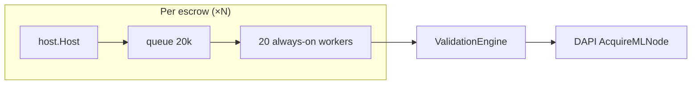
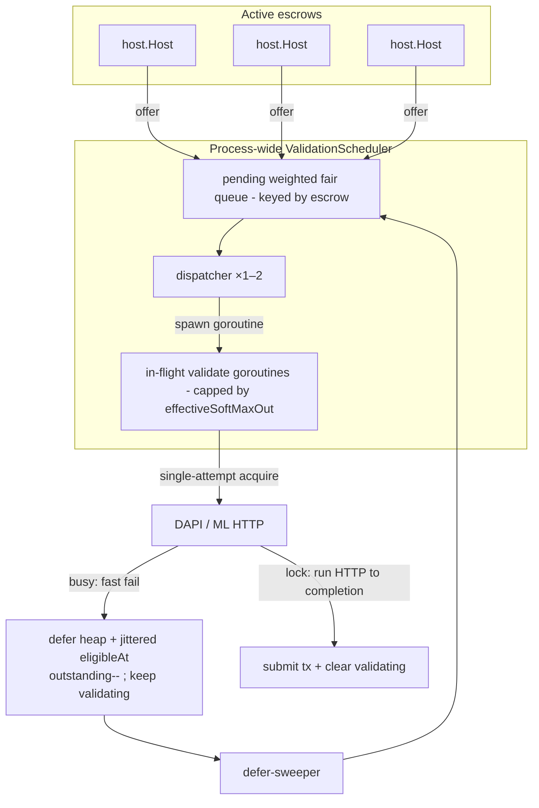
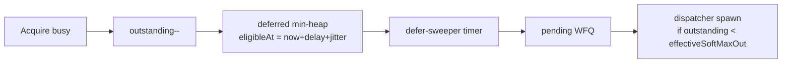

# Shared validation concurrency — implementation plan

## Context

Today each active devshard escrow gets its own `host.Host` with **20 dedicated validation goroutines** and a **20,000-job queue**. The real throughput ceiling is enforced downstream by DAPI's broker (`LockCount < MaxConcurrent` per ML node), not by these per-escrow workers.

### Production incident (fixed in #1417 / `ae2b525`)

A node accumulated ~2.5M goroutines / ~380GB RSS because:

1. `NewHost()` started 20 workers immediately, even for hosts that were never registered.
2. Failed escrow resolution discarded the host from the map without `Close()` — workers leaked.
3. Broken escrows (version conflict, pruned epoch) were re-resolved on every request with no negative cache.

**Phase 1 (prerequisite — already on the base branch, not part of this work):** explicit `Host.Start()` / `Host.Close()` lifecycle, resolution-failure cache (30s transient / 10m permanent), `storeSessionIfAbsent` race handling, `EvictBefore`. This document does **not** cherry-pick or re-land Phase 1. Note: `HostManager.Close()` exists but is **not** yet wired into the app closer stack — Phase 2 §4 wires it.

**Phase 2 (this document only):** remove per-escrow worker pools and **always** use the process-wide shared scheduler (no feature flag). Treat validation like an **async HTTP router**: a tiny shared dispatcher hands off work; ML concurrency is owned by DAPI (and by the fallback capacity plan when DAPI is down). Local code must not invent a second pool sized to `sum(max_concurrent)`.

---

## How acquire actually works today (important — corrects earlier assumptions)

The DAPI broker acquire is **already non-blocking on the server side**. `lockAvailableNode` returns immediately: if no node is free it sends `nil`, which surfaces as `ErrNoNodesAvailable` → `codes.ResourceExhausted` at the client (`decentralized-api/broker/broker.go:456`, `node_lock.go:50`, `common/nodemanager/client.go:84`). DAPI never parks a caller waiting for a slot.

**The multi-second blocking is entirely devshardd-local.** `Engine.doWithLockedNode` (`devshard/cmd/devshardd/inference/engine.go`) swallows the instant `ResourceExhausted` and turns it into an internal retry loop: `maxAcquireAttempts = 10`, each iteration sleeping `2s` (`~20s` worst case) before giving up. That loop is what makes a validation "hold a slot" across a long acquire wait.

**Consequence for this plan:** the *non-blocking try-acquire primitive already exists* — it is `Acquire` returning `ResourceExhausted`. Making the scheduler react to "busy" fast requires **zero DAPI changes**. It requires two devshardd-local changes:

1. A **single-attempt (no sleep-retry) acquire mode** for the validation path, so `ErrNoNodesAvailable` returns in one RPC instead of being retried 10× internally.
2. Surfacing that error out through `Validate` so the scheduler can branch on `errors.Is(err, nodemanager.ErrNoNodesAvailable)`. Today acquire is buried under `Validate → ExecuteValidation → executeMLRequest → doWithLockedNode` and the scheduler only sees an opaque error.

---

## Why not N workers (and why not N = maxConcurrent)?

| Wrong model | Right model |
|-------------|-------------|
| N always-on workers ≈ ML slots | 1–2 dispatcher routines + spawn-per-job validates |
| Hold a local "slot" for whole acquire+HTTP | Dispatcher never blocks; in-flight work is bounded only by a static memory cap |
| `maxInFlight = sum(max_concurrent)` | That sum is the **broker / fallback** budget ([ml-node-capacity-fallback-plan.md](./ml-node-capacity-fallback-plan.md)), not a local worker count |

DAPI already admits at most `sum(max_concurrent)` locks; extra local waiters only create goroutine/queue pressure without raising ML throughput.

**Go note:** a `net/http` blocking call parks **one cheap goroutine per in-flight request** (the runtime netpoller frees the OS thread). That is fine and is not a "worker pool." We spawn one such goroutine per accepted validation and bound the total with a static soft cap (memory safety valve) — see the honest note on `softMaxOut` below.

---

## Goals

| Goal | Metric |
|------|--------|
| No per-escrow standing workers | Goroutine count not `20 × escrows` |
| Tiny shared dispatcher | 1–2 pump/dispatch routines process-wide |
| ML concurrency elsewhere | Happy path: DAPI broker; DAPI-down: capacity plan `/4` + local in-flight |
| Fairness across escrows | No single hot escrow starves others in the pending queue |
| Preserve consensus semantics | `ShouldValidate` stays per-host; only execution is shared |

## Non-goals

- Changing which inferences a host validates.
- Replacing DAPI broker locking on the happy path.
- Any DAPI / broker change (acquire is already non-blocking server-side).
- Gateway-side changes.
- Implementing DAPI-down `max/4` bounds — that is [ml-node-capacity-fallback-plan.md](./ml-node-capacity-fallback-plan.md). This plan does **not** size a local semaphore from `sum(max_concurrent)`.

---

## Current architecture (per-escrow workers)



**Problems:** `20N` idle/blocked goroutines; each worker held for entire acquire+ML wait (amplified by the internal 10×2s acquire retry); queue memory scales with escrows.

---

## Target architecture (async router, spawn-per-job)



**Design decision — spawn-per-job (resolves the earlier Option A / Option B contradiction):**

The dispatcher **never blocks**. It fair-pops a job and spawns a short-lived goroutine, then immediately takes the next job. Each spawned goroutine runs the full `Validate` (payload fetch → acquire → ML HTTP → submit tx). Concurrency is bounded only by `effectiveSoftMaxOut` (static memory cap, HA-scaled), never by a pool sized to ML capacity.

Acquire inside that goroutine uses the **single-attempt (non-blocking) mode**:

1. Host discovers work → builds `Job` with **slot-weighted** `Weight = max(1, len(h.slotIDs))` → `scheduler.Offer(job)` (host marks `validating[id]`). Discovery sources: (a) `HandleRequest`, (b) process-wide **OfferRescan** (§1b), (c) lease **RetryLoop** offered into the same scheduler (§1c).
2. Pending queue is bounded and **slot-weighted fair** by escrow (`Job.Weight`). If full → drop + `job.Host.ClearValidating(id)` + rely on the next discovery pass (traffic, OfferRescan, or RetryLoop) — not only inbound requests.
3. Dispatcher fair-pops a job and spawns a goroutine (subject to `effectiveSoftMaxOut`; if at cap, leave the job pending and stop spawning until one completes).
4. In the goroutine, `Validate` runs with single-attempt acquire:
   - **Busy (`ErrNoNodesAvailable`)** → do **not** sleep-retry inside the engine. Return fast; decrement `outstanding` immediately (slot freed); scheduler defers the job with a **jittered** `eligibleAt` (§1a) and **keeps** `validating[id]` set. The dispatcher is already free and picks another escrow's job (fairness). Deferred jobs do **not** count toward `effectiveSoftMaxOut` and become eligible only after `eligibleAt` (no tight spin; no exponential backoff; no per-inference defer cap). Discovery must not re-offer while deferred — see `validating` ownership below.
   - **Lock acquired** → run ML HTTP to completion in the same goroutine, then the **single finish path** in `validateAsync` (§1c Option B): submit barrier → mempool → optional `SetResult` for `LeaseHeld` → clear `validating`.
5. `Host.Close()` → `scheduler.ForgetHost(h)`: drop pending + deferred for that host and clear their `validating`; in-flight goroutines are cancelled via their per-job context. Cancel alone is not enough — submit must honor the publish fence (§ submit barrier below).

**What bounds ML load?**

| Path | Bound |
|------|--------|
| DAPI up | Broker `LockCount < MaxConcurrent` |
| DAPI down + capacity observed | Capacity plan: `max/4` + local in-flight |
| Old DAPI, never observed | Unchanged today (no local invent) |

Local scheduler only bounds **pending queue depth** and a **static soft outstanding-goroutine cap** (memory), not "workers = Σ max_concurrent".

**Honest note on `softMaxOut`:** under sustained backlog this *is* a local concurrency ceiling — it behaves like a worker-pool cap. The distinction we keep is that it is a **static memory safety valve** (configured default **128**, then scaled by the HA multiplier — §1 / `effectiveSoftMaxOut`), decoupled from and never derived from `sum(max_concurrent)`. The non-blocking acquire matters precisely so these capped slots are not wasted parking for `~20s` on a saturated cluster: a busy job frees its slot in one RPC instead of holding it through a sleep-retry loop.

---

## Component design

### 1. `ValidationScheduler` (new: `devshard/validationpool/`)

```go
type Job struct {
    Host           *host.Host
    EscrowID       string        // fairness key (weighted fair-queue bucket)
    Weight         uint32        // required: set at Offer = max(1, len(host.slotIDs))
    LeaseHeld      bool          // true = RetryLoop already owns Postgres lease (§1c)
    LeaseClaimedAt time.Time     // required when LeaseHeld; used for TTL in submit barrier
    Work           validateJob
}

type Scheduler struct {
    pending      wfq            // weighted fair queue, keyed by EscrowID
    deferred     deferredSet    // acquire-busy jobs; min-heap by eligibleAt
    dispatchers  int            // default 2
    outstanding  atomic.Int64   // live validate goroutines ONLY (not pending/deferred)
    softMaxOut   int            // configured cluster budget; NOT sum(max_concurrent)
    haMultiplier int            // DEVSHARD_VALIDATION_HA_MULTIPLIER; default 1
    // effectiveSoftMaxOut = max(1, softMaxOut / haMultiplier) — spawn cap used at runtime
    deferDelay   time.Duration  // base acquire-busy re-probe interval (not exponential)
    deferJitter  time.Duration  // uniform jitter added to deferDelay (§1a)
}

func (s *Scheduler) Offer(job Job) bool
func (s *Scheduler) ForgetHost(h *host.Host)
func (s *Scheduler) Shutdown(ctx context.Context) error
```

**Dispatchers:** default **2** (env `DEVSHARD_VALIDATION_DISPATCHERS`, clamp `[1, 4]`). Enough to keep the pending queue moving while one dispatch path is briefly busy spawning; unrelated to ML slot count. Dispatchers **never** `sleep`/`time.After` for defer backoff — that would stall the pump (see §1a).

**Acquire policy (resolved):** single-attempt, non-blocking. The validation path must use an engine acquire mode that does **one** `Acquire` RPC and returns `ErrNoNodesAvailable` immediately — it must **not** run `doWithLockedNode`'s `maxAcquireAttempts`/`2s`-sleep loop (that would double-retry: engine loop *and* scheduler defer). On busy → enter deferred set with jittered `eligibleAt` (§1a) and pick another escrow's job. Only after a lock (or a fallback slot from the capacity plan) does the ML HTTP run to completion.

**Per-job cancellable context (new):** today `validateAsync` runs with `context.Background()`, so `Close()` cannot cancel in-flight validations. The scheduler must mint a per-job `context.WithCancel` (derived from a host/scheduler root ctx) and cancel it in `ForgetHost`/`Shutdown`. This stops in-flight `Validate` when the host goes away — but see the submit barrier next.

**Submit barrier after cancel (resolved — gap 3):** canceling `ctx` does **not** automatically stop the code *after* `Validate` returns. Race:

```text
t0  validate: payload → acquire → ML HTTP
t1  settle / Host.Close → ForgetHost → cancel(ctx)
t2  Validate returns (result or ctx error)
t3  sign MsgValidation / MsgValidationVote
t4  mempool.Add  ← can still run unless guarded
```

Today `mempool.Add` has no host-closed / `ctx.Err()` check (`host.go` publish path); lease jobs only partially guard via `AllowValidationSubmit` / RetryLoop `OwnsPendingLease`.

**Fence — before signing and before `mempool.Add`, abandon submit if any of:**

1. `ctx.Err() != nil` (ForgetHost / shutdown cancelled the job)
2. host validation is closed / disabled (`validationClosed` or equivalent set by `Host.Close`)
3. for `LeaseHeld` jobs: lease no longer owned, or `now - LeaseClaimedAt > leaseTTL` (same checks RetryLoop already does; `LeaseClaimedAt` required on the job)

On abandon: do **not** publish; clear `validating` as a terminal leave; for `LeaseHeld`, leave lease `pending` so another instance can claim after TTL. Pattern: **cancel stops work; publish only if the job is still owned and the host is still live.**

**`validating` ownership (resolved — keep set while in scheduler):** `validating[id]` lives on `Host` and means “this inference is already in the scheduler pipeline.” It stays set for **pending + deferred + in-flight**. That is the preferred single-flight guard: `collectValidationJobs` already skips `validating` IDs, so OfferRescan / traffic cannot double-offer a deferred job. Do **not** clear on acquire-busy defer (the defer-sweeper owns re-probe).

| Event | `validating[id]` |
|-------|------------------|
| `Offer` accepted | **Set** (before or as enqueue to pending) |
| Pending → spawned (in-flight) | **Keep** |
| Acquire busy → deferred | **Keep** |
| Deferred sweeper → pending again | **Keep** |
| Terminal success / fail / `ErrValidationSkipped` / `ErrValidationAlreadyLeased` | **Clear** (job left scheduler) |
| Pending-full **drop** | **Clear** (`ClearValidating`) so a later discovery can re-offer |
| `ForgetHost` / shutdown abandon | **Clear** |

Every path that removes a job from the scheduler without completing it (pending-full drop, `ForgetHost`, shutdown drain) must call `host.ClearValidating(id)`; otherwise the inference is stuck "validating" forever and `VoteThreshold` may become unreachable. Scheduler-side `(host, id)` dedupe is optional hardening later — not required if this table is honored.

**`ErrValidationAlreadyLeased` = skip, not fail (resolved):** another instance (or an overlapping local path) already holds the Postgres validation lease. In `validateAsync`, treat `errors.Is(err, ErrValidationAlreadyLeased)` like `ErrValidationSkipped`: log at info, **do not** call `FailValidationFinished` / error counters, do not publish, clear `validating`. Keeping `validating` set while deferred makes this rare; the skip path is the safety net when it still happens.

**Pending queue — slot-weighted fair queue (resolved):** the pending queue is a **WFQ keyed by `EscrowID`**, with share = host slot count. Not plain round-robin and not equal-weight-by-default. Implement with deficit round robin (DRR) or virtual-time WFQ: escrows with more slots progress faster, but no escrow — however hot — starves the others.

**Pending HWM (high-water mark):** max number of jobs allowed in the **pending** WFQ at once (waiting to be spawned — not deferred, not in-flight). If `Offer` would exceed the HWM → reject the offer, `ClearValidating`, count as a queue drop (same retry semantics as today’s full channel). Fixed default **4096** (env `DEVSHARD_VALIDATION_PENDING_HWM`, optional). Not `activeEscrows×K` for v1 — a single constant is enough; raise via env if needed.

**`Weight` set on Offer (resolved):**

```text
job.Weight = max(1, uint32(len(h.slotIDs)))  // same slot set as ShouldValidate
scheduler.Offer(job)
```

- **Who:** every Offer caller (`HandleRequest` / OfferRescan collect→Offer path, and RetryLoop `LeaseHeld`) sets `Weight` before `Offer`.
- **What:** slot-weighted — proportional to this host’s slots in the escrow group.
- **Floor:** `max(1, …)` so an empty `slotIDs` never yields weight 0 (would never get dispatch share).
- **Scheduler:** uses `Job.Weight` for the WFQ bucket; does **not** recompute from `Host` on pop. On Offer, refresh the bucket weight for that `EscrowID` from `job.Weight` (slot counts are stable for an escrow’s life; refresh keeps the bucket correct if the first offer raced).
- **Not in scope:** equal-weight / round-robin-only mode — slot-weighted is the design.

**Soft outstanding cap + HA multiplier:**

| Env | Default | Meaning |
|-----|---------|---------|
| `DEVSHARD_VALIDATION_SOFT_MAX_OUT` | **128** | Configured in-flight budget (**cluster-wide** intent) |
| `DEVSHARD_VALIDATION_HA_MULTIPLIER` | **1** | Number of concurrent `devshardd` processes that share validation work (HA peers). Clamp `[1, 64]`. |

```text
effectiveSoftMaxOut = max(1, softMaxOut / haMultiplier)
```

Dispatchers spawn only while `outstanding < effectiveSoftMaxOut`. Static knobs; **not** derived from capacity sum. Chosen after §1a stampede controls: busy slots free immediately, so a fat 256 valve is unnecessary; configured 128 still leaves headroom above typical broker fill without oversized Acquire waves.

**Why the HA multiplier:** `softMaxOut` is enforced **per process**. With N HA instances each using 128, aggregate in-flight Acquires can approach `N × 128` (broker still gates ML locks; Postgres leases still prevent duplicate validation of the same inference). Setting `DEVSHARD_VALIDATION_HA_MULTIPLIER=N` on every peer keeps aggregate ≈ configured `SOFT_MAX_OUT` (e.g. 128/3 → 42 per process). Default `1` preserves single-instance behavior. Operator must set the same multiplier on each peer; the process does not auto-discover peer count.

**What counts toward the spawn cap (resolved):**

| State | Counts toward `outstanding` / `effectiveSoftMaxOut`? |
|-------|------------------------------------------------------|
| In-flight validate goroutine (payload / acquire / ML HTTP / submit) | **Yes** |
| Pending in WFQ (not yet spawned) | **No** |
| Deferred (acquire-busy, waiting for `eligibleAt`) | **No** |

On busy: the validate goroutine exits and `outstanding--` **before** (or as) the job enters `deferred`. A deferred job is only a timestamped queue entry — it must not pin a soft-cap slot, or saturation would freeze the scheduler with `effectiveSoftMaxOut` idle “waiters” and no room to try other work.

### 1a. Acquire-busy stampede controls (resolved)

**Problem:** with single-attempt acquire, a saturated process can spawn up to `effectiveSoftMaxOut` validate goroutines, all get `ErrNoNodesAvailable` quickly, all defer, then all wake together and repeat — an Acquire RPC stampede every `deferDelay` (still better than 10×2s sleeps, but avoidable). Across HA, use `DEVSHARD_VALIDATION_HA_MULTIPLIER` so each peer’s wave stays smaller.

**Controls:**

1. **Deferred ∉ spawn cap** — as in the table above. Soft cap only bounds live work, not waiting-to-retry.

2. **Non-blocking deferred wake (dispatchers never sleep on backoff):**
   - Store deferred jobs in a **min-heap keyed by `eligibleAt`** (or equivalent sorted structure).
   - A dedicated **defer-sweeper** goroutine (one, process-wide) waits on `time.Until(heap.Peek().eligibleAt)` (or a resettable timer), pops all due jobs, and pushes them back into the WFQ pending queue, then signals dispatchers.
   - Alternatively: dispatchers `select` on a shared `timer.C` / `nextEligible` channel updated whenever the heap min changes — still no per-job `sleep` inside the dispatch loop.
   - **Forbidden:** `time.Sleep(deferDelay)` (or blocking `After`) inside a dispatcher while holding the right to pump the pending queue.

3. **Jittered `eligibleAt` (break lockstep):**
   - Base: `deferDelay` (env `DEVSHARD_VALIDATION_DEFER_DELAY`, default **2s**).
   - Jitter: uniform in `[0, deferJitter]` (env `DEVSHARD_VALIDATION_DEFER_JITTER`, default **`deferDelay`** i.e. 100% of base → spread over `[deferDelay, 2·deferDelay]`).
   - On busy: `eligibleAt = now + deferDelay + U(0, deferJitter)`.
   - No exponential backoff; no per-inference defer cap (validation window still terminates the job).
   - Optional hardening (not required for v1): cap how many deferred jobs become due in one sweeper tick (e.g. promote at most `effectiveSoftMaxOut` per tick). Decide from deferred-depth metrics (§ observability below), not from DAPI-outage concerns (those use nodemanager fallback).



**Deferred-queue observability (required for v1):**

| Signal | Spec |
|--------|------|
| Prometheus gauge | `devshard_validation_deferred_depth` — current deferred-heap length (process-wide). Updated on defer / promote / ForgetHost drop / shutdown. Exposed on the existing **`/metrics`** endpoint (same registry as other `devshard_validation_*` series). |
| Related gauges | `devshard_validation_outstanding`, `devshard_validation_pending_depth`, `devshard_validation_soft_max_out`, `devshard_validation_effective_soft_max_out`; counter `devshard_validation_acquire_busy_requeues_total` |
| Warn log | When deferred depth **crosses above 100** (edge-triggered: log on transition `≤100 → >100`, not on every increment). `slog`/`observability` warn with `deferred_depth`, `effective_soft_max_out`, `pending_depth`. Threshold constant `validationDeferredWarnDepth = 100` (optional env later; hardcode 100 for v1). |
| Clear | No spam while staying `>100`; optional info when it drops back `≤100`. |

This is the primary signal for broker-busy deferred storms (DAPI up, no free ML slots). It does **not** replace nodemanager cache metrics for DAPI-down.

**Retry / discovery ownership (resolved):** four complementary sources — not only traffic + defer.

| Source | What it covers | Cadence |
|--------|----------------|---------|
| **Scheduler defer** | Job already offered; DAPI busy → re-probe | `deferDelay` + jitter (`eligibleAt`); sweeper promotes to WFQ |
| **Traffic (`HandleRequest`)** | Hot escrows; re-offer after pending-full drop | every inbound request |
| **OfferRescan (§1b)** | Quiet escrows with never-offered / dropped work | process-wide ticker |
| **RetryLoop (§1c)** | Stale Postgres validation leases (HA/crash) | `DEVSHARD_VALIDATION_RETRY_INTERVAL` (default 5m) |

- **Scheduler-driven (jittered interval, infinite defer):** acquire-busy jobs go to the deferred min-heap with `eligibleAt = now + deferDelay + jitter` (§1a) and re-enter the WFQ when the sweeper promotes them. This keeps *already-offered* work moving on a quiet escrow after transient saturation without lockstep Acquire storms. Infinite defer is safe because the validation **window** is the natural terminal: payload pruned → `ErrValidationSkipped` (host.go:1063), or settlement ends the work.
- **Traffic-driven:** `collectValidationJobs` still re-scans on every `HandleRequest` and re-offers anything not `validating` and not already voted (unchanged).
- **Quiet-escrow OfferRescan (§1b):** required because defer only helps jobs already in the scheduler; pending-full drops and never-offered candidates on idle escrows need a non-traffic discovery path.
- **RetryLoop (§1c):** existing lease-recovery path; must enter the same scheduler (not call `Validate` out-of-band).

**Payload-fetch-before-acquire wrinkle (accepted, noted):** in `Validator.Validate`, payloads are fetched from the executor *before* acquire. An acquire-busy requeue therefore discards a completed payload fetch and refetches on retry. We accept this cost because busy-requeues should be rare when capacity is sized correctly. Reordering acquire ahead of payload fetch is a possible follow-up but is invasive (acquire and ML HTTP are coupled inside `doWithLockedNode`) and out of scope here.

**Capacity plan relationship:** scheduler does **not** call `SyncCapacity` to resize workers. Capacity cache feeds **fallback HTTP admission** only. No dependency on capacity Phase A to ship the shared dispatcher (static soft caps are enough).

### 1b. Quiet-escrow `OfferRescan` (new)

**Problem:** today (and under traffic-only discovery) a host only runs `collectValidationJobs` inside `HandleRequest`. A quiet escrow — session warm, little or no inbound traffic — never re-offers after a pending-full drop, and never offers work that appeared while idle. Scheduler defer does **not** fix this: defer only re-probes jobs already accepted into pending/deferred.

**Design:** a process-wide ticker (env `DEVSHARD_VALIDATION_OFFER_RESCAN`, default **15s**, clamp e.g. `[5s, 2m]`) that:

1. Lists `HostManager.ActiveEscrowIDs()`.
2. For each live host with validation enabled, runs the same `collectValidationJobs` → `scheduler.Offer` path as `HandleRequest`.
3. Skips hosts that are closed / not started; `ForgetHost` / settle removes them naturally.

`Offer` remains idempotent w.r.t. `validating[id]` (already-marked IDs are skipped in collect). Rescan must not bypass fairness: it only **offers**; the WFQ still decides dispatch order.

This is discovery only — it does **not** replace RetryLoop (no lease semantics) and does **not** replace acquire-busy defer. Jobs already pending/deferred/in-flight remain in `validating`, so rescan skips them; the defer-sweeper re-probes busy work without a second Offer.

### 1c. `RetryLoop` integration — one finish path (Option B, resolved)

**Problem today:** `session.RetryLoop` (`devshard/cmd/devshardd/session/retry.go`) every ~5m claims a stale Postgres validation lease and calls `inner.Validate` **directly**, then submits to the host mempool and `SetResult` itself. That path bypasses the shared scheduler / WFQ / `softMaxOut`, and would reintroduce a second publish path if left as a completion callback.

**Design (resolved — Option B, single path):** RetryLoop only **claims the lease and Offers**. It does **not** call `Validate`, does **not** submit to the mempool, and does **not** `SetResult` in a callback. All post-ML finish work runs inside `validateAsync` (same code as normal validations).

```text
RetryLoop                         Scheduler                      Host.validateAsync
   |                                 |                                 |
   |-- AcquireOneStale (lease)       |                                 |
   |-- Offer(LeaseHeld=true) ------->|                                 |
   |   (retryOne returns)            |-- spawn ----------------------->|
   |                                 |     Validate (single-attempt)   |
   |                                 |     busy → defer (keep validating)
   |                                 |     OK → submit barrier         |
   |                                 |          mempool.Add            |
   |                                 |          if LeaseHeld: SetResult|
   |                                 |          clear validating       |
```

**Rejected — Option A (callback):** scheduler runs `Validate`, then invokes a RetryLoop `onDone` for mempool + `SetResult`. That duplicates the submit barrier, risks `SetResult(submitted)` after `ForgetHost` cancel, and splits publish logic across two packages. **Do not implement.**

**RetryLoop `retryOne` (only this):**

1. `AcquireOneStale` as today (lease already owned by this instance).
2. `buildValidateRequest` as today; if not finishable → `SetResult(skipped)` here is OK (never offered).
3. `scheduler.Offer` with `LeaseHeld=true`, `Weight = max(1, len(h.slotIDs))`, and **required** `LeaseClaimedAt = time of AcquireOneStale` for TTL checks in the submit barrier. Do **not** wrap with `LeaseValidator` again (lease already held).
4. Return. No `Validate`, no mempool, no `SetResult(submitted)` in RetryLoop.

**`validateAsync` finish path (normal and `LeaseHeld` share this):**

```text
result, err := Validate(ctx, ...)
if ErrValidationSkipped || ErrValidationAlreadyLeased → quiet skip; clear validating; return
if ErrNoNodesAvailable → scheduler defer (keep validating); return   // not a finish
if other err → fail metrics; clear validating; return
// hash-mismatch: treat as Valid=false (same as today's RetryLoop) and continue to publish

if !submitAllowed(ctx, host, job) {   // gap 3 barrier
    // ctx cancelled / host closed / LeaseHeld&&(!OwnsPendingLease || TTL exceeded)
    // LeaseHeld: leave lease pending for another instance
    clear validating
    return
}

sign + mempool.Add(...)
if job.LeaseHeld {
    SetResult(submitted)   // only after successful mempool add
}
clear validating
```

**Ordering invariants (must hold):**

| Rule | Why |
|------|-----|
| `SetResult(submitted)` **only after** `mempool.Add` succeeds | Never mark lease done if vote/validation was not published |
| Submit barrier **before** sign and `mempool.Add` | Cancel/`ForgetHost` must not publish |
| On barrier abandon for `LeaseHeld` | Leave lease `pending` (no `SetResult(submitted)`); another instance can reclaim after TTL |
| On acquire-busy defer | No `SetResult`; lease stays owned until TTL; barrier re-checks ownership at finish |
| No RetryLoop completion callback | One path only |

**Wiring:** inject a small `LeaseFinisher` (or `LeaseStore` + instance addr) into `Host` / validate path so `validateAsync` can `OwnsPendingLease` + `SetResult` without importing RetryLoop. RetryLoop keeps claiming leases; Host finishes them.

**Engine note:** single-attempt acquire is a property of the **validation** `Validate` path (all callers). Inference keeps the 10×2s retry loop.

**Non-overlap with OfferRescan:** Rescan finds unfinished inferences with no lease activity required. RetryLoop only wakes on **stale leases**. Both may offer the same id; `validating` + mempool checks + lease ownership / `ErrValidationAlreadyLeased` skip keep it single-flight.

### 2. `Engine` changes (devshardd-local, no DAPI change)

Add a single-attempt acquire path for **all validation** `Validate` callers (normal and `LeaseHeld` jobs both go through the scheduler → `validateAsync`), e.g. `doWithLockedNodeOnce` or a `ValidateRequest`-scoped option, that performs one `Acquire` and returns `ErrNoNodesAvailable` without the `maxAcquireAttempts`/sleep loop. Inference execution keeps the existing sleep-retry loop. `Validate` must propagate `ErrNoNodesAvailable` (distinct from other errors) so the scheduler can branch on it. Fallback-to-passive-cache behavior (DAPI unreachable) is unchanged.

### 3. `Host` changes

Remove: `validationQueue`, `startValidationWorkers`, `enqueueValidation` (channel path).

Add: `scheduler` (`Offer`), `ClearValidating(id)` (scheduler callback), `validationEnabled` (`Start` / `Close` → `ForgetHost`), optional `LeaseFinisher` for Option B. Offer path sets `Job.Weight = max(1, len(slotIDs))` before `Offer`. `validateAsync` is the **only** finish path: per-job ctx, submit barrier, mempool publish, `SetResult(submitted)` when `LeaseHeld`, quiet skip for `ErrValidationAlreadyLeased` / `ErrValidationSkipped`.

### 4. `HostManager` integration

| Event | Today | Phase 2 |
|-------|-------|---------|
| `storeSessionIfAbsent` | `Start()` → 20 workers | `Start()` → offers enabled (no per-escrow workers) |
| failure / settle / evict | `Close()` | `Close` → `ForgetHost` (drop pending/deferred; cancel in-flight) |
| process start | `RetryLoop.Run` | construct shared `Scheduler`; `OfferRescan.Run`; `RetryLoop` offers via scheduler |
| app shutdown | RetryLoop cancel; **`HostManager.Close` not wired** | ordered shutdown below |

**Shutdown order (resolved — closes app-closer gap):** today `HostManager.Close()` exists (`session/manager.go`) but is **not** registered on the `devshardd` closer stack (`app.go` only cancels RetryLoop and closes the store). Phase 2 **must** wire an ordered shutdown so in-flight validates do not touch a closed store and the scheduler does not outlive its hosts:

1. Cancel **OfferRescan** and **RetryLoop** contexts (stop new discovery / lease claims).
2. `HostManager.Close()` — for each live host: `Host.Close()` → `scheduler.ForgetHost(h)` (drop that host’s pending + deferred; cancel in-flight job contexts; clear `validating`).
3. `scheduler.Shutdown(ctx)` — stop dispatchers + defer-sweeper; wait for in-flight validates to finish or ctx-cancel (bounded grace); no new spawns.
4. Close remaining dependencies (`store.Close`, etc.) only after step 3 returns.

Settle/evict of a single escrow uses the same per-host subsequence (steps 2’s one-host path) without shutting down the process-wide scheduler.

### 5. Observability migration

Per-escrow queue metrics change meaning under one shared queue:
- `SetValidationQueueDepth(escrowID, …)` → report **global** pending depth plus optional per-escrow pending counts.
- Keep `IncValidationQueueDrop`; add acquire-busy-requeue counter, outstanding gauge, configured vs effective soft-max gauges.
- **Deferred queue (required):** `devshard_validation_deferred_depth` on `/metrics`; **warn log when depth > 100** (edge-triggered). See §1a. Helper e.g. `SetValidationDeferredDepth(n int)` in `devshard/observability` next to `SetValidationQueueDepth`.

---

## Implementation phases

Ship the shared pool as the **only** validation scheduler — no feature flag, no dual path with per-escrow workers.

| Phase | Steps | Outcome |
|-------|-------|---------|
| **A — Engine + metrics** | 1–2 | Single-attempt validation acquire; observability helpers (no behavior change for hosts yet) |
| **B — Scheduler core** | 3–4 | `validationpool` pending WFQ + defer sweeper + caps (unit-tested; not wired) |
| **C — Host cutover** | 5–6 | Delete per-escrow workers; Offer + validateAsync finish path + submit barrier |
| **D — Discovery + RetryLoop** | 7–8 | OfferRescan; RetryLoop Offer-only + LeaseHeld finish (Option B) |
| **E — App lifecycle** | 9–10 | Wire app startup/shutdown; soak / pprof acceptance |

Mark each step `✅ done` in the heading when merged.

---

## Step-by-step implementation plan

Each step is PR-sized: files, work, tests, acceptance. Check off by appending `✅ done` to the step title (same convention as [ml-node-capacity-fallback-plan.md](./ml-node-capacity-fallback-plan.md)).

### Step 1 — Observability helpers for shared validation queues

**Files:** `devshard/observability/metrics_lifecycle.go` (+ tests if present).

**Work:**
- Add gauges: `devshard_validation_deferred_depth`, `devshard_validation_pending_depth`, `devshard_validation_outstanding`, `devshard_validation_soft_max_out`, `devshard_validation_effective_soft_max_out`.
- Add counter: `devshard_validation_acquire_busy_requeues_total`.
- Helpers: `SetValidationDeferredDepth`, `SetValidationPendingDepth`, `SetValidationOutstanding`, `SetValidationSoftMaxOut` / `EffectiveSoftMaxOut`, `IncValidationAcquireBusyRequeue`.
- Deferred warn: edge-triggered log when deferred depth crosses **> 100** (`validationDeferredWarnDepth = 100`); no spam while staying above; exposed via `/metrics` (existing registry).

**Tests:** `TestSetValidationDeferredDepthWarnAbove100` (cross 101 → one warn; further growth silent until ≤100 again).

**Acceptance:** `/metrics` shows new series at zero; existing validation metrics still work.

### Step 2 — Engine single-attempt acquire for validation

**Files:** `devshard/cmd/devshardd/inference/engine.go`, `validator.go` (+ tests); any `ValidateRequest` option type in `devshard/`.

**Work:**
- Add single-attempt path (`doWithLockedNodeOnce` or acquire-mode flag): one `Acquire`, return `ErrNoNodesAvailable` immediately — **no** `maxAcquireAttempts` / 2s sleep.
- Validation `Validate` / `executeMLRequest` uses single-attempt mode.
- Inference execution keeps existing 10×2s loop.
- Propagate `errors.Is(err, nodemanager.ErrNoNodesAvailable)` out of `Validate` (not wrapped opaquely).
- DAPI-down → fallback / passive cache unchanged.

**Tests:** `TestEngine_ValidateAcquireSingleAttempt` — busy → one RPC, no sleep-retry; inference path still retries.

**Acceptance:** validation busy fails fast; inference latency/retry behavior unchanged.

### Step 3 — `validationpool` pending WFQ + spawn cap

**Files:** new `devshard/validationpool/` (`scheduler.go`, `wfq.go`, `scheduler_test.go`).

**Work:**
- Package **`devshard/validationpool`** only.
- `Job` with `Host`, `EscrowID`, `Weight`, `LeaseHeld`, `LeaseClaimedAt` (required when `LeaseHeld`), `Work`.
- Slot-weighted WFQ keyed by `EscrowID`; `Offer` sets/refreshes bucket weight from `job.Weight`.
- Pending **HWM = 4096** (`DEVSHARD_VALIDATION_PENDING_HWM`); over HWM → reject Offer, caller clears `validating`, `IncValidationQueueDrop`.
- `effectiveSoftMaxOut = max(1, SOFT_MAX_OUT / HA_MULTIPLIER)` (defaults 128 / 1); env `DEVSHARD_VALIDATION_SOFT_MAX_OUT`, `DEVSHARD_VALIDATION_HA_MULTIPLIER`.
- 1–2 dispatchers (`DEVSHARD_VALIDATION_DISPATCHERS`); spawn-per-job; `outstanding` counts **in-flight only**.
- APIs: `Offer`, `ForgetHost` (stub OK until step 4 wires deferred), `Shutdown`; per-job cancellable ctx.
- Update pending/outstanding/soft-max gauges from step 1.

**Tests:** `TestOffer_SetsSlotWeight` (caller contract documented); `TestScheduler_WeightedFairness`; `TestScheduler_DropsWhenPendingFull`; `TestScheduler_SoftOutstandingCap`; `TestScheduler_HAMultiplierScalesSoftMax`; `TestScheduler_IdleHasNoValidationGoroutines`.

**Acceptance:** package builds and unit tests pass with a fake `runJob` callback; not wired into Host yet.

### Step 4 — Deferred min-heap + sweeper + jitter

**Files:** `devshard/validationpool/` (`defer.go` or in `scheduler.go` + tests).

**Work:**
- On busy (`ErrNoNodesAvailable` from job runner): `outstanding--`, push deferred with `eligibleAt = now + deferDelay + U(0, deferJitter)` (defaults 2s + 2s); **keep** `validating` (Host responsibility — scheduler must not clear on defer).
- Defer-sweeper (non-blocking for dispatchers); promote due jobs back to WFQ.
- Update `devshard_validation_deferred_depth`; busy-requeue counter; warn >100 (step 1).
- `ForgetHost` / `Shutdown`: drop that host’s pending **and** deferred; cancel in-flight; notify Host to clear `validating`.
- Promote-per-tick cap: **not** in v1 (optional later).

**Tests:** `TestScheduler_DeferOnAcquireBusy`; `TestScheduler_DeferKeepsValidatingBlocksReoffer` (via Host fake); `TestScheduler_NoDoubleRetry`; `TestScheduler_DeferJitteredIntervalInfinite`; `TestScheduler_DeferredDoesNotCountTowardSoftMax`; `TestScheduler_DeferSweeperDoesNotBlockDispatchers`; `TestScheduler_DeferJitterBreaksLockstep`; `TestScheduler_DeferredDepthMetric`; `TestScheduler_DeferredDepthWarnAbove100`; `TestScheduler_ForgetHostCancelsInflight`.

**Acceptance:** busy jobs defer and re-enter pending without holding soft-cap slots; dispatchers never sleep on backoff.

### Step 5 — Host cutover: Offer path, delete per-escrow workers

**Files:** `devshard/host/host.go`, `host_test.go`; wire option `WithValidationScheduler`.

**Work:**
- Add `ClearValidating`, `WithValidationScheduler`; `Start` enables offers (no 20 workers); `Close` → `ForgetHost`.
- **Delete** `validationQueue`, `startValidationWorkers`, channel `enqueueValidation`.
- `collectValidationJobs` → build `Job` with `Weight = max(1, len(slotIDs))` → `scheduler.Offer`; mark `validating` with no gap before pending (mark on accept / before Offer returns true).
- Pending-full / Offer false → `ClearValidating` + drop metric.
- Update lifecycle tests: no standing per-host workers.

**Tests:** updated `TestHost_NewHostDoesNotStartValidationWorkers` / Start-Close; `TestOffer_SetsSlotWeight` from Host; OfferRescan not yet required.

**Acceptance:** Host no longer spawns 20 goroutines; Offers go to shared scheduler (may still need step 6 finish path for end-to-end validate).

### Step 6 — `validateAsync` finish path + submit barrier + skips

**Files:** `devshard/host/host.go` (+ tests); `LeaseFinisher` interface (small) for lease checks/`SetResult`.

**Work:**
- `validateAsync` uses per-job ctx (not `context.Background()`).
- Single finish path: Validate → skip `ErrValidationSkipped` / `ErrValidationAlreadyLeased` (quiet) → on `ErrNoNodesAvailable` return to scheduler for defer → else submit barrier → sign → `mempool.Add` → if `LeaseHeld` then `SetResult(submitted)` → clear `validating`.
- Submit barrier: `ctx.Err()`, host validation closed, `LeaseHeld` ⇒ `OwnsPendingLease` + `now - LeaseClaimedAt ≤ leaseTTL`.
- Hash-mismatch → `Valid=false` and continue to publish (match today’s RetryLoop).
- Busy handoff: scheduler job runner calls `validateAsync` / Host entry and maps `ErrNoNodesAvailable` → `Defer` (keep validating).

**Tests:** `TestValidateAsync_AlreadyLeasedIsSkip`; `TestValidateAsync_SubmitAbandonedAfterForgetHost`; `TestValidateAsync_SubmitAbandonedOnCtxCancel`; `TestScheduler_DeferTerminatesOnPayloadPruned`.

**Acceptance:** cancel/close cannot publish; AlreadyLeased is not an error metric; busy defers without clearing validating.

### Step 7 — OfferRescan (quiet-escrow discovery)

**Files:** new under `devshard/validationpool/` or `devshard/cmd/devshardd/session/`; wire in app (full wire in step 9 OK if constructed here).

**Work:**
- Ticker `DEVSHARD_VALIDATION_OFFER_RESCAN` (default 15s): `ActiveEscrowIDs` → collect → Offer (same as HandleRequest).
- Skips closed hosts; respects `validating` (no double-offer of deferred/in-flight).

**Tests:** `TestOfferRescan_QuietEscrowOffers`; `TestOfferRescan_RespectsValidating`.

**Acceptance:** idle escrow with unfinished validations gets Offers without inbound traffic.

### Step 8 — RetryLoop Option B (`LeaseHeld` Offer-only)

**Files:** `devshard/cmd/devshardd/session/retry.go` (+ tests); Host `LeaseFinisher` wiring from step 6.

**Work:**
- `retryOne`: `AcquireOneStale` → `buildValidateRequest` → `Offer(LeaseHeld=true, LeaseClaimedAt=now, Weight=…)` → return.
- Remove RetryLoop’s `Validate` / mempool / `SetResult(submitted)` tail.
- `SetResult(skipped)` still OK when request not buildable (never offered).
- Do not re-acquire lease via `LeaseValidator` for these jobs.

**Tests:** `TestRetryLoop_OffersIntoScheduler`; `TestRetryLoop_CountsTowardSoftMaxOut`; `TestRetryLoop_BusyDefersLikeNormal`; `TestLeaseHeld_SetResultOnlyAfterMempool`; `TestLeaseHeld_FinishPathSameAsNormal`; `TestLeaseHeld_SubmitAbandonedWhenLeaseLost`; `TestLeaseHeld_BarrierAbandonLeavesLeasePending`.

**Acceptance:** no second finish path; lease `SetResult(submitted)` only after mempool add inside `validateAsync`.

### Step 9 — App wiring + ordered shutdown

**Files:** `devshard/cmd/devshardd/app.go`, `session/manager.go`, config parsing for env knobs.

**Work:**
- Construct process-wide `validationpool.Scheduler`; pass into `HostManager` / `WithValidationScheduler`.
- Start OfferRescan + RetryLoop (Offer-only).
- Shutdown order: cancel OfferRescan + RetryLoop → `HostManager.Close` (`ForgetHost` each) → `scheduler.Shutdown` → `store.Close`.
- Register `HostManager.Close` on the closer stack (missing today).
- Parse envs: soft max, HA multiplier, dispatchers, defer delay/jitter, pending HWM, offer rescan.

**Tests:** `TestApp_ShutdownClosesHostsThenScheduler` (or HostManager-level equivalent).

**Acceptance:** SIGTERM/drain does not leave validate goroutines touching a closed store; no per-escrow worker pools in process.

### Step 10 — Soak acceptance + docs checklist

**Files:** this plan (mark steps ✅); optional runbook notes in rollout section.

**Work:**
- Local/manual: many escrows → confirm goroutine count ≠ `20×N` (pprof).
- Watch `/metrics`: deferred/pending/outstanding; trigger busy to see deferred depth + warn >100.
- Confirm inference still uses multi-attempt acquire under load.
- Mark steps 1–9 `✅ done` in this doc as PRs merge.

**Tests:** pprof / manual checklist in PR description.

**Acceptance:** rollout metrics green; plan checkboxes complete.

---

## Progress checklist

Copy/paste tracker (mirror step headings):

- [ ] Step 1 — Observability helpers
- [ ] Step 2 — Engine single-attempt acquire
- [ ] Step 3 — `validationpool` pending WFQ + spawn cap
- [ ] Step 4 — Deferred min-heap + sweeper + jitter
- [ ] Step 5 — Host cutover (delete per-escrow workers)
- [ ] Step 6 — `validateAsync` finish path + submit barrier
- [ ] Step 7 — OfferRescan
- [ ] Step 8 — RetryLoop Option B
- [ ] Step 9 — App wiring + ordered shutdown
- [ ] Step 10 — Soak acceptance

---

## Testing plan

| Test | Asserts |
|------|---------|
| Phase 1 start/close tests | update: "no standing per-host workers"; `Start` enables offers only |
| `TestApp_ShutdownClosesHostsThenScheduler` | OfferRescan/RetryLoop stop → hosts ForgetHost → scheduler.Shutdown → store close; no validate after store closed |
| `TestScheduler_IdleHasNoValidationGoroutines` | after drain, no validate goroutines (dispatchers may remain) |
| `TestEngine_ValidateAcquireSingleAttempt` | validation acquire does one RPC on busy; no internal 10×2s loop |
| `TestScheduler_DeferOnAcquireBusy` | busy job is deferred; `validating` **stays set**; other escrows' jobs still start |
| `TestScheduler_DeferKeepsValidatingBlocksReoffer` | while deferred, collect/OfferRescan does not offer the same id again |
| `TestScheduler_NoDoubleRetry` | scheduler backoff is the only retry; engine does not also sleep-retry |
| `TestScheduler_WeightedFairness` | escrows dispatch proportional to **slot** `Weight` set on Offer; 3-slot escrow gets ~3× share vs 1-slot; hot escrow does not starve others |
| `TestOffer_SetsSlotWeight` | Offer from host with N slots → `Job.Weight == max(1, N)`; empty slots → Weight 1 |
| `TestScheduler_DeferJitteredIntervalInfinite` | busy job re-probes at `deferDelay+jitter`; no exponential growth, no defer cap |
| `TestScheduler_DeferTerminatesOnPayloadPruned` | infinitely-deferred job drops cleanly on `ErrValidationSkipped` |
| `TestValidateAsync_AlreadyLeasedIsSkip` | `ErrValidationAlreadyLeased` → no FailValidation / no mempool; `validating` cleared |
| `TestScheduler_DeferredDoesNotCountTowardSoftMax` | after busy, `outstanding` drops; deferred pile can exceed `softMaxOut` without blocking other pending spawns |
| `TestScheduler_DeferSweeperDoesNotBlockDispatchers` | with jobs deferred, dispatchers still spawn other eligible pending work (no sleep in dispatch loop) |
| `TestScheduler_DeferJitterBreaksLockstep` | N simultaneous busy deferrals produce spread `eligibleAt` values (not all equal) |
| `TestScheduler_DeferredDepthMetric` | defer/promote updates `devshard_validation_deferred_depth` |
| `TestScheduler_DeferredDepthWarnAbove100` | crossing 101 logs warn once; further growth does not re-warn until depth returned ≤100 |
| `TestScheduler_DropsWhenPendingFull` | drop clears `validating`; same retry semantics as today |
| `TestScheduler_ForgetHostCancelsInflight` | `ForgetHost` cancels per-job ctx and clears `validating` |
| `TestValidateAsync_SubmitAbandonedAfterForgetHost` | ML finished, then `ForgetHost`/close before publish → no `mempool.Add` |
| `TestValidateAsync_SubmitAbandonedOnCtxCancel` | `ctx` cancelled after `Validate` returns → no sign / no mempool entry |
| `TestLeaseHeld_SubmitAbandonedWhenLeaseLost` | `LeaseHeld` job fails `OwnsPendingLease` / TTL → no publish; lease left pending |
| `TestScheduler_SoftOutstandingCap` | stops spawning above soft max; resumes after completion; pending/deferred excluded from cap |
| `TestScheduler_HAMultiplierScalesSoftMax` | `SOFT_MAX_OUT=128`, `HA_MULTIPLIER=4` → `effectiveSoftMaxOut=32`; spawn stops at 32 |
| `TestOfferRescan_QuietEscrowOffers` | no `HandleRequest`; after rescan tick, pending work is offered |
| `TestOfferRescan_RespectsValidating` | rescan does not double-offer an in-flight / deferred id |
| `TestRetryLoop_OffersIntoScheduler` | stale lease → `Offer(LeaseHeld)`; RetryLoop does not call `Validate` / mempool / `SetResult(submitted)` |
| `TestRetryLoop_CountsTowardSoftMaxOut` | lease jobs compete for `softMaxOut` with normal jobs |
| `TestRetryLoop_BusyDefersLikeNormal` | acquire-busy on lease job uses scheduler defer + single-attempt acquire |
| `TestLeaseHeld_SetResultOnlyAfterMempool` | `LeaseHeld`: `SetResult(submitted)` not called if mempool add skipped/fails |
| `TestLeaseHeld_FinishPathSameAsNormal` | normal and `LeaseHeld` jobs both go through `validateAsync` finish (no RetryLoop callback) |
| `TestLeaseHeld_BarrierAbandonLeavesLeasePending` | ForgetHost/cancel after ML → no publish, no `SetResult(submitted)`, lease still pending |
| pprof: many sessions | not `20N` standing workers |

---

## Rollout

1. Land shared scheduler as the only path (delete per-escrow workers in the same PR series).
2. Watch idle goroutines, validation latency, missed-validation rate, acquire-busy re-queue rate, deferred depth.
3. Tune `SOFT_MAX_OUT` / `HA_MULTIPLIER` / defer jitter from metrics if needed.

---

## Open questions

_None currently — submit barrier, `validating` lifetime, shutdown order, and “always shared pool” are resolved._

**Resolved:**

- **Always shared pool** — no `DEVSHARD_SHARED_VALIDATION_SCHEDULER` flag; per-escrow workers are removed when the scheduler lands.
- **App shutdown order (§4)** — stop OfferRescan/RetryLoop → `HostManager.Close`/`ForgetHost` → `scheduler.Shutdown` → `store.Close`. Wire `HostManager.Close` into the app closer stack (missing today).
- **`validating` stays set while in scheduler** — pending + deferred + in-flight; clear only on terminal leave, pending-full drop, or `ForgetHost`/shutdown. Prevents OfferRescan/traffic double-offer of deferred jobs without a separate scheduler dedupe index.
- **Submit barrier (gap 3)** — before sign/`mempool.Add`, abandon if `ctx.Err()`, host validation closed, or (LeaseHeld) lease not owned / TTL exceeded. Cancel stops work; publish only if still owned and host still live.
- **`ErrValidationAlreadyLeased` = skip** — quiet drop like payload-pruned; not a validate error.
- **Phase 1 is base-branch prerequisite** — not re-landed on this branch; this doc is Phase 2 only.
- **Fairness = slot-weighted WFQ; weight set on Offer** — caller sets `Job.Weight = max(1, len(slotIDs))` before every `Offer` (traffic, OfferRescan, LeaseHeld); scheduler uses that weight for the `EscrowID` bucket and does not recompute on pop. Not equal-weight-by-default.
- **Backoff = jittered interval, infinite defer** — acquire-busy jobs re-probe at `deferDelay + U(0, deferJitter)` (defaults 2s + 2s; no exponential, no per-inference defer cap). Safe because the validation window (payload pruning / settlement) is the natural terminal, so defer is never truly unbounded.
- **Acquire stampede controls (§1a)** — deferred jobs do **not** count toward the spawn cap; wake via min-heap + defer-sweeper (dispatchers never sleep on backoff); jitter breaks lockstep Acquire bursts after broker-busy. **Deferred depth on `/metrics`** + **warn log when depth > 100** (edge-triggered). Promote-per-tick cap stays optional, driven by this signal.
- **HA multiplier** — `DEVSHARD_VALIDATION_HA_MULTIPLIER` (default 1): `effectiveSoftMaxOut = max(1, SOFT_MAX_OUT / HA_MULTIPLIER)` so N peers do not each take the full configured budget. Operator-set; not auto-discovered.
- **Acquire is non-blocking at DAPI already** — the blocking is devshardd's internal retry loop. Option B is a devshardd-only change (single-attempt acquire + surface `ErrNoNodesAvailable`); **no DAPI work**.
- **Spawn-per-job** — dispatcher never blocks; it spawns one goroutine per accepted job, bounded by a static `softMaxOut`. This replaces the earlier ambiguous "Option A vs Option B" split.
- **No double retry** — single-attempt acquire in the engine; the fixed-interval defer lives only in the scheduler's deferred set.
- **`validating` cleared only when leaving the scheduler** (terminal, pending-full drop, `ForgetHost`/shutdown) — not on acquire-busy defer; **per-job cancellable ctx** replaces `context.Background()`; **submit barrier** fences mempool publish after cancel.
- **Do not size local concurrency to `sum(max_concurrent)`** — that budget belongs to DAPI + the capacity/fallback plan.
- **Quiet-escrow discovery = OfferRescan** — process-wide ticker re-runs collect/Offer for all active hosts; traffic + defer alone are not enough for idle escrows after pending-full drops / never-offered work.
- **RetryLoop → Offer only; finish in `validateAsync` (Option B)** — one path for barrier → mempool → `SetResult(submitted)`. No RetryLoop completion callback. `SetResult(submitted)` only after successful mempool add; barrier abandon leaves lease pending. `LeaseClaimedAt` required on `LeaseHeld` jobs.
- **Package `devshard/validationpool`** — sole home for the shared scheduler.
- **Pending HWM = 4096** — max jobs in the pending WFQ; Offer above HWM drops + clears `validating`.

---

## Related

| Item | Topic |
|------|-------|
| [ml-node-capacity-fallback-plan.md](./ml-node-capacity-fallback-plan.md) | Observes `max_concurrent`; bounds **fallback HTTP**, not validation dispatcher count |
| #1417 (`ae2b525`) | Host leak fix, ML-node passive cache |
| #1348 (`c357727`) | Inference during PoC validation |
| #1267 / `upgrade-v0.2.14` | Release branch |

Phase 2 goal: **shared async validation router** — 1–2 dispatchers + spawn-per-job with non-blocking acquire — not "N×20 workers" and not "workers = Σ max_concurrent."
