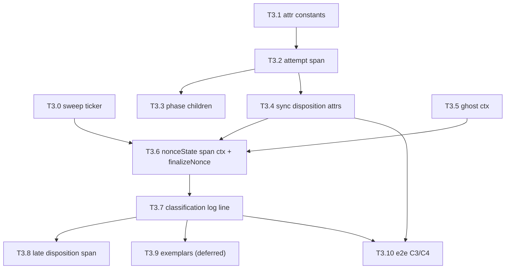

# T3 — disposition on the trace: step-by-step implementation plan

**Status:** in progress — T3.0–T3.7 ✅; next is T3.8.
**Design:** [observability-trace-correlation-plan.md](./observability-trace-correlation-plan.md) §5 (T3).
This document is *plan only*: what to change, in what order, and how each step is proven. It does
not restate the design rationale — read §5.1–§5.9 of the parent document first.

**Scope boundary.** T3 covers: the classification sweep fix (T3.0), gateway attempt spans (tier 1),
the classification log line (tier 2), the late disposition span (tier 3), and the e2e assertions
C3/C4. Prompt capture is T4, dapi/mlnode is T5, dashboards are T6 — all out of scope here.

---

## 0. Baseline — what T3 can assume is already landed

Verified against the current tree, not the plan docs. T3 does **not** need to redo any of this.

| Prerequisite | State | Evidence |
|---|---|---|
| `trace_id`/`span_id` stamped on log lines | ✅ landed | `devshard/observability/slog.go:21` `InstallLogger`, `common/observability` `TraceHandler` |
| OTel `Init` in devshardctl | ✅ landed | `devshard/cmd/devshardctl/main.go:131-136`, `observability.GatewayServiceName = "devshardctl"` |
| Root span `gateway.request` | ✅ landed | `observability.StartGatewayRequest` (`devshard/observability/gateway.go:21`), bound at `cmd/devshardctl/logging.go:17-24`, called at `gateway.go:1408`, `gateway.go:1499`, `proxy.go:202` |
| Span-bearing ctx reaches the redundancy path | ✅ landed | `proxy.go:390` `RunInference(context.WithoutCancel(r.Context()), …)`; `settleCtx` at `redundancy.go:1705` |
| `tempo-alloy` profile + harness | ✅ landed | `Makefile:112-129`, `harness/trace_backend.go:19` `WaitTraceSpan`, `harness/trace_correlation.go:20` `RequireLogsForTrace` |
| citest entry point | ✅ landed | `make -C devshard/testenv citest-observability` (`Makefile:107-109`) |

And what T3 must build from zero:

| Gap | Evidence |
|---|---|
| No spans anywhere in the redundancy/streaming path | zero `otel`/`trace.` references in `redundancy.go` |
| No OTel attribute-name constants | ✅ landed in T3.1 — `devshard/observability/attrs.go` |
| `refreshDerived` has exactly one caller | ✅ landed in T3.0 — also called from `Tracker.Sweep()` |
| No `finalizeNonce` choke point | two delete sites: `tracker.go:562-584` (reclassify terminal) and `tracker.go:535-541` (`releaseCountedLive`) |
| `nonceState` carries no span context | `tracker.go:43-65` |
| Ghost probe runs on `context.Background()` | `redundancy.go:4206`; picker `logCtx` is `Background()` at `session_picker.go:208` |
| Accounting record path takes no `ctx` | `Recorder.Ghost/RealSend/Usage/TimeoutResult`, `recorder.go:169,190,205,221` |

---

## 1. Step index

Status key: ⬜ not started · 🟡 in progress · ✅ done · ⏸ deferred

| ID | Step | Tier | Independently shippable? | Status |
|----|------|------|--------------------------|--------|
| **T3.0** | Classification sweep ticker, off the persistence path | — | ✅ yes (pure correctness fix) | ✅ |
| **T3.1** | Attribute-name constants + Prometheus↔span value contract test (C4) | — | ✅ yes | ✅ |
| **T3.2** | `devshard.gateway.attempt` span skeleton + split/escalation reason | 1 | ✅ yes | ✅ |
| **T3.3** | Phase children `dispatch`/`prefill`/`stream` + stall events | 1 | ✅ yes | ✅ |
| **T3.4** | Synchronous disposition attributes on the attempt span | 1 | ✅ yes | ✅ |
| **T3.5** | Ghost probe inherits the originating request context | 1 | ✅ yes | ✅ |
| **T3.6** | Span context on `nonceState` + `finalizeNonce` choke point + emission queue | 2 | ✅ yes (sink is a no-op until T3.7) | ✅ |
| **T3.7** | Classification log line from the gateway sink | 2 | ✅ yes | ✅ |
| **T3.8** | Late `devshard.nonce.disposition` span, linked root | 3 | ✅ yes | ⬜ |
| **T3.9** | Prometheus exemplars on the disposition series | 2-bonus | ⏸ deferred by D2 | ⏸ |
| **T3.10** | Harness helpers + e2e assertions C3/C4 | — | needs T3.4 + T3.7 | ⬜ |



---

## 2. Decisions — all confirmed (2026-08-06)

D1–D6 are settled at their recommended defaults. The steps in §3 already assume these answers; the
table below is the record, not an open question list.

| ID | Question | Decision ✅ | Enforced by |
|----|----------|-------------|-------------|
| **D1** | `reclassify` runs under `Tracker.mu` write lock (`tracker.go:372-381` `withWrite`). Emitting a log line or span there would do I/O under the lock. | **Amended 2026-08-06 (see §6).** Non-blocking send onto a bounded queue drained by the tracker's own goroutine. The original "drain after unlock in `withWrite`/`snapshot`" still ran the sink on the caller's goroutine, and the hottest caller is `RecordDiff` inside the sequencer's `Session.mu`. | T3.6 · `TestDispositionEventEmittedOutsideLock`, `TestDispositionSinkNeverBlocksTheRecorder`, `TestDispositionQueueDropsInsteadOfBlocking` (`-race`) |
| **D2** | `devshard_accounting_disposition` is a **Gauge** (`accounting/metrics.go:181-183`, `prometheus.GaugeValue`). Prometheus/OpenMetrics only carries exemplars on counters and histogram buckets, so `NewMetricWithExemplars` on this series would be dropped at exposition. | **Defer T3.9.** The "click the spike → open the trace" path is served by the Grafana TraceQL data link in T6, which needs no Go change. Revisit only if a monotonic `devshard_accounting_disposition_total` twin is added. | T3.9 marked ⏸; no code |
| **D3** | Ghost probes need the originating ctx (`session_picker.go:169` `ghostDispatcher`, dispatch at `476-478`, `pickerRequest.ctx` at `146`). Change the callback signature, or carry ctx on `PreparedInference`? | Change the callback signature to take `ctx` — 1 type, 1 dispatch site, 1 implementation (`redundancy.go:628`, `4189`). | T3.5 · `TestGhostProbeSpanSharesTraceWithRequest` |
| **D4** | `Recorder.Ghost/RealSend/Usage/TimeoutResult` take no ctx. Add `ctx` as a first parameter, or add `*Ctx` variants? | Add `ctx` as the **first parameter**; no `*Ctx` variants. 4 production call sites (`redundancy.go:2886, 2919, 2975, 4189` regions) plus `cmd/devshardctl/accounting_test.go`. | T3.6 · `TestDispositionEventCarriesTraceRef` |
| **D5** | Late spans: re-parent onto the original trace, or emit a linked root span? Parent §5.8 says linked root beyond `max_trace_live` (30 s). | Single constant `dispositionReparentWindow = 10s` (Tempo's `max_trace_idle`): lag `< 10 s` → re-parented child; lag `>= 10 s` → linked root span. | T3.8 · `TestLateDispositionSpanIsLinkedRootBeyondThreshold`, `TestEarlyDispositionSpanIsReparentedChild` |
| **D6** | Sweep interval for T3.0. | `DefaultSweepInterval = 5 * time.Second`, overridable via `DEVSHARD_STATS_SWEEP_SECONDS`; `0` disables the sweep goroutine. | T3.0 · `TestTrackerSweepDisabledByZeroInterval` |

---

## 3. Steps

Every step is independently compilable, committable, and green before the next begins.
All Go commands assume the workspace cache prefix:

```bash
export GOMODCACHE="$HOME/go/pkg/mod" GOCACHE="$HOME/Library/Caches/go-build"
```

---

### T3.0 — classification sweep ticker, off the persistence path ✅

**Goal:** give time-derived classification an event to hang telemetry on, and shorten the window in
which a past-deadline nonce exists only as unpersisted live state.

**Correction to parent §5.2.** That section's side finding — "the Prometheus collector and the
`/api/v1/epochs` HTTP API also serve stale deadline-based dispositions" — is **wrong**. `Query`
takes a fresh `now` (`query.go:86`) and folds uncounted live nonces through
`live.counterKey(escrow.meta, now)` at read time (`query.go:150-158`, `225-254`); the comment at
`query.go:81-83` states the design explicitly. Reads are already fresh. T3.0 is therefore *not*
about metric or API staleness, and not primarily about tests. The three real reasons:

1. **Telemetry is event-driven, and the deadline transition is eventless by construction.**
   `finalizeNonce` (T3.6) fires only from `reclassify`, and `reclassify` runs only on a recorded
   fact. `TimeoutBuffer` (5 s, `deadlineReached` at `tracker.go:698-709`) is deliberately *added on
   top of* `RefusalTimeout`, so the last gateway fact (`TimeoutResult`) is guaranteed to land
   **before** the accounting deadline. Every `unfinished_refused` / `unfinished_execution` nonce
   therefore crosses its deadline with no event pending, and nothing re-evaluates it until the next
   `refreshDerived`. Its only caller is `snapshot()` (`store.go:210`), on the 5-minute `Flush`
   ticker. Without T3.0, tiers 2 and 3 emit the disposition log line and span up to 5 minutes late.
2. **Restart loses the unpromoted classification.** `Live` is excluded from the persisted blob
   (`store.go:25-33`). A nonce past its deadline but not yet promoted into `Counted` is gone on
   restart and reappears as `Unclassified` (`TestRestartTurnsLiveStateIntoUnclassified`). The sweep
   narrows that exposure from one snapshot interval to one sweep interval.
3. **Terminal live state is only reaped by `reclassify`.** `delete(e.Live, nonce)` happens at
   `tracker.go:569` and `581-583`; a nonce that becomes terminal purely by deadline lingers in the
   `Live` map until the next snapshot.

Test determinism (no need to shrink `DEVSHARD_STATS_SNAPSHOT_SECONDS` to force a write) is a
welcome side effect, not the justification.

**Do:** (per decision **D6**)

1. `devshard/accounting/tracker.go`
   - Add `const DefaultSweepInterval = 5 * time.Second` next to `DefaultSnapshotInterval` (line 16).
   - Add `func (t *Tracker) Sweep()` — takes `t.mu.Lock()`, computes `now := t.nowUTC()`, calls
     `escrow.refreshDerived(now)` for every escrow, updates `t.updated`. No store access.
   - Add `sweepLoop(ctx, interval)` mirroring `snapshotLoop` (92-106); start it from `OpenTracker`
     (67-90) alongside `go t.snapshotLoop(...)` at line 88. Use a second `done` channel (e.g.
     `sweepDone`) so `Close` (108-126) waits for both.
   - `interval <= 0` disables the sweep loop entirely (no goroutine).
2. `OpenTracker` signature: add a `sweep time.Duration` parameter, or accept an options struct.
   Prefer an explicit parameter — there are 2 production callers/1 test helper.
3. `devshard/cmd/devshardctl/accounting_server.go` — add `accountingSweepInterval()` next to
   `accountingSnapshotInterval()` (27-32), reading `DEVSHARD_STATS_SWEEP_SECONDS` with
   `DefaultSweepInterval` as the fallback and `0` meaning disabled.
4. `devshard/cmd/devshardctl/main.go:436-440` — pass it into `accounting.OpenTracker`.

**Non-goals:** do not change `refreshDerived` (586-590), `counterKey` (651-681), `persistable`
(689-696) or `deadlineReached` (698-709). The classification logic is correct; only its cadence is
wrong.

**Performance — the one real risk, and the guard.** `Sweep` takes the **exclusive** `t.mu` write
lock and `refreshDerived` is O(live nonces), so a sweep every 5 s is a periodic stall on every
writer. The writer that matters is the per-diff observer, which runs inside the sequencer's critical
section — `query.go:16-19` already calls this out as the reason queries copy and aggregate outside
the lock.

`Live` is **not** bounded by concurrency: `releaseCountedLive` only runs at settlement
(`tracker.go:535-541`), so counted-but-not-terminal nonces (a non-applied timeout) plus
pending-classification entries accumulate across an escrow's lifetime. Worst case is O(nonces per
epoch), not O(in-flight).

Sequence the work so this is measured, not assumed:

1. Land the straightforward full-scan sweep first.
2. Add `BenchmarkTrackerSweep` over 10², 10³, 10⁴ live nonces across several escrows.
3. **Only if** the benchmark shows a p99 hold above ~1 ms, add the short-circuit: keep a per-escrow
   `nextDeadline time.Time`, maintained in `RecordRealSend` (314-327) and `RecordReceipt` (267-276),
   and skip any escrow whose `nextDeadline` is in the future. `deadlineReached` is monotone in
   time, so this is exact, not an approximation, and it turns the steady-state sweep into
   O(#escrows) with no per-nonce work.

Cheap guards to include regardless: skip escrows with an empty `Live` map, and skip settled escrows.

**Tests** — `devshard/accounting/accounting_test.go`:

- `TestTrackerSweepClassifiesDeadlineWithoutFlush` — register escrow, `RecordRealSend`, advance the
  injected clock (`t.now`) past `RefusalTimeout + TimeoutBuffer`, call `Sweep()`, assert the
  disposition counter shows `unfinished_refused` **without** any `Flush`.
- `TestTrackerSweepIsIdempotent` — two consecutive `Sweep()` calls do not double-count.
- `TestTrackerSweepDisabledByZeroInterval` — no sweep goroutine, existing snapshot behaviour intact.
- `TestTrackerSweepMatchesQueryClassification` — after a sweep, the promoted counters equal what
  `Query` was already reporting for the same instant. This pins the invariant that T3.0 changes
  *when* state is promoted, never *what* it classifies to.
- `BenchmarkTrackerSweep` — see the performance guard above.
- Existing `TestDeadlineDerivedDisposition`, `TestPreDeadlineSkipRemainsInFlight` and
  `TestQueryDoesNotMutateLedger` must stay green.

```bash
cd devshard && go test ./accounting/... -count=1 -race
cd devshard && go test ./accounting/ -run '^$' -bench BenchmarkTrackerSweep -benchmem
cd devshard && go test ./cmd/devshardctl/ -run 'TestGatewayAccounting|TestAccounting' -count=1
```

**Exit:** a nonce that crosses its deadline with no further events is promoted into `Counters` and
reaped from `Live` within one sweep interval, with no SQLite write; `Query` output is unchanged at
every instant; `BenchmarkTrackerSweep` recorded in the progress log.

---

### T3.1 — attribute-name constants and the C4 contract test ✅

**Goal:** one authoritative Go definition of every span-attribute key from parent §2, and a test
that locks span attribute **values** to Prometheus label values byte-for-byte.

**Do:**

1. New file `devshard/observability/attrs.go` — exported `attribute.Key` constants for:
   `escrow.id`, `devshard.nonce`, `devshard.slot_id`, `participant.key`, `model`,
   `devshard.disposition`, `devshard.dispatch_phase`, `devshard.timeout_evaluation_phase`,
   `devshard.quarantine_mode`, `devshard.no_send_reason`, `devshard.failure_origin`,
   `devshard.timeout_kind`, `devshard.timeout_outcome`, `devshard.timeout_reason`,
   `devshard.detail_reason`, `devshard.protocol_kind`, `devshard.origin_trace_id`,
   `devshard.stream`, `devshard.output_chunks`, `devshard.content_chunks`,
   `devshard.output_bytes`, `devshard.stall_count`,
   `devshard.attempt.role`, `devshard.attempt.start_reason`, `devshard.attempt.index`,
   `devshard.attempt.trigger_nonce`, `devshard.host.id`.
   Deliberately **not** span attributes: `escalation_stage` (near-duplicate of `start_reason`) and
   `delay_ms` (derivable from sibling span start times) — both stay log-only. See T3.2.
   Reuse existing key strings where `service.go:111-259` already sets them — do not introduce a
   second spelling.
2. New span-name constants in `devshard/observability/gateway.go` next to `gatewayRequestSpan` (15):
   `gateway.attempt`, `attempt.dispatch`, `attempt.prefill`, `attempt.stream`,
   `devshard.nonce.disposition`.

**Tests** — new `devshard/observability/attrs_contract_test.go`, package `observability_test` (an
external test package, so it may import `devshard/accounting` without any import cycle;
`devshard/accounting` imports only `devshard/types`):

- **C4** `TestSpanAttrValuesMatchPrometheusLabelValues` — enumerate every constant of
  `accounting.Disposition`, `Phase`, `QuarantineMode`, `NoSendReason`, `FailureOrigin`,
  `TimeoutKind`, `TimeoutOutcome`, `TimeoutReason`, `ProtocolKind` (`accounting/types.go:13-107`)
  and assert the attribute-building helper produces the identical string.
- `TestAttrKeysAreUnique` — no duplicate key strings.

```bash
cd devshard && go test ./observability/... -count=1
```

**Exit:** C4 green; adding a new enum value to `accounting/types.go` without extending the attribute
mapping fails the build or the test.

---

### T3.2 — `devshard.gateway.attempt` span skeleton ✅

**Goal:** one span per nonce, opened where the attempt is prepared and closed at the race outcome,
carrying **why this attempt exists**. No phase children, no disposition yet.

**How attempts are actually created — read this before implementing.** Attempts are *not* fanned out
in parallel up front. `RunInference` prepares exactly one `primary` (`redundancy.go:1720-1733`,
`role="primary"`, `startReason="primary"`), and secondaries are added **over time** by
`startAdditionalInflight` (1990-2038). Some are immediate (`Decision.ImmediateAttempts`, delay 0),
most fire on a timer or on failure. Each new attempt goes to a *different* participant, because
`triedParticipants` is threaded into `prepareInflight` as the exclude set (1731, 2027). So the span
tree shows **staggered** siblings, and their start offsets are themselves diagnostic.

The split reason is already tracked and already exported to Prometheus — it is simply not on a span:

| Existing state | Location |
|---|---|
| `inflight.role`, `inflight.startReason` | `redundancy.go:862-863`, set at `1732-1733`, `2028-2029` |
| `gatewayAttemptRole()`, `gatewayAttemptStartReason()` | `redundancy.go:2829-2834` |
| Prometheus `Reason`/`Role` dimensions | `RecordGatewaySlotDecision` + `RecordGatewayAttemptStarted`, `redundancy.go:2899-2913`; `RecordSpeculativeAttemptStart`, `2031` |

Reason vocabulary (use verbatim — Prometheus already carries these values):
`primary`, `primary_unresponsive` (650), `primary_suspicious` (1738), `secondary_faster` (826),
`receipt_timeout` (830, 2678), `pairwise_insufficient_data` (658), `pairwise_budgeted_speedup`
(2033), `suspicious_host` (2645), `poc_probe` (2653), `attempt_failed` (2667),
`first_token_timeout` (2691), `phase_transition_aborted` (2455),
`response_timeout_reduced_max_tokens` (2495).

**Do:**

1. New file `devshard/observability/gateway_attempt.go`:
   ```go
   func StartGatewayAttempt(ctx context.Context, a AttemptIdentity) (context.Context, trace.Span)
   ```
   `AttemptIdentity` carries nonce, escrow id, slot id, participant key, host id, model, quarantine
   mode, **role, start reason, attempt index**, and for secondaries the **trigger nonce**,
   **escalation stage** and **delay_ms**. `trace.SpanKindInternal`.
2. `devshard/cmd/devshardctl/redundancy.go`
   - Add `span trace.Span` and `spanCtx context.Context` fields to `inflight` (843-943).
   - Open in `prepareInflight` (1822) — it already receives `ctx` and already calls
     `recordAccountingAttempt(ctx, inf)` at 1868, so the nonce is known. `role`/`startReason` are
     assigned by the caller just after, so set those attributes at the assignment sites (1732-1733,
     2028-2029) rather than inside `prepareInflight`.
   - Close in `finishRaceOutcome` (3706), in the same per-attempt loop that already calls
     `finishActiveStall` at 3739 — one `span.End()` per attempt, exactly once.
   - Guard every span call so a nil span (OTel disabled) is a no-op.
3. **Fix the escalation log line** at 2001. Today it fires *before* the new attempt is prepared, so
   it is attributed to the **trigger's** nonce and carries only `host` and `delay_ms` — you cannot
   tell from it which nonce joined or why. Add, after preparation: `reason`, `new_nonce`,
   `new_host`, `attempt_index`, `role`. Keep the existing stage name and fields so current greps and
   `WaitLokiSubstring` assertions keep matching. These lines already carry `trace_id` —
   `logging.Stage` routes through `slog.Log(ctx, …)` (`devshard/logging/logger.go:62-84`) — so this
   is a field addition only. **The log line is the primary record of the split; the span attributes
   in step 2 exist to make it filterable and the trace view self-describing, not to replace it.**
4. **Span events only where no span exists to carry the information** — the paths where a split was
   considered and did *not* happen, so there is no attempt span: `picker_exhausted` (2014),
   `secondary_prepare_failed` (2024), `escalation_skipped` (2335). Emit these as events on the
   parent `gateway.request` span. Do **not** add an `attempt.escalated` event for the successful
   case: the new attempt's own span already carries `start_reason` and `trigger_nonce`, and its
   start timestamp already shows when the split happened, so a parent event would restate its own
   child. See the sizing note below.
5. Ghost attempts that never reach `finishRaceOutcome` must still end their span — cover in T3.5.

**Why the reason belongs on the span and not only in the log.** The log line is authoritative and
carries strictly more detail; the two span attributes are not a copy of it, they buy three specific
things the log cannot:

| | Log line only | + `role` / `start_reason` on the span |
|---|---|---|
| Aggregate "how often do we escalate on receipt_timeout" | already answered by Prometheus `RecordGatewayAttemptStarted{Reason}` (2907-2913) | unchanged |
| "Find traces where a secondary started on receipt_timeout" | Loki query → extract trace ids → open each | one TraceQL filter |
| Reading a 3-attempt trace | pivot to Loki once per sibling to learn why each exists | visible on the span in the trace view |
| Filterability at all in TraceQL | impossible | parent §5.8's rule: *put every attribute you filter on directly on the span representing the thing*, because TraceQL search evaluates one block at a time and cross-span joins are unreliable |

Cost is not the deciding factor either way — `start_reason` is a 13-value bounded enum and `role` is
binary, so both are negligible in Tempo. The deciding factor is that "why does this attempt exist"
is a property *of the attempt*, which is exactly what its span represents.

**Keep the attribute set minimal.** Anything derivable from the span tree stays out and lives only
in the log line: `escalation_stage` is a near-duplicate of `start_reason`
(`receipt_timeout_wait_elapsed` ↔ `receipt_timeout`), and `delay_ms` is the gap between sibling span
start times. Ship `role`, `start_reason`, `attempt.index`, `trigger_nonce`, `host.id` and nothing
more.

**Tests** — new `devshard/cmd/devshardctl/attempt_span_test.go`, using
`go.opentelemetry.io/otel/sdk/trace/tracetest.SpanRecorder`:

- `TestAttemptSpanOpensAndClosesOncePerNonce` — N attempts produce exactly N `gateway.attempt`
  spans, each ended.
- `TestAttemptSpanIsChildOfGatewayRequest` — all attempts share the request's trace id; each has a
  distinct span id; parent span id equals the `gateway.request` span.
- `TestAttemptSpanCarriesIdentityAttributes` — nonce/escrow/slot/participant/host/model.
- `TestAttemptSpanCarriesRoleAndStartReason` — primary is `role=primary, start_reason=primary`; the
  escalated secondary carries the trigger's reason.
- `TestEscalationLogLineIdentifiesNewAttempt` — the line at 2001 names the new nonce, host and
  reason, not just the trigger's; drive at least the receipt-timeout and `attempt_failed` paths
  (`proxy_test.go:2199-2300` already builds the receipt-timeout escalation fixture).
- `TestStaggeredAttemptsHaveDistinctStartTimes` — the secondary's span starts after the primary's,
  by roughly the escalation delay. This is the property that makes the trace readable, and it is
  why no `delay_ms` attribute is needed.
- `TestPickerExhaustedEmitsEvent` — the no-split path is visible on the parent span, since no
  attempt span exists to carry it.
- `TestSuccessfulSplitEmitsNoParentEvent` — guards the minimal-attribute rule against drift.
- `TestAttemptSpanNoopWhenTracingDisabled` — no panic, no allocation of a real span.

```bash
cd devshard && go test ./cmd/devshardctl/ -run 'TestAttemptSpan|TestEscalation|TestStaggered|TestPickerExhausted' -count=1
cd devshard && go test ./cmd/devshardctl/... -count=1
```

**Exit:** an overscheduled chat renders one `gateway.attempt` child per nonce under one
`gateway.request`, each naming its host, role and start reason;
`{ span.devshard.attempt.start_reason = "receipt_timeout" }` returns those traces; the escalation
log line identifies the joining attempt; and a request that wanted to split but could not carries
the reason as an event on the parent span.

---

### T3.3 — phase children and stall events ✅

**Goal:** the span shape from parent §5.8 — `attempt.dispatch` / `attempt.prefill` /
`attempt.stream` plus stall events — projected from measurements the gateway already takes. No new
measurement.

**Do:** open/close a span at each existing log point. All of these already have a usable `ctx`.

| Existing log stage | File:line | Span action |
|---|---|---|
| `started` | `redundancy.go:1917` | start `attempt.dispatch` |
| `send_completed` | `redundancy.go:1935` | annotate `attempt.dispatch` |
| `receipt_received` | `redundancy.go:1887` (receipt handler closure) | end `attempt.dispatch`, start `attempt.prefill` |
| `first_token` | `redundancy.go:1595` (`raceWriter.Write`, `rw.group.logCtx`) | end `attempt.prefill`, start `attempt.stream` |
| `attempt_inter_chunk_stall` / `winner_stalled_after_content` | `redundancy.go:2540-2553` | span event `stream.stall.detected` |
| `finishActiveStall` | `redundancy.go:1026-1044`, called at `1537`, `3739` | span event `stream.stall.recovered` |
| `race_completed` | `redundancy.go:3776` | end `attempt.stream`, then the attempt span |

Timestamps come from the existing `inflight` atomics — `sendTime` (849), `receiptTimeNano` (866),
`firstTokenNano` (870) — via `trace.WithTimestamp`, so phase boundaries match the histograms
exactly. End-of-stream attributes on `attempt.stream` from `outputChunks` (872), `contentChunks`
(873), `outputBytes` (874) and `len(stalls)` (878).

**Explicitly not doing:** the 60 s heartbeat (`monitorInflight`, 2710-2752) stays logs-only, per
parent §5.8. No span, no span event.

**Tests** — `attempt_span_test.go`:

- `TestAttemptPhaseSpansFormContiguousChain` — dispatch end == prefill start == first-token time;
  no gaps, no overlaps.
- `TestAttemptStreamCarriesChunkCounters` — output/content/bytes/stall_count attributes match the
  `inflight` counters.
- `TestStallProducesDetectedAndRecoveredEvents` — one pair per `attemptStall` (1004-1011).
- `TestHeartbeatEmitsNoSpanEvents` — regression guard for the logs-only rule.
- `TestAttemptWithoutFirstTokenSkipsStreamSpan` — a refused attempt yields dispatch (+prefill) only,
  no dangling unended span.

```bash
cd devshard && go test ./cmd/devshardctl/ -run 'TestAttempt|TestStall|TestHeartbeat' -count=1
```

**Exit:** a streaming chat renders the 4-level tree from parent §5.9 in Tempo; every span is ended
on every path including client cancel and stall abort.

---

### T3.4 — synchronous disposition attributes on the attempt span ✅

**Goal:** everything the gateway knows *before the response is flushed* lands on the attempt span:
ghost / no-send reason / quarantine / race outcome / timeout action / failure origin, plus a
provisional `devshard.disposition` for `ghost`, `finished_used`, `finished_unused`.

**Do:**

1. Thread `ctx` into the three recorder-adjacent helpers so they can reach the attempt span
   (they take `*inflight`, so the span can also be read from `inf.span` — prefer that, it avoids
   signature churn):
   - `recordGatewayAttemptStarted` (`redundancy.go:2886`) → set dispatch-phase and quarantine attrs.
   - `recordGatewayAttemptTerminal` (`redundancy.go:2919`) → set `devshard.disposition` =
     `finished_used` / `finished_unused` from the winner comparison, plus failure origin.
   - `recordGatewayTimeoutAction` (`redundancy.go:2975`) → set `devshard.timeout_kind`,
     `devshard.timeout_outcome`, `devshard.timeout_reason`, `devshard.detail_reason`.
2. Ghost: set `devshard.disposition = ghost` and `devshard.no_send_reason` in `runGhostProbe`
   (`redundancy.go:4189`) — the span for a ghost is opened and closed there (see T3.5).
3. Values must come from the T3.1 mapping helper, never from an inline string literal — this is what
   keeps C4 meaningful.

**Span lifetime (added after review).** Each fact stamps only the dimensions it recorded, and the
attempt span has to stay open long enough to receive all of them:

- The dispatch phase is read **once**, at `RealSend`, and returned by the recorder. Terminal and
  timeout facts never re-read it — a phase flip mid-request would otherwise put a different
  `dispatch_phase` on the span than on the Prometheus label for the same nonce.
- `finishRaceOutcome` closes the phase children at the race outcome but ends the attempt span only
  after `recordGatewayAttemptTerminal`, and for failed attempts only after timeout evaluation has
  run (both the synchronous loop and the background one). `endAttemptSpan` replays the
  race-outcome timestamp, so the span's *duration* is still the race duration even though it is
  exported later.
- A timeout action is mirrored onto the span only when `accounting.TimeoutActionRecorded` says it
  became a counter fact, so the span can never claim a dimension Prometheus does not have.

**Tests** — `attempt_disposition_test.go`, `attempt_span_test.go`:

- `TestAttemptSpanDispositionForWinnerAndLoser`
- `TestAttemptSpanGhostDispositionAndNoSendReason`
- `TestAttemptSpanTimeoutAttributes` — one case per `TimeoutOutcome` value (`types.go:76-84`).
- `TestAttemptSpanAttributesMatchAccountingFacts` — for the same simulated attempt, the span
  attribute set equals the `CounterKey` the tracker derives. This is the unit-level twin of C4.
- `TestRunInferenceStampsDispositionOnEveryAttemptSpan` and
  `TestRunInferenceStampsTimeoutOutcomeOnAttemptSpan` — the same claims through a real
  `RunInference`. The unit tests above call record-then-end in the order the helpers were designed
  for, so they cannot see an ordering bug in `finishRaceOutcome`; these two can, and did.
- `TestAttemptSpanEndIsIdempotent` — the race loop and the timeout loop can both reach a failed
  attempt.

```bash
cd devshard && go test ./cmd/devshardctl/ -count=1
```

**Exit:** `{ span.devshard.disposition = "ghost" }` and `{ span.devshard.no_send_reason = "…" }`
return traces in Tempo for the ghost e2e scenarios, without any late-classification machinery.

---

### T3.5 — ghost probe inherits the originating request context ✅

**Goal:** a ghost burn is attributable to the user request whose overscheduling caused it. Today it
is deliberately detached, so ghost traces would be orphans.

**Do:** (per decision **D3**)

1. `devshard/cmd/devshardctl/session_picker.go`
   - `ghostDispatcher` type (169): add `ctx context.Context` as the first parameter.
   - Dispatch site (476-478): pass the waiting request's context rather than `p.logCtx`. A burn only
     happens on an iteration that did *not* choose a request, so the causally responsible request is
     the oldest waiter — the one whose dispatch the burn is delaying. Fall back to `p.logCtx` when
     the queue is empty.
   - Leave `p.logCtx = context.Background()` (208) as the fallback for picker-internal logging.
2. `devshard/cmd/devshardctl/redundancy.go`
   - `runGhostProbe` (4189): accept `ctx`, replace
     `ensureRequestLogContext(context.Background())` (4206) with
     `ensureRequestLogContext(ctx)` so the existing request id is reused rather than a fresh one
     minted.
   - Open and end a `gateway.attempt` span for the ghost inside `runGhostProbe` (ghosts never reach
     `finishRaceOutcome`).
   - Update the wiring at `newSessionPicker(..., e.runGhostProbe, ...)` (628).

**Tests** — `devshard/cmd/devshardctl/`:

- `TestGhostProbeInheritsRequestID` — the ghost log line carries the caller's `request_id`, not a
  new one.
- `TestGhostProbeSpanSharesTraceWithRequest` — ghost `gateway.attempt` span has the same trace id as
  `gateway.request`.
- `TestGhostProbeFallsBackWhenNoRequestContext` — background dispatch still works, span is a root.
- `TestPicker_GhostBurnInheritsWaitingRequestTrace` — the picker-side half: the burn carries the
  queued submitter's trace, not a detached one.

```bash
cd devshard && go test ./cmd/devshardctl/ -run 'TestGhost|TestSessionPicker' -count=1
```

**Exit:** in the ghost e2e, the ghost's log lines and the user request's log lines share one
`trace_id`.

---

### T3.6 — span context on `nonceState`, `finalizeNonce`, and the emission queue ✅

**Goal:** the tracker remembers *which trace* a nonce belonged to, and emits exactly one terminal
event per nonce from exactly one choke point — without doing I/O under its write lock.

**Do:**

1. `devshard/accounting/tracker.go` — extend `nonceState` (43-65) with:
   `TraceID [16]byte`, `SpanID [8]byte`, `Sampled bool`, `Emitted bool`. In-memory only; `Live` is
   already excluded from the persisted blob (`store.go:25-33`), so nothing changes in storage.
2. Carry the span context in, per decision **D4**: add `ctx context.Context` as the first parameter
   of `Recorder.Ghost` (169), `RealSend` (190), `Usage` (205), `TimeoutResult` (221). The recorder
   extracts `trace.SpanContextFromContext(ctx)` and passes a small `TraceRef` value into the
   tracker's `Record*` methods. **`devshard/accounting` must not import `go.opentelemetry.io/otel`
   beyond `otel/trace`** — a plain `TraceRef{TraceID, SpanID, Sampled}` struct keeps it dependency-free
   if preferred.
   Populate on first write only; never overwrite a non-zero trace id.
3. Introduce `func (e *escrowState) finalizeNonce(nonce uint64, s *nonceState, key CounterKey)` and
   call it from both delete sites:
   - the terminal branch of `reclassify` (`tracker.go:562-584`, delete at ~581-583)
   - `releaseCountedLive` (`tracker.go:535-541`), which today deletes counted-but-not-terminal
     entries **without** going through `reclassify`
   Guard with `s.Emitted` so the mutable-bucket churn (parent §5.1 step 4) cannot double-emit.
4. Emission queue, per decision **D1**: `finalizeNonce` appends a `DispositionEvent` to a slice on
   the `Tracker`. `withWrite` (372-381), `withEscrow` (399-411) and `snapshot` (`store.go:205-233`)
   drain the slice **after** releasing the lock and hand each event to a registered sink:
   ```go
   type DispositionEvent struct {
       EscrowID   string
       Nonce      uint64
       Key        CounterKey
       Trace      TraceRef
       SendAt     time.Time
       ObservedAt time.Time
   }
   type DispositionSink interface{ OnDisposition(DispositionEvent) }
   func (t *Tracker) SetDispositionSink(s DispositionSink)
   ```
   No sink registered → events are dropped cheaply. That is the state until T3.7.
5. `protocol_only` nonces (`recordDiff`, 543-560) have no live state and no trace: emit the event
   with a zero `TraceRef`. Restart-orphaned nonces do the same — the empty trace id is the signal,
   and it is measurable.

**Tests** — `devshard/accounting/accounting_test.go`:

- `TestFinalizeNonceEmitsOncePerNonce` — a nonce reclassified `unfinished_refused` →
  `finished_used` emits exactly one event, carrying the final key.
- `TestFinalizeNonceEmitsOnSettlementRelease` — the `releaseCountedLive` path emits (this is the bug
  the choke point exists to prevent).
- `TestDispositionEventCarriesTraceRef` — trace/span ids survive from the first `RealSend`.
- `TestDispositionEventEmittedOutsideLock` — the sink may call back into the tracker (e.g.
  `ErrorCounts`) without deadlocking. Run with `-race`.
- `TestProtocolOnlyEmitsWithEmptyTrace`.
- `TestNoSinkIsSafe` — nil sink, no allocation growth.
- All 47 existing tests in `accounting_test.go` stay green.

```bash
cd devshard && go test ./accounting/... -count=1 -race
cd devshard && go test ./cmd/devshardctl/ -count=1
```

**Exit:** for every nonce that leaves `Live`, exactly one `DispositionEvent` is produced, on every
path, with no lock held during dispatch.

---

### T3.7 — the classification log line ✅

**Goal:** the backbone of late classification. One structured log line per terminal nonce, carrying
`trace_id`/`span_id` of the original request plus the full dimension set — queryable in both
directions with no Tempo dependency.

**Do:**

1. `devshard/cmd/devshardctl/accounting.go` — implement a `DispositionSink` that:
   - rebuilds a context from the stored `TraceRef` via
     `trace.ContextWithRemoteSpanContext(context.Background(), sc)` so the T1 `TraceHandler` stamps
     `trace_id`/`span_id` automatically;
   - logs via the ctx-aware path (`logging.InfoCtx` / `logInferenceStage`) at stage
     `nonce_disposition`;
   - fields: `escrow`, `nonce`, `disposition`, `dispatch_phase`, `timeout_evaluation_phase`,
     `quarantine_mode`, `no_send_reason`, `failure_origin`, `timeout_kind`, `timeout_outcome`,
     `timeout_reason`, `detail_reason`, `participant`, `model`, `lag_ms` (ObservedAt − SendAt).
   - Field **values** come from the T3.1 mapping helper, so LogQL and TraceQL filters use identical
     strings.
2. Register the sink where the recorder is constructed (`cmd/devshardctl/main.go:436-453`).
3. Emit `trace_id=""` explicitly for orphans rather than omitting the field, so
   `| json | trace_id=""` measures the orphan rate.

**Tests:**

- `devshard/cmd/devshardctl/accounting_test.go`
  - `TestDispositionLogLineCarriesTraceID` — capture `slog` output, assert `trace_id` matches the
    span that was active on `RealSend`.
  - `TestDispositionLogLineFieldsMatchCounterKey` — every `CounterKey` field is present with the
    canonical value.
  - `TestDispositionLogLineOrphanHasEmptyTraceID`.
- `devshard/observability/promtail_labels_lint_test.go` and
  `devshard/testenv/observability/promtail_labels_lint_test.go` — extend to assert
  `nonce`/`escrow_id`/`trace_id` never appear in a `labels` stage of `promtail-config.yaml` or
  `config.alloy` (parent §11 cardinality rule).

```bash
cd devshard && go test ./cmd/devshardctl/ -run 'TestDisposition' -count=1
cd devshard/testenv && go test ./observability/... -count=1
```

**Exit:** both LogQL queries from parent §5.5 return results against a live testenv stack:

```logql
{compose_service="devshardctl"} | json | disposition = "unfinished_refused"
{compose_service="devshardctl"} | json | trace_id = "<id>"
```

---

### T3.8 — the late `devshard.nonce.disposition` span ⬜

**Goal:** make `{ span.devshard.disposition = "…" }` a first-class TraceQL query and put the
outcome in a timeline. Explicitly *not* load-bearing — tiers 1–2 already deliver the workflow.

**Do:**

1. Extend the T3.7 sink to also emit a span, per decision **D5**:
   - lag `< 10 s` (under Tempo's `max_trace_idle`) → child of the stored attempt `SpanContext` via
     `trace.ContextWithRemoteSpanContext`;
   - lag `>= 10 s` → **root span in its own trace** with `trace.WithLinks(trace.Link{SpanContext:
     stored})` and `devshard.origin_trace_id` as a plain attribute.
2. Preserve the original sampling decision (`TraceFlags` from `TraceRef.Sampled`). Never hardcode
   `FlagsSampled` — that would mint an orphan single-span trace for every unsampled request.
3. Full attribute set on the span itself (never rely on a cross-span spanset join, parent §5.8):
   the same field list as T3.7 plus `devshard.origin_trace_id`.
4. Skip the span entirely when `TraceRef` is zero and the disposition is `protocol_only`, or emit a
   root span with no link — the absence of a parent is the correct signal.

**Tests** — `devshard/cmd/devshardctl/`, with `tracetest.SpanRecorder`:

- `TestLateDispositionSpanIsLinkedRootBeyondThreshold`
- `TestEarlyDispositionSpanIsReparentedChild`
- `TestDispositionSpanPreservesSamplingDecision` — unsampled input produces no exported span.
- `TestDispositionSpanCarriesFullAttributeSet` — asserts self-sufficiency for TraceQL search.
- `TestProtocolOnlyDispositionSpanHasNoLink`

```bash
cd devshard && go test ./cmd/devshardctl/ -run 'TestDisposition|TestLate' -count=1
```

**Exit:** in testenv, the refusal-timeout e2e produces a `devshard.nonce.disposition` span found by
TraceQL attribute search, and Grafana renders a navigable link back to the request trace.

---

### T3.9 — Prometheus exemplars on the disposition series ⏸ deferred

**Deferred by decision D2 (confirmed).** `devshard_accounting_disposition` is exposed as a Gauge
(`accounting/metrics.go:40-44` descriptor, `181-183` `gauge()` helper using
`prometheus.GaugeValue`), and exemplars are only carried on counters and histogram buckets. Wrapping
it with `prometheus.NewMetricWithExemplars` would compile and then be silently dropped at exposition
time.

**Revisit when** a monotonic `devshard_accounting_disposition_total` counter twin exists. Until then
the "click the spike → open the trace" path is served by the Grafana TraceQL data link in T6, which
needs no Go change.

---

### T3.10 — harness helpers and e2e assertions C3/C4 ⬜

**Goal:** the disposition→trace workflow is asserted in CI, in the existing accounting e2e
scenarios rather than in new ones.

**Do:**

1. `devshard/testenv/citest/harness/trace_backend.go` — add, alongside `WaitTraceSpan` (19):
   ```go
   func WaitTraceByAttr(t *testing.T, obs ObservabilityEndpoints, tagQuery string, timeout time.Duration) []string
   func RequireSpanAttrs(t *testing.T, obs ObservabilityEndpoints, traceID string, want map[string]string)
   ```
   `WaitTraceByAttr` dispatches on `obs.Profile.TraceBackend()` exactly as `WaitTraceSpan` does:
   Tempo → `/api/search?tags=…` (reuse `tempoSearchTraceIDs`, 175); Jaeger → `/jaeger/api/traces`
   with `tags`. `RequireSpanAttrs` reads `/api/traces/{id}` and extends `tempoTraceDetail` (241) to
   surface span attributes, which it currently discards.
2. New `devshard/testenv/citest/disposition_trace_test.go`:
   - **C3** `TestDispositionTraceGhost` — drive the ghost scenario, then
     `WaitTraceByAttr("{ span.devshard.disposition = \"ghost\" }")` returns ≥1 trace, and
     `RequireLogsForTrace` (`trace_correlation.go:20`) finds the classification log line for it.
   - `TestDispositionTraceUnfinishedRefused` — the late path; exercises T3.0 + T3.8 together and
     bounds the wait by `RefusalTimeout + TimeoutBuffer + sweep`, not by the snapshot interval.
   - **C4 (stack-level)** `TestDispositionLabelValuesMatchSpanAttrs` — scrape
     `devshard_accounting_disposition` from Prometheus, and for each label value present assert a
     span carrying the identical attribute value exists.
3. `devshard/testenv/Makefile:107-109` — extend the `citest-observability` `-run` pattern with
   `TestDispositionTrace|TestDispositionLabelValues`, or add a dedicated `citest-disposition-traces`
   target (it is auto-discovered by `list-citest-targets`, 73-77).
4. Add TraceQL assertions to the existing accounting e2e listed in parent §5 — those tests already
   force every disposition, they simply do not look at traces today.

**Tests / verification:**

```bash
make -C devshard/testenv citest-observability
OBS_PROFILE=jaeger-promtail make -C devshard/testenv citest-observability   # C7 regression
```

**Exit:** C3 and C4 green on `tempo-alloy`; `jaeger-promtail` stays green.

---

## 4. Validation matrix

| Layer | Command | Covers |
|-------|---------|--------|
| accounting unit | `cd devshard && go test ./accounting/... -count=1 -race` | T3.0, T3.6 |
| observability unit | `cd devshard && go test ./observability/... -count=1` | T3.1 (C4 contract) |
| gateway unit | `cd devshard && go test ./cmd/devshardctl/... -count=1` | T3.2–T3.8 |
| testenv lint | `cd devshard/testenv && go test ./observability/... -count=1` | T3.7 cardinality rule |
| citest (tempo-alloy) | `make -C devshard/testenv citest-observability` | T3.10 (C3, C4) |
| citest (jaeger-promtail) | `OBS_PROFILE=jaeger-promtail make -C devshard/testenv citest-observability` | C7 regression |
| CI rollup | `make -C devshard ci-testenv-unit` / `ci-testenv-integration` | all |

---

## 5. Definition of done

- [x] **T3.0** Eventless deadline transitions promoted and reaped within one sweep interval, no SQLite write, `Query` output unchanged, sweep cost benchmarked.
- [x] **T3.1** C4 contract test green; every enum in `accounting/types.go` has a mapped attribute value.
- [x] **T3.2** One `gateway.attempt` span per nonce, child of `gateway.request`, always ended, carrying role + start reason; escalation log line names the joining attempt; no-split paths (`picker_exhausted`, `escalation_skipped`, `secondary_prepare_failed`) carried as parent span events.
- [x] **T3.3** `attempt.dispatch`/`prefill`/`stream` contiguous; stall events paired; heartbeat still logs-only.
- [x] **T3.4** Ghost / winner / loser / timeout attributes on the attempt span, from the T3.1 mapping, proven through a real `RunInference` and not just through the helpers in isolation.
- [x] **T3.5** Ghost probes share `request_id` and `trace_id` with the originating request.
- [x] **T3.6** Exactly one `DispositionEvent` per nonce, from both delete sites, delivered on the tracker's own goroutine so no sink work touches the sequencer path (`-race` green).
- [x] **T3.7** Classification log line carries `trace_id` + full dimension set; both LogQL queries from parent §5.5 return results.
- [ ] **T3.8** Late disposition span emitted as a linked root; sampling decision preserved.
- [x] **T3.9** Deferred by D2; no code. Revisit gate recorded: a `devshard_accounting_disposition_total` counter twin.
- [ ] **T3.10** C3 + C4 green in citest on `tempo-alloy`; C7 green on `jaeger-promtail`.
- [ ] Parent [observability-trace-correlation-plan.md](./observability-trace-correlation-plan.md) §12 T3 row updated to ✅.

---

## 6. Progress log

| Date | Step | Notes |
|------|------|-------|
| 2026-08-06 | T3.4–T3.7 | **Review pass; seven fixes.** (1) `finishRaceOutcome` ended the attempt span *before* recording the terminal fact, so every synchronous disposition attribute was silently dropped — T3.4 was not actually working. Span now ends after terminal and after timeout evaluation, replaying the race-outcome timestamp; two `RunInference`-level tests added, both verified to fail against the old ordering. (2) A terminal-but-unclassified nonce emitted an all-zero `CounterKey`, attributing the event to slot 0; it now keeps its identity dimensions and only the disposition is empty. (3) Dispatch phase was re-read at terminal/timeout time instead of reusing the phase stamped at `RealSend`. (4) The winner/loser mapping was duplicated between `Recorder.Usage` and the gateway; now one `UsageFor`/`DispositionForUsage`, likewise `NoSendFromReason` and `TimeoutActionRecorded`. (5) D1 amended — bounded async queue instead of post-unlock drain (see §2). (6) Duplicate `ParticipantKeys()` call on the picker-exhausted path. (7) `Tracker.sink` was written under `mu` but read by the dispatcher without it; now an atomic pointer. Minimalism: dropped `AnnotateAttemptDispatch`, `Recorder.CurrentPhase`, `TraceRef.SpanIDString`, the always-true `stream` attribute, the unreachable `chosen` arm in `ghostOriginContext`, and the ad-hoc inline attribute keys on the three parent events (their counters are in the adjacent log line, same trace id). |
| 2026-08-06 | T3.0 ✅ | `Tracker.Sweep` + `sweepLoop`; `OpenTracker(..., sweep)`; `DEVSHARD_STATS_SWEEP_SECONDS` (default 5s, 0 disables). Tests: `TestTrackerSweep*`. Benchmark arm64: live=100 ~8µs, 1k ~75µs, 10k ~726µs — all under 1ms; short-circuit deferred. |
| 2026-08-06 | T3.1 ✅ | `observability/attrs.go` keys + `CounterKeyAttrs` + identity string helpers; gateway span name constants; C4 in `attrs_contract_test.go`. `service.go` SetEscrowID/SetNonce/SetSlotID/SetModel use Attr* keys. |
| 2026-08-06 | T3.2 ✅ | `observability/gateway_attempt.go` + `StartGatewayAttempt` / role attrs / parent no-split events. Wired in `attempt_spans.go` + `redundancy.go` (`inflight.span`/`spanCtx`, open in `prepareInflight`, role on primary/secondary, end in `finishRaceOutcome`). Escalation log enriched after prepare (`reason`/`new_nonce`/`new_host`/`attempt_index`/`role`). Tests in `attempt_span_test.go` + `gateway_attempt_test.go`. |
| 2026-08-06 | T3.3 ✅ | Phase children `attempt.dispatch`/`prefill`/`stream` from existing timestamps; stall `detected`/`recovered` events; heartbeat stays logs-only. Tests: contiguous phases, chunk counters, stall pair, no stream without first token, `TestHeartbeatEmitsNoSpanEvents`. |
| 2026-08-06 | T3.4 ✅ | Sync disposition attrs via `SetAttemptCounterKeyAttrs` / `CounterKeyAttrs` on started/terminal/timeout helpers; ghost sets `disposition=ghost` + `no_send_reason`. Tests: winner/loser/failure, ghost, all `TimeoutOutcome`s, C4 twin `TestAttemptSpanAttributesMatchAccountingFacts`. |
| 2026-08-06 | T3.5 ✅ | `ghostDispatcher`/`runGhostProbe` take `ctx`; picker passes `ghostOriginContext` (oldest waiter → `logCtx`); ghost opens/ends `gateway.attempt` under that ctx. Tests: request_id inherit, shared trace, background root fallback, picker-side attribution. |
| 2026-08-06 | T3.6 ✅ | `TraceRef` on `nonceState`; `finalizeNonce` from reclassify + `releaseCountedLive`; bounded queue drained by the tracker goroutine, `FlushDispositions` barrier for shutdown and tests, `DispositionDrops` counter; Recorder methods take `ctx`. Tests: once-per-nonce, settlement release, trace survival, outside-lock (`-race`), non-blocking recorder, queue drop, sink swap under load, protocol_only empty trace, nil sink. |
| 2026-08-06 | T3.7 ✅ | `dispositionLogSink` logs `nonce_disposition` with CounterKey fields + explicit empty `trace_id` for orphans; registered in `main.go`. Promtail/Alloy cardinality lint extended. |
| 2026-08-06 | — | Plan created; no step started. |
| 2026-08-06 | T3.2 | Attribute set trimmed after review. Kept `role`/`start_reason` on the attempt span (bounded enums, needed for TraceQL filtering and to make the trace view self-describing); dropped the `attempt.escalated` parent event for the *successful* case as a restatement of its own child, and dropped `escalation_stage`/`delay_ms` as derivable. Parent span events retained only for the no-split paths, where no attempt span exists. |
| 2026-08-06 | T3.2 | Scope extended to the **split reason**. Audit found attempts are staggered escalations, not an up-front parallel fan-out, and that `inflight.role`/`startReason` already exist and already feed Prometheus. T3.2 now adds those as span attributes, an `attempt.escalated` event on the parent per split, enriched escalation log fields (today the line is attributed to the trigger nonce, not the new attempt), and the non-split paths. |
| 2026-08-06 | T3.0 | Parent §5.2's "stale Prometheus/API" side finding disproved against `query.go:81-158` — reads were already fresh. T3.0's justification rewritten: it exists to give the eventless deadline transition an event for tiers 2–3, to shrink the restart-loss window, and to reap terminal live state. Performance guard + `BenchmarkTrackerSweep` added; parent doc corrected. |
| 2026-08-06 | §2 | **D1–D6 confirmed at their recommended defaults.** D1 post-unlock emission queue; D2 T3.9 deferred (gauge cannot carry exemplars); D3 `ghostDispatcher` gains `ctx`; D4 `ctx` as first param on the four `Recorder` methods; D5 10 s re-parent window, linked root beyond; D6 5 s sweep via `DEVSHARD_STATS_SWEEP_SECONDS`. Plan status → ready to implement. |
