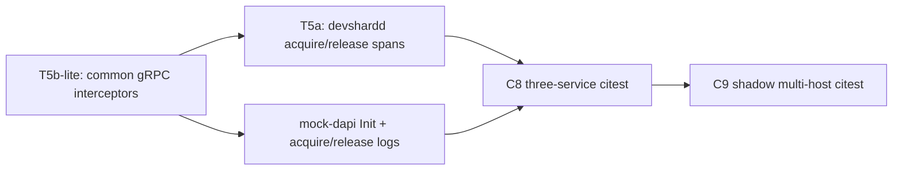

# T5 test plan — dapi / ML-node hop correlation

**Status:** landed for testenv (see §6.1). Sections 1–2 describe the state *before* the
implementation slice; they are kept as the rationale for the shape that shipped.

**Companion to:** [observability-trace-correlation-plan.md](./observability-trace-correlation-plan.md) §7 / §9,
[gateway-tracing.md](../../docs/gateway-tracing.md) (build order T5),
[observability-test-plan.md](./observability-test-plan.md).

**Goal.** Prove that a single user chat produces **one** `trace_id` and **one** `request_id`
across Loki lines (and spans) from:

| Hop | Compose service | Role |
|-----|-----------------|------|
| Gateway | `devshardctl` | accepts chat, races hosts |
| Host | `versiond-*` / `devshardd` | Acquire → ML HTTP → Release |
| Node manager | `mock-dapi` | `AcquireMLNode` / `ReleaseMLNode` (same gRPC surface as real dapi) |

Plus a second case where **shadow quarantine** makes the gateway open **multiple host attempts**
under that same client `request_id` / parent `trace_id`.

---

## 1. Baseline today (what already exists)

| ID | Coverage | Gap vs this plan |
|----|----------|------------------|
| **C1 / C2** — `TestTraceLogCorrelation` | Tempo spans `devshardctl` + `devshardd`; Loki `trace_id` on `devshardctl` + `versiond.*` | **No `mock-dapi`** in either assertion |
| **T7** — `TestMLNodePool_*` | Real pool + exclusions via mock-dapi `AcquireMLNode` | No OTel / no log correlation |
| **T4a** — `TestPayloadCapture*` | Payload capture on ML failures | Orthogonal |

`mock-dapi` already serves `common/nodemanager/gen.NodeManager` (via
`chainoracle/params.Server` + host-events wrap). It does **not** today:

- call `observability.Init` / export OTLP
- emit JSON logs with `trace_id` / `request_id` / `span_id`
- use the inbound gRPC context on `AcquireMLNode` (`_ context.Context`)
- appear in gencompose with `TESTENV_OTEL_*` (those knobs are on versiond / `devshardctl` only)

So the citests below are blocked on a thin T5 **implementation slice** for testenv’s mock-dapi
(and the shared client/server plumbing real dapi will reuse).

---

## 2. Implementation prerequisites (test-blocking)

Do these before (or in the same PR as) the citests. Prefer shared packages so mock-dapi and
production dapi stay aligned.

### 2.1 NodeManager surface — stay on `common/nodemanager`

**Decision:** keep mock-dapi on the **same** `NodeManager` gRPC API and client as real dapi
(`common/nodemanager` + `gen.NodeManager`). Do **not** invent a parallel test-only acquire path.

| Piece | Owner | Work |
|-------|--------|------|
| Client | `common/nodemanager.Client` (used by `devshardd`) | Wire **client** OTel stats/interceptor so `traceparent` rides on Acquire/Release (T5b) |
| Server (testenv) | `chainoracle/params.Server` behind mock-dapi | Use `ctx` for logging + optional server span; emit `stage=mlnode_acquire` / `mlnode_release` JSON lines |
| Server (prod) | `decentralized-api` nodemanager | Same interceptors + logging later; **not required** for these citests if mock-dapi is green |

Optional later: extract the T7 pool broker into something both params-server and real broker can share.
**Not required for T5 tests** — correlation only needs ctx-aware logs/spans on the mock server that
already implements Acquire/Release.

### 2.2 mock-dapi OTel + logging (T5b-lite)

1. **gencompose** — add to `mock-dapi` service (same as versiond/devshardctl):

   ```yaml
   DEVSHARD_OTEL_ENABLED: ${TESTENV_OTEL_ENABLED:-false}
   OTEL_ENDPOINT: ${TESTENV_OTEL_ENDPOINT:-}
   LOG_FORMAT: ${LOG_FORMAT:-json}
   OTEL_SERVICE_NAME: mock-dapi   # or service.name via resource attrs
   ```

2. **`cmd/mockdapi`** — `observability.Init` when enabled; `service.name=mock-dapi`
   (distinct from `decentralized-api` so Tempo/Loki filters stay clear).

3. **gRPC server** — register shared unary interceptor (new helper next to
   `common/observability/grpc.go` ObservedConn, or `otelgrpc`) so inbound calls continue the
   parent trace from `devshardd`.

4. **Acquire / Release logs** — structured `slog`/`logging.Stage` from `ctx`:

   ```
   stage=mlnode_acquire|mlnode_release
   trace_id, span_id, request_id   # request_id from metadata if forwarded
   node_id, lock_id, model, endpoint (acquire)
   outcome (release)
   ```

5. **Metadata** — ensure `devshardd` → mock-dapi gRPC carries W3C `traceparent` (interceptor)
   and, if available, `x-request-id` / request-id metadata so Loki can join on `request_id`
   as well as `trace_id`.

### 2.3 T5a on the host (recommended same PR)

Wrap `mlClient.Acquire` / `Release` (and ideally `StartMLNodeCall` for the HTTP hop) in child spans
under the attempt tree:

- `devshardd.mlnode.acquire`
- `devshardd.mlnode.release`
- `devshardd.mlnode.chat.completions` (existing helper, wire call sites)

Citest can then assert **spans** on mock-dapi *or* host-side acquire; logs remain the hard
requirement for mock-dapi.

### 2.4 Out of scope for this test plan

- Full production `decentralized-api` Init + broker selection span (T5c)
- Real Python mlnode OTel (mock-openai header logging is enough if needed)
- T4b / Grafana dashboards (T6)

---

## 3. Citest cases

Wire into `make citest-observability` (or a focused `citest-dapi-correlation` target) under
`devshard/testenv/citest/`.

### 3.1 **C8** — three-service log (+ span) correlation

**File:** `citest/dapi_trace_correlation_test.go`  
**Name:** `TestTraceLogCorrelationGatewayHostDapi`

**Boot:** `BootObservabilityStack` (2 hosts, `tempo-alloy`), payload capture off.

**Drive:** one non-stream (or stream) happy-path chat via `PostGatewayChatCompletionEx`; capture
`X-Request-Id`.

**Assert (in order):**

1. **Trace covers services**  
   `WaitTraceCoveringServices(t, obs, []string{"devshardctl", "devshardd", "mock-dapi"}, …)`  
   (extend helper to accept `mock-dapi` / resource `service.name`).

2. **Loki lines share `trace_id`**  
   `RequireLogsForTrace(t, obs, traceID, []string{"devshardctl", "versiond.*", "mock-dapi"}, …)`  
   Require ≥1 line per family with `stage` present.

3. **Same `request_id`**  
   For each service family, at least one Loki line for that `trace_id` has
   `request_id == gateway X-Request-Id`  
   (new helper: `RequireRequestIDOnTrace(t, obs, traceID, requestID, services)`).

4. **Span sanity**  
   - `devshardctl` / `gateway.request`  
   - `devshardd` / `devshardd.request` (or attempt span)  
   - `devshardd.mlnode.acquire` **or** mock-dapi server span for `AcquireMLNode`  
   - Prefer asserting `mlnode.node.id` attribute when T5a attrs land

5. **Negative:** no second root `trace_id` for the same `request_id` on the happy path
   (orphan Acquire would fail this).

**Dump on fail:** `devshardctl`, `versiond-0`, `mock-dapi`, `alloy`, `loki`, `tempo`.

---

### 3.2 **C9** — shadow host → multi-host attempts, one client identity

**File:** same package or `citest/shadow_multi_host_trace_test.go`  
**Name:** `TestShadowHostMultiAttemptSameTrace`

**Intent.** Shadow quarantine still sends **real** traffic (`ParticipantRequestLimiter` docs:
probe = no-send; shadow = real send, no-winner). Combined with redundancy escalation, the gateway
opens attempts on **≥2 distinct hosts** for one client request. All attempts must stay under the
**same** `request_id` / parent `trace_id`.

**Boot:** `BootObservabilityStack` (2 escrow hosts minimum). Fast redundancy timers
(`PatchAdversarialFastRedundancy`) so a second attempt starts quickly.

**Setup:**

1. Resolve participant keys for `versiond-0` / `versiond-1` (status / admin APIs already used in
   citest).
2. Force **shadow** quarantine on the first-chosen host:
   - Prefer admin / throttle patch: set `empty_stream_threshold: 1` then drive one empty-stream
     failure against that participant, **or**
   - Direct admin suspicious / quarantine API if available for testenv.
3. Confirm limiter reports `shadow_quarantined` (or `quarantine_mode=shadow`) for that key.
4. Optionally slow the first ML node (`latency_ms` / partial) so receipt timeout starts the
   secondary before the primary finishes — guarantees two live attempts.

**Drive:** one chat with unique needle in the prompt; capture `X-Request-Id`.

**Assert:**

1. Gateway Loki (or spans) shows **≥2** distinct `devshard.gateway.attempt` (or
   `nonce` / `host` fields) under the same `request_id` / `trace_id`.
2. Host labels differ (`host` suffix / `participant_key`) — not two attempts on the same slot.
3. `RequireLogsForTrace` still includes `devshardctl`, `versiond.*`, and `mock-dapi`.
4. **mock-dapi:** ≥1 `mlnode_acquire` log (often one per host attempt that reaches ML) sharing
   `trace_id`; if two acquires occur, both share that id (child spans OK).
5. Client-facing `X-Request-Id` equals `request_id` on gateway root logs for both attempts
   (attempts may add span_id; they must not mint a new request_id).

**Note:** Do **not** use probe quarantine here — that burns silent probes and may hide the
multi-host real-send shape the test is meant to prove.

---

## 4. Harness additions

| Helper | Purpose |
|--------|---------|
| `WaitTraceServices` | Trace-scoped service coverage, including `mock-dapi`. Pins the assertion to one trace, unlike `WaitTraceCoveringServices`, which any recent trace can satisfy |
| `RequireRequestIDOnTrace` | Loki: each `compose_service` has a line with both `trace_id` and `request_id` |
| `TryTraceIDsForRequest` / `RequireSingleTraceForRequest` | request_id → trace_id, with the "exactly one trace" negative case |
| `RequireStagesForTrace` | Wait for `stage=mlnode_acquire` / `mlnode_release` on a trace |
| `ForceShadowQuarantine` / `ForceOneShadowQuarantine` | Threshold + fault drive; the "one" variant clears the extra participants (see below) |
| `GatewayAttemptParticipants` / `TryWaitMultiHostAttempts` | Attempt count + host diversity from `gateway.attempt` spans |
| `PostGatewayChatSoftEx` | Chat that returns status + headers without failing, so C9 can skip a round |

Reuse `RequireLogsForTrace` from T2; do not fork a second correlation helper family.

### 4.1 Two things C9 learned the hard way

- **The stack must be HA-solo.** `BootObservabilityStack` gives two hosts that are
  *one* on-chain participant, so the picker reports "tried every host in escrow" after a single
  attempt and no fan-out is possible. C9 uses `BootObservabilityStackHASolo` (HA pair + solo).
- **Exactly one participant may stay quarantined.** The fault drive is stack-wide, so every
  participant that takes an attempt is struck; with all of them quarantined no host may win and
  the client request fails with `no non-empty response`. `ForceOneShadowQuarantine` clears the
  rest via `POST /v1/admin/participants/unquarantine`.

---

## 5. Makefile / CI

```make
# Option A — fold into existing suite
citest-observability: … -run '…|TestTraceLogCorrelation|TestShadowHostMultiAttemptSameTrace'

# Option B — focused (faster while iterating)
citest-dapi-correlation: citest-images
	$(MAKE) build-devshardd
	TESTENV_CITEST=1 go test -tags=testenvci ./citest/ \
	  -run '^(TestTraceLogCorrelationGatewayHostDapi|TestShadowHostMultiAttemptSameTrace)$$' \
	  -count=1 -v -timeout 45m
```

Prefer **Option A** once green; keep Option B during implementation.

---

## 6. Acceptance checklist

- [x] mock-dapi exports OTLP when `TESTENV_OTEL_ENABLED=true` and appears in Tempo as `mock-dapi`
- [x] `AcquireMLNode` / `ReleaseMLNode` log lines carry `trace_id` (+ `request_id` when metadata set)
- [x] `TestTraceLogCorrelationGatewayHostDapi` green under `tempo-alloy`
- [x] `TestShadowHostMultiAttemptSameTrace` green: ≥2 hosts, one `request_id`, one parent `trace_id`
- [x] Unit tests: interceptor propagates context; params `AcquireMLNode` logs under cancelled ctx still safe
- [x] Docs: mark T5 test slice in correlation plan §9 (C8/C9) and gateway-tracing build order when landed

### 6.1 What landed

| Piece | Where |
|-------|-------|
| Shared gRPC client/server trace interceptors (`traceparent` + `x-request-id`) | `common/observability/grpctrace.go` (+ `grpctrace_test.go`) |
| NodeManager client dials with those interceptors | `common/nodemanager/client.go` (+ `client_trace_test.go`) |
| ctx-aware `stage=mlnode_acquire` / `mlnode_release` logs | `devshard/chainoracle/params/server.go` (+ `mlnode_log_test.go`) |
| mock-dapi Init + JSON logs + server interceptor | `devshard/testenv/cmd/mockdapi/main.go`, `devshard/testenv/mockdapi/service.go` (+ `trace_test.go`, a Docker-free C8) |
| Host acquire/release/ML-call spans (T5a) | `devshard/cmd/devshardd/inference/engine.go`, `devshard/observability/service.go` (+ `engine_test.go`) |
| `TESTENV_OTEL_*` / `LOG_FORMAT` on mock-dapi | `devshard/testenv/cmd/gencompose/compose.go` (+ `main_test.go`) |
| Correlation + shadow-quarantine harness | `citest/harness/request_correlation.go`, `citest/harness/shadow_quarantine.go` |
| C8 / C9 citests | `citest/dapi_trace_correlation_test.go`, `citest/shadow_multi_host_trace_test.go` |

**Still open (T5c):** production `decentralized-api` node manager does not yet register the server
interceptor or emit the acquire/release stages. The client side already propagates, so adopting it
there is `observability.Init` + one `grpc.ChainUnaryInterceptor` line.

---

## 7. Suggested landing order



1. Shared client/server interceptors + mock-dapi Init/logs (**unblocks C8**).  
2. T5a host spans (makes Tempo tree readable; optional for C8 if logs alone pass).  
3. C8 citest.  
4. Shadow setup helper + C9 citest.  
5. Doc checkmarks (C8/C9 in §9; T5 partial ✅ if only testenv mock-dapi, full ✅ when prod dapi matches).

---

## 8. Risks / decisions

| Risk | Mitigation |
|------|------------|
| Loki `compose_service` for mock-dapi differs from `service.name` | Assert on the Docker Compose label Alloy already stamps; align OTEL resource `service.name` with it |
| `request_id` not on gRPC metadata today | Minimum bar: shared `trace_id`. Treat identical `request_id` on mock-dapi as stretch goal in the same PR if metadata plumbing is small |
| Shadow setup flaky (which host is primary) | Pin via admin “prefer / quarantine” or drain one host; assert on *count of distinct hosts ≥ 2* rather than fixed order |
| Probe vs shadow confusion | Document and assert `quarantine_mode=shadow` before the multi-attempt chat |
| Real dapi drift | Keep mock-dapi on `common/nodemanager` gen + shared interceptors so prod adoption is copy-paste Init + register |

---

## 9. Mapping to correlation plan §9

| New ID | Assertion | Depends on |
|--------|-----------|------------|
| **C8** | One chat → Loki (+ Tempo) from `devshardctl`, `devshardd`/`versiond.*`, **and** `mock-dapi` share `trace_id`; `request_id` match when metadata lands | T5a + T5b-lite (mock-dapi) |
| **C9** | Shadow-quarantined primary → ≥2 host attempts; same client `request_id` / parent `trace_id`; mock-dapi acquires still on that trace | C8 + shadow harness |
