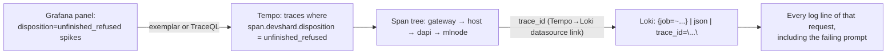
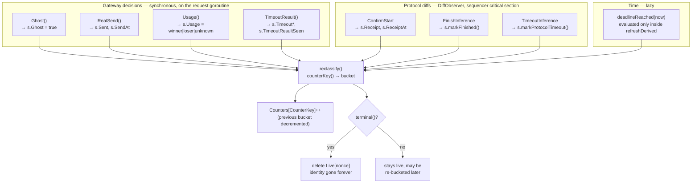
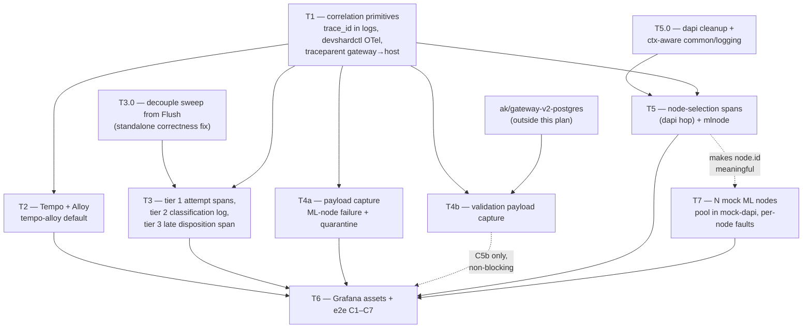

# testenv observability — trace/log correlation plan

**One-page summary:** [gateway-tracing.md](../docs/gateway-tracing.md).
**Test scenarios:** [observability-test-plan.md](./observability-test-plan.md) — the #1547 disposition
matrix re-run against mock ML nodes, asserting telemetry instead of counters.

**Scope:** continuation of [observability-plan.md](./observability-plan.md) (Phase 10 stack selection).
That document answers *"which backend do we run"*. This one answers *"what do we put in the
telemetry so one `inferenceId` reconstructs the whole request path"*.

**Goal in one sentence:** given an `escrow_id` + `nonce` (== `inferenceId`) or an accounting
disposition bucket (`ghost`, `unfinished_refused`, …), a developer opens Grafana and gets the full
span tree across gateway → devshardd → dapi → mlnode **plus every log line those components wrote
for that request**, including the prompt that triggered the failure.

**Primary e2e stack:** `tempo-alloy`. Jaeger + Promtail stay supported as the fallback profile.

---

## 0. TL;DR of the design decision

> *"Do we label each request, or how do we check the log? Maybe it is possible to label spans."*

**Label spans, not requests, and not Prometheus series.** Three tiers, chosen by cardinality:

| Tier | Carries | Cardinality budget | Where it lives |
|------|---------|--------------------|----------------|
| **Prometheus labels** | `participant`, `model`, `disposition`, `dispatch_phase`, `quarantine_mode`, `no_send_reason`, `failure_origin`, `timeout_*` | bounded enums only — **never** `nonce`/`escrow_id`/`request_id` | already emitted (`devshard_accounting_disposition`, `devshard_gateway_slot_decisions_total`) |
| **Span attributes (Tempo)** | everything above **plus** `escrow.id`, `devshard.nonce`, `request.id`, `participant.key`, `slot.id` | unbounded — Tempo indexes attributes per-span, high cardinality is fine | **new** — this plan |
| **Loki log-line fields** | `trace_id`, `span_id`, `request_id`, `escrow_id`, `nonce`, payload hash, prompt/response text | unbounded, but must stay **inside the line**, not in stream labels | **new** — this plan |

The flow a developer follows:



No per-request label is needed anywhere, because `trace_id` **is** the join key and Tempo/Loki are
built to index it. The only thing we must guarantee is that every log line carries the `trace_id`
of the span that was active when it was written. That is item #1 below and it does not exist today.

---

## 1. Where we actually are (audit)

Verified against the current tree, not the plan docs.

| Capability | Status | Evidence |
|------------|--------|----------|
| OTel SDK + W3C propagator | ✅ for `devshardd`, `edge-api` | `devshard/observability/init.go:44`, `edge-api/observability/init.go:36` |
| OTel init in **devshardctl (gateway)** | ❌ **never called** | no `observability.Init` in `devshard/cmd/devshardctl/` |
| OTel init in **dapi** | ❌ package exists, `main.go` never calls it | `decentralized-api/observability/init.go` unreferenced |
| OTel init in **devshard-host** | ❌ mounts `EchoMiddleware` but no `Init` | `devshard/cmd/devshard-host/main.go:77` |
| `traceparent` gateway → host | ❌ not injected | `devshard/transport/client.go:622-628` sets only Content-Type + auth |
| `traceparent` host → mlnode | ✅ | `InjectRequestContext` in `engine.go:94` |
| `X-Request-Id` gateway → host | ❌ not forwarded; host mints a **new** id | `devshard/observability/middleware.go:68-73` |
| `trace_id` / `span_id` in log lines | ❌ **nothing emits them** | `devshard/observability/ctx.go:251-268` (`Fields`) has `request_id`, `stage`, `where` — no trace ids |
| Loki→trace derived field | ⚠️ configured but dead | `observability/grafana/provisioning/datasources/loki.yaml` matches `trace_id=(\w+)` — never matches |
| Gateway logs are structured | ❌ `log.Print` free text | `devshard/logging/logger.go:114-131` (`Stage`) |
| Mid-stream progress logging | ✅ **already good** — 60 s heartbeat, first-token, stall, suppression, terminal summary | `redundancy.go:2710-2752` and §5.8 table |
| Spans inside a streaming response | ❌ none in the gateway; one flat span on the host | `transport/server.go:282` covers the whole stream |
| Tempo / Alloy in testenv | ❌ Jaeger + Promtail only | `docker-compose.observability.yml` |
| Accounting per-nonce identity retained | ❌ dropped on classify | `devshard/accounting/tracker.go:581-583` deletes `Live[nonce]` after folding into `Counters` |
| Deadline-based dispositions evaluated promptly | ❌ only inside the snapshot write | `refreshDerived` has one caller, `store.go:210`, reached via `Flush` on a 5-min ticker (`tracker.go:16`) — see §5.2 |
| Prompt capture on failure | ❌ none | — |

Two structural consequences worth internalising before reading the phases:

1. **The gateway has no tracing at all.** Everything about "gateway observability giving a full span
   by requestId" starts from zero. `devshardctl` is where escrow/nonce/disposition live, so it must
   become the trace root.
2. **Accounting is aggregate-only by design.** `nonceState` is deleted the moment a nonce reaches a
   terminal disposition; only `Counters[CounterKey]` survives. A Grafana counter therefore can never
   be drilled into. Fixing that is *not* about adding a label to the counter — it is about emitting a
   **span per terminal nonce** so Tempo becomes the per-request index that the tracker refuses to be.

---

## 2. Correlation contract

One set of names, used identically as span attributes and log fields. Reuse the existing devshard
constants where they exist; add the rest in `devshard/observability/names.go`.

| Key | Type | Meaning | Origin |
|-----|------|---------|--------|
| `trace_id` / `span_id` | hex | W3C ids of the active span | injected by the log handler (§3) |
| `request_id` | string | `req-<nano>-<seq>`, human-facing, echoed to the client | `devshard/logging` |
| `escrow.id` | string | devshard id | existing span attr |
| `devshard.nonce` | uint64 | **== `inferenceId`** (`user/session.go:799-821` sets `InferenceId: nonce`) | existing span attr |
| `devshard.slot_id` | uint32 | host slot | existing |
| `participant.key` | string | executor participant | gateway metrics label |
| `model` | string | model id | existing |
| `devshard.disposition` | enum | `protocol_only` \| `ghost` \| `finished_used` \| `finished_unused` \| `finished_usage_unknown` \| `unfinished_refused` \| `unfinished_execution` | `accounting/types.go:13-23` |
| `devshard.dispatch_phase` | enum | `normal` \| `poc` \| `confirmation_poc` | `types.go:25-31` |
| `devshard.timeout_evaluation_phase` | enum | same values | `types.go:25-31` |
| `devshard.quarantine_mode` | enum | `none` \| `probe` \| `shadow` \| `probation` | `types.go:33-40` |
| `devshard.no_send_reason` | enum | `poc_unavailable_host` \| `participant_throttled_no_send` \| `participant_capability_no_send` \| `no_compatible_request_after_stale` \| `unknown` | `types.go:42-50` |
| `devshard.failure_origin` | enum | `host_response` \| `gateway_policy` \| `client` \| `transport_unknown` | `types.go:52-59` |
| `devshard.timeout_kind` | enum | `refused` \| `execution` | `types.go:69-74` |
| `devshard.timeout_outcome` | enum | `skipped` \| `vote_collection_failed` \| `insufficient_votes` \| `diff_send_failed` \| `applied` | `types.go:76-84` |
| `devshard.timeout_reason` | enum | `phase_transition_aborted` \| `long_response_after_content` \| `escrow_state_root_diverged` \| `context_canceled` \| `timeout_diff_delivery_failed` \| `timeout_not_applied` \| `unknown` | `types.go:86-96` |
| `devshard.detail_reason` | free string | normalized raw reason | `tracker.go:878-893` |
| `devshard.protocol_kind` | enum | `receipt_applied` \| `finish_applied` \| `timeout_applied` \| `challenged` \| `validated` \| `invalidated` | `types.go:98-107` |
| `devshard.stream` | bool | streaming vs unary — required to exclude stream spans from latency panels (§5.8) | new (§6) |

Payload fingerprints and sizes are **log-line fields, not span attributes** — see §6.1 for why.

**Rule:** the attribute value string must be byte-identical to the Prometheus label value for the
same dimension. That is what makes "click from the `devshard_accounting_disposition` panel into
Tempo" work with a mechanical TraceQL template instead of a translation table. Enforce it with a
test (§9, C4).

### Header contract

| Header | Direction | Meaning |
|--------|-----------|---------|
| `traceparent` | every hop | W3C context, the machine join key |
| `X-Request-Id` | every hop | the devshard logging id, **forwarded, never regenerated when present** |
| `X-Inference-Id` | gateway → host → mlnode | the nonce; already declared in `common/utils/api_headers.go:6` but unused |

There is an apparent semantic split — `devshard/observability/ctx.go:202-205` sets `X-Request-Id`
from the logging id, while `decentralized-api/observability/operation.go:172-181` sets it to the
**OTel trace id** — but the dapi side is reachable only from dead inference code (§7.1), so this is
a deletion rather than a reconciliation. The logging id is canonical; the trace id already travels
in `traceparent`.

---

## 3. Phase T1 — log/trace correlation primitives (blocking prerequisite)

Nothing else in this document is observable in Grafana until logs carry `trace_id`. Do this first
and independently of any compose change.

### T1.0 — the shared pieces belong in `common/`, not `devshard/`

Four binaries need identical correlation behaviour, so the reusable half lands in `common` and each
service keeps only its own call-site adapter.

**The module graph supports it.** `edge-api`, `decentralized-api` and `devshard` all carry
`replace common => ../common` (`*/go.mod:6`, `decentralized-api/go.mod:323`), `common` already
depends on `go.opentelemetry.io/otel/trace v1.40.0` plus the SDK (`common/go.mod:31-35`), and
`common/observability` already exists (`chain.go`, `grpc.go`, `names.go`, `operation.go`,
`otelutil/`). Nothing new has to be introduced — and `common` must not import any service module, so
anything service-specific stays behind a hook.

**Land in `common/observability`:**

| Piece | Why shared |
|-------|-----------|
| `TraceHandler` — wraps any `slog.Handler`, stamps `trace_id`/`span_id` from `trace.SpanContextFromContext(ctx)` | pure OTel, zero service knowledge |
| `RegisterContextFields(func(context.Context) []slog.Attr)` | lets each module contribute its own ctx-derived fields (devshard adds `request_id`) without `common` importing them |
| `InstallLogger(format)` — build JSON or text handler, wrap, `slog.SetDefault` | one env contract (`LOG_FORMAT=json\|text`) across all four binaries |
| Request-id context key + `WithRequestID`/`RequestID`/`PropagateRequestID` | currently private to `devshard/logging` (`logger.go:26,73-106`), so dapi and edge-api can never read or set it; `X-Request-Id` is already a cross-service header |
| **OTel bootstrap `Init`** | three near-identical copies exist today (`devshard/observability/init.go`, `decentralized-api/observability/init.go`, `edge-api/observability/init.go`); `otelutil.ParseHeaders` is already shared, the rest should follow — this is also how `devshardctl` gets its `Init` in T1.4 for free |

Keep thin aliases in `devshard/logging` for the moved request-id helpers so existing call sites
compile unchanged.

```go
// common/observability/sloghandler.go
type TraceHandler struct{ slog.Handler }

func (h TraceHandler) Handle(ctx context.Context, r slog.Record) error {
	if sc := trace.SpanContextFromContext(ctx); sc.IsValid() {
		r.AddAttrs(
			slog.String("trace_id", sc.TraceID().String()),
			slog.String("span_id", sc.SpanID().String()),
		)
	}
	for _, fn := range contextFieldHooks {   // devshard registers request_id here
		r.AddAttrs(fn(ctx)...)
	}
	return h.Handler.Handle(ctx, r)
}
```

**The catch — a handler only sees what the call site passes.** `slog.Info(...)` hands the handler
`context.Background()`; only `slog.InfoContext(ctx, ...)` / `slog.Log(ctx, ...)` carry a span. So
each front-end needs ctx-aware entry points, and they differ a lot in cost:

| Front-end | Users | ctx today | Work |
|-----------|-------|-----------|------|
| `devshard/observability.Log(ctx, …)` (`ctx.go:271-291`) | devshardd, host | **takes ctx, then drops it** | **one chokepoint** — forward ctx |
| `devshard/logging.Stage(ctx, …)` (`logger.go:114-131`) | devshardctl gateway | **takes ctx, then drops it** | **one chokepoint** — see T1.3 |
| `devshard/logging` `Logger` iface | devshard | no ctx | add `InfoCtx`/`WarnCtx`/`ErrorCtx`/`DebugCtx` |
| `common/logging` `Info(msg, subSystem, kv…)` | dapi (73 files), common (15), devshard (3) | **no ctx parameter at all** | add `*Ctx` variants; only migrate the call sites that matter |
| raw `slog` | edge-api (`cmd/edge-api/main.go`) | n/a | switch to `slog.*Context` |

The good news is that devshard — the part that matters for this plan — needs **two chokepoint
changes**, not a per-call-site sweep, because both `Log` and `Stage` already receive a `ctx` and
simply discard it. And `common/logging` does not need a 73-file migration: per §7.1 most dapi paths
are dead, so only `broker/` and `nodemanager/` have to be threaded (T5b).

Unrelated cleanup this exposes: `devshard/logging.NewSlogAdapter` (`logger.go:44-68`) and
`SetLogger` have **no callers**. They were written for a dapi-embeds-devshard scenario that never
happened — `decentralized-api/go.mod` has no `devshard` dependency. Delete rather than port.

### T1.1 — install the handler per binary

Each of `devshardd`, `devshardctl`, `dapi`, `edge-api` calls
`observability.InstallLogger(os.Getenv("LOG_FORMAT"))` at startup. testenv sets `json`; the default
stays `text` so local dev output is unchanged. devshard additionally registers its `request_id`
extractor hook once, in `devshard/observability`.

### T1.2 — route devshard's two chokepoints through ctx

`observability.Log` forwards its `ctx` into new `logging.*Ctx` functions. `Fields()`
(`ctx.go:251-268`) keeps working unchanged — the handler supplies the trace ids, so no field
plumbing changes.

### T1.3 — gateway logging: `Stage` → structured

`logging.Stage` (`logger.go:114-131`) writes free text via `log.Print` and has no `ctx`-derived
trace. Keep the signature (it already takes `ctx`) and switch the body to `slog.Log(ctx, …)` with
the kv pairs as attrs. In `text` mode keep emitting the current `request=… stage=…` shape so
existing greps and `WaitLokiSubstring` assertions keep passing.

### T1.4 — OTel init in devshardctl

`devshardctl` becomes a traced service (`service.name=devshardctl`), using the `Init` consolidated
into `common/observability` in T1.0. Env mirrors devshardd: `DEVSHARD_OTEL_ENABLED`,
`OTEL_ENDPOINT`, `OTEL_HEADERS`. Root span `gateway.request` is started in the proxy handler where
`ensureRequestLogContext` already runs (`gateway.go:1407`), so `request_id` and the span are born
together.

### T1.5 — propagate on the gateway → host hop

`devshard/transport/client.go:622-628`: inject `traceparent` and forward `X-Request-Id` /
`X-Inference-Id`. Then flip `RequestIDMiddleware` (`observability/middleware.go:68-73`) to *prefer*
the inbound header — it currently mints a fresh id when the header is present-but-unhandled, which
severs gateway and host logs into two unrelated ids.

### T1.6 — Promtail/Alloy: parse JSON, keep ids off the labels

`observability/promtail-config.yaml` already runs a `json` stage. Extend the expression set with
`trace_id`, `span_id`, `request_id`, `stage`, `where` — but promote **only** `level`, `service`,
`stage` to Loki labels. `trace_id`/`request_id`/`nonce` stay as line content; Loki's `| json` filter
queries them at read time with no cardinality cost.

Then the already-provisioned derived field in `loki.yaml` (`matcherRegex: '"trace_id":"(\w+)"'`)
starts working — point its `datasourceUid` at `tempo` for the primary profile.

**T1 exit criteria:** in `jaeger-promtail` (unchanged stack), a gateway chat produces gateway *and*
devshardd log lines sharing one `trace_id`, and clicking the Loki derived field opens the trace.

---

## 4. Phase T2 — Tempo + Alloy as the primary e2e stack

Implements Phases B–D of [observability-plan.md](./observability-plan.md), with `tempo-alloy` as
the default for e2e rather than an optional profile.

### T2.1 — files

```
devshard/testenv/
  observability/
    tempo.yaml                              # new: OTLP receiver, local blocks, metrics-generator
    alloy/
      config.alloy                          # port from devshard-testenv branch (logs + metrics)
      config.tempo.trace.alloy              # otelcol.receiver.otlp → otelcol.exporter.otlp tempo:4317
      config.jaeger.trace.alloy             # same shape → jaeger:4317
  docker-compose.observability.tempo.yml    # new
  docker-compose.observability.alloy.yml    # new
  docker-compose.observability.promtail.yml # split out of the shared file
  docker-compose.observability.jaeger.yml   # split out of the shared file
```

`docker-compose.observability.yml` keeps only the shared services (loki, prometheus, grafana).

### T2.2 — ports and IPs

| Service | Host port | testenv IP (`BASE.x`) |
|---------|-----------|-----------------------|
| jaeger UI | `11686` | `.60` |
| prometheus | `19099` | `.61` |
| loki | `13101` | `.62` |
| promtail | — | `.63` |
| grafana | `13000` | `.64` |
| **tempo** | `13200` (query) | **`.65`** |
| **alloy** | `12345` (UI) | **`.66`** |

`writeObservabilityIPOverride` (`citest/harness/observability.go:98-130`) is generated per-profile —
emit only the blocks for services the profile actually starts, otherwise Compose fails on an
unknown service.

### T2.3 — endpoint matrix (unchanged from the parent plan, restated for the default)

| Profile | `TESTENV_OTEL_ENDPOINT` | Log collector | Default? |
|---------|--------------------------|---------------|----------|
| `tempo-alloy` | `http://alloy:4317` | Alloy | ✅ **e2e default** |
| `tempo-promtail` | `http://tempo:4317` | Promtail | fallback |
| `jaeger-alloy` | `http://alloy:4317` | Alloy | matrix |
| `jaeger-promtail` | `http://jaeger:4317` | Promtail | legacy default, kept green |

`PrepareObservabilityOverlay` derives the endpoint from `TESTENV_OBS_PROFILE` — the hardcoded
`"TESTENV_OTEL_ENDPOINT": "http://jaeger:4317"` at `observability.go:69` becomes a switch.

### T2.4 — Tempo config essentials

```yaml
# observability/tempo.yaml (sketch)
distributor:
  receivers:
    otlp: { protocols: { grpc: { endpoint: "0.0.0.0:4317" } } }
storage:
  trace: { backend: local, local: { path: /var/tempo/blocks }, wal: { path: /var/tempo/wal } }
metrics_generator:
  processor:
    span_metrics:
      dimensions:
        - devshard.disposition
        - devshard.dispatch_phase
        - devshard.quarantine_mode
        - devshard.no_send_reason
        - devshard.failure_origin
        - devshard.timeout_kind
        - devshard.timeout_outcome
        - model
  registry: { external_labels: { source: tempo } }
  storage: { remote_write: [{ url: http://prometheus:9090/api/v1/write }] }
overrides:
  defaults:
    metrics_generator: { processors: [span-metrics, service-graphs] }
```

The `span_metrics` processor is what makes the disposition taxonomy *self-serve*: Tempo derives
`traces_spanmetrics_calls_total{devshard_disposition="unfinished_refused", …}` straight from the
span attributes, with **exemplars** pointing at concrete trace ids. That is the "click the spike,
land on the request" path, and it needs zero new Go metric code. Prometheus must run with
`--web.enable-remote-write-receiver`.

Grafana: add a Tempo datasource with `tracesToLogsV2` (tag `trace_id`, datasource `loki`) and
`lokiSearch` enabled, so the trace view has a "Logs for this span" button.

### T2.5 — harness abstraction

`WaitJaegerSpan` becomes backend-agnostic `WaitTraceSpan(t, obs, service, operation, timeout)`,
dispatching on profile: Jaeger HTTP API vs Tempo `GET /api/search?tags=…` + `GET /api/traces/{id}`.
Add `WaitTraceByAttr(t, obs, tagQuery, timeout) []TraceID` for the disposition assertions in §9.

---

## 5. Phase T3 — attaching the disposition to the trace

**Implementation plan:** [observability-t3-implementation-plan.md](./observability-t3-implementation-plan.md)
— trackable steps T3.0–T3.10 with per-step tests and exit criteria. This section stays the design
reference.

### 5.1 How a nonce is actually classified

The tracker is a small event-sourced state machine. `nonceState` (`tracker.go:43-65`) accumulates
*facts* from two completely independent producers, and after every fact `reclassify` recomputes
which counter bucket the nonce belongs to.



**The lifecycle in order** (`tracker.go:543-584`):

1. **Consumption.** A diff commits carrying the nonce → `recordDiff(nonce, hasStart)`. No
   `StartInference` tx in it → counted as `protocol_only` immediately, no live state ever created.
   Otherwise `Live[nonce]` is created.
2. **Fact accumulation.** The gateway sets `Ghost`/`Sent`/`Usage`/timeout fields; the diff observer
   sets `Receipt`/`Finished`/`ProtocolTimedOut`.
3. **Bucketing.** `counterKey()` (`tracker.go:651-681`) is a priority switch:

   | Condition | Disposition |
   |-----------|-------------|
   | `s.Ghost` | `ghost` |
   | `s.Finished && Usage==winner` | `finished_used` |
   | `s.Finished && Usage==loser` | `finished_unused` |
   | `s.Finished && Usage==unknown` | `finished_usage_unknown` |
   | `Sent && !Finished && deadlineReached && Receipt` | `unfinished_execution` |
   | `Sent && !Finished && deadlineReached` | `unfinished_refused` |
   | otherwise | **unclassified** — this is `in_flight` / `pending_classification` |

   `persistable()` (`tracker.go:689-696`) then withholds the two timeout dispositions until
   `TimeoutResultSeen || ProtocolTimedOut`, so a deadline alone never counts as a timeout.
4. **Bucket is mutable.** If the key changed, `reclassify` decrements the old key and increments the
   new one (`tracker.go:573-580`). A nonce can legitimately move `unfinished_refused` →
   `finished_used` when a late finish lands.
5. **Terminal + erase.** `terminal()` (`tracker.go:683-687`) = `Ghost`, or `Finished && Usage != ""`,
   or `ProtocolTimedOut && TimeoutResultSeen`. Then `Live[nonce]` is deleted. From that moment the
   nonce exists only as `+1` on an aggregated `CounterKey`.

### 5.2 Why it is late — the real latency budget

Two separate causes, and only one of them is inherent.

**Cause 1 — protocol deadlines (inherent).** `deadlineReached` (`tracker.go:698-709`) is
`SendAt + RefusalTimeout + buffer`, or `ReceiptAt + ExecutionTimeout + buffer` once a receipt exists.
Defaults from `devshard/types/config.go:50-51` and `devshard/user/session.go:27`:

| Parameter | Default |
|-----------|---------|
| `RefusalTimeout` | **60 s** |
| `ExecutionTimeout` | **1920 s (32 min)** |
| `TimeoutBuffer` | 5 s |

**Cause 2 — the lazy sweep (accidental, fixable).** `deadlineReached` is time-dependent, so a nonce
that goes silent generates no event and is only re-evaluated when someone calls `refreshDerived`.
There is exactly **one** caller: `Tracker.snapshot()` at `store.go:210`, reached only via `Flush` —
i.e. the snapshot ticker (`DefaultSnapshotInterval = 5 min`, `tracker.go:16`, overridable with
`DEVSHARD_STATS_SNAPSHOT_SECONDS`) or `Finalize`/`Settled`/`Retire`/`Close`.

Resulting time from "user got their response" to "disposition exists":

| Disposition | Bound | Typical |
|-------------|-------|---------|
| `protocol_only` | immediate | ~0 |
| `ghost` | immediate — `Ghost()` is terminal on its own | ~0, often *before* the response |
| `finished_used` / `_unused` / `_usage_unknown` | needs `FinishInference` committed **and** `Usage` from the race outcome; both are on the request path | sub-second to seconds |
| `unfinished_refused` | 60 s + 5 s **+ up to one sweep** | **up to ~6 min** |
| `unfinished_execution` | 1920 s + 5 s **+ up to one sweep** | **up to ~37 min** |

So "minutes" is not chain latency and not a slow pipeline — it is the refusal/execution timeout by
definition, inflated by a 5-minute polling artifact.

> **Side finding, corrected:** an earlier revision claimed the Prometheus collector and the
> `/api/v1/epochs` HTTP API serve stale deadline-based dispositions. They do not. `Query` takes a
> fresh `now` (`query.go:86`) and folds uncounted live nonces through `counterKey` at read time
> (`query.go:150-158`, `225-254`; see the comment at `query.go:81-83`). The lazy sweep affects
> *promotion into the persisted counters* and, critically, the fact that a deadline transition
> produces **no event** for telemetry to hang off — which is why T3.0 blocks tiers 2 and 3 rather
> than merely tidying the metrics. See T3.0 in
> [observability-t3-implementation-plan.md](./observability-t3-implementation-plan.md).

### 5.3 Is async classification optimal?

**The asynchrony itself is correct and unavoidable.** A disposition answers *"what did the protocol
ultimately do with this consumed nonce"*. For a host that simply never responds, that answer does
not exist until the refusal deadline expires; there is nothing to observe earlier. Making it
synchronous would mean changing protocol semantics, not observability.

**Two aspects are genuinely suboptimal:**

| Aspect | Verdict |
|--------|---------|
| Deadline-driven dispositions gated behind a 5-min persistence tick | ❌ accidental coupling — fix in T3.0 |
| Nonce identity erased at terminal (`delete(e.Live, nonce)`) | ⚠️ correct for the ledger's job (bounded memory, aggregate ledger), but it means **no component in the system can answer "show me the request behind this counter"**. Telemetry has to capture identity *before* the erase. |

### 5.4 Can we just keep the span open until classification?

**No.** The request span ends when the response is flushed; by classification time it is long gone.
Holding it open fails on five counts:

1. **Duration.** Up to 32 minutes for `unfinished_execution`. A 2-second request reported as a
   32-minute span destroys every latency panel and Tempo's span-metrics histograms.
2. **Nothing is exported until `End()`.** The trace would be invisible in Tempo for the whole
   window — the exact opposite of what you want while debugging a stuck request.
3. **Restart loses it.** In-memory unended spans are dropped on gateway restart; the interesting
   failure cases are exactly the ones likeliest to coincide with one.
4. **Unbounded retention.** One live span object per in-flight nonce, and overscheduling multiplies
   nonces per user request.
5. **Structurally inexpressible.** Classification often fires on the diff-observer goroutine inside
   the sequencer critical section, or on the sweep ticker. There is no request handler left to
   "wait" in.

A partial version *is* worth doing though: a per-nonce **attempt span** that closes at the race
outcome rather than at response flush. That covers everything the gateway knows synchronously — see
tier 1 below.

### 5.5 Is a log line with the same trace_id enough?

**Largely yes — and it should be the foundation, not the fallback.** This is the right instinct.

A classification log line carrying `trace_id`, `span_id`, `nonce`, `escrow_id` and the full
dimension set gives both directions of the lookup:

```logql
# disposition → the requests that produced it
{compose_service="devshardctl"} | json | disposition = "unfinished_refused"
# trace → what the protocol finally decided
{compose_service="devshardctl"} | json | trace_id = "9f3c…"
```

What a log line **cannot** do that a span can:

| Capability | Log-only | Span |
|------------|----------|------|
| Filter by disposition | ✅ LogQL | ✅ TraceQL |
| Jump trace → classification | ✅ (Grafana trace-to-logs) | ✅ |
| Jump classification → trace | ✅ (derived field on `trace_id`) | ✅ native |
| Appear **inside** the trace timeline | ❌ | ✅ |
| Feed Tempo `metrics_generator` span-metrics | ❌ | ✅ |
| Correlate across services in one TraceQL query | ❌ | ✅ |
| Survive Loki retention shorter than Tempo's | ❌ | ✅ |

The only *capability* loss is TraceQL-native search and span-metrics. Span-metrics is redundant here
anyway — `devshard_accounting_disposition` already exists and is authoritative. So the honest
conclusion is that the log line buys ~85% of the value for ~10% of the work, and the span is a
genuine but incremental upgrade.

### 5.6 Recommendation — three tiers, in this order

**T3.0 — decouple the classification sweep from persistence** *(do this first; it is a correctness
fix, not an observability one)*

Give the tracker a short sweep ticker (5–10 s) that calls `refreshDerived(now)` under the write lock
without touching SQLite, and leave `Flush` on its 5-minute cadence. This tightens the accounting
API, the Prometheus counters, and any telemetry built on top, and it removes the "+ up to one
sweep" term from every row of the 5.2 table. It also makes the timeout e2e tests deterministic
without shrinking `DEVSHARD_STATS_SNAPSHOT_SECONDS` to force a write.

**Tier 1 — put everything the gateway knows synchronously on a live span** *(highest value/effort)*

Most of what a developer needs for "why did this request fail" is known **before the response is
sent**: which participant, which slot, ghost-or-send, the no-send reason, quarantine mode, race
outcome, timeout action, failure origin. None of that requires waiting for the protocol.

Add a child span `devshard.gateway.attempt` per nonce, opened in `prepareInflight`/`startInflight`
and closed at `finishRaceOutcome` (or immediately, for a ghost). Attributes: `devshard.nonce`,
`escrow.id`, `devshard.slot_id`, `participant.key`, `model`, `devshard.quarantine_mode`,
`devshard.no_send_reason`, `devshard.failure_origin`, `devshard.timeout_kind`,
`devshard.timeout_outcome`, and a **provisional** `devshard.disposition` where it is already
decided (`ghost`, `finished_used`, `finished_unused`).

This alone makes overscheduling legible in the trace view: one request span with N attempt children,
one winner and N-1 losers or ghosts.

**Tier 2 — classification log line with trace context** *(the backbone of late classification)*

At the single terminal choke point (see 5.7), emit one structured log line through the T1 ctx-aware
logger, seeded with the stored span context so it carries `trace_id`/`span_id`, plus `nonce`,
`escrow_id`, and every `CounterKey` field. This is what answers your question directly: **the trace
is findable by `trace_id` from the log, and the log is findable from the trace, without any span.**

**Tier 3 — the late disposition span** *(TraceQL-native, optional)*

Same choke point, same data, emitted as a zero-duration span re-parented onto the original trace.
Worth doing because it makes `{ span.devshard.disposition = "…" }` a first-class query and puts the
outcome in the timeline, but it is explicitly *not* load-bearing: if Tempo stitching disappoints,
tiers 1–2 still deliver the workflow.

### 5.7 Implementation details for tiers 2 and 3

**Capture the span context on `nonceState`.** Add `TraceID [16]byte`, `SpanID [8]byte`, `Sampled
bool` — 25 bytes per live nonce, in-memory only, deliberately not persisted (matching how `Live` is
already excluded from the store blob, `store.go:25-33`). Populate from the first recorder call that
has a request context:

| Recorder entry | Call site | Request ctx? |
|----------------|-----------|--------------|
| `RealSend` | `recordGatewayAttemptStarted` (`redundancy.go:2895`) | ✅ `settleCtx`, propagated at `redundancy.go:1703-1705` |
| `Usage` | `recordGatewayAttemptTerminal` (`redundancy.go:2923`) | ✅ same chain |
| `TimeoutResult` | `recordGatewayTimeoutAction` (`redundancy.go:2984`) | ✅ same chain |
| `Ghost` | `runGhostProbe` (`redundancy.go:4198`) | ❌ **synthetic** — `ensureRequestLogContext(context.Background())` at `4209` |
| protocol facts | `DiffObserver` (`recorder.go:78`) | ❌ by construction |

The ghost path needs a real code change, not just plumbing: `runGhostProbe` must take the picker's
originating context (available at `session_picker.go:478`) so a ghost burn is attributable to the
user request whose overscheduling caused it. Today it is deliberately detached.

**Emit at exactly one choke point.** Two places drop a nonce, and only one of them currently runs
through `reclassify`:

- `reclassify` terminal branch (`tracker.go:581-583`)
- `releaseCountedLive` on settle (`tracker.go:535-541`) — deletes counted-but-not-terminal entries
  **directly**, bypassing reclassify

Introduce `finalizeNonce(nonce, s, key)` and call it from both, otherwise every nonce that settles
while counted-but-not-terminal (a non-applied timeout, per the comment at `tracker.go:530-534`)
silently produces no telemetry. Guard it with a `s.Emitted` flag so the mutable-bucket churn in step
4 of 5.1 cannot double-emit.

**Re-parenting sketch:**

```go
sc := trace.NewSpanContext(trace.SpanContextConfig{
    TraceID:    s.TraceID,
    SpanID:     s.SpanID,      // the attempt span from tier 1
    TraceFlags: sampledFlag(s), // preserve the original decision, do not force-sample
    Remote:     true,
})
ctx := trace.ContextWithRemoteSpanContext(context.Background(), sc)
_, span := tracer.Start(ctx, "devshard.nonce.disposition",
    trace.WithSpanKind(trace.SpanKindInternal),
    trace.WithTimestamp(s.SendAt),                    // see note below
    trace.WithAttributes(dispositionAttrs(key, s)...))
span.End()
```

Notes and caveats:

- **Duration semantics.** Starting at `SendAt` makes the span visually cover the resolution window
  and its duration means *time-to-disposition* — useful in its own right, and safely separated from
  request latency because span-metrics buckets by span name. Document it, or start at `now` if you
  prefer a zero-duration marker.
- **Sampling.** Do not hardcode `FlagsSampled`; carry the original decision. Forcing it produces
  orphan single-span traces for every unsampled request.
- **Tempo stitching.** Trace-ID lookup merges across blocks, so a 37-minute-late span still joins
  when you open the trace by ID — but TraceQL *search* only sees one block's worth. See §5.8: for
  lags beyond `max_trace_live` (30 s) prefer a linked root span over re-parenting. Keep
  `block_retention` (14 d default) well above the worst case either way.
- **Restart.** `Live` is not persisted, so nonces in flight across a gateway restart reload without
  span context and classify as orphans. Acceptable; log it as `trace_id=""` so it is measurable.
- **`protocol_only`.** No dispatch ever happened, so there is no context to attach to. Emit a root
  span — the absence of a parent is itself the correct signal.

**Tier 2 bonus — exemplars without span-metrics.** Store the last `trace_id` per `CounterKey` and
attach it as a Prometheus exemplar on the existing `devshard_accounting_disposition` series (via
`prometheus.NewMetricWithExemplars` around the `MustNewConstMetric` at `accounting/metrics.go:155-177`).
That gives the "click the spike → open the trace" jump directly from the counters we already trust,
with none of the Tempo `metrics_generator` configuration in §T2.4. If this lands, span-metrics
becomes optional.

### 5.8 Streaming requests — span shape

Chat completions are SSE streams, so "how long was the request" is the wrong question and span
duration is the wrong answer. This section fixes the shape before tier 1 is built.

**First, a correction to the mental model.** The 32-minute `ExecutionTimeout` is *not* how long
streams run. It is the protocol's outer backstop for a nonce that was receipted and never finished.
Streaming attempts are policed far more tightly by the gateway itself
(`redundancy.go:430-433`, `512-515`):

| Guard | Setting | Default |
|-------|---------|---------|
| Receipt must arrive | `ReceiptTimeoutMS` | 5 s |
| First token deadline (adaptive) | `FirstTokenTimeoutFloorMS` + `PerInputTokenFirstTokenLagMS` × input tokens | 1 s + 10 ms/token |
| Gap between chunks | `InterChunkStallTimeoutMS` | 60 s |
| Non-streaming only, no content | `NonStreamNoContentTimeoutMS` | 30 min |

So a healthy stream is bounded by stall detection, not by 32 minutes. The long tail is the
*pathological* case, and it is exactly the case where the span has already closed.

**Industry practice for streaming spans**, in order of importance:

1. **Never treat span duration as latency.** For token streams the meaningful signals are
   time-to-first-token and time-per-output-token, which is why the OTel GenAI conventions define
   `gen_ai.server.time_to_first_token` and `gen_ai.server.time_per_output_token` as separate
   histograms alongside the operation-duration metric. Total duration is a *throughput/length*
   signal, not a latency one.
2. **Phase children, not one flat span.** Split the attempt into contiguous child spans at the
   milestones you already measure. This is what makes a slow request legible at a glance.
3. **Span events for milestones, never a span per chunk.** A 4k-token response would produce 4k
   spans; traces above ~50 MB uncompressed degrade Tempo query and compaction.
4. **Segregate streaming from non-streaming in latency panels** — separate span names or a
   `stream=true` span-metrics dimension. Mixing them makes every percentile meaningless.
5. **Heartbeat progress through logs, not spans.** A log line per stall or per N chunks, carrying
   `trace_id`, gives live visibility while the span is still unexported.

**What the gateway already logs mid-stream.** Practice #5 above is effectively already implemented —
this is the strongest part of the current instrumentation and tier 1 should preserve it verbatim.

| Signal | Cadence | Where | Fields |
|--------|---------|-------|--------|
| **Heartbeat** `waiting_for_receipt` → `waiting_for_first_token` → `streaming_inflight` | every `LogHeartbeatInterval` = **60 s**, per attempt | `monitorInflight`, `redundancy.go:2710-2752` | `host`, `elapsed_ms`, `output_chunks`, `since_receipt_ms`, `since_first_token_ms`, `since_last_chunk_ms`, `role`, `winner_nonce` |
| `first_token` | once per attempt | `redundancy.go:1596` | `host`, `route` (winner/probe/pending), `winner_nonce` |
| `stream_forwarding_started` | once (`forwardedLog`) | `redundancy.go:1628` | `host` |
| `stream_suppressed` / `poc_probe_stream_suppressed` | once (`suppressedLog`) | `redundancy.go:1651`, `1600` | `winner_nonce`, `poc_reason` |
| `winner_write_ctx_cancelled` | once (`ctxCancelledLog`) | `redundancy.go:1616`, `1683` | `where` (write/flush), chunk + byte counters, `error` |
| `attempt_inter_chunk_stall` / `winner_stalled_after_content` | per stall, gap > `InterChunkStallLogThreshold` = **30 s** | `redundancy.go:2540-2552` | `stall_threshold_ms`, `output_chunks_before_stall`, `content_chunks_before_stall`, `output_bytes_before_stall` |
| `classify_buffer_dropped` | once (`classifyCapLog`) | `redundancy.go:1440` | drop `reason` |
| Terminal stall summary | once at race end | `stallLogFields`, `redundancy.go:1089-1136` | `stall_count` + JSON `stalls[]` with before/after counters per stall |

Note the 30 s stall *log* threshold is deliberately tighter than the 60 s stall *abort*
(`InterChunkStallTimeoutMS`) and tighter than the 60 s heartbeat, so a stall is visible before it
becomes fatal. A 32-minute attempt therefore already produces roughly 32 heartbeat lines plus a line
per stall — genuine live progress while any span would still be unexported.

**The one thing missing is the join key.** Every one of these goes through `logInferenceStage` →
`logging.Stage` → `log.Print` as free text with no `trace_id`, so none of them can currently be
pivoted from a trace. T1.3 is what turns this existing stream of progress lines into the live view
of a trace.

**Spans during streaming: there are none.** To answer the obvious follow-up directly — there is no
chain of linked spans across a long stream, because there is no span at all in `devshardctl`
(§1: OTel is never initialised there). The only span covering a stream is `devshardd.inference`
(`transport/server.go:282`, `defer op.FinishErr(&err)`), a single flat span spanning the entire
handler — precisely the anti-pattern this section argues against. `StartMLNodeCall` exists in
`observability/service.go:73-108` but has no call sites; the engine only bumps
`IncMLNodeAttempt` counters (`cmd/devshardd/inference/engine.go:138-291`).

**The good news: the gateway already measures every milestone.** `inflight`
(`redundancy.go:844-905`) carries `sendTime`, `receiptTimeNano`, `firstTokenNano`, `outputChunks`,
`contentChunks`, `outputBytes`, `lastChunkAt`, and `stalls []attemptStall` — and `attemptStall`
(`redundancy.go:1005-1012`) already records `StartTime`/`DetectedTime`/`EndTime` plus chunk/byte
counters at stall onset. Tier 1 is therefore mostly *projection*, not new measurement:

```
gateway.request                                  root; ends at response flush
└── devshard.gateway.attempt        (per nonce)  ends at race outcome
    ├── attempt.dispatch     sendTime → receiptTimeNano
    ├── attempt.prefill      receiptTimeNano → firstTokenNano      ← CTTFL lives here
    └── attempt.stream       firstTokenNano → lastChunkAt
        └── events: stream.stall.detected / stream.stall.recovered (one pair per attemptStall)
```

End-of-stream attributes on `attempt.stream`: `devshard.output_chunks`, `devshard.content_chunks`,
`devshard.output_bytes`, `devshard.stall_count`, `gen_ai.usage.output_tokens`.

Every boundary in that tree is an existing log point, so tier 1 is "open/close a span where we
already log", not new plumbing:

| Existing log stage | Span action |
|--------------------|-------------|
| `started` / `send_completed` | start `attempt.dispatch` |
| `receipt_received` | end `attempt.dispatch`, start `attempt.prefill` |
| `first_token` | end `attempt.prefill`, start `attempt.stream` |
| `attempt_inter_chunk_stall` / `winner_stalled_after_content` | span event `stream.stall.detected` |
| `finishActiveStall` | span event `stream.stall.recovered` |
| `race_completed` | end `attempt.stream` and `devshard.gateway.attempt` |

Keep the 60 s heartbeat as **logs only** — do not turn it into spans or span events. Heartbeats
belong in Loki (queryable while in flight, cheap to drop) whereas span events are buffered until
`End()` and would add ~32 events to a long attempt for no query benefit.

`attempt.prefill` is the span whose duration actually matters, and it is short even when the stream
is long — which means Tempo's span-metrics histograms over that span name are meaningful with
default buckets, while `attempt.stream` should be excluded from latency SLOs. Keep the existing
`devshard_host_first_token_seconds`, `devshard_host_receipt_seconds` and
`devshard_host_cttfl_seconds_per_input_token` histograms (`metrics.go:178-205`) as the authoritative
latency signals; spans supply structure and causality, not measurement.

**Tempo's constraint on drip-fed traces.** Tempo assembles a trace in memory and flushes it after
`max_trace_idle` (10 s), with `max_trace_live` (30 s) as a hard cap so a slowly drip-fed trace cannot
pin memory. Consequences that matter here:

- **Trace-ID lookup merges across blocks**, so a span arriving 32 minutes late *does* appear when you
  open the trace by ID. This is the path the workflow in §0 depends on, and it is safe.
- **TraceQL search evaluates only the contiguous portion within one block.** Duration reported in
  search results covers just that subset, and `spanset` operators can evaluate false for a trace
  that would match if all blocks were considered.

The practical rule: **put every attribute you want to filter on directly on the span that
represents the thing**, and never rely on a cross-span spanset join (`{ A } && { B }`) for a late
span. The disposition span in §5.7 already carries its full attribute set, so it complies.

**Revision to tier 3:** because `max_trace_live` is 30 s, anything classified later than that is
guaranteed to land in a different block. Grafana's own guidance for exactly this pattern is to
**split the trace and use span links** rather than stretch one trace across the gap. So:

| Classification lag | Emission |
|--------------------|----------|
| within the request (ghost, finished_*) | attribute on the live `devshard.gateway.attempt` span — tier 1, no extra span |
| late (`unfinished_refused`, `unfinished_execution`, delayed finishes) | **own root span** `devshard.nonce.disposition` in its own trace, with a `trace.Link` to the stored attempt `SpanContext`, plus `devshard.origin_trace_id` as a plain attribute |

The link keeps both traces short, contiguous and single-block — so TraceQL search, duration and
spanset operators all stay accurate — while Grafana renders the link as a navigable edge in both
directions. `devshard.origin_trace_id` additionally makes the join queryable from Loki and from
TraceQL without depending on link traversal. This supersedes the
`ContextWithRemoteSpanContext` re-parenting sketch for the late case; keep re-parenting only where
the lag is comfortably under `max_trace_idle`.

### 5.9 What a long stream looks like end to end

Two different mechanisms are easy to conflate, so state them separately:

| Mechanism | Used for | Trace id |
|-----------|----------|----------|
| **Parent–child spans** (ordinary nesting) | everything inside the request: gateway root → per-attempt subtree → phases → host → dapi → mlnode | **one shared `trace_id`** |
| **Span links** (`trace.Link`) | only the classification gap, which is unbounded and outside the request's causal flow | **two trace ids**, joined by the link + `devshard.origin_trace_id` |

So within a single stream — however long — there are **many spans but no links**. They are plain
parent–child spans sharing one trace id, minted once at `gateway.request` and propagated by
`traceparent` (T1.4/T1.5).

**Concrete shape for one request that overschedules two attempts, one streaming for 32 minutes:**

```
trace_id = 9f3c…                                     ← one id for everything below
gateway.request                              [0 → 32m]
├── devshard.gateway.attempt  nonce=4711     [0 → 32m]   winner
│   ├── attempt.dispatch                     [0 → 1.2s]
│   ├── attempt.prefill                      [1.2s → 3.4s]
│   └── attempt.stream                       [3.4s → 32m]
│       ├── event stream.stall.detected      @ 11m
│       └── event stream.stall.recovered     @ 11m40s
├── devshard.gateway.attempt  nonce=4712     [0.8s → 4s]  loser / ghost
└── devshardd.inference (host, via traceparent)
    └── devshardd.mlnode.chat.completions
```

**When each span actually reaches Tempo.** Spans export on `End()`, batched by the OTel
BatchSpanProcessor (5 s default flush). So this trace arrives in two waves:

| Wave | ~t | Spans |
|------|----|-------|
| 1 | ~8 s | `attempt.dispatch`, `attempt.prefill`, the loser attempt subtree |
| 2 | ~32 m | `attempt.stream`, the winner `devshard.gateway.attempt`, `gateway.request`, host spans |

This is a real benefit of the phase split: **the trace becomes queryable in Tempo within seconds**
instead of only when the stream finishes. A single flat span would have shown nothing for 32
minutes.

It also means the block split from §5.8 happens *even inside one request* — the two waves are 32
minutes apart, far beyond `max_trace_live` (30 s). The consequences are the ones already stated, and
they are acceptable:

- **Trace-ID lookup merges across blocks**, so opening the trace shows the complete tree above. This
  is the primary workflow and it is unaffected.
- **TraceQL search** evaluates one block at a time, so a search hit may report only the first wave's
  duration, and cross-span `{ A } && { B }` spanset joins are unreliable. Hence the rule: put every
  attribute you filter on directly on the span that represents the thing.

**Watching a stream while it is still running.** Nothing from wave 2 exists yet, so Tempo cannot help
mid-stream. That is the job of the 60 s heartbeat logs (§5.8) — once T1 stamps `trace_id` on them,
`{...} | json | trace_id = "9f3c…"` shows live progress against a trace that is still only half
exported. Wave 1 gives you the trace id to paste; the heartbeats give you liveness.

**Full lookup path for a failed request, in order:**

1. `request_id` or disposition → Loki, or a Tempo search on wave-1 attributes → obtain `trace_id`.
2. Trace-ID lookup in Tempo → the merged tree above, across both waves.
3. Trace-to-logs on `trace_id` → every gateway/host/dapi line, heartbeats and prompt included.
4. Follow the link (or `devshard.origin_trace_id`) → the `devshard.nonce.disposition` trace carrying
   the final accounting verdict, which may have arrived up to ~37 minutes later.

### Mapping the disposition matrix onto span attributes

Every row of the accounting matrix becomes an attribute tuple on `devshard.nonce.disposition`, and
every corresponding e2e test gets a TraceQL assertion:

| Trigger | `devshard.disposition` | Discriminating attributes | e2e that must produce it |
|---------|------------------------|----------------------------|--------------------------|
| protocol-only nonce | `protocol_only` | *(no dispatch span → root trace)* | unit only today; add `WaitTraceByAttr` check when an e2e exists |
| request not sent | `ghost` | `devshard.no_send_reason` ∈ {`poc_unavailable_host`, `participant_throttled_no_send`, `participant_capability_no_send`, `no_compatible_request_after_stale`}, `devshard.quarantine_mode` | `TestE2E_AccountingFocusedGhostRequestNotSent`, `TestE2E_AccountingGhostCapabilityNoSendReason` |
| real send, deadline not reached | `in_flight` (transient; span still open) | dispatch span present, no disposition span yet | `TestE2E_AccountingLiveInFlightIsCountedOnce` |
| protocol finish + selected winner | `finished_used` | `devshard.protocol_kind=finish_applied` | `TestE2E_AccountingHappyPath`, `TestE2E_AccountingNoResidualAfterFinishedTraffic`, `TestE2E_AccountingOverscheduledLoserFinishes` |
| protocol finish + known non-winner | `finished_unused` | same + loser | `TestE2E_AccountingOverscheduledLoserFinishes` |
| protocol finish + usage not recoverable | `finished_usage_unknown` | same | `TestE2E_AccountingFinishedUsageUnknown` |
| deadline reached, no receipt | `unfinished_refused` | `devshard.timeout_kind=refused`, `devshard.timeout_outcome`, `devshard.timeout_reason` | `TestE2E_AccountingNoReceiptTimeoutBecomesUnfinishedRefused` |
| deadline reached, receipt applied | `unfinished_execution` | `devshard.timeout_kind=execution`, `devshard.failure_origin` | `TestE2E_AccountingLiveSendTimeout` |

Note the asymmetry in the `in_flight` row: `in_flight` is a *tracker state*, not a `Disposition`
constant (`types.go:13-23` has no `in_flight`). In traces it is represented by the absence of a
disposition span — which is also the correct semantics for "still running", and is queryable in
TraceQL via a span-not-exists filter.

### Resulting queries

```traceql
{ span.devshard.disposition = "unfinished_refused" && span.model = "Qwen/Qwen2.5-7B-Instruct" }
{ span.devshard.no_send_reason = "participant_throttled_no_send" }
{ span.devshard.nonce = 4711 && span.escrow.id = "devshard-1" }
{ span.devshard.quarantine_mode != "none" && span.devshard.failure_origin = "host_response" }
```

```logql
{compose_service=~"devshardctl|versiond.*"} | json | trace_id = "9f3c…"
{compose_service="devshardctl"} | json | nonce = "4711"
```

---

## 6. Phase T4 — payload capture for failing requests

**Requirement:** when a request fails on the ML node, is quarantined, or fails validation, the
payload that caused it must be recoverable — from the same trace where the capture is synchronous,
and by `inference_id` + payload hash where it is not.

**Split by storage requirement.** Two of the three triggers fire while the payload is still in
scope; the third fires long after the request completed, which changes both the storage requirement
and the landing order:

| Sub-phase | Triggers | Storage needed | Blocked by |
|-----------|----------|----------------|------------|
| **T4a** | ML-node failure, quarantine | none — payload is in scope at failure time | — |
| **T4b** | validation failure | gateway must retain payloads until the verdict lands | **`ak/gateway-v2-postgres`** |

### 6.1 What goes on the span — almost nothing

Earlier drafts put `devshard.prompt.sha256`, `.chars`, `.messages` and `.max_tokens` on the span.
**Dropped.** T3 already carries `devshard.disposition`, `failure_origin`, `quarantine_mode`,
`no_send_reason` and `timeout_kind`, which is what makes a trace answerable on its own. A payload
fingerprint only pays off if you search by it, and you would get the fingerprint from a log line
anyway.

Two things stay on the trace:

- **`devshard.stream` (bool) as a span attribute.** §5.8 requires excluding streaming spans from
  latency panels; that filter is unimplementable in TraceQL or span-metrics if the bit is not on the
  span. One boolean, zero cardinality.
- **A `payload.captured` span event** carrying the hash, as the pointer from the trace view to the
  Loki line.

`devshard.prompt.sha256` becomes a **log-line field at every capture site**. It is the only join key
between the gateway capture and the validation capture, because the validation path carries hashes
only on the protocol side (`host.go:913-926`).

### 6.2 Policy knobs

All capture is off unless explicitly enabled. One level knob, plus one switch per trigger so a
production-debug session can turn on exactly one path:

| Variable | Values | Default | Scope |
|----------|--------|---------|-------|
| `DEVSHARD_LOG_PAYLOADS` | `off` \| `hash` \| `redacted` \| `full` | `off` | redaction level applied to every trigger below |
| `DEVSHARD_LOG_PAYLOADS_MLNODE` | `true` \| `false` | `false` | T4a — ML-node failure |
| `DEVSHARD_LOG_PAYLOADS_QUARANTINE` | `true` \| `false` | `false` | T4a — quarantine (sizes only; level-independent) |
| `DEVSHARD_LOG_PAYLOADS_VALIDATION` | `true` \| `false` | `false` | T4b — validation failure |
| `DEVSHARD_LOG_PAYLOADS_MAX_BYTES` | int | `16384` | per-line cap, applied after redaction |

Renamed from `DEVSHARD_LOG_PROMPTS` — responses are in scope now, so "prompts" was a misnomer.

Levels: `hash` = fingerprint, sizes and request attributes only; `redacted` = hash plus first/last N
chars per message with PII-ish patterns masked; `full` = complete bodies, **testenv only**. Assert in
a test that the `deploy/join` compose files never set `full`.

The size cap is not optional. Loki rejects oversized batches, and testenv already hits the
per-tenant ingestion limit under load (`429 … ingestion rate limit exceeded … limit: 4194304
bytes/sec`).

### 6.3 T4a — ML-node failure (gateway, synchronous)

**Trigger:** the host answered and the answer *is* the failure — `failure_origin == host_response`
(`accounting/types.go:52-59`), plus the `error_stream` case where the host returns 200 but the SSE
carries an OpenAI error event. Explicitly **excluded:** `transport_unknown`, which is host
unavailability and says nothing about the request that triggered it.

**What to log:** request body, response body, and request attributes (model, `max_tokens`, stream
flag, message count, sizes), on one line through the ctx-aware logger so it inherits
`trace_id`/`span_id`/`request_id`/`nonce` from §3.

**Response availability differs by path** — the one implementation subtlety:

| Path | Response in scope today |
|------|-------------------------|
| non-streaming | full body already buffered (`proxy.go:545-577`) — free |
| streaming | write-through; only `pendingBuf` pre-content bytes and a truncated `errorBodySample` (`redundancy.go:887-892`) |

Take prefix-plus-error for streaming rather than adding a full-response buffer: a mid-stream
failure's diagnostic value is in the prefix and the error event, and buffering whole streams would
reintroduce exactly the memory cost this phase is structured to avoid.

### 6.4 T4a — quarantine (gateway, sizes only)

**Trigger:** any `applyQuarantineLocked` transition (`participant_limiter.go:1195-1210`).

**What to log:** request and response **sizes** and attributes, the reason string, `participant_key`,
`model_id`, `quarantine_mode`. **No bodies.** Quarantine is a host-health signal, not a content bug,
and the observers deliberately never receive `params.Prompt` today
(`participant_limiter.go:532-611`) — keep it that way and thread a small stats struct instead.

### 6.5 T4b — validation failure (deferred behind Postgres)

**Trigger:** a validation verdict of `Valid: false`, including the hash-mismatch path.

**What to log:** full prompt, full response, and all request/response attributes.

**Why this is deferred, not merely late.** The gateway learns of invalidation through the accounting
recorder (`recorder.go:133-141` → `ProtocolInvalidated`), long after the request completed. To log
payloads at the gateway it must have retained them — and since it cannot know in advance which
inferences will be sampled for validation, that means retaining payloads for **all traffic** across
the validation window, not just for failures. That is a full-traffic payload store: it needs a real
persistence engine, and it is the largest privacy surface in this plan. SQLite is the wrong engine
for it, and §11 already records the non-goal of persisting per-nonce data in the accounting store.
**Land `ak/gateway-v2-postgres` first.**

**Fallback that needs no persistence.** The validator already holds both payloads in memory at the
decision point (`cmd/devshardd/inference/validator.go:103-123`), so capturing there costs zero
storage and zero retention. The trade is correlation: `devshardd` runs validation in a different
process on a different trace, so the line joins on `inference_id`/nonce plus the payload hash rather
than on `trace_id`. If the Postgres branch slips, this still satisfies the requirement.

Either way, capture must happen **before** the hash-mismatch check returns
(`cmd/devshardd/inference/validate.go:130-140`). That path discards the bodies and propagates only
expected-vs-actual hashes — which is precisely the case you most want to inspect.

### 6.6 Notes

The gateway already parses the body for filters/parameters
(`devshard/cmd/devshardctl/request_filters_parameters.go`), so the request is in scope at the point
where the root span is created — no extra body buffering for T4a.

**Do not** conflate this with the existing OpenAI `metadata.trace_id` / `metadata.span_id`
passthrough at `request_filters_parameters.go:550-567`. That is a client-supplied field forwarded
upstream; it is not our correlation id and must not be trusted as one.

---

## 7. Phase T5 — the dapi hop (node selection only) and mlnode

### 7.1 Scope: dapi is a node broker, not an inference server

On the devshard request path dapi does **exactly one thing**: hand out an ML node over the
`nodemanager.NodeManager` gRPC service. Everything inference-shaped in dapi is dead:

| dapi surface | Status | Evidence |
|--------------|--------|----------|
| `POST /v1/chat/completions`, `/completions` | **410 Gone** | `classicInferenceDeprecated`, `internal/server/public/server.go:105-108`, `177-183` |
| `/v1/devshard/*` (embedded legacy gateway) | **410 Gone** | `server.go:159-160` |
| `InferenceValidator` / classic validation | **never instantiated** anywhere | `internal/validation/inference_validation.go` |
| `broker.DoWithLockedNodeHTTPRetry` (dapi's own ML POST-under-lock) | **zero callers** | `broker/lock_helpers.go` |
| `observability.InferenceTracer` (`inference_trace.go`) | **zero non-test call sites** | — |
| `observability.Init()` in dapi | **never called** | `decentralized-api/main.go` |

So the earlier plan's dapi tasks — Echo trace middleware, inference span wiring,
`SetPayloadFetchObserver` — are all pointed at dead code and are **dropped**. Two consequences worth
recording:

- The `X-Request-Id` semantic split flagged in §2 (dapi's `AttachRequestID` setting it to the trace
  id, `observability/operation.go:172-181`) exists **only in dead code**. It is a deletion, not a
  reconciliation.
- Chain spans in dapi (`chain_trace.go` via `cosmosclient`) *are* live but run against the no-op
  provider because `Init` is never called. They are off the chat path; wiring them is optional.

**Correction to "just use `common/observability`":** it does not cover this hop.
`common/observability` instruments **Cosmos chain** traffic only — `ChainTracer`
(`StartStoreQuery`/`StartGRPCQuery`) and `ObservedConn`, which wraps the chain gRPC client. The
NodeManager service is a different gRPC service with no wrapper, and neither side has interceptors:
`common/nodemanager/client.go:70` dials with bare `grpc.NewClient(... insecure)`, and
`decentralized-api/main.go:287-294` serves with bare `grpc.NewServer()`. `common/` is the right
*home* for the fix, but the code does not exist yet.

### 7.2 dapi cleanup and ctx-aware logging (do before T5b/T5c)

Instrumenting dapi is not worth doing on top of the dead inference machinery — the dead code is what
made the earlier version of this plan propose the wrong tasks. Two pieces of work, both independent
of the tracing itself and both landable on their own.

**A — delete the dead inference surface.** Everything below has zero non-test call sites or is
unreachable:

| Delete | Location | Note |
|--------|----------|------|
| `InferenceValidator`, `NewInferenceValidator` | `internal/validation/inference_validation.go` | never instantiated anywhere in the repo; the `broker.LockNode` call inside it is the only reference to that path |
| `broker.DoWithLockedNodeHTTPRetry` (+ `LockNode` if it falls out) | `broker/lock_helpers.go` | dapi's own POST-under-lock helper; zero callers since devshardd took over execution |
| `observability.InferenceTracer` and the inference span helpers | `observability/inference_trace.go` | zero non-test call sites |
| `observability.AttachRequestID`, `Extract/InjectRequestContext` | `observability/operation.go:172-181` and neighbours | reachable only from `inference_trace.go`; deleting these also removes the `X-Request-Id` semantic split noted in §2 |
| `observability.Inference` service shorthand | `observability/service.go` | unused; `Chain` stays |
| Inference-path instruments in `metrics_otel.go` / `metrics_prometheus.go` | — | only ever fired via the dead `StartOperation` inference calls; keep the chain instruments |
| `SetPayloadFetchObserver` | — | documented but never registered |
| `getChatById` | `get_chat_handler.go` | orphaned, not routed — superseded by `classicInferenceDeprecated` on GET |

**Keep** the `classicInferenceDeprecated` and `legacyDevshardDeprecated` 410 handlers
(`internal/server/public/server.go:105-108`, `159-160`, `177-183`). Those are a deliberate
deprecation contract for clients, not dead code — the handlers they *replaced* are what's gone.

Once this lands, `decentralized-api/observability` is a small, honest package: chain spans, the
mlnode metrics federation handler, and names.

**B — switch dapi to ctx-aware logging.** `common/logging` takes no `context` at all
(`Info(msg, subSystem, keyvals...)`, `logging.go:29-64`), so every dapi log line is invisible to the
T1 handler no matter what is installed. Two steps:

1. Add `InfoCtx`/`WarnCtx`/`ErrorCtx`/`DebugCtx`/`TraceCtx` to `common/logging`, forwarding to
   `slog.Log(ctx, …)`. Keep the existing non-ctx functions as `context.Background()` wrappers so
   nothing breaks.
2. Thread `ctx` through the **live** subsystems only, in priority order:

   | Subsystem | Why |
   |-----------|-----|
   | `nodemanager/` + `broker/` | the request path — this is what T5 is for |
   | `cosmosclient`, `tx_manager` | already produce chain spans; ctx is in scope, just unused for logs |
   | chain event listener, PoC, admin | background; useful but not correlated to a request — do last or not at all |

   Roughly 73 dapi files import `common/logging`, but the request-path subset is small. Do not
   attempt a blanket migration; the value is entirely in the subsystems that have a request `ctx` to
   propagate.
3. Call `observability.Init` in `decentralized-api/main.go` (T5b) — until then dapi's live chain
   spans run against the no-op provider, so even correct ctx plumbing produces empty `trace_id`.

The same ctx-awareness argument applies to `common/` itself (15 files) and the 3 devshard files that
use `common/logging`; they come along for free once the `*Ctx` variants exist.

### 7.3 What the node-selection hop looks like

```
devshardd inference engine                        dapi
  engine.go:121-124  mlClient.Acquire  ──gRPC──▶  nodemanager/server.go:73-91 AcquireMLNode
                                                    └▶ broker.lockAvailableNode  (broker.go:466)
                                                         └▶ getLeastBusyNode + nodeAvailable (520-558)
  engine.go:87-96    POST {endpoint}/v1/chat/completions ──HTTP──▶ ML node
  engine.go:178      mlClient.Release  ──gRPC──▶  ReleaseMLNode
```

Selection outcomes worth capturing as attributes: chosen `node_id`, `lock_id`, `endpoint`,
`LockCount` of the winner, candidate count, excluded node ids, and on failure the
`NodeNotAvailableReason` or the gRPC code (`ResourceExhausted` = no nodes, `Unavailable` = broker
error, `NotFound` = unknown lock on release). Today this path has **logging only** — no metrics, no
spans, in either `broker/` or `nodemanager/`.

### 7.4 Three tiers, cheapest first

**T5a — client-side span in devshardd. No dapi change at all.** ✅ recommended first

devshardd already has OTel initialised, so wrap `Acquire`/`Release` in
`devshardd.mlnode.acquire` / `.release` child spans of `attempt.dispatch`. Everything interesting is
already in the response: `mlnode.node.id`, `mlnode.lock_id`, `mlnode.endpoint`, `model`,
`escrow.id`, `mlnode.excluded_count`, `rpc.grpc.status_code`, plus the retry attempt index and
whether devshardd fell back to the passive `mgr.PickNode` cache.

That alone answers the original question — *"which mlnode was chosen for this inferenceId, and how
long did getting it take"* — with zero work in dapi. Pair it with the existing
`StartMLNodeCall` helper (`devshard/observability/service.go:73-108`), which is defined but has no
call sites, for the ML-node HTTP call itself.

**T5b — shared gRPC interceptors in `common/`.** The propagation fix.

Add a matching `otelgrpc`-style client/server interceptor pair under `common/observability/grpc.go`
(next to the existing chain `ObservedConn`) and register them in `common/nodemanager/client.go` and
`decentralized-api/main.go:287`. This is the piece that puts dapi's span in the *same trace* rather
than an orphan, and it is generic, so any future gRPC service gets it free. Requires
`observability.Init` in dapi (`DAPI_OTEL_ENABLED`, `service.name=decentralized-api`).

**T5c — server-side selection span in dapi.** Only if T5a leaves questions.

A span in `nodemanager/server.go:73` plus attributes from `broker.getLeastBusyNode` explaining *why*
this node: candidate count, per-candidate `NodeNotAvailableReason`, queue wait time. Worth it only
when you need to debug the broker's decision rather than observe its result.

Both T5b and T5c assume §7.2 has landed: without the `common/logging` `*Ctx` variants and
`observability.Init`, dapi's broker and nodemanager lines still carry no `trace_id` and its spans
are no-ops.

### 7.5 `mlnode_metrics.go` is not request-path telemetry

Clarifying the "at dapi we have mlnodes observability" point: `GET /v1/mlnodes/metrics`
(`observability/mlnode_metrics.go`, wired at `server.go:141-147`) is a **Prometheus federation
endpoint** — it scrapes each node's `{PoCUrl}/api/v1/metrics`, stamps a `node_id` label, and
synthesizes `mlnode_up{node_id}`. It reads broker state, not requests, and emits nothing per
inference.

The actual per-request ML metrics already exist and live in **devshardd**, not dapi:
`devshard_mlnode_attempts_total` and `devshard_mlnode_call_seconds`
(`devshard/observability/metrics_lifecycle.go`, emitted from `engine.go:138-291`).

So the integration is: add a Prometheus scrape job for `/v1/mlnodes/metrics` in the testenv overlay,
and join it to traces through the `node_id` ↔ `mlnode.node.id` span attribute from T5a — no code
change on the dapi side.

### mlnode

`mlnode/` is Python (Poetry) with **no `opentelemetry` dependency at all**. Full instrumentation is
its own project. Two cheap steps that unblock e2e now:

1. **testenv `mock-openai`:** log the inbound `traceparent` and `X-Request-Id` as JSON fields. That
   alone lets Loki show the mock's view of the request inside the trace, and validates that
   propagation actually reaches the last hop.
2. **real mlnode, minimal:** add `opentelemetry-instrumentation-fastapi` + an OTLP exporter behind
   `MLNODE_OTEL_ENABLED`, and stamp `trace_id` into its log formatter. Server spans plus correlated
   logs, no manual instrumentation.

Deferred; not on the e2e critical path since testenv uses the mock.

---

## 8. Grafana assets

| Asset | Content |
|-------|---------|
| Datasource `tempo` | `tracesToLogsV2` → `loki` on tag `trace_id`; `spanBar` on duration |
| Datasource `loki` | derived field `trace_id` → `tempo` (retarget the existing `jaeger` uid) |
| Datasource `prometheus` | `exemplarTraceIdDestinations: [{name: trace_id, datasourceUid: tempo}]` — needed for the Tempo span-metrics exemplars |
| Dashboard **Gateway request forensics** | table of recent failing requests (`request_id`, `nonce`, `disposition`, `participant`) built from a Tempo search, each row linking to the trace |
| Dashboard **Disposition taxonomy** | `devshard_accounting_disposition` stacked by disposition, each panel with a TraceQL data link `{ span.devshard.disposition = "$__field.labels.disposition" }` |
| Dashboard **Quarantine / ghost drilldown** | `no_send_reason` × `quarantine_mode` heatmap → Tempo |

The disposition panels are where §2's byte-identical-value rule pays off: the data link is a literal
template substitution of the Prometheus label into the TraceQL query.

---

## 9. e2e assertions

Extend `citest` and the accounting e2e suite. New harness helpers:

```go
func WaitTraceSpan(t, obs, service, operation string, timeout time.Duration)          // backend-agnostic
func WaitTraceByAttr(t, obs, tagQuery string, timeout time.Duration) []string         // TraceQL/Jaeger tags → trace ids
func RequireLogsForTrace(t, obs, traceID string, services []string)                   // Loki | json | trace_id=…
func RequireSpanAttrs(t, obs, traceID string, want map[string]string)
```

| ID | Assertion | Depends on |
|----|-----------|-----------|
| **C1** | One gateway chat → a single trace containing spans from `devshardctl` **and** `devshardd` | T1.4, T1.5 |
| **C2** | Every Loki line for that trace carries the same `trace_id`, across ≥2 `compose_service` values | T1.1–T1.6 |
| **C3** | `WaitTraceByAttr("{ span.devshard.disposition = \"ghost\" }")` returns ≥1 trace in the ghost e2e | T3 |
| **C4** | For each Prometheus label value present on `devshard_accounting_disposition`, a matching span attribute value exists — the contract test for §2 | T3 |
| **C5a** | ML-node failure e2e: the trace's log set contains the payload line with the matching `devshard.prompt.sha256` | T4a |
| **C5b** | Validation-failure e2e: a payload line exists for the invalidated `inference_id`, joinable by payload hash | T4b (does not gate T6) |
| **C6** | `tempo-alloy` profile: Alloy UI shows OTLP receiver → exporter connected and Tempo returns the trace | T2 |
| **C7** | `jaeger-promtail` remains green (no regression in the legacy profile) | T1, T2 |

Wire the disposition assertions into the existing accounting e2e tests listed in §5 rather than
writing new scenarios — those tests already force every disposition; they simply do not look at
traces today.

---

## 10. Phase T7 — multi-node mock ML pool in testenv

Prerequisite for the per-node failure scenarios in
[observability-test-plan.md](./observability-test-plan.md) (gap **G1**), and the thing that makes
`mlnode.node.id` from T5a worth asserting.

### 10.1 Why today's mock cannot express "one node is slow"

testenv has **one** ML node and every host resolves it:

| Fact | Location |
|------|----------|
| A single `mock-openai` service on `BaseIP.4` | `cmd/gencompose/compose.go:83-95` |
| One `MOCK_ML_ENDPOINT` handed to mock-dapi | `compose.go:67` |
| `AcquireMLNode` returns that constant endpoint, `NodeId: "mock-openai"`, and a monotonic lock id | `devshard/chainoracle/params/server.go:53-63` |
| `ExcludedNodes` on the request is **ignored** | `server.go:53` — the parameter is never read |
| `ReleaseMLNode` is a no-op | `server.go:65-67` |
| `/testenv/fault` therefore has global blast radius | `mockopenai/config.go:35-59` |

Consequences: overscheduling scenarios cannot have a fast winner and a slow loser; `mlnode.node.id`
is a constant so it proves nothing; and devshardd's retry-with-exclusion logic is never exercised
because exclusion is ignored.

### 10.2 Design — N instances, not a payload selector

Both options were considered; the selector alone does not work.

| Option | Verdict |
|--------|---------|
| **A — N `mock-openai` containers**, mock-dapi hands out a different endpoint per acquire | ✅ **recommended** |
| **B — one container, N virtual nodes behind path prefixes** (`http://mock-openai:8088/n1` → `…/n1/v1/chat/completions`) | viable fallback; lighter compose, but no TCP-level failure |
| **C — `node_id` selector on the `/testenv/fault` payload alone** | ❌ **does not work.** The mock cannot tell which node it is impersonating: devshardd sends no node identity on the chat request (`engine.go:87-96` posts `endpoint + "/v1/chat/completions"` with no node header). Distinguishing nodes requires distinct *addresses*, which is options A or B. |

A is recommended over B because it yields an extra, distinct fault: **stopping the container gives
connection-refused**, which is not the same failure as an HTTP 503 and is exactly the discriminator
the failure-origin suite (S12–S17) relies on.

### 10.3 T7.1 — gencompose emits a pool

New config field `MLNodes: N` (default `1`, so existing configs are unchanged). Emit
`mock-openai-0 … mock-openai-{N-1}` at `BaseIP.40+i`, each with its own `MOCK_OPENAI_ADDR`, published
host port and `/testenv/fault` endpoint. `.40+` avoids the gencompose block (`.2–.11`) and the
observability overlay (`.60+`); `.4` is retired.

mock-dapi receives the list instead of a single URL:

```yaml
MOCK_ML_NODES: "mock-openai-0=http://mock-openai-0:8088,mock-openai-1=http://mock-openai-1:8088"
```

Keep `MOCK_ML_ENDPOINT` working as the single-node shorthand so nothing else has to change at once.

### 10.4 T7.2 — a real node pool in the params server

Replace `mlEndpoint string` (`params/server.go:27`) with an ordered `[]MLNode{ID, Endpoint, Models,
MaxConcurrent}` and make `AcquireMLNode` behave like a broker rather than a constant:

| Behaviour | Why it matters |
|-----------|----------------|
| Round-robin (or least-locked) selection across the pool | gives the winner/loser asymmetry |
| **Honour `ExcludedNodes`** | currently ignored; this is what exercises devshardd's retry path (`engine.go:121-124` passes `excluded`) |
| Return the **real** `NodeId` | makes `mlnode.node.id` on the T5a span a genuine dimension instead of a constant |
| Track locks so `ReleaseMLNode` actually releases | enables a `max_concurrent` exhaustion fault |
| Return `ResourceExhausted` when every node is excluded or saturated | delivers scenario **F11 / S15** with no extra machinery |

This mirrors the real dapi broker contract (`decentralized-api/broker/broker.go:466-558`) closely
enough that the traces produced in testenv have the same shape as production.

### 10.5 T7.3 — harness surface

Address nodes by the same string id that `AcquireMLNode` returns and that lands in the
`mlnode.node.id` span attribute, so a test never has to translate between an index and an id:

```go
// per-instance fault targeting — supersedes the global PatchMockOpenAIFault
func PatchMockOpenAIFaultForNode(t *testing.T, stack *Stack, nodeID string, fault Fault)
func ResetAllMockOpenAIFaults(t *testing.T, stack *Stack)
func StopMLNode(t *testing.T, stack *Stack, nodeID string)   // connection-refused fault
func StartMLNode(t *testing.T, stack *Stack, nodeID string)
func MLNodeIDs(stack *Stack) []string                        // ["mock-openai-0", "mock-openai-1"]
```

Keep the existing global `PatchMockOpenAIFault` as an alias for `mock-openai-0` so current citest
scenarios keep passing unchanged.

### 10.6 Bonus this unlocks

Give pool entries **different model sets** and `AcquireMLNode` starts producing genuine
capability-driven outcomes — a node that cannot serve the requested model is skipped, which is the
natural testenv analogue of the `participant_capability_no_send` ghost reason and closes part of
gap G2 without new fault verbs.

---

## 11. Risks and non-goals

| Risk | Mitigation |
|------|-----------|
| **Late disposition spans past Tempo's block window** | Worst case is `ExecutionTimeout` (32 min default) + sweep — see §5.2. `max_trace_live` is 30 s, so late spans always land in another block: emit them as linked root spans, not re-parented children (§5.8). Tier 2 (the log line) is unaffected by Tempo entirely, which is why it is the backbone. Assert in C3. |
| **Streaming spans poisoning latency panels** | Span duration on a token stream is a length signal, not latency. Split into `attempt.dispatch` / `attempt.prefill` / `attempt.stream`, keep SLOs on `attempt.prefill` and on the existing first-token histograms, and exclude `attempt.stream` from latency dashboards (§5.8). |
| **Double-emitted or missing disposition telemetry** | A nonce's bucket is mutable (`reclassify` moves it between `CounterKey`s), and `releaseCountedLive` deletes counted-but-not-terminal entries without going through `reclassify`. Emit from a single `finalizeNonce` choke point called from both, guarded by an `Emitted` flag — §5.7. |
| **Stale deadline-based dispositions** | `refreshDerived` runs only inside the snapshot write, so metrics and the accounting API lag by up to one snapshot interval. T3.0 fixes it; until then, e2e must force a flush rather than assume freshness. |
| **Cardinality blowup** | Hard rule from §0: nonce/escrow/request ids are span attributes and log-line fields only, never Prometheus or Loki stream labels. Add a lint over `promtail-config.yaml` / `config.alloy` `labels` stages. |
| **Payload leakage** | `DEVSHARD_LOG_PAYLOADS` defaults to `off` and each trigger has its own default-`false` switch (§6.2); `full` is set by the testenv harness only. Add a test asserting the production compose files never set `full`. Responses are in scope too, so the blast radius is larger than the original prompt-only design. |
| **Full-traffic payload retention (T4b)** | Gateway-side validation capture cannot know which inferences will be sampled, so it retains payloads for all traffic across the validation window — the reason T4b waits on `ak/gateway-v2-postgres`, and the reason validator-side capture (zero retention) is kept as a fallback. §6.5. |
| **Sampling drops the interesting trace** | Run e2e at `AlwaysSample`. For production, prefer tail-based sampling in Alloy keyed on `devshard.disposition != finished_used` so failures are always kept. |
| **`X-Request-Id` semantic split** | Fix in T1 before anything depends on it (§2). |
| **Two log stacks** (`devshard/logging` vs `common/logging`) | T1 handles `devshard/logging`; `common/logging` gets the same handler in T5b. Until then dapi broker/nodemanager lines lack `trace_id` — tolerable, since T5a puts the selection *result* on a devshardd span. |
| **Non-goal** | Changing production `deploy/join` defaults. testenv proves the stack; the join migration is a separate decision, as in the parent plan. |
| **Non-goal** | Persisting per-nonce trace ids in the accounting SQLite store. Tempo is the per-request index; the tracker stays aggregate-only. |

---

## 12. Phase order and dependencies



| Phase | Deliverable | Blocking? |
|-------|-------------|-----------|
| **T1** | Shared handler + `Init` + request-id helpers in `common/observability`; logs carry `trace_id`; gateway is traced; one trace spans gateway + host | ✅ everything depends on it |
| **T2** | `tempo-alloy` profile is the e2e default; Jaeger/Promtail stay green (compose split + harness landed) | ✅ for TraceQL queries (tier 3 only) |
| **T3.0** | Classification sweep on its own 5–10 s ticker, off the persistence path | independent — also fixes stale metrics/API |
| **T3** | Tier 1 attempt spans → tier 2 classification log line → tier 3 late disposition span — ✅ landed (T3.0–T3.8 + T3.10 citest C3/C4; unfinished late-path citest pending G3) | tiers are independently shippable |
| **T4a** | Payload capture for ML-node failures + quarantine sizes, gated by `DEVSHARD_LOG_PAYLOADS*` | — |
| **T4b** | Payload capture for validation failures | ⛔ needs `ak/gateway-v2-postgres` on the release branch (§6.5); can land last |
| **T5.0** | dapi cleanup: delete the dead inference surface; add `*Ctx` variants to `common/logging` and thread `ctx` through broker/nodemanager (§7.2) | independent; prerequisite for T5b/T5c |
| **T5** | T5a client-side acquire/release spans in devshardd (no dapi change); then shared gRPC interceptors in `common/`; dapi server-side selection span optional | — |
| **T7** | `MLNodes: N` in gencompose, real node pool in the params server (round-robin + exclusions + lock tracking), per-node fault helpers (§10) | ✅ for the per-node scenarios in the test plan |
| **T6** | Dashboards + C1–C7 in CI | last |

T1 is small (a slog handler, one `Init` call, one header injection) and immediately useful on the
existing Jaeger stack — land it standalone before touching Compose.

T7 is independent of the instrumentation work and can be built in parallel by anyone: it touches
only `cmd/gencompose`, `chainoracle/params`, and the citest harness. It is worth doing early because
several of the most interesting traces (fast winner vs. slow loser, retry after exclusion) are
simply not reproducible without it.

---

## References

- [observability-plan.md](./observability-plan.md) — stack/profile selection, Alloy River baseline
- [testenv-v2-plan.md](./testenv-v2-plan.md) §Phase 10
- `devshard/accounting/types.go` — disposition taxonomy (source of truth for §2 enum values)
- `devshard/observability/ctx.go`, `operation.go`, `middleware.go` — existing log/span helpers
- [Tempo span metrics](https://grafana.com/docs/tempo/latest/metrics-generator/span_metrics/) — derived RED metrics + exemplars
- [Grafana trace-to-logs](https://grafana.com/docs/grafana/latest/datasources/tempo/configure-tempo-data-source/#trace-to-logs)
- [OTel slog bridge](https://pkg.go.dev/go.opentelemetry.io/contrib/bridges/otelslog) — alternative to the hand-rolled handler in T1.1
