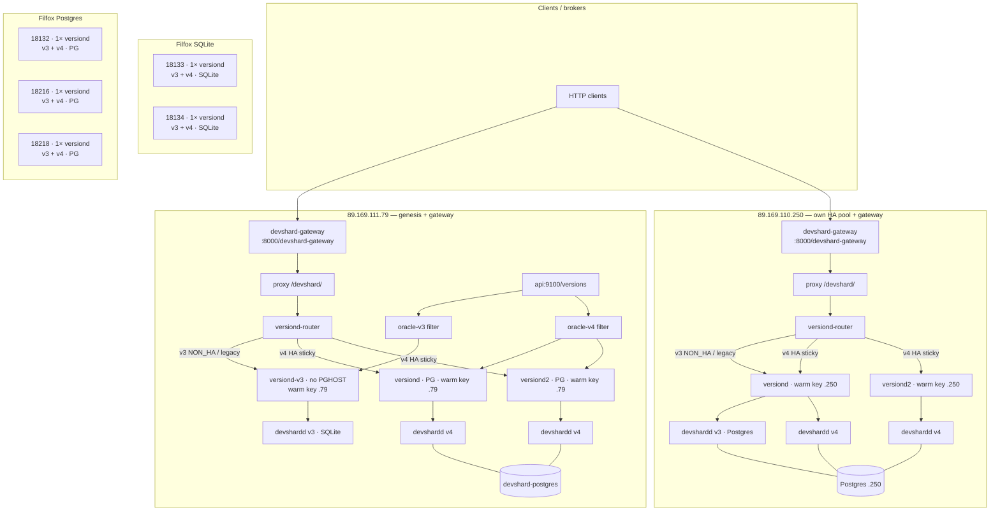

# Plan: v3 + v4 HA and gateway (gonka-testnet)

**Status:** Deploy + Phase D smoke + HA kill-tests (§3) + **§2 validation lease race** + **§7 rolling SHA** on **`.79`** done. Optional leftover: reclaim unsettled escrows 3/4/5.  
**Chain:** `gonka-testnet`  
**Branch / docs:** [devshard-0.2.14-v4](https://github.com/gonka-ai/gonka/tree/devshard-0.2.14-v4) · [release notes](https://github.com/gonka-ai/gonka/blob/devshard-0.2.14-v4/devshard/docs/release-0.2.14-v4.md) · [v4 deploy test plan](https://github.com/gonka-ai/gonka/blob/devshard-0.2.14-v4/devshard/docs/v4-deploy-test-plan.md) · [HA architecture](https://github.com/gonka-ai/gonka/blob/devshard-0.2.14-v4/devshard/docs/high-availability-architecture.md)

**Live on `.79` (2026-07-25):** `oracle-v3` / `oracle-v4`, `versiond-v3` (1× v3 SQLite), `versiond` + `versiond2` (1× v4 each, Postgres), `versiond-router`, proxy → router; **`devshard-gateway`** (`testnet-v4-local`, `DEVSHARD_CHAIN_GRPC=node:9090`, `DEVSHARD_ROUTE_PREFIX=/devshard/v4`, admin `:18080`).

**Live on `.250` (2026-07-25):** `oracle-v4`, `versiond` (v3+v4 Postgres, legacy for v3), `versiond2` (v4 only), `versiond-router`, `devshard-postgres`; warm key `join-2`; **`devshard-gateway`** (same image/`CHAIN_GRPC` pattern, `config.devshard.env`, storage `.devshardctl-250`, admin `:18080`, route left on `/devshard/v4`).

**Phase D smoke:**
- **`.79`:** v3 escrow **6** + v4 escrow **7** — chat **200** + on-chain **settled** (Inference window).
- **`.250`:** v3 escrow **10** + v4 escrow **11** — chat **200** + on-chain **settled** (admin API key for chat; `api_key` model_limits update blocked by `default_request_max_tokens` > cap).

**§2 Validation lease race (`.79`) — PASS**
- First run (escrows 14/15): uniqueness OK; many `pending` under confirmation PoC; `versiond2` quiet. Logs `/tmp/lease-race-79-20260725-090044`.
- **Rerun (escrow 16, Inference window):** gov `validation_rate=10000`; mempool warm **200** on both `versiond`/`versiond2`; **40/40** chats 200; **18** leases all **`submitted`**, **0 duplicates**, **0 pending**, **0** `no nodes`; settle tx `9EC54FB3…`. Still little `should_validate` on `versiond2` (note `cross_replica_offer_weak`). Log `/tmp/lease-race-79-rerun-20260725-093033`.
- **Cross-replica Offer (escrow 17, round-robin):** temporarily disabled sticky (`hash $sticky_key consistent` commented out → RR); same escrow hit both upstreams 8/8. **40/40** chats 200; **12** leases all **`submitted`**, **0 duplicates**; `should_validate` on **both** (`versiond` 24, `versiond2` 20); losers logged `validation leased by another instance` on both sides; settle tx `A753073B…`. Sticky **restored** after test. Log `/tmp/lease-race-rr-20260725-115915`.

**Live on filfox (2026-07-25):** single `versiond:0.2.14-devshard-v4` each; **18133/18134** SQLite (`PGHOST` empty); **18132/18216/18218** Postgres (`PGHOST=postgres`, `DEVSHARD_STORAGE_MODE=postgres`); v3+v4 healthz OK.

**v4 zip (live on `.79` after §7):**  
http://89.169.111.79:8000/devshard-assets/devshardd-v4-r4.zip  
SHA256: `9c40ee1ddab5729a4158f61713681dd269aec39a23256d1ff51ffb719d8cff4e`  
(`binary_version=0.2.14-v4-r4`, supports `--print-storage-mode`)

**v3 zip (official):**  
https://github.com/gonka-ai/gonka/releases/download/release%2Fv0.2.13-devshard-v3.0.0/devshardd.zip  
SHA256: `ca1294fc8db3f0907a01f362eb4b13665f66d0fd12cfc6f01468b1e27f0bab63`

---

## Fleet

| Host | SSH |
|------|-----|
| 89.169.111.79 | `ubuntu@89.169.111.79` |
| 89.169.110.250 | `ubuntu@89.169.110.250` |
| filfox 18132 | `decentai@xj7-5.s.filfox.io -p 18132` |
| filfox 18133 | `decentai@xj7-5.s.filfox.io -p 18133` |
| filfox 18134 | `decentai@xj7-5.s.filfox.io -p 18134` |
| filfox 18216 | `decentai@xj7-5.s.filfox.io -p 18216` |
| filfox 18218 | `decentai@xj7-5.s.filfox.io -p 18218` |

---

## Locked decisions

| Topic | Choice |
|--------|--------|
| Governance `approved_versions` | **v3 + v4 only** (remove v1 and v2); add v4 zip + sha256 |
| `VERSIOND_NON_HA_VERSIONS` | **`v3`** |
| `VERSIOND_LEGACY_HOST` (**.79**) | **`versiond-v3`** (dedicated SQLite process — **not** in the HA pool) |
| `VERSIOND_HOSTS` (**.79**) | **`versiond versiond2`** (v4 HA only; both share `devshard-postgres` + `.79` warm key) |
| **v3 storage** | **SQLite** on **.79** via **`versiond-v3`** (no `PGHOST`). **SQLite** on **filfox 18133 / 18134**. **Postgres** on **.250**. Remaining filfox (18132, 18216, 18218): Postgres if `PGHOST` set |
| **v4 storage** | **Postgres** on HA participants (.79, .250). Filfox: same process env as that host (SQLite on 18133/18134; Postgres on the other three if `PGHOST` set) |
| `.79` HA | **Mandatory:** `versiond` + `versiond2` + `versiond-router` + separate **`versiond-v3`**, Postgres **on .79**, **.79 warm key** |
| `.250` HA | **Mandatory:** same pattern, Postgres **on .250**, **.250 warm key** (separate pool — not in `.79`’s `VERSIOND_HOSTS`) |
| Filfox | **One `versiond` each** (children for v3 + v4); no multi-versiond HA |
| Gateway | **Both `.79` and `.250`** — each runs its own `devshard-gateway` against that host’s `PUBLIC_API` + `/devshard/{version}/…` (local proxy → local `versiond-router`). v4 transport = **`DEVSHARD_CHAIN_GRPC`** (no LCD REST). Public paths: `http://89.169.111.79:8000/devshard-gateway`, `http://89.169.110.250:8000/devshard-gateway` (admin each on `127.0.0.1:18080`) |
| Existing gateway escrows | **Settle / remove if possible**; do **not** migrate them to other versions; create **new** escrows only for smoke tests when needed |
| `VERSIOND_ORACLE` (**.79**) | **Filtered local oracles** (chosen): `oracle-v3` serves only `v3`; `oracle-v4` serves only `v4`. Avoids orphan `devshardd` children. Long-term: upstream `VERSIOND_ALLOW_VERSIONS`. |

### HA vs separate validators

- Two HA `versiond` instances share **one** warm key / `KEY_NAME` / Postgres (replicas of **one** participant).
- `.250` is a **different** validator → its **own** HA pair + **own** Postgres.
- Never put `.250` in `.79`’s `VERSIOND_HOSTS` (or the reverse).

### Storage constraint

One `versiond` process inherits one `PGHOST` for **all** of its children — so **true v3 SQLite + v4 Postgres on the same host requires two `versiond` processes**.

- **.79 (redesign):** `versiond-v3` with **no `PGHOST`** (SQLite) + HA pair `versiond`/`versiond2` with **`devshard-postgres`** (v4). Router: `VERSIOND_LEGACY_HOST=versiond-v3`, `VERSIOND_NON_HA_VERSIONS=v3`, `VERSIOND_HOSTS=versiond versiond2`.
- Filfox **18133 / 18134**: leave `PGHOST` unset ⇒ **v3 and v4 both SQLite** (acceptable for participate-only).
- **.250**: `PGHOST` set ⇒ **v3 and v4 both Postgres** (required for that host’s plan).

### Mental model (upstream intent)

- Each `versiond` can run **multiple** `devshardd` children (`v3`, `v4`, …).
- Multiple `versiond` instances = HA for **one** participant (same warm key), often on different machines — here both HA replicas on the same box for `.79` and for `.250`.
- **Router already supports a distinct legacy host** (`VERSIOND_LEGACY_HOST`) that need not be in `VERSIOND_HOSTS`.
- Gateway does **not** manage the versiond pool; it calls `PUBLIC_API` + `/devshard/{version}/…`. **`versiond-router`** sticky-hashes on escrow/session id for HA versions.
- Adding a HA peer **today:** update `VERSIOND_HOSTS` + **recreate `versiond-router`** (static list; no auto-discovery yet).

### `.79` split + filtered oracles (chosen — no wasted children)

**Goal:** v3 SQLite and v4 Postgres HA on the same host **without** unused `devshardd` processes.

Stock `versiond` starts a child for **every** name in chain `approved_versions`. To run “only v3” / “only v4” per process without a code change, each `versiond` points at a **filtered local oracle** that rewrites `api:9100/versions` to a single-name list.

| Process | `VERSIOND_ORACLE_URL` | Starts | Storage |
|---------|----------------------|--------|---------|
| `versiond-v3` | `http://oracle-v3:9100/versions` | **v3 only** | SQLite (no `PGHOST`) |
| `versiond` | `http://oracle-v4:9100/versions` | **v4 only** | Postgres |
| `versiond2` | `http://oracle-v4:9100/versions` | **v4 only** | Postgres |

Router (unchanged contract):

| Env | Value |
|-----|--------|
| `VERSIOND_HOSTS` | `versiond versiond2` |
| `VERSIOND_LEGACY_HOST` | `versiond-v3` |
| `VERSIOND_NON_HA_VERSIONS` | `v3` |

```text
api:9100/versions  (chain: v3 + v4)
        │
        ├─ oracle-v3 ──► [{v3}] ──► versiond-v3 ──► /devshard/v3 (SQLite)
        │
        └─ oracle-v4 ──► [{v4}] ──► versiond + versiond2 ──► /devshard/v4 (HA + PG)
                                      ▲
                                      └── versiond-router (sticky / Devshard-Ha)
```

**Do not** put `versiond-v3` in `VERSIOND_HOSTS`.

Compose overlay on `.79`: `docker-compose.devshard-ha-split.override.yml` (+ script `scripts/devshard-oracle-filter.py`).

---

## Target architecture

### Host × instance map



### ASCII overview

```text
api:9100/versions (v3+v4 on chain)
   ├─ oracle-v3 → versiond-v3 → v3 SQLite     ← VERSIOND_LEGACY_HOST
   └─ oracle-v4 → versiond + versiond2 → v4 PG ← VERSIOND_HOSTS (HA)
                      ▲
               versiond-router ← proxy /devshard/
```

---

## Phased execution

### Phase 0 — Preflight (all 7 hosts) — **DONE** (gov + `.79` escrow clear; full 7-host inventory earlier)

1. Confirm chain sync; avoid proxy/node/versiond recreates during PoC.
2. Inventory compose overlays, `versiond`, postgres, gateway (especially `.79` / `.250`).
3. Align deploy artifacts to **devshard-0.2.14-v4** images/compose.
4. **Governance:** set `approved_versions` to **v3 + v4** only (drop v1, v2; register v4 URL + sha256).
5. On `.79` gateway: **settle / deactivate / remove** existing escrows if possible; do not recreate them for migration.

### Phase A — `.79` baseline (gateway + v4 image + Postgres) — **DONE**

Superseded in detail by Phase B split; kept as history of the intermediate step.

1. Built local images (`versiond` / `versiond-router` / gateway) — GHCR `0.2.14-devshard-v4` tags were missing.
2. Brought up **`devshard-postgres`**; recreated `versiond` with `DEVSHARD_STORAGE_MODE=postgres`.
3. Confirmed gov: only v3+v4; `/devshard/v3|v4/healthz` OK.
4. Gateway → `DEVSHARD_CHAIN_GRPC=node:9090` (image `testnet-v4-local`).
5. Note: single-`versiond` with shared `PGHOST` could not keep v3 on SQLite — fixed in Phase B via `versiond-v3` + filtered oracles.

### Phase B — Participant HA

**On `.79` (split + filtered oracles) — DONE**

1. `oracle-v3` / `oracle-v4` filters (`ORACLE_ALLOW=v3` / `v4`).
2. **`versiond-v3`**: no `PGHOST`; oracle → `oracle-v3`; `./devshards-v3/data`.
3. HA **`versiond` + `versiond2`**: Postgres; oracle → `oracle-v4`.
4. `VERSIOND_HOSTS=versiond versiond2`, `VERSIOND_LEGACY_HOST=versiond-v3`, `VERSIOND_NON_HA_VERSIONS=v3`.
5. Proxy `VERSIOND_SERVICE_NAME=versiond-router`; router + proxy recreated.
6. Verified: **one child per versiond**; v3 → `versiond_legacy`; v4 → `versiond_ha_pool`.

**On `.250` — DONE**

1. Loaded v4 `versiond` / `versiond-router` images from `.79`; added `docker-compose.versiond.yml` + `docker-compose.devshard-ha-250.override.yml`.
2. `devshard-postgres` + `oracle-v4` (v4-only filter for `versiond2`).
3. **`versiond`** (`KEY_NAME=join-2`): full oracle → **v3 + v4**, Postgres; **`VERSIOND_LEGACY_HOST`**.
4. **`versiond2`**: oracle-v4 → **v4 only**, Postgres.
5. Router: `VERSIOND_HOSTS=versiond versiond2`, `NON_HA=v3`, `LEGACY_HOST=versiond`; proxy → `versiond-router`.
6. Verified: v3 → `versiond_legacy`; v4 → `versiond_ha_pool`; healthz 200.
7. **`devshard-gateway`:** image `testnet-v4-local` (loaded from `.79`), `docker-compose.devshard-gateway.yml` + `config.devshard.env`, `DEVSHARD_CHAIN_GRPC=node:9090`, storage `.devshardctl-250`. Replaced stale host-process `devshardctl` that previously bound `:18080` (old escrow 188 / v2 load-test).

**HA kill-tests (§3) — DONE (2026-07-25)** on both HA pairs (stopped **`versiond2`**, survivor **`versiond`**):

| Host | Baseline ≥2 ups | Sticky failover to survivor | After-kill all → survivor | Gateway chat while down | Pool restored after `docker start versiond2` | Logs |
|------|-----------------|----------------------------|---------------------------|-------------------------|-----------------------------------------------|------|
| `.79` | yes (`10`+`18`) | yes (pinned `ha-pin-kill-1`) | yes | **200** `ha-79-during-kill-ok` (escrow 12) | yes | `/tmp/ha-kill-79-20260725-084122` |
| `.250` | yes (`10`+`15`) | yes (pinned `ha-pin-kill-1`) | yes | **200** `ha-250-during-kill-ok` (escrow 13) | yes | `/tmp/ha-kill-250-20260725-084252` |

Note: `/devshard/v4/sessions/*/healthz` returns **404** with routing headers — expected; pass/fail used `X-Upstream-Addr` + non-502/503 + gateway chat.

**§7 Rolling SHA (`.79`) — PASS** (gov **#13**, escrow **21**, log `/tmp/rolling-sha-r4-20260725-131324`)
- Built/published `devshardd-v4-r4` with `--print-storage-mode` → `postgres` (avoids stop/start fallback).
- Timing: vote → wait until **T−2m** → start SSE on **r3** (`d21511…`) → PASS → download → **overlap** (`swapped child route; old child draining`) → idle drain → **r4 only** (`9c40ee…`, port 5002).
- Timeline: vote `13:13:33Z`, SSE first chunk on old `13:21:28Z`, PASS `13:23:35Z`, new child start/swap `13:23:38Z` (~3s after PASS). No `rolling overlap disabled` / stop/start.
- Note: SSE finished early (`STREAM_EXIT` ~2s after first chunk); overlap proven from versiond logs + healthz, not from a stream held through the roll.
- After test: `VERSIOND_HOSTS=versiond versiond2` restored; sticky still on.

### Phase C — Filfox join hosts — **DONE**

1. Loaded `versiond:0.2.14-devshard-v4` on all five; one `versiond` each (no HA).
2. **18133 & 18134:** `docker-compose.devshard-filfox-sqlite.override.yml` — `PGHOST` cleared → **SQLite** for v3+v4.
3. **18132, 18216, 18218:** `docker-compose.devshard-filfox-pg.override.yml` — keep `PGHOST=postgres` + `DEVSHARD_STORAGE_MODE=postgres`.
4. Verified healthz v3/v4 **200** on all; not added to `.79`/`.250` `VERSIOND_HOSTS`.

### Phase D — Gateway smoke — **DONE** (`.79` + `.250`; chat + settle)

Gateways are **single-route** (`DEVSHARD_ROUTE_PREFIX`); smoke switches `/devshard/v3` then `/devshard/v4` and recreates the gateway container.

**On `.79`**

1. Funded creator from genesis `gonka-account-key` (`home=/srv/dai/.inference`).
2. **v3:** escrow **6** — chat **200** (`phase-d-v3-ok`); backend `versiond_legacy`; **settled** on-chain.
3. **v4:** escrow **7** — chat **200** (`phase-d-v4-ok`); backend `versiond_ha_pool`; **settled** on-chain.
4. Earlier escrows **3/4/5** still unsettled on-chain (first smoke during PoC / race cleanup / sig issues). Gateway left on `/devshard/v4`.

**On `.250`**

1. Installed docker gateway (see Phase B §7); same creator key; Inference window.
2. **v3:** escrow **10** — chat **200** (`phase-d-250-v3-ok`); backend `versiond_legacy`; **settled**.
3. **v4:** escrow **11** — chat **200** (`phase-d-250-v4-ok`); backend `versiond_ha_pool`; **settled**.
4. Chat used **admin** API key (settings `model_limits`/`access_mode=api_key` rejected: `default_request_max_tokens` 10000 > `request_max_tokens_cap` 4096). Gateway left on `/devshard/v4`.

### Phase E — Later (out of scope for first ship)

- Retire v3 from `NON_HA` or remove v3 from gov when ready.
- Router auto-discovery without reboot (upstream follow-up).

---

## Ops cheat sheet

```bash
cd /srv/dai/gonka/deploy/join
source config.env
files=(-f docker-compose.yml -f docker-compose.mlnode.yml)
for f in docker-compose.env-override.yml \
         docker-compose.genesis-override.yml \
         docker-compose.runtime-override.yml \
         docker-compose.rpc-override.yml \
         docker-compose.postgres.yml \
         docker-compose.devshard-assets-override.yml \
         docker-compose.versiond.yml \
         docker-compose.devshard-ha-split.override.yml; do
  [ -f "$f" ] && files+=(-f "$f")
done
docker compose "${files[@]}" up -d --no-deps --force-recreate <service>
# Gateway (separate compose):
#   docker compose -f docker-compose.devshard-gateway.yml up -d --no-deps --force-recreate devshard-gateway
```

- Prefer **Inference** (non-PoC) for proxy / versiond / router recreates.
- Monitors / status: prefer **`session_version`**, not legacy `protocol_version`.
- Gateway never lists versiond replicas.

---

## Success criteria

- [x] Chain `approved_versions` = **v3, v4** only
- [x] `.79`: **`versiond-v3`** SQLite + `oracle-v3`; **`versiond`+`versiond2`** v4 HA + `oracle-v4` + `devshard-postgres`; router `LEGACY_HOST=versiond-v3`; **one child per versiond**
- [x] `.250`: v3 **Postgres**; v4 HA ×2 + Postgres on `.250`
- [x] Filfox **18133 & 18134**: v3 (and local v4) **SQLite**
- [x] Filfox **18132, 18216, 18218**: Postgres children when `PGHOST` set
- [x] Gateway on **`.79`** and **`.250`** (`testnet-v4-local`, `CHAIN_GRPC`); Phase D chat+settle smoke on both
- [x] HA: kill one `versiond` (`versiond2`) on `.79` and on `.250`; v4 traffic survives via peer; restart rejoins pool
- [x] Test plan **§2** (validation leases): uniqueness PASS on `.79` (gov #8 `validation_rate=10000`; see status notes)
- [x] Test plan **§7** (rolling SHA): r3→r4 overlap on `.79` (gov #13; see status notes)

---

## Explicit non-goals

- Filfox multi-versiond HA
- Keeping or migrating current `.79` escrow IDs onto new versions
- Auto `VERSIOND_HOSTS` discovery (manual router update for now)
- Cross-host gateway → remote versiond pool (each gateway uses **local** proxy/router only)

---

## Related local context (`.79`)

- Gov proposal passed: approved_versions **v3 + v4** only (self-hosted v4 zip + sha).
- Old gateway escrows 1/2 removed locally (on-chain settle failed signatures / not found).
- Images built locally on host (`versiond` / `versiond-router` / gateway `testnet-v4-local`) — GHCR `*:0.2.14-devshard-v4` was unavailable.
- Overlay: `docker-compose.devshard-ha-split.override.yml` + `scripts/devshard-oracle-filter.py`.
- v4 zip: `http://89.169.111.79:8000/devshard-assets/devshardd-v4.zip`.

## Related local context (`.250`)

- Overlay: `docker-compose.devshard-ha-250.override.yml` + `oracle-v4`; gateway: `docker-compose.devshard-gateway.yml` + `config.devshard.env`.
- Gateway image loaded from `.79` (`ghcr.io/gonka-ai/devshard-gateway:testnet-v4-local`); storage host dir `.devshardctl-250`.
- Stale host `devshardctl` on `:18080` (escrow 188 / v2) stopped to free the port for docker gateway.