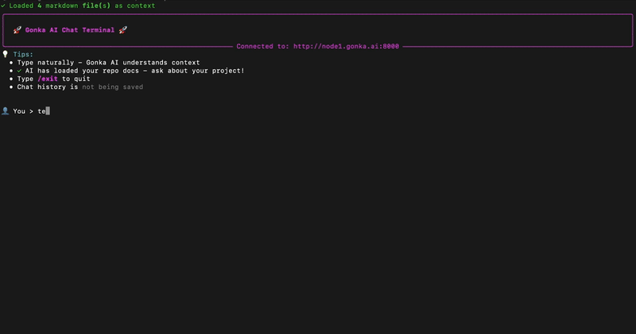

# Gonka Chat CLI Example

A fun, illustrative toy example showing what's possible when you build on top of Gonka AI!

This is a playful demonstration of a chat CLI interface that talks to Gonka AI's decentralized ML nodes. While it's a simple proof-of-concept, it showcases the real potential of building applications on Gonka AI's infrastructure - imagine what you could create!

## Demo



## Files

- `gonka_chat_cli.py` - Python implementation of the chat CLI with real-time streaming support
- `demo.gif` - Demonstration of the CLI in action

## Usage

```bash
python gonka_chat_cli.py
```

The CLI provides:
- Real-time streaming responses from ML nodes
- Plain text formatting for better readability
- Performance metrics (tokens/second, response time)
- Interactive chat interface

## Features

- Stream responses in real-time as they're generated
- Clean, readable output without markdown artifacts
- Automatic retry logic for failed requests
- Graceful error handling
- Performance monitoring and metrics

## What Could You Build?

This toy example barely scratches the surface! The Gonka AI network opens up possibilities for:
- Custom AI-powered applications
- Decentralized chatbots and assistants
- Integration with your existing tools and workflows
- Novel ML-powered services that leverage decentralized compute

Have fun exploring and building on Gonka AI!
