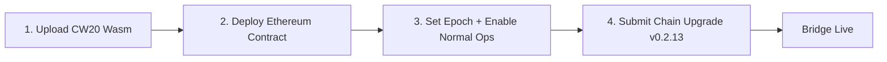

# Ethereum Bridge Mainnet Deployment Plan

> Gonka Mainnet API: `https://node3.gonka.ai/chain-api`
> Ethereum Mainnet: Chain ID `1`

---

## Overview



All steps must be completed **before** submitting the `v0.2.13` upgrade proposal, which atomically registers the bridge address and CW20 code ID on the Gonka chain.

---

## Pre-Requisites

| Item | Details |
|------|---------|
| Gonka binary | `inferenced` built from the release branch |
| Ethereum wallet | Funded EOA or Ledger — enough ETH for deploy + 3 txns |
| Multisig (optional) | Gnosis Safe or similar for Ethereum contract ownership |
| Hardhat project | `proposals/ethereum-bridge-contact/` with `npm install` done |
| `.env` file | `MAINNET_RPC_URL`, `PRIVATE_KEY` or `LEDGER_ADDRESS`, `GONKA_CHAIN_ID=gonka-mainnet` |

---

## Step 1 — Upload Wrapped Token CW20 Wasm

Upload the CW20 contract artifact to Gonka mainnet. This gives us a `code_id` for the upgrade proposal.

**Using the script** (recommended):

```bash
cd proposals/ethereum-bridge-contact/scripts
./upload-wrapped-token-wasm.sh --key <KEY_NAME>

# With custom home/node:
./upload-wrapped-token-wasm.sh --key mykey --home ~/.inference --node https://node3.gonka.ai/chain-rpc/
```

The script auto-resolves the wasm from `inference-chain/contracts/wrapped-token/artifacts/wrapped_token.wasm`, uploads it, waits for confirmation, and prints the `CODE_ID`.

> [!IMPORTANT]
> Save this `CODE_ID` — it goes into the upgrade proposal's `Plan.Info` JSON.

---

## Step 2 — Deploy Ethereum Bridge Contract

Two deployment paths depending on key management:

### Option A: Single Signature → Migrate to Multisig

Deploy with a single EOA, configure the bridge, then transfer ownership to a multisig.

#### 2A.1 — Deploy

```bash
cd proposals/ethereum-bridge-contact

# .env must have MAINNET_RPC_URL and PRIVATE_KEY set
HARDHAT_NETWORK=mainnet node deploy.js
```

Output will show the deployed contract address.

#### 2A.2 — Configure (while still single-owner)

Complete Steps 3.1 and 3.2 below (set epoch + enable normal operation) while the EOA is still the owner.

#### 2A.3 — Create Gnosis Safe (2/3 multisig)

1. Go to [safe.global](https://app.safe.global) → **Create New Safe** on Ethereum mainnet
2. Add **3 signer addresses** (owner EOAs)
3. Set **Threshold: 2** (requires 2 of 3 to execute)
4. Deploy the Safe → note the Safe address

#### 2A.4 — Transfer ownership to multisig

```bash
HARDHAT_NETWORK=mainnet node transfer-ownership.js \
  <BRIDGE_CONTRACT_ADDRESS> \
  <GNOSIS_SAFE_ADDRESS>
```

The contract uses OpenZeppelin `Ownable2Step` — the Safe must then call `acceptOwnership()`:

1. Go to Safe → **New Transaction** → **Contract Interaction**
2. Enter the BridgeContract address + ABI (from `artifacts/contracts/BridgeContract.sol/BridgeContract.json`)
3. Call `acceptOwnership()` → Collect 2/3 signatures → Execute

> [!TIP]
> This is the simpler path. The deployer EOA handles initial setup (deploy + set epoch + enable), then hands off to the multisig for ongoing operations.

### Option B: Deploy Directly from Multisig

Deploy the contract via a Gnosis Safe transaction. All operations require 2/3 multisig approval from the start.

#### 2B.1 — Create Gnosis Safe (2/3 multisig)

Same as 2A.3: create a Safe on [safe.global](https://app.safe.global) with 3 signers, threshold = 2.

#### 2B.2 — Prepare deployment bytecode

```bash
cd proposals/ethereum-bridge-contact
npx hardhat compile
```

The compiled bytecode is in `artifacts/contracts/BridgeContract.sol/BridgeContract.json` → `bytecode` field.

#### 2B.3 — Constructor arguments

The contract constructor requires two `bytes32` arguments:

| Argument | Value | How to compute |
|----------|-------|----------------|
| `gonkaChainId` | `keccak256("gonka-mainnet")` | `ethers.sha256(ethers.toUtf8Bytes("gonka-mainnet"))` |
| `ethereumChainId` | `0x0000...0001` (chain ID 1) | `ethers.zeroPadValue("0x01", 32)` |

#### 2B.4 — Deploy via Gnosis Safe

1. Go to Safe → **New Transaction** → **Transaction Builder**
2. Set **To**: `0x` (contract creation) with the ABI-encoded `bytecode + constructor args` as data
3. Collect 2/3 signatures → Execute
4. Note the deployed contract address from the transaction receipt

> [!WARNING]
> All subsequent admin calls (`setGroupKey`, `resetToNormalOperation`) will also require 2/3 multisig approval. Steps 3.3 and 3.4 below must be executed through the Safe UI instead of CLI scripts.

---

## Step 3 — Set Epoch and Enable Normal Operation

### 3.1 — Query current Gonka epoch

**Using the script:**

```bash
cd proposals/ethereum-bridge-contact/mainnet
./query-gonka-epoch.sh
```

This prints the current epoch index and group key, plus the exact `submit-epoch.js` command to run next.

### 3.2 — Get the epoch's BLS group key

```bash
inferenced query inference show-epoch-group-data <EPOCH_INDEX> \
  --node https://node3.gonka.ai/chain-rpc/ \
  --output json | jq -r '.epoch_group_data.group_key'
```

This returns a **base64-encoded compressed BLS G2 key**. The `submit-epoch.js` script handles conversion to EIP-2537 format automatically.

### 3.3 — Submit genesis epoch to the Ethereum contract

This uses the admin `setGroupKey()` function (only available in `ADMIN_CONTROL` state):

```bash
cd proposals/ethereum-bridge-contact

HARDHAT_NETWORK=mainnet node submit-epoch.js \
  <BRIDGE_CONTRACT_ADDRESS> \
  <EPOCH_INDEX> \
  <GROUP_KEY_BASE64>
```

### 3.4 — Enable normal operation

Transitions the contract from `ADMIN_CONTROL` → `NORMAL_OPERATION`:

```bash
HARDHAT_NETWORK=mainnet node enable-normal-operation.js \
  <BRIDGE_CONTRACT_ADDRESS>
```

### 3.5 — Verify contract state

```bash
HARDHAT_NETWORK=mainnet node get-contract-state.js \
  <BRIDGE_CONTRACT_ADDRESS>
```

Expected output:
- State: `NORMAL_OPERATION`
- Latest Epoch ID: matches `<EPOCH_INDEX>`
- Group Key: non-zero 256-byte value

### 3.6 — Catch up to current epoch (if needed)

If time has passed between deploy and upgrade, the contract may be behind by one or more epochs. Each new epoch requires a **public** `submitGroupKey` call with a BLS validation signature from the previous epoch's key:

```bash
# For each epoch from (genesis+1) to current:
HARDHAT_NETWORK=mainnet node submit-epoch-public.js \
  <BRIDGE_CONTRACT_ADDRESS> \
  <NEXT_EPOCH_INDEX> \
  <NEXT_GROUP_KEY_BASE64> \
  <VALIDATION_SIGNATURE_BASE64>
```

> [!NOTE]
> Once the bridge node is running, epoch syncing happens automatically. Manual catch-up is only needed for the initial gap.

---

## Step 4 — Submit Chain Upgrade Proposal

With the Ethereum contract address and CW20 code ID in hand, submit the `v0.2.13` upgrade proposal:

```bash
inferenced tx gov submit-proposal \
  /path/to/upgrade-proposal.json \
  --from <KEY_NAME> \
  --chain-id gonka-mainnet \
  --node https://node3.gonka.ai/chain-rpc/ \
  --gas auto --gas-adjustment 1.5 --yes
```

Where `upgrade-proposal.json` contains:

```json
{
  "messages": [
    {
      "@type": "/cosmos.upgrade.v1beta1.MsgSoftwareUpgrade",
      "authority": "<GOV_MODULE_ADDRESS>",
      "plan": {
        "name": "v0.2.13",
        "height": "<TARGET_BLOCK_HEIGHT>",
        "info": "{\"ethereum_bridge_address\":\"<BRIDGE_CONTRACT_ADDRESS>\",\"wrapped_token_code_id\":<CODE_ID>}"
      }
    }
  ],
  "deposit": "25000000ngonka",
  "title": "v0.2.13 Upgrade — Ethereum Bridge Registration",
  "summary": "Registers Ethereum bridge contract, USDC/USDT metadata, trading approvals, and CW20 wrapped token code ID.",
  "metadata": "https://github.com/gonka-ai/gonka"
}
```

The `Plan.Info` JSON is parsed by the upgrade handler to:

| Field | Used For |
|-------|----------|
| `ethereum_bridge_address` | `k.SetBridgeContractAddress()` |
| `wrapped_token_code_id` | `k.SetWrappedTokenCodeID()` |
| _(hardcoded)_ USDC `0xA0b8...` | `k.SetTokenMetadata()` + `k.SetBridgeTradeApprovedToken()` |
| _(hardcoded)_ USDT `0xdAC1...` | `k.SetTokenMetadata()` + `k.SetBridgeTradeApprovedToken()` |

---

## Post-Upgrade Verification

After the upgrade executes at the target height:

**Using the script:**

```bash
cd proposals/ethereum-bridge-contact/scripts
./verify-bridge-setup.sh --contract <BRIDGE_CONTRACT_ADDRESS>
```

This checks both the Ethereum contract state and Gonka chain state (bridge addresses, code ID, token metadata).

---

## Deployment Checklist

- [ ] **Step 1**: CW20 wasm uploaded → `CODE_ID = ___`
- [ ] **Step 2**: Ethereum contract deployed → `ADDRESS = 0x___`
- [ ] **Step 2**: Ownership transferred to multisig (if Option A)
- [ ] **Step 3.3**: Genesis epoch submitted (epoch `___`)
- [ ] **Step 3.4**: Normal operation enabled
- [ ] **Step 3.5**: Contract state verified
- [ ] **Step 3.6**: Caught up to current epoch (if behind)
- [ ] **Step 4**: Upgrade proposal submitted → Proposal ID `___`
- [ ] **Step 4**: Proposal passed (voting quorum reached)
- [ ] **Post-upgrade**: Bridge address, code ID, and token metadata verified on-chain
