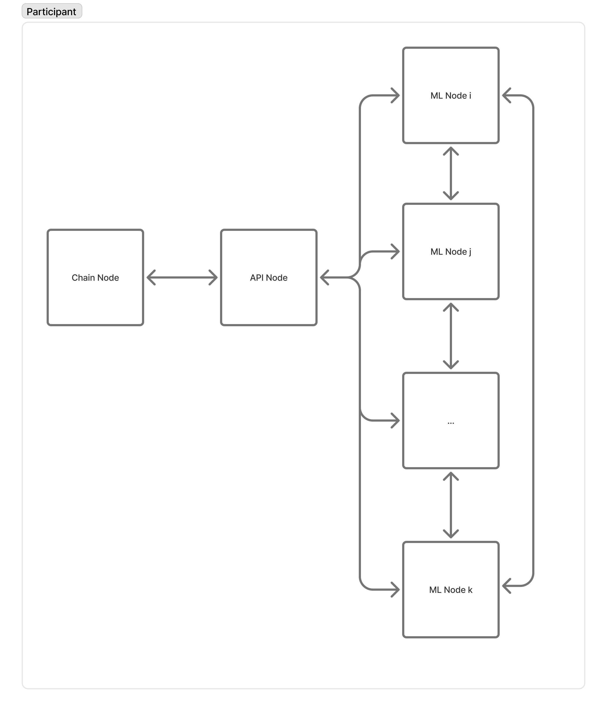
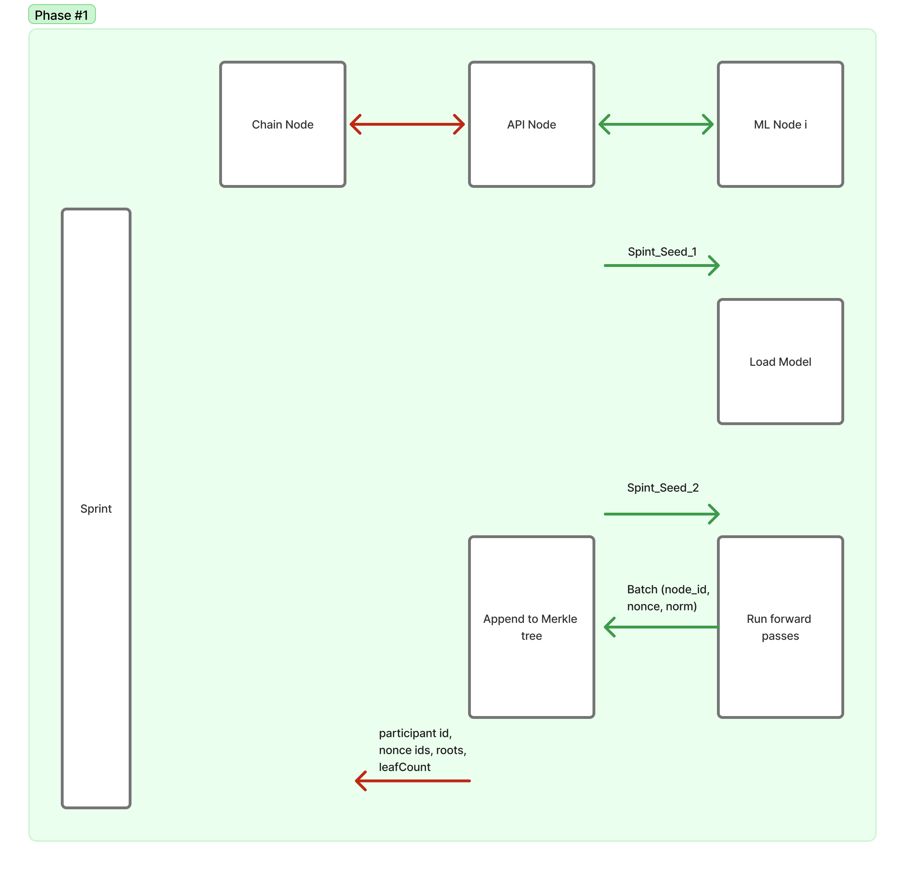
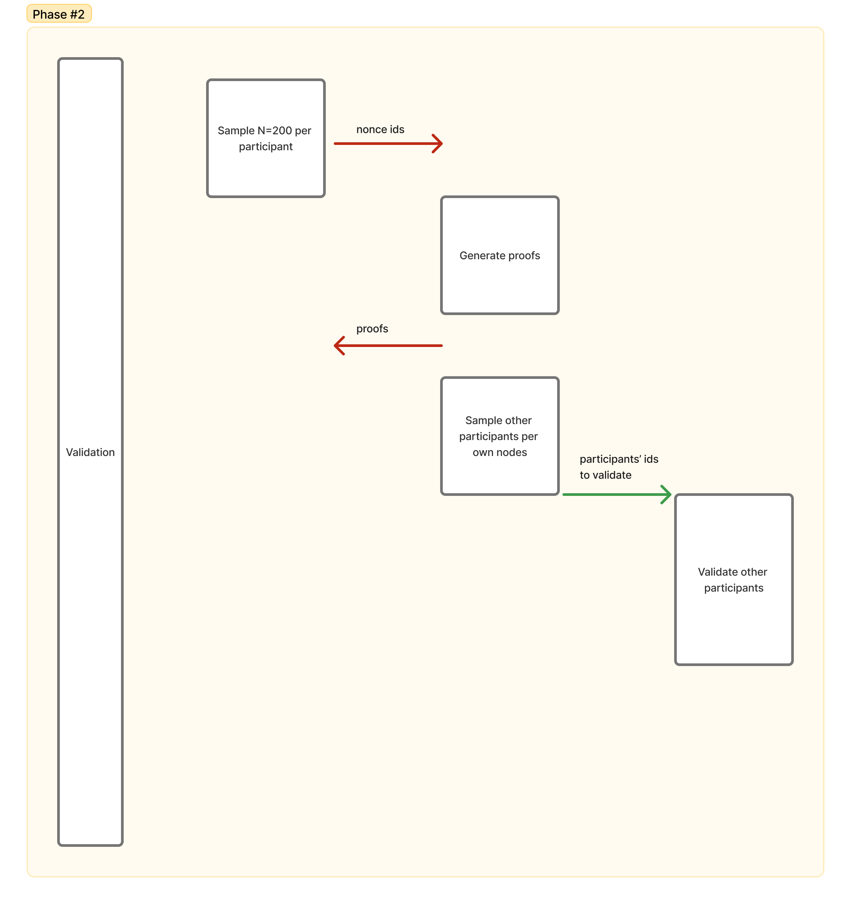

# Proof of Compute Proposal

Chain <> Participant's API Node <> Participant's ML Nodes



## Phase 1 - Sprint

### Process Description

**Initiation**
- **Sprint generation** – at the start of each epoch the chain derives a 256‑bit Sprint_Seed_1 from the latest block hash via a deterministic VRF. This seed is identical for every device participating in the Sprint.
- **Model initialization** – every ML node initializes Transformer based on Sprint_Seed_1.
- **Node Seed creation** - after the model is initialized, every participant generates its unique Node_Seed that is based on its public key.
- **Sprint_Seed_2 broadcast** – after 1 minute (model loading window), the chain emits Sprint_Seed_2, which marks the beginning of the 5‑minute compute window.

**Compute**
- **Each ML‑node iterates over nonce values**. For every nonce, it derives an Input Seed: `InputSeed = H(Node_Seed, Sprint_Seed_2, nonce)`.
- **The Input Seed is mapped to a 4‑token sequence**, which is fed through the Transformer.
- **The last output vector of the sequence is extracted**; its L2‑norm is calculated and stored as the artefact (node_id, nonce, norm).
- **Nodes batch 1 000 artefacts at a time** and stream them to the API node (send ALL nonces, not filtered by target distance)
- **The API node appends each batch into a Merkle tree** corresponding to the node (leaf = hash(nonce, norm, node_id))

**Wrap-up**
- **When the Sprint timer expires**, API finalises **each node-specific Merkle tree**, then hashes their roots into a tiny *meta-tree*.  It submits:
   1. `meta_root` – single 32-byte root stored on-chain
   2. `leaf_counts[]` – array of per-node counts (used by scheduler & sampling)
   3. *(optionally)* `node_roots[]` – individual node roots for auditability (they would anyway be passed during validation for either all nodes of for the majority of them).
   This lets us keep one root on-chain while still tracking work per node.



### Implementation Analysis

**Infrastructure that can be reused with minimal/no changes:**
- ✅ **Epoch timing framework**: `epochParams.IsStartOfPoCStage` / `IsEndOfPoCStage` (just add new timing stage)
- ✅ **Orchestration skeleton**: `NodePoCOrchestrator.StartPoC()` (same flow, different payloads)
- ✅ **Sprint_Seed_1**: `blockHash` generation and distribution already works perfectly
- ✅ **Model initialization**: `ModelWrapper.build()` + `initialize_model_weights_from_rng()` unchanged
- ✅ **Node_Seed**: `public_key` already provides participant-specific seed
- ✅ **4-token mapping**: `get_random_emb()` function works as-is
- ✅ **HTTP infrastructure**: `postGeneratedBatches()` handler, request/response flow
- ✅ **Chain storage framework**: `SetPocBatch()` mechanism (just different data)
- ✅ **Hash functions**: `GenerateSHA256Hash()` for Merkle leaf creation

**Infrastructure requiring careful modification (preserve structure, change logic):**
- ⚠️ **ML node computation**: 
  - **Keep**: Model forward pass, batch processing, streaming logic
  - **Change**: Replace distance-to-target with L2-norm extraction
- ⚠️ **Batch filtering**:
  - **Keep**: Batching (1000 artifacts), streaming mechanism  
  - **Change**: Remove `sub_batch(r_target)` filtering - send everything
- ⚠️ **ProofBatch data structure**:
  - **Keep**: `PublicKey`, `BlockHash`, `BlockHeight`, `Nonces` fields
  - **Change**: `Dist` semantics (L2-norms vs distances) + add `MerkleRoot`, `LeafCount`
- ⚠️ **Input generation**:
  - **Keep**: `get_inputs()` function structure
  - **Change**: Seed formula from `block_hash` to `sprint_seed_2` component
- ⚠️ **Chain submission**:
  - **Keep**: `SetPocBatch()` framework and HTTP handlers
  - **Change**: Accept `meta_root` + `leaf_counts[]` (+ optional `node_roots[]`) instead of a single node root

**Completely new implementations:**
- 🆕 **Sprint_Seed_2 generation & timing**: New epoch stage with 1-minute delay after Sprint_Seed_1, then seed distribution
- 🆕 **Model loading window**: 1-minute buffer to ensure all nodes (including 16-core CPUs with RTX 3090) complete 400M-parameter model initialization from deterministic seed
- 🆕 **Merkle tree library**: Replace `cosmossdk.io/store/rootmulti` (blockchain-specific) with `github.com/ComposableFi/go-merkle-trees` or `github.com/arriqaaq/merkletree`
- 🆕 **Merkle tree construction**: (a) incremental per-node trees, (b) meta-tree over node roots, (c) proof generation that concatenates paths
- 🆕 **L2-norm extraction**: `torch.linalg.norm(output_vector)` computation

## Phase 2 - Validation

### Process Description

**Proof Generation**
- **Determine nonces to validate**: deterministically sample N = 200 nonce ids per participant (sampled uniformly across all leaves from that participant's nonces).
- **API node extracts each (nonce, norm) and its Merkle path** and posts proof on chain.

**Proof Validation**
- **Participants' ML‑nodes split the work** of re‑running the 200 nonces for every peer.
- **Each check**: recompute ||output||_2 and compare with submitted proof.
- **Results posted on chain** as a float p. *For example, probability of the fact that the participant submitted honest number of nonces).*
- **Finalisation**: Each validator votes "valid" or "invalid" on each participant's proof. Votes are weighted by each validator's voting power from the previous epoch. If a participant gets >50% weighted "valid" votes, they're approved and get voting power = leafCount for this epoch.
  
- **Compensation**: nodes parked by the scheduler (running inference during the Sprint) receive voting weight compensation equal to their nodes leafCount from previous epoch. *Can complicate, average over time but probably don't need to.*



### Implementation Analysis

**Infrastructure that can be reused:**
- ✅ **Epoch timing**: `epochParams.IsStartOfPoCValidationStage` / `IsEndOfPoCValidationStage` 
- ✅ **Validation orchestration**: `MoveToValidationStage()` / `ValidateReceivedBatches()`
- ✅ **Validation framework**: `inference_validation.go` logic structure
- ✅ **Node work distribution**: `sendInitValidateRequest()`
- ✅ **ML node communication**: `nodeBroker` system
- ✅ **Result structure**: `ValidatedBatch` struct
- ✅ **Weight system**: Existing voting weight from chain state
- ✅ **Weighted voting system**: Current `calculateValidationOutcome()` with >1/2 threshold using previous epoch weights already implemented in `chainvalidation.go`

**Changes needed:**
- ⚠️ **Validation scope**: Modify `ValidateReceivedBatches()` to use sampled nonces only
- ⚠️ **Validation logic**: Compare recomputed vs submitted L2-norms instead of current logic

**New implementations required:**
- 🆕 **Deterministic sampling**: Function for uniform nonce selection (N=200)
- 🆕 **MerkleProofSubmission**: Struct with paths and sampled data
- 🆕 **Chain message types**: `MsgSubmitPocMerkleRoot` for Sprint, `MsgSubmitPocProof` for Validation
- 🆕 **Merkle proof verification**: Current `ibctypes.VerifyMembership()` is for blockchain state; need general-purpose verification (`github.com/ComposableFi/go-merkle-trees` or `github.com/arriqaaq/merkletree`)

---

## Migration Strategy

### Phase 1: Minimal Changes (Sprint Implementation)  
1. ✅ Reuse existing epoch timing with `IsStartOfPoCStage`/`IsEndOfPoCStage`
2. ✅ **Sprint_Seed_1 already works** Current `blockHash` provides deterministic model initialization
3. ✅ **Node_Seed already works** Current `public_key` provides participant-specific seed
4. 🆕 Add Sprint_Seed_2 emission timing with 1-minute delay (new epoch parameter)
5. ✅ **Model initialization already deterministic** - no changes needed

### Phase 2: Computation Changes  
1. ⚠️ Modify InputSeed derivation: Change from `block_hash + public_key + nonce` to `H(Node_Seed, Sprint_Seed_2, nonce)`
2. ✅ **4-token mapping already implemented** via `get_random_emb()` function
3. 🆕 Implement L2-norm calculation of last output vector 
4. ⚠️ Modify `ProofBatch.Dist` to store L2-norms instead of distance-to-target values
5. ⚠️ **Remove target distance filtering**: Send ALL nonces, not just those meeting `r_target` criteria

### Phase 3: Merkle Tree Integration
1. 🆕 Add per-node Merkle trees with `hash(nonce, norm, node_id)` leaves
2. ⚠️ Modify batch submission to build per-node trees of all nonces
3. 🆕 Add Merkle tree library dependency
4. 🆕 Add meta-Merkle tree of depth 1 storing all the per-node roots (allows to submit single root on chain)

### Phase 4: Enhanced Validation
1. 🆕 Add deterministic N=200 nonce sampling 
2. 🆕 Add Merkle path extraction and verification
3. ⚠️ Modify validation to compare recomputed vs submitted L2-norms
4. ✅ **Weighted voting system already implemented**: Current `pocValidated()` function in `chainvalidation.go` already uses >1/2 weighted threshold with previous epoch voting power

---

## Recommended Merkle Tree Libraries

### Primary Choice: `github.com/ComposableFi/go-merkle-trees`
- **Why**: Most advanced, supports incremental leaf addition, built-in proof generation
- **Usage**: `tree.Add(leaf)`, `tree.GenerateProof(index)`, customizable hashing

### Alternative: `github.com/arriqaaq/merkletree` 
- **Why**: RFC6962 compliant, simpler API, well-tested
- **Usage**: `tree.Path(index)`, builds from leaf slice

### Key Integration Points
```go
// Leaf creation using existing infrastructure
func CreateArtifactLeaf(nonce int64, norm float64, nodeId string) []byte {
    data := fmt.Sprintf("%d_%f_%s", nonce, norm, nodeId)
    return []byte(utils.GenerateSHA256Hash(data))
}

// Enhanced ProofBatch struct
type ProofBatch struct {
    Nonces     []int64   `json:"nonces"`
    Dist       []float64 `json:"dist"`      // L2-norms
    MerkleRoot string    `json:"merkle_root"`
    LeafCount  int       `json:"leaf_count"`
}
```

