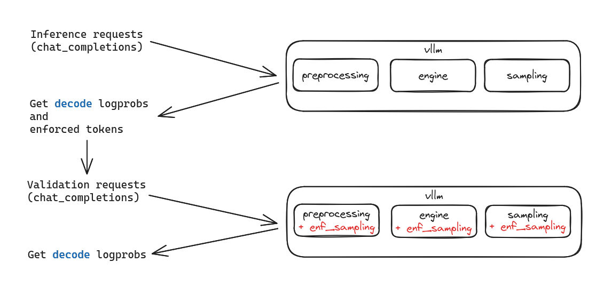
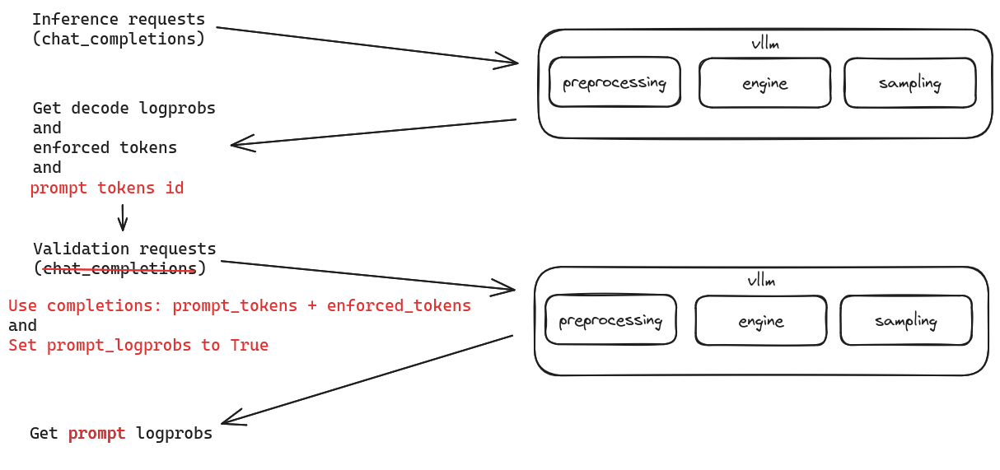
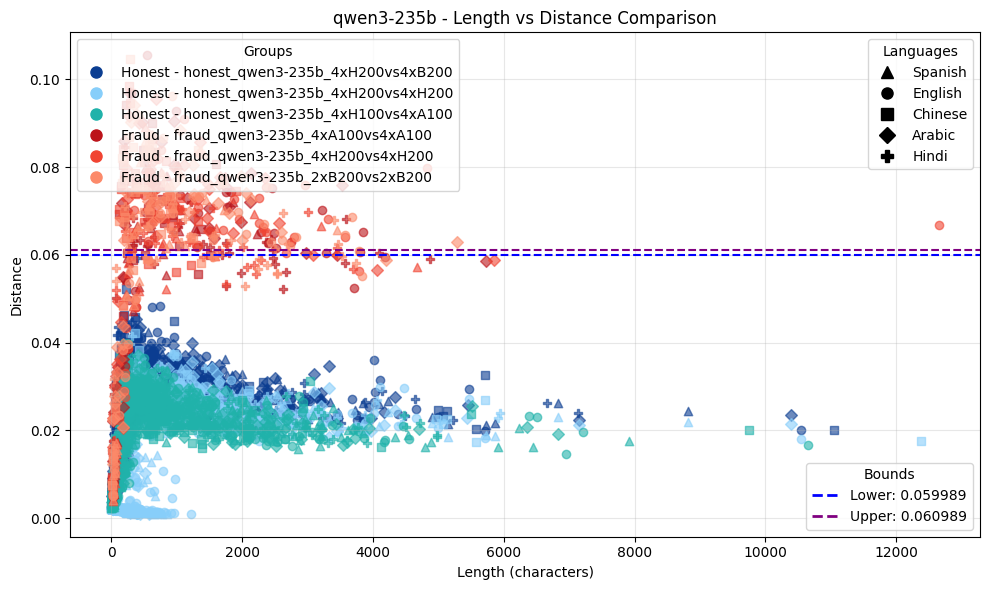

# Inference Validation Optimization

## Inference Validation

Validation uses the enforced sampling algorithm, which works as follows:

### Executor

1. Generates a token sequence $[t_1 \, t_2 \, \dots \, t_N]$ for the given prompt.

2. For each position $i \in \lbrace 1,\dots,N \rbrace$, records the top-k (e.g. `k=5`) candidate tokens and their probabilities.

### Validator

1. Re-generates **the same** token sequence $[t_1, t_2, \dots, t_N]$.

2. Computes probabilities for the same top-k candidates.

Compares the two distributions using the average distance.


## Problem

Validation in the current enforced sampling algorithm is slow, and the algorithm requires modifying internal vllm components, which must be maintained every time the vllm version changes.

This happens because the validation node uses **decoding** to regenerate the same tokens produced by the executor.

## Proposed Solution

Validation can be sped up and integration with new vllm versions can be made seamless by using prefills instead of decodes, along with special functions available in newer vllm versions.

## Method Architecture

Components that change are highlighted in red.

### Previous Version

Inference requests looked like this:

```
url = f"{model_info.url}/v1/chat/completions"
payload = {
    "model": model_info.name,
    "messages": _prepare_messages(prompt),
    "max_tokens": request_params.max_tokens,
    "temperature": request_params.temperature,
    "seed": request_params.seed,
    "stream": False,
    "logprobs": True,
    "n": 1,
    "top_logprobs": request_params.top_logprobs,
    "skip_special_tokens": False,
    "repetition_penalty": 1.2,
}
```

Validation requests looked like this:

```
url = f"{model_info.url}/v1/chat/completions"
payload = {
    "model": model_info.name,
    "messages": _prepare_messages(prompt),
    "max_tokens": request_params.max_tokens,
    "temperature": request_params.temperature,
    "seed": request_params.seed,
    "stream": False,
    "logprobs": True,
    "top_logprobs": request_params.top_logprobs,
    "n": 1,
    "skip_special_tokens": False,
    "repetition_penalty": 1.2,
    "enforced_tokens": enforced_tokens.dict(),
}
```

**Algorithm diagram:**



### Proposed Version

Inference requests now look like this:

```
url = f"{model_info.url}/v1/chat/completions"
payload = {
    "model": model_info.name,
    "messages": _prepare_messages(prompt),
    "max_tokens": request_params.max_tokens,
    "temperature": request_params.temperature,
    "seed": request_params.seed,
    "stream": False,
    "logprobs": True,
    "n": 1,
    "top_logprobs": request_params.top_logprobs,
    "skip_special_tokens": False,
    "return_token_ids": True,
    "return_tokens_as_token_ids": True,
    **_sampling_extras(request_params),
}
```

New fields:
- `return_token_ids` — required to retrieve prompt tokens
- `return_tokens_as_token_ids` — returns token IDs

Validation requests:

```
url = f"{model_info.url}/v1/completions"
payload = {
    "model": model_info.name,
    "prompt": prompt_tokens + enforced_tokens,
    "max_tokens": 1,
    "temperature": request_params.temperature,
    "seed": request_params.seed,
    "stream": False,
    "n": 1,
    "skip_special_tokens": False,
    "prompt_logprobs": request_params.top_logprobs,
    "return_tokens_as_token_ids": True,
    **_sampling_extras(request_params),
}
```

Requests are now sent to the completions endpoint. This is needed to send prompts as token sequences rather than text, which avoids situations where identical strings can have different token IDs.

The `return_tokens_as_token_ids` field is added to allow comparison of inference and validation tokens later.

The key field is `prompt_logprobs`, which enables retrieval of prompt log probabilities.

**Algorithm diagram:**



As shown, internal vllm components are not modified with this algorithm.

The implementation script can be found at: [mlnode/packages/benchmarks/scripts/inference.py](../../mlnode/packages/benchmarks/scripts/inference.py), [mlnode/packages/benchmarks/src/validation/utils.py](../../mlnode/packages/benchmarks/src/validation/utils.py)

## Results

### Speed

For QwQ-32B on 1xH100, the following e2e validation metrics were obtained (with 3000 decoded tokens during inference):

| Metric, ms     |     New |       Old |
|----------------|--------:|----------:|
| N (sample size) |    1500 |       497 |
| Mean (E[X])    | 763.023 | 11166.292 |

### Validation

Artifacts for the `Qwen/Qwen3-235B-A22B-Instruct-2507` model: [link](https://drive.google.com/drive/folders/15mkxAjli2NPhtY7ySAmZy1H2n7p2kt9a?usp=drive_link)


