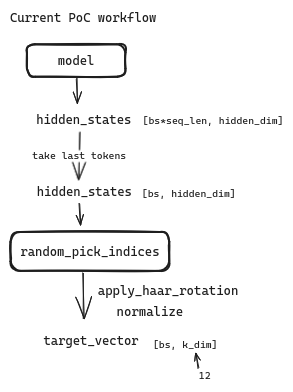
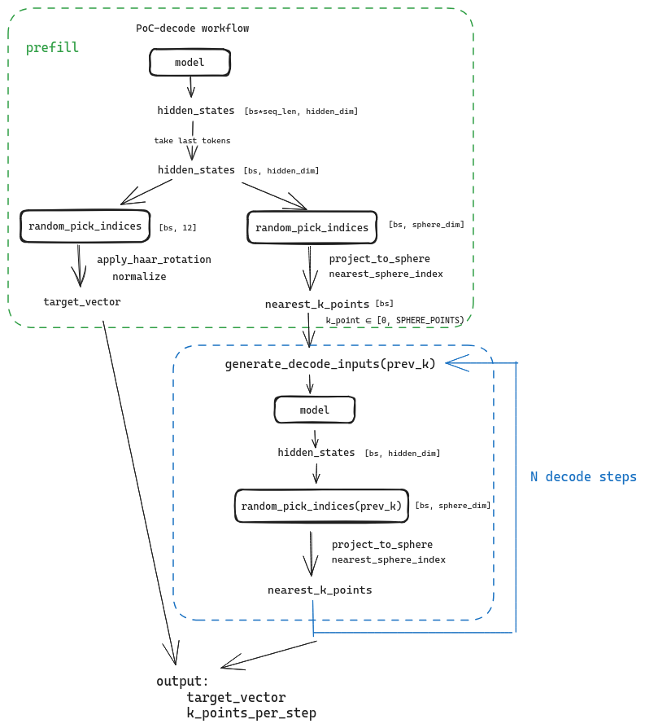
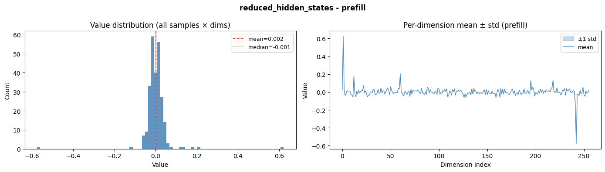
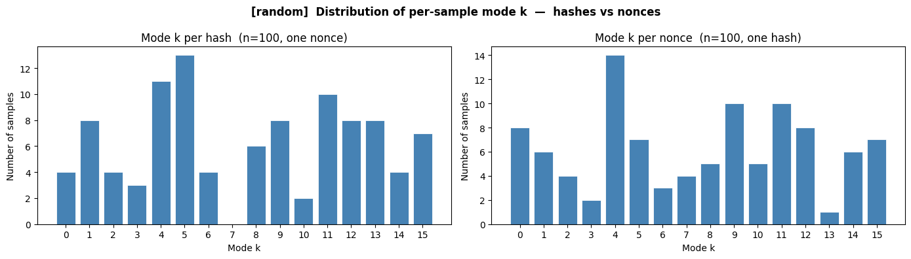
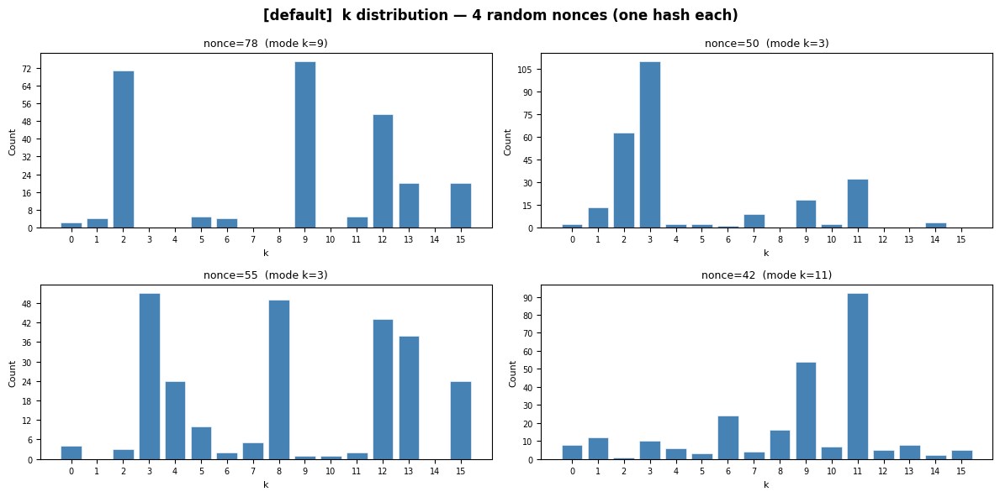
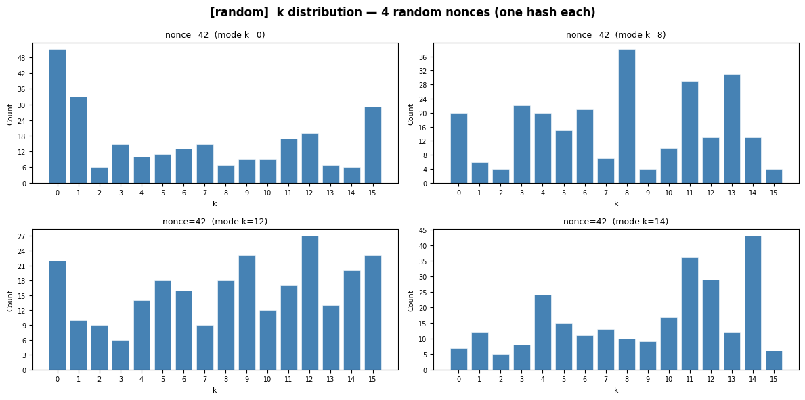
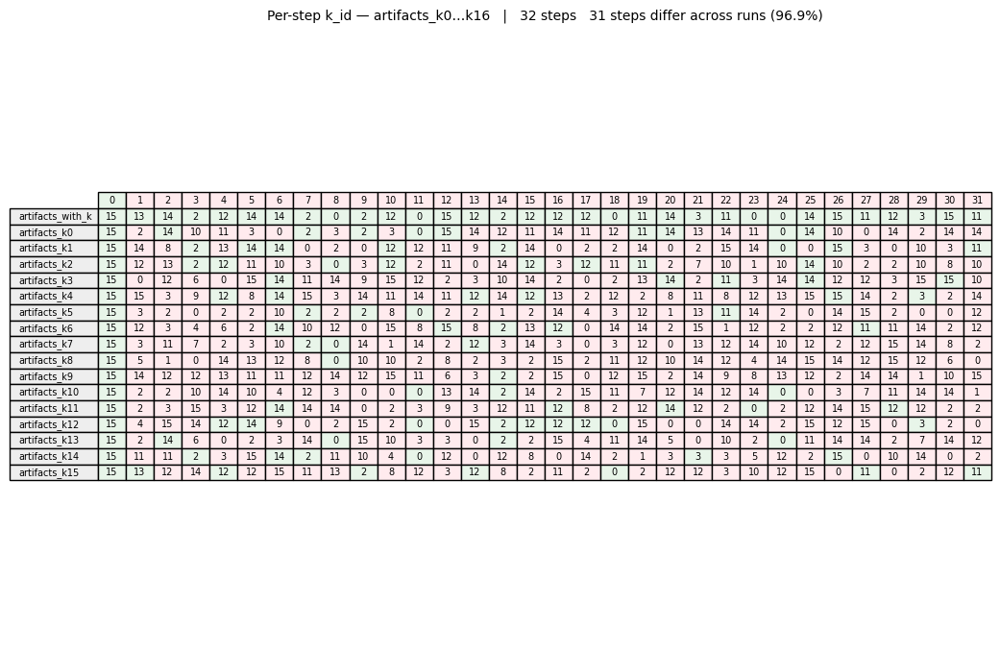
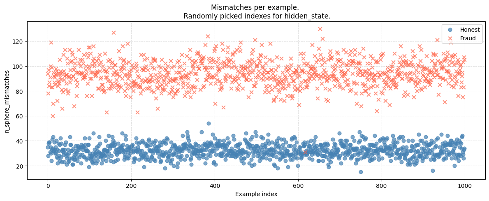

## PoC-decode

**Problem:** The current PoC procedure only covers the prefill step, but in real inference the majority of computation also comes from the decode steps.

**Goal:** Bring the PoC procedure closer to how real inference actually works.

**Task:** Extend the PoC procedure to cover decode steps.


## Theory

The current PoC procedure looks like this:



After prefill, `k_dim=12` dimensions are selected from the hidden state, forming a new vector that is then transformed and returned.

The proposed PoC-decode works as follows:



Before the PoC begins, a unit sphere is constructed with `k` points placed at equal distances from one another.

After prefill, an additional `sphere_dim` (currently 256) dimensions are selected from the hidden state. The resulting vectors are projected onto the unit sphere, and the nearest k-point to each vector is identified. The resulting point ID is then used for:
- guiding the decode generation
- selecting hidden state indices at subsequent decode steps

An interactive 3D sphere plot is available [here](https://axeltec-software.github.io/ReportsHelper/poc-decode/sphere_projection.html), with example code in `notebooks/poc-sphere-projection.ipynb`.

K-point selection statistics across different block hashes are also available as a [chart](https://axeltec-software.github.io/ReportsHelper/poc-decode/nearest_k_point_dist.html).

The method operates in two modes: inference and validation.

- **Inference mode** uses the pipeline described above.
- **Validation mode** works as follows: the PoC request passes the `k_point_ids` obtained during inference; at each decode step the model produces a `k_point_id` which is compared against the one from inference. If the IDs differ, a mismatch is recorded and the inference `k_point_id` is used instead of the newly generated one.


## Detailed Analysis
### Hidden state and k-point distributions

`notebooks/analysis.ipynb` contains distributions of hidden states at different decode steps.

The hidden state distribution follows a normal distribution centered around zero. Due to the nature of specific PoC inputs, certain dimensions tend to dominate the full hidden state. The dimensionality reduction step helps avoid over-relying on those dominant dimensions.



The following chart shows the mean k-point distribution when using one fixed nonce with 100 different block hashes, and vice versa.



Each request contains 256 decode steps, each producing a `k_point_id`. The mode `k_point_id` is computed per request, and the histogram is built across all 100 requests.

### Fraud resistance

- Randomly selecting hidden state indices leads to a more uniform k-point distribution, which makes fraud harder (see `notebooks/analysis.ipynb`).

Example distribution with fixed indices at every step:



Example distribution with randomly selected indices (dependent on the k-point from the previous step):



- It was verified (`notebooks/fraud-k-step.ipynb`) that hardcoding k is not viable. The table below shows 32 decode steps: the first row (`artifacts_with_k`) is the working pipeline, and all other rows are variants where instead of using the `k_point_id` from the previous decode step, it is hardcoded to a fixed value (0–15). The hardcoded variants consistently diverge from the original.




## Results

Validation was performed using the Qwen2.5-7B model in the following setups:

- Hashes: 25
- Nonces: 40
- Decodes: 256

**Honest setup:**
- Models: `RedHatAI/Qwen2.5-7B-Instruct-FP8-dynamic` vs `RedHatAI/Qwen2.5-7B-Instruct-FP8-dynamic`
- Hardware: NVIDIA RTX 4000 vs A100

**Fraud setup:**
- Models: `Qwen/Qwen2.5-7B-Instruct-AWQ` vs `RedHatAI/Qwen2.5-7B-Instruct-FP8-dynamic`
- Hardware: A100 vs A100





## Notes

- Some experiments were run (`notebooks/analysis.ipynb`) exploring different values of `sphere_dim` and `the number of k-points` on the sphere. The current configuration uses `sphere_dim=256` and `k_points=16`, though further experimentation is possible.

- Decode performance depends critically on CUDA graphs, so integrating CUDA graph support into PoC-decode is essential.


## Code

The initial PoC-decode implementation for vLLM v0.11 is at:
https://github.com/axeltec-software/vllm/tree/axeltec/poc-decode-proposal

PoC-decode is disabled by default. To enable it, pass the `--poc-decode` flag:

```
vllm serve RedHatAI/Qwen2.5-7B-Instruct-FP8-dynamic --poc-decode
```

Experiment notebooks are in the `notebooks/` directory.

Data collection scripts are in the `scripts/` directory.

To download pre-collected data for the notebooks:

```bash
bash scripts/download_data.sh
```

Or download manually from [Google Drive](https://drive.google.com/drive/folders/1tVh6mTsazMfjtSz-J0MTN8KYD5B9g1Bq?usp=sharing).

To collect your own data:

```bash
bash scripts/collect_validation.sh --honest
bash scripts/collect_validation.sh --fraud
URL=http://localhost:8000 bash scripts/collect_analysis.sh
```
