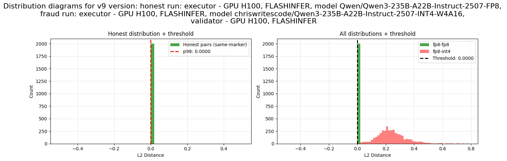
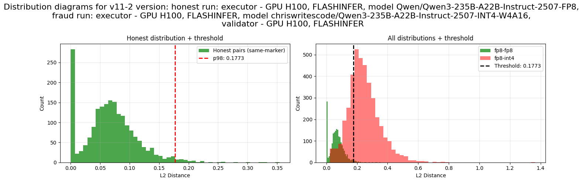
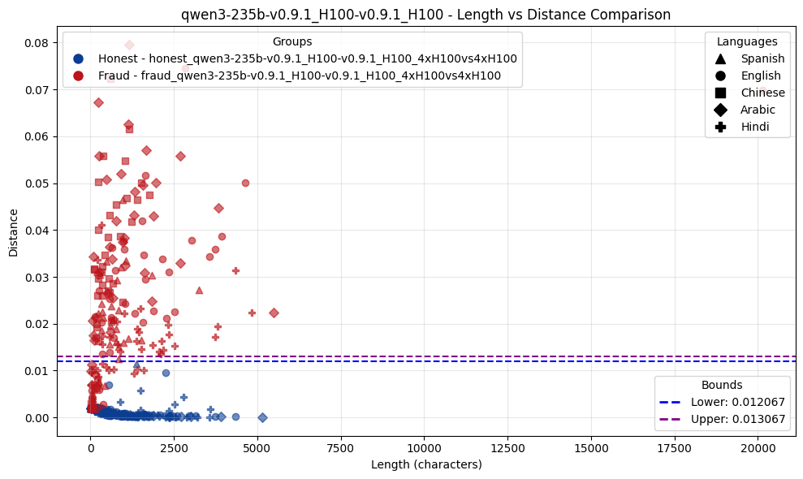
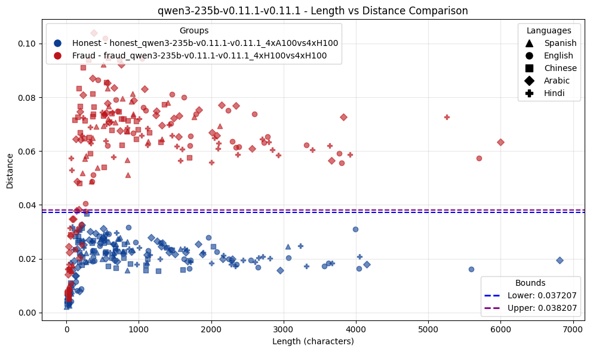

# Report: PoC Integration into vLLM v0.11.1

## Goal

Enhance PoC procedure through deep integration with vLLM inference engine to improve GPU utilization, enable seamless coexistence with production inference, and eliminate blocking behavior.

Make vLLM treat PoC nonce verification as regular requests with lower priority, without significant performance loss.

## Results

**Link to a code**: [poc-draft-v0.11](https://github.com/axeltec-software/vllm/tree/poc-draft-v0.11)

```
git clone https://github.com/axeltec-software/vllm.git
cd vllm
git checkout poc-draft-v0.11
```  
**Docker:** 

```
docker pull redcaesar/vllm-poc-v0.11.1:f06bb4a
```

1. Integrate PoC procedure into vLLM inference engine. 

- The PoC procedure has been upgraded and migrated from version v0.9.1 to v0.11.1.
- New tests were added, and existing ones have been verified.
- A `--blocking` flag was added, which functions as follows:  
When `blocking=True`:  
    - PoC waits for any in-progress chat requests to finish.  
    - Enables exclusive mode, rejecting new chat requests (with a 503 status).  
    - Executes PoC exclusively.  
    - Disables exclusive mode once execution is complete.  
2. Benchmark integrated version against older versions and on different machines

**Model:** Qwen/Qwen3-235B-A22B-Instruct-2507

**Link to a full table:** [comparison](https://docs.google.com/spreadsheets/d/1ZZyjvVdfje5UctWeNpf7ehCN7iXp6DXkuLeI_9ako_k/edit?usp=sharing)


### PoC Validation

Old v0.9 version:



Current v0.11 version:



### Enforced tokens validation

Old v0.9 version:



Current v0.11 version:



### Performance


**Hardware:** H100, tp 4, pp 1

**Workload:** Prompt=normal(512, 16), Response=normal(256, 8)

**Difference Comparison:**

| VUs      | Duration   |   Total Nonces |   Nonces/sec | Input tokens/sec   | Passed Requests   | E2E Latency Diff (%)   | ITL Diff (%)   | TTFT Diff (%)   | Output tokens/sec Diff (%)   |
|:---------|:-----------|---------------:|-------------:|:-------------------|:------------------|:-----------------------|:---------------|:----------------|:-----------------------------|
| PoC Only | 100        |           4096 |         41   | N/A                | N/A               | N/A                    | N/A            | N/A             | N/A                          |
| 1.0      | 120s       |           3232 |         32.3 | 21.4               | 4.0               | +174.1%                | +0.3%          | +8.1%           | -75.0%                       |
| 5.0      | 120s       |           3232 |         32.3 | 106.8              | 20.0              | +127.1%                | -0.0%          | +60.9%          | -72.0%                       |
| 10.0     | 120s       |           3264 |         32.6 | 213.7              | 40.0              | +125.9%                | -0.4%          | +58.3%          | -69.9%                       |
| 20.0     | 120s       |           3200 |         32   | 406.0              | 76.0              | +267.6%                | -0.8%          | +106.4%         | -68.4%                       |

**Note:** Diff (%) shows the percentage change when PoC is enabled compared to without PoC.

**All runs:**

| VUs   | Duration   | PoC Enabled   | Total Nonces   | Nonces/sec   | E2E Latency (med)   | ITL (med)   | TTFT (med)   | Output tokens/sec   | Passed Requests   | Input tokens/sec   |
|:------|:-----------|:--------------|:---------------|:-------------|:--------------------|:------------|:-------------|:--------------------|:------------------|:-------------------|
| N/A   | 100        | True          | 4096.0         | 41.0         | N/A                 | N/A         | N/A          | N/A                 | N/A               | N/A                |
| 1.0   | 120s       | False         | N/A            | N/A          | 7258.6              | 28.4        | 140.0        | 34.1                | 17.0              | 90.8               |
| 1.0   | 120s       | True          | 3232.0         | 32.3         | 19893.3             | 28.5        | 151.4        | 8.5                 | 4.0               | 21.4               |
| 5.0   | 120s       | False         | N/A            | N/A          | 8706.8              | 32.3        | 153.4        | 146.5               | 70.0              | 373.9              |
| 5.0   | 120s       | True          | 3232.0         | 32.3         | 19770.4             | 32.3        | 246.8        | 41.0                | 20.0              | 106.8              |
| 10.0  | 120s       | False         | N/A            | N/A          | 9551.9              | 34.7        | 159.1        | 266.0               | 130.0             | 694.4              |
| 10.0  | 120s       | True          | 3264.0         | 32.6         | 21574.2             | 34.6        | 251.8        | 80.0                | 40.0              | 213.7              |
| 20.0  | 120s       | False         | N/A            | N/A          | 10721.8             | 36.6        | 160.9        | 474.3               | 239.0             | 1276.7             |
| 20.0  | 120s       | True          | 3200.0         | 32.0         | 39409.1             | 36.3        | 332.2        | 149.7               | 76.0              | 406.0              |


## Notes

Separation with enforced tokens validation works well between identical versions; however, issues are observed during cross-validation between v0.9 and v0.11. This is most likely related to the problems we found in PRs for v0.11: logprob values for identical requests sometimes differ.

## Possible further improvements:

Adding a ratio to regulate the mixing of PoC and chat requests. Branch with draft implementation: [bs/priority](https://github.com/axeltec-software/vllm/tree/bs/priority)
